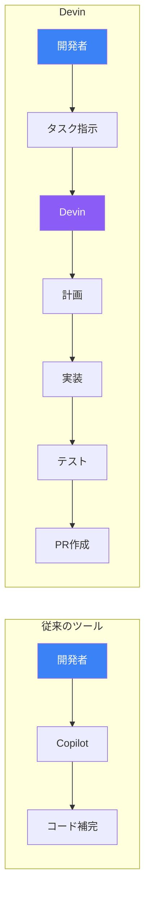
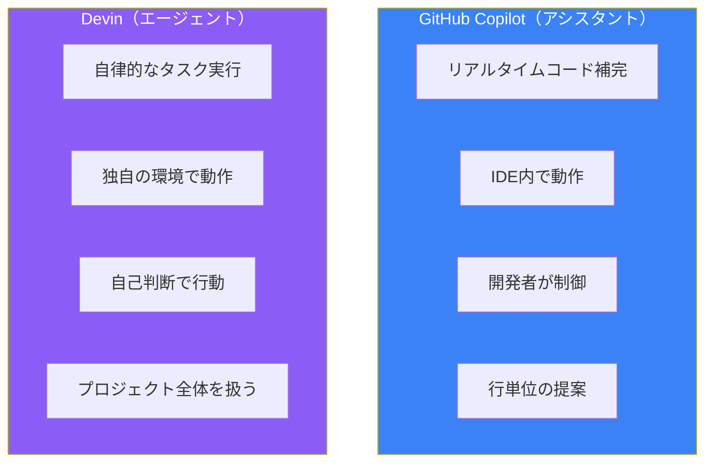
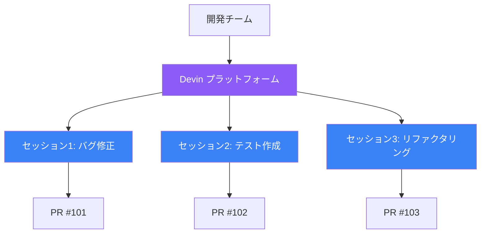
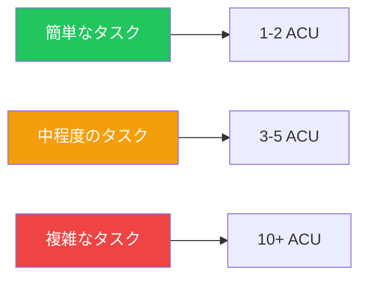

自然言語で指示を出すだけで、コードを書き、テストし、プルリクエストまで作成してくれるAIエンジニアがいたら？これがDevinです。Cognition AIが開発した「世界初の自律型AIソフトウェアエンジニア」として、ソフトウェア開発の世界に新しいパラダイムをもたらしています。

## Devinとは何か

Devinは、コード補完ツールではなく、**自律的にソフトウェア開発タスクを遂行するAIエージェント**です。従来のAIコーディングツールが「アシスタント」なら、Devinは「ジュニアエンジニア」のような存在です。



### Devinの特徴

Devinは、サンドボックス化されたコンピューティング環境で動作します。この環境には以下が含まれます：

- **シェル**: コマンド実行
- **コードエディタ**: ファイル編集
- **ブラウザ**: ドキュメント参照、エラー調査

これにより、人間のエンジニアと同じように、コードを書き、実行し、エラーを確認し、修正するというサイクルを自律的に回すことができます。

## Copilotとの根本的な違い

GitHub CopilotとDevinは、どちらもAIを活用した開発ツールですが、その役割は根本的に異なります。



### 比較表

| 観点 | GitHub Copilot | Devin |
|------|---------------|-------|
| **役割** | コーディングアシスタント | 自律型エンジニア |
| **動作環境** | IDE内 | 独自のクラウド環境 |
| **入力** | コードコンテキスト | 自然言語のタスク説明 |
| **出力** | コード補完・提案 | PR、コミット、デプロイ |
| **制御** | 開発者が常に制御 | 自律的に判断・実行 |
| **最適な用途** | 日常的なコーディング加速 | 定型タスクの委任 |

### 実際の動作の違い

**Copilotの場合**:
```
開発者: [コードを書き始める]
Copilot: [次の行を提案]
開発者: [提案を受け入れるか修正]
開発者: [テストを実行]
開発者: [エラーを修正]
```

**Devinの場合**:
```
開発者: ユーザー認証機能を実装して。JWTを使って、
       リフレッシュトークンも対応してください。

Devin: [コードベースを分析]
       [実装計画を作成]
       [コードを実装]
       [テストを実行]
       [エラーを自動修正]
       [PRを作成]

開発者: [PRをレビュー・マージ]
```

## Devinの主要機能

### 1. Agent-Native IDE

Devinは専用のクラウドベースIDEで動作します。複数のDevinセッションを並列で実行でき、それぞれが独立したタスクに取り組めます。



### 2. Interactive Planning

タスクを開始すると、Devinはまずコードベースを分析し、実装計画を提案します。開発者はこの計画をレビュー・修正してから、実行を開始できます。

```
Devin: コードベースを分析しました。以下の計画で進めます：

1. src/auth/jwt.ts にJWTユーティリティを作成
2. src/middleware/auth.ts に認証ミドルウェアを追加
3. src/routes/auth.ts にログイン/リフレッシュエンドポイントを実装
4. tests/auth.test.ts にテストを追加

この計画で進めてよいですか？
```

### 3. Devin Wiki

リポジトリを自動的にインデックスし、アーキテクチャ図やドキュメントを生成します。新しいチームメンバーのオンボーディングや、レガシーコードの理解に役立ちます。

### 4. Devin Search

コードベースに対して自然言語で質問できます：

```
質問: 認証エラーはどこでハンドリングされている？

回答: 認証エラーは以下の場所でハンドリングされています：
- src/middleware/errorHandler.ts:45 - AuthenticationError クラス
- src/routes/auth.ts:78 - ログイン失敗時の処理
[ソースコードへのリンク]
```

### 5. チーム連携

Slack、Microsoft Teams、Jiraとの統合が可能です：

- **Slack**: `@Devin` でメンションしてタスクを依頼
- **Jira**: チケットに `devin` ラベルを追加すると自動で対応開始
- **GitHub**: PRへのコメントで追加修正を依頼

## 料金プラン

Devin 2.0（2025年4月リリース）で、価格が大幅に引き下げられました。

| プラン | 月額 | ACU | 追加ACU | 対象 |
|--------|------|-----|---------|------|
| **Core** | $20 | 9 | $2.25/ACU | 個人開発者、試用 |
| **Team** | $500 | 250 | $2/ACU | チーム、本格利用 |
| **Enterprise** | カスタム | カスタム | 要相談 | 大企業、VPC対応 |

### ACU（Agent Compute Unit）とは

ACUはDevinの作業量を測る単位です。タスクの複雑さや実行時間によって消費量が変わります。



### どのプランを選ぶべきか

| シナリオ | 推奨プラン |
|----------|-----------|
| Devinを試したい | Core |
| 週に数回、小さなタスクを依頼 | Core |
| 日常的にタスクを委任 | Team |
| 複数人でDevinを共有 | Team |
| セキュリティ・コンプライアンス要件あり | Enterprise |

## Devinが得意なこと・苦手なこと

### 得意なタスク

- **コードマイグレーション**: フレームワークやライブラリのアップグレード
- **セキュリティ修正**: 脆弱性の検出と修正
- **単体テスト作成**: テストカバレッジの向上
- **小規模な機能追加**: 明確な仕様のある機能
- **バグ修正**: 再現手順が明確なバグ

### 苦手なタスク

- **曖昧な要件**: 「もっと使いやすくして」など
- **アーキテクチャ設計**: システム全体の設計判断
- **パフォーマンス最適化**: 深い分析が必要な場合
- **創造的なUI/UX**: デザインの判断が必要な場合

## まとめ

| 観点 | 説明 |
|------|------|
| **Devinとは** | 自律型AIソフトウェアエンジニア |
| **Copilotとの違い** | アシスタント vs エージェント |
| **主要機能** | 自律実行、計画、Wiki、Search |
| **価格** | $20/月から |
| **最適な用途** | 定型タスク、マイグレーション、テスト |

Devinは「ジュニアエンジニア」として考えるのが最適です。明確な指示があれば優秀に働きますが、曖昧なタスクや高度な判断が必要な場面では人間の監督が必要です。次回は、Devinのベンチマーク性能と実際の成功率について詳しく見ていきます。

## 参考資料

- [Cognition - Introducing Devin](https://cognition.ai/blog/introducing-devin)
- [Devin Official Documentation](https://docs.devin.ai/)
- [Cognition - Devin 2.0](https://cognition.ai/blog/devin-2)
- [Devin Pricing](https://devin.ai/pricing/)
