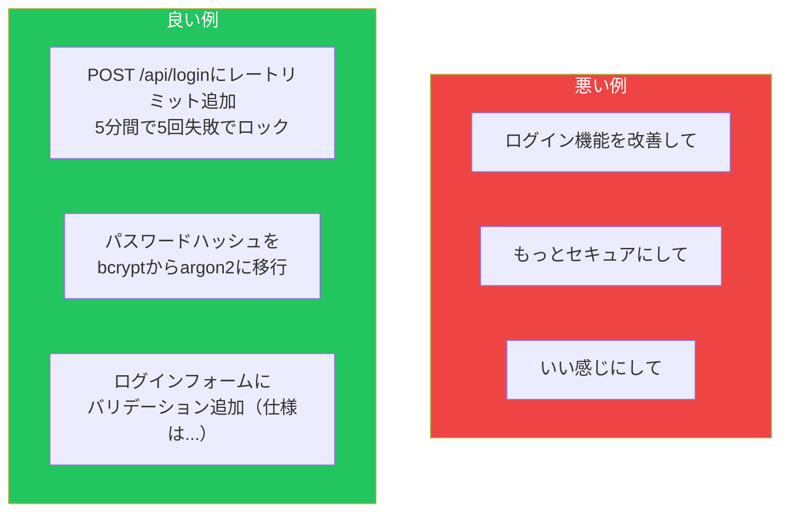
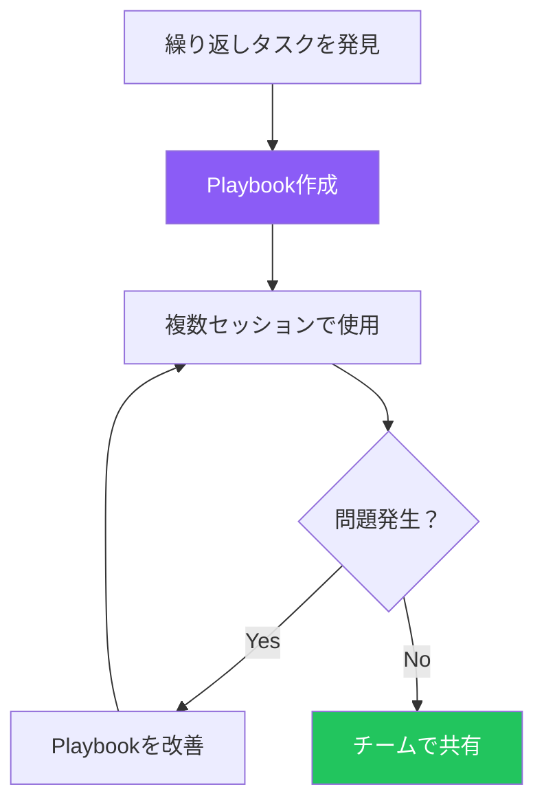
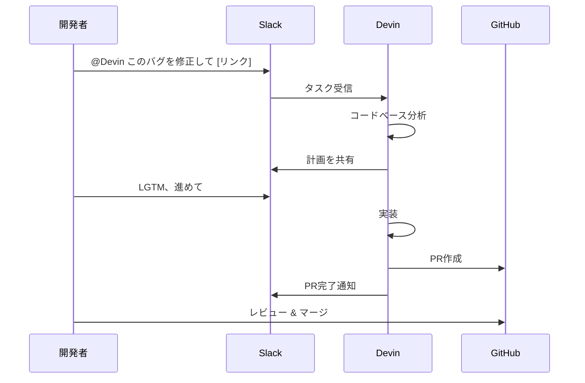
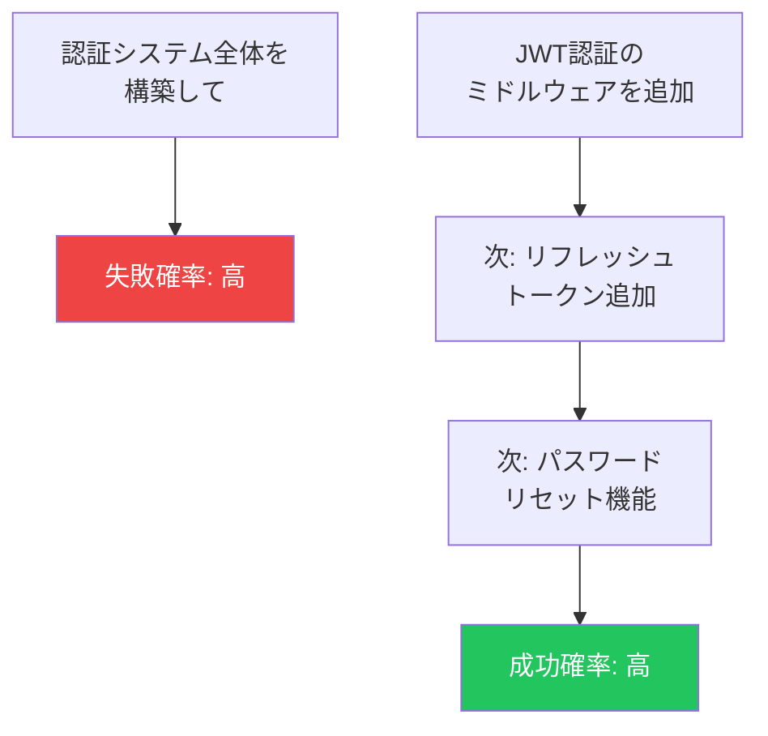
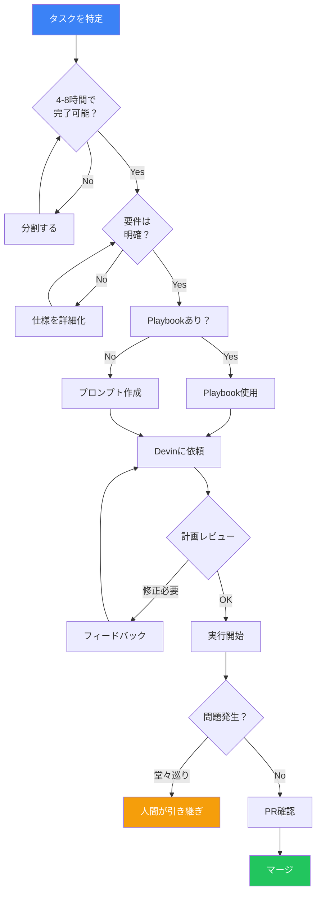

Devinは強力なツールですが、使い方を間違えると時間とACUを浪費してしまいます。Answer.AIの検証では、20タスク中成功したのはわずか3件（15%）でした。しかし、適切なアプローチを取れば、Devinはチームの強力な戦力になります。この記事では、Devinを効果的に活用するための実践的なガイドを紹介します。

## セットアップ手順

### 1. アカウント作成

[app.devin.ai](https://app.devin.ai)にアクセスし、「Get Started」をクリックします。


セットアップウィザードでは以下を聞かれます：
- 自分自身について（役職など）
- 会社・組織について
- チーム名（個人利用も可）

### 2. プラン選択

| プラン | 月額 | ACU | 推奨用途 |
|--------|------|-----|----------|
| Core | $20 | 9 | 試用、個人プロジェクト |
| Team | $500 | 250 | チーム利用、本格運用 |

### 3. リポジトリ連携

GitHubアカウントを連携し、Devinにアクセスを許可します。Devinは連携したリポジトリに対してPRを作成できるようになります。

### 4. 統合設定（オプション）

チーム利用の場合、以下の統合を設定すると効果的です：

- **Slack**: `@Devin`でメンションしてタスク依頼
- **Jira**: `devin`ラベルで自動タスク開始
- **Linear**: Webhook連携で自動化

## 効果的なプロンプトの書き方

### 基本原則：具体的に、明確に

Devinへの指示は、同僚のジュニアエンジニアに仕様書を渡すのと同じです。曖昧な指示は曖昧な結果を生みます。



### プロンプトテンプレート

効果的なプロンプトは以下の要素を含みます：

```
## タスク
[何をしてほしいか1-2文で]

## コンテキスト
- 対象ファイル/ディレクトリ: [パス]
- 関連する既存コード: [説明]
- 使用技術: [フレームワーク、ライブラリ]

## 要件
1. [具体的な要件1]
2. [具体的な要件2]
3. [具体的な要件3]

## 成功基準
- [どうなったら完了か]
- [テストの期待結果]

## やらないこと
- [スコープ外のこと]
```

### 実例：良いプロンプト

```
## タスク
ユーザー認証APIにリフレッシュトークン機能を追加

## コンテキスト
- 対象: src/api/auth.ts, src/middleware/jwt.ts
- 現在はアクセストークンのみ（有効期限1時間）
- Express + TypeScript、JWTはjsonwebtokenライブラリ使用

## 要件
1. リフレッシュトークン生成（有効期限7日）
2. POST /api/auth/refresh エンドポイント追加
3. リフレッシュトークンはDBに保存（既存のUserモデル使用）
4. 既存のテストパターンに従ってテスト追加

## 成功基準
- npm test が全てパス
- Postmanで動作確認できる

## やらないこと
- フロントエンドの変更
- 既存のログインフローの変更
```

### プロンプト分析機能を活用

Devinには「Analyze prompt」機能があります。送信ボタンの横にあるペンアイコンをクリックすると、プロンプトを改善する提案が表示されます。

## Playbooks活用法

### Playbooksとは

Playbooksは、繰り返し使うタスクのためのテンプレートです。同じ種類のタスクを何度も依頼する場合、Playbookを作成することで品質と効率が向上します。



### Playbookの作成方法

1. **Webアプリから**: 「Create a new Playbook」をクリック
2. **ファイルから**: `.devin.md`拡張子のファイルをドラッグ&ドロップ

### Playbook例：ユニットテスト追加

```markdown
# Unit Test Playbook

## 目的
指定されたファイルにユニットテストを追加する

## 手順
1. 対象ファイルを分析し、テスト対象の関数を特定
2. 既存のテストパターンを確認（tests/ディレクトリ）
3. 同じパターンでテストファイルを作成
4. エッジケースを含めてテストを実装
5. npm test を実行して確認

## 成功基準
- カバレッジが80%以上
- 既存テストが壊れていない
- テスト名が明確で読みやすい

## 注意点
- モックは最小限に
- 実装の詳細ではなく振る舞いをテスト
- AAA（Arrange-Act-Assert）パターンを使用
```

### Playbook vs Knowledge

| 用途 | Playbook | Knowledge |
|------|----------|-----------|
| 特定タスクの手順 | ○ | × |
| 組織のコーディング規約 | × | ○ |
| 繰り返し使うワークフロー | ○ | × |
| プロジェクト全体の情報 | × | ○ |
| ベストプラクティス | △ | ○ |

**Knowledge**は全セッションで自動的に参照される一般的な情報（スタイルガイド、アーキテクチャなど）に使い、**Playbook**は特定タスクの手順に使います。

## 統合ワークフロー

### Slack連携



### Jira連携

1. **セットアップ**: Devin → Team → Integrations → Jira
2. **ボットアカウント作成**: `devin-bot@yourcompany.com`
3. **チケットにラベル追加**: `devin`

```
チケット: PROJ-123 ログインページにCAPTCHA追加

[devinラベルを追加]

↓ Devinがコメント

「コードベースを分析しました。以下の計画で進めます：
1. src/components/Login.tsx にreCAPTCHA追加
2. src/api/auth.ts でトークン検証
3. 環境変数RECAPTCHA_SECRET_KEY追加

Start session? (yes/no)」
```

## よくある失敗パターンと回避方法

### 失敗パターン1: 曖昧な指示

```
❌ 悪い例: 「パフォーマンスを改善して」

✅ 良い例: 「/api/users のレスポンス時間を改善して。
現在2秒かかっているクエリをN+1問題の解消で
500ms以下にしたい。」
```

### 失敗パターン2: スコープが大きすぎる



**大きなタスクは分割**：4-8時間で完了できる単位に分けましょう。

### 失敗パターン3: 堂々巡りに付き合う

```
警告サイン:
- 「指示を無視している」と感じる
- 同じ解決策を繰り返し提案してくる
- 何時間も進展がない
```

**対処法**: 早めに打ち切って、人間が引き継ぐか、タスクを再定義します。ACUを節約しましょう。

### 失敗パターン4: 不可能なタスクを依頼

Answer.AIの検証では、Devinが**不可能なタスク**（Railwayの制限で実現できない機能など）に1日以上費やし、存在しない機能を「幻覚」したケースがありました。

**対処法**: タスクが技術的に実現可能か、事前に確認しましょう。

### 失敗パターン5: 既存コードベースの理解が必要なタスク

Devinは新規コード生成は得意ですが、複雑な既存コードベースとの統合は苦手です。

```
得意:
- 新しいエンドポイント追加
- スタンドアロンのユーティリティ関数
- マイグレーションスクリプト

苦手:
- 複雑なレガシーコードの修正
- 暗黙的なパターンの理解
- 複数コンポーネント間の連携
```

## 効果的なワークフロー

### 推奨フロー



### 並列実行の活用

Devin 2.0では複数セッションを並列実行できます。

```
セッション1: src/api/users のテスト追加
セッション2: src/api/orders のテスト追加
セッション3: src/api/products のテスト追加

→ 3つのPRが並列で作成される
```

同じPlaybookを複数セッションで実行すると、問題点を素早く発見できます。

## チェックポイントとスナップショット

### チェックポイント復元

Devinが間違った方向に進んだ場合、タイムラインをスクラブして「restore checkpoint」アイコンをクリックすると、以前の状態に戻せます。

### スナップショット活用

スナップショットは、環境のセーブポイントです。リポジトリのクローン、環境構築が完了した状態を保存しておけば、次回のセッション開始が高速になります。

**Shortcuts**: Snapshot + Playbook の組み合わせをホームページに保存できます。リポジトリごとに1つのショートカットを作成することを推奨します。

## まとめ

| ポイント | 推奨アクション |
|----------|----------------|
| プロンプト | 具体的に、成功基準を明確に |
| タスクサイズ | 4-8時間で完了できる単位に分割 |
| Playbooks | 繰り返しタスクはテンプレート化 |
| 失敗時 | 早めに打ち切り、人間が引き継ぐ |
| 並列実行 | 独立したタスクは同時実行 |
| 統合 | Slack/Jiraでワークフローに組み込む |

Devinは「優秀だが経験の浅いジュニアエンジニア」です。明確な指示と適切な監督があれば、チームの生産性を大幅に向上させることができます。

## 参考資料

- [Devin Docs - Instructing Devin Effectively](https://docs.devin.ai/essential-guidelines/instructing-devin-effectively)
- [Coding Agents 101](https://devin.ai/agents101)
- [Creating Playbooks](https://docs.devin.ai/product-guides/creating-playbooks)
- [Answer.AI - Thoughts on a Month with Devin](https://www.answer.ai/posts/2025-01-08-devin.html)
