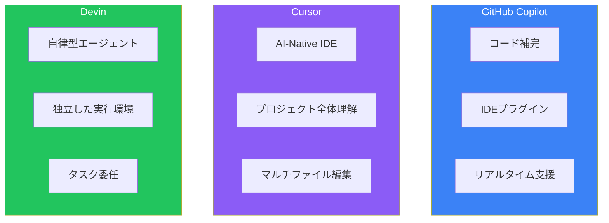
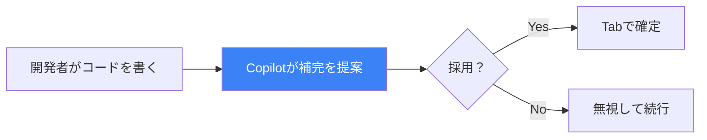
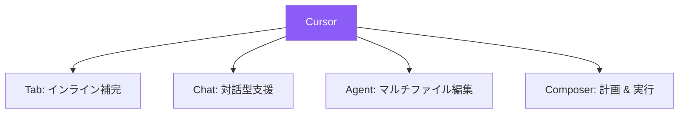
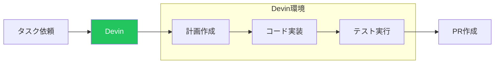
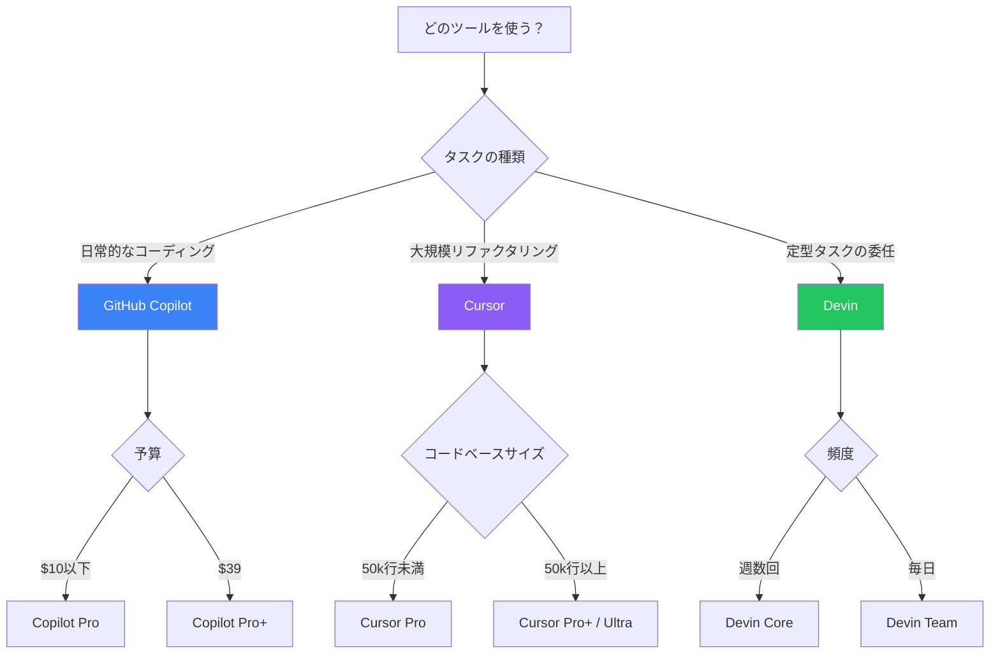
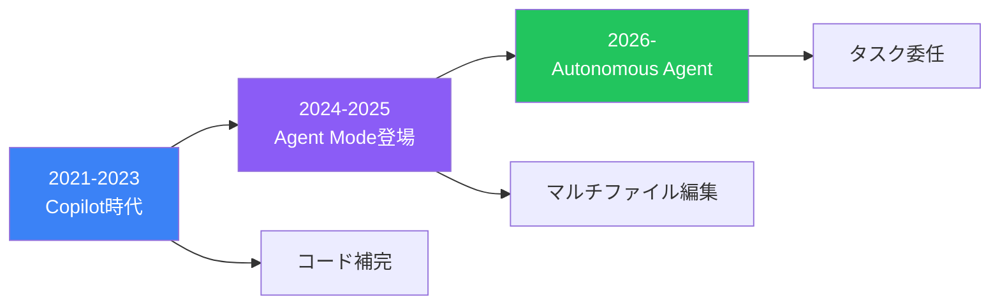

2026年、AIコーディングツールは開発者の必需品となりました。開発者の約85%が日常的にAIツールを使用し、市場規模は20億ドルを超えています。本記事では、代表的な3つのツール—Devin、GitHub Copilot、Cursor—を徹底比較し、どのツールをいつ使うべきかを解説します。

## ツールの分類：3つのパラダイム



| 分類 | ツール | 役割 |
|------|--------|------|
| **Copilot型** | GitHub Copilot | 開発者の隣で補完を提案 |
| **AI-Native IDE** | Cursor | AIと一体化したエディタ |
| **Autonomous Agent** | Devin | 独立してタスクを実行 |

## 各ツールの詳細

### GitHub Copilot

GitHubとOpenAIが共同開発したコード補完ツール。2021年のローンチ以来、業界標準として君臨しています。



**特徴**:
- **即座の補完**: タイピング中にリアルタイムで提案
- **幅広いIDE対応**: VS Code、JetBrains、Visual Studio、Neovim、Xcode
- **Agent Mode**: プロジェクト全体のコンテキストを理解し、マルチファイル変更が可能
- **モデル選択**: Claude、GPT、Geminiなど複数モデルに対応

**料金プラン（2026年）**:

| プラン | 月額 | Premium Requests | 特徴 |
|--------|------|------------------|------|
| Free | $0 | 50 | 基本機能 |
| Pro | $10 | 300 | 個人向け |
| **Pro+** | $39 | 1,500 | 全モデルアクセス |
| Business | $19/user | - | 組織向け |
| Enterprise | $39/user | - | 高度なセキュリティ |

**向いているユースケース**:
- 日常的なコーディング作業の高速化
- GitHubワークフローとの統合
- 既存のIDE環境を維持したい場合

### Cursor

VS Codeをフォークし、AIをコアに組み込んだ「AI-Native IDE」。エディタそのものがAIとの対話を前提に設計されています。



**特徴**:
- **プロジェクト全体の理解**: リポジトリ全体をコンテキストとして活用
- **Agent Mode**: 複数ファイルにまたがる変更を計画・実行
- **モデル選択の自由**: GPT、Claude、Gemini、xAIなど自由に切り替え
- **VS Code互換**: 拡張機能、テーマ、キーバインドをそのまま使用可能

**料金プラン（2026年8月改定）**:

| プラン | 月額 | 内容 |
|--------|------|------|
| Hobby | $0 | 制限付きTab/Agent |
| **Pro** | $20 | 無制限Tab + $20分のAgent利用 |
| Pro Plus | ~$60 | $70分のAgent利用 |
| Ultra | $200 | Pro の20倍の利用枠 |
| Teams | $40/user | SSO、管理機能 |

**利用量の目安**（Pro $20分）:
- Claude Sonnet: 約225リクエスト
- GPT-5: 約500リクエスト
- Gemini: 約550リクエスト

**向いているユースケース**:
- 大規模リファクタリング（50,000行以上のコードベース）
- マルチファイル編集が頻繁な場合
- AIモデルを柔軟に切り替えたい場合

### Devin

Cognition AIが開発した自律型AIソフトウェアエンジニア。タスクを渡すと、独立した環境で計画・実装・テスト・PR作成まで行います。



**特徴**:
- **完全自律**: 独立したサンドボックス環境で作業
- **並列実行**: 複数のDevinセッションを同時に実行可能
- **統合**: Slack、Jira、Linearとの連携
- **Devin Wiki/Search**: コードベースの自動ドキュメント化と検索

**料金プラン（2026年）**:

| プラン | 月額 | ACU | 追加ACU |
|--------|------|-----|---------|
| **Core** | $20 | 9 | $2.25 |
| Team | $500 | 250 | $2 |
| Enterprise | カスタム | カスタム | 要相談 |

**向いているユースケース**:
- コードマイグレーション（フレームワーク更新など）
- セキュリティ脆弱性の一括修正
- 大量の類似タスク（テスト追加など）
- 開発者がレビューに集中したい場合

## 徹底比較表

| 項目 | GitHub Copilot | Cursor | Devin |
|------|---------------|--------|-------|
| **タイプ** | IDEプラグイン | AI-Native IDE | 自律型エージェント |
| **動作環境** | 既存IDE内 | 専用IDE | クラウド環境 |
| **最低月額** | $0（無料枠あり） | $0（制限あり） | $20 |
| **推奨月額** | $10-39 | $20-60 | $500 |
| **リアルタイム補完** | ◎ | ◎ | × |
| **マルチファイル編集** | ○（Agent Mode） | ◎ | ◎ |
| **自律実行** | △ | ○ | ◎ |
| **並列タスク** | × | ○ | ◎ |
| **学習曲線** | 低 | 中 | 中-高 |
| **大規模コードベース** | △ | ◎ | ○ |

## 使い分けガイド

### シナリオ別推奨



### 推奨組み合わせ

多くのチームは複数ツールを併用しています：

**パターン1: Copilot + Cursor**
```
日常作業 → Copilot（高速補完）
大規模変更 → Cursor（Agent Mode）
```

**パターン2: Copilot + Devin**
```
インタラクティブ作業 → Copilot
バッチ的なタスク → Devin（並列実行）
```

**パターン3: 全部使う**
```
コーディング → Copilot
リファクタリング → Cursor
マイグレーション → Devin
```

### チーム規模別推奨

| チーム規模 | 推奨構成 | 月額目安 |
|-----------|----------|----------|
| 個人 | Copilot Pro | $10 |
| 個人（パワーユーザー） | Cursor Pro | $20 |
| 小規模チーム（3-5人） | Copilot Business | $57-95 |
| 中規模チーム（10人） | Copilot + Devin Team | $690 |
| 大規模チーム | Enterprise構成 | 要見積もり |

## 2026年の市場動向

### CopilotからAgentへ



AIコーディングツールは、単純な補完から自律的なエージェントへと進化しています：

1. **補完（Autocomplete）**: 次の行を提案
2. **対話（Chat）**: 質問に回答
3. **編集（Agent）**: 複数ファイルを変更
4. **委任（Autonomous）**: タスクを独立して実行

### 注目のトレンド

1. **MCP（Model Context Protocol）の普及**
   - ツール間の相互運用性向上
   - エージェントがインタラクティブUIをレンダリング

2. **マルチプラットフォーム展開**
   - Terminal、IDE、Web、デスクトップ全てに対応
   - Cursorがこのトレンドをリード

3. **小規模特化モデルの台頭**
   - 言語・フレームワーク特化のファインチューニング
   - オープンソースフレームワーク（Continue、Aider）との組み合わせ

### Cognition + Windsurf

2026年1月、CognitionがWindsurf（Agentic IDE）を買収しました。これにより：

- Devinの自律性 + WindsurfのIDE体験
- 「エージェント + IDE」の統合プラットフォーム

今後、Cursorとの直接競争が激化する可能性があります。

## まとめ

| ツール | 一言で言うと | 最適な用途 |
|--------|-------------|-----------|
| **GitHub Copilot** | 業界標準の補完ツール | 日常的なコーディング高速化 |
| **Cursor** | AIネイティブなIDE | 大規模リファクタリング |
| **Devin** | 自律型ジュニアエンジニア | 定型タスクの委任 |

2026年のAIコーディングツールは「どれか一つ」ではなく「どう組み合わせるか」の時代です。自分のワークフローに合わせて最適な組み合わせを見つけましょう。

## 参考資料

- [GitHub Copilot Plans & Pricing](https://github.com/features/copilot/plans)
- [Cursor Pricing](https://cursor.com/pricing)
- [Devin Pricing](https://devin.ai/pricing/)
- [DigitalOcean - GitHub Copilot vs Cursor 2026](https://www.digitalocean.com/resources/articles/github-copilot-vs-cursor)
- [CB Insights - Coding AI Market Share 2025](https://www.cbinsights.com/research/report/coding-ai-market-share-2025/)
- [Cognition - Windsurf Acquisition](https://cognition.ai/blog/windsurf)
