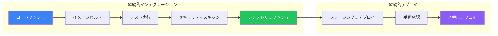

CI/CDパイプラインでDockerのビルドとデプロイを自動化することで、一貫性のある信頼性の高いリリースを実現できます。この記事では、GitHub Actionsを使用した本番環境向けパイプラインの構築方法を解説します。

## CI/CDパイプラインの概要

典型的なDocker CI/CDパイプライン：



## 基本的なDockerビルドワークフロー

### シンプルなビルドとプッシュ

```yaml
# .github/workflows/docker-build.yml
name: Docker Build and Push

on:
  push:
    branches: [main]
  pull_request:
    branches: [main]

env:
  REGISTRY: ghcr.io
  IMAGE_NAME: ${{ github.repository }}

jobs:
  build:
    runs-on: ubuntu-latest
    permissions:
      contents: read
      packages: write

    steps:
      - name: Checkout repository
        uses: actions/checkout@v4

      - name: Set up Docker Buildx
        uses: docker/setup-buildx-action@v3

      - name: Log in to Container Registry
        if: github.event_name != 'pull_request'
        uses: docker/login-action@v3
        with:
          registry: ${{ env.REGISTRY }}
          username: ${{ github.actor }}
          password: ${{ secrets.GITHUB_TOKEN }}

      - name: Extract metadata
        id: meta
        uses: docker/metadata-action@v5
        with:
          images: ${{ env.REGISTRY }}/${{ env.IMAGE_NAME }}
          tags: |
            type=ref,event=branch
            type=ref,event=pr
            type=sha,prefix=
            type=semver,pattern={{version}}

      - name: Build and push
        uses: docker/build-push-action@v5
        with:
          context: .
          push: ${{ github.event_name != 'pull_request' }}
          tags: ${{ steps.meta.outputs.tags }}
          labels: ${{ steps.meta.outputs.labels }}
          cache-from: type=gha
          cache-to: type=gha,mode=max
```

## マルチアーキテクチャビルド

複数のCPUアーキテクチャ向けにイメージをビルド：

```yaml
name: Multi-Architecture Build

on:
  push:
    branches: [main]
    tags: ['v*']

jobs:
  build:
    runs-on: ubuntu-latest
    steps:
      - name: Checkout
        uses: actions/checkout@v4

      - name: Set up QEMU
        uses: docker/setup-qemu-action@v3

      - name: Set up Docker Buildx
        uses: docker/setup-buildx-action@v3

      - name: Login to Docker Hub
        uses: docker/login-action@v3
        with:
          username: ${{ secrets.DOCKERHUB_USERNAME }}
          password: ${{ secrets.DOCKERHUB_TOKEN }}

      - name: Build and push
        uses: docker/build-push-action@v5
        with:
          context: .
          platforms: linux/amd64,linux/arm64,linux/arm/v7
          push: true
          tags: |
            ${{ secrets.DOCKERHUB_USERNAME }}/myapp:latest
            ${{ secrets.DOCKERHUB_USERNAME }}/myapp:${{ github.sha }}
```

## CIでのテスト

### コンテナでテストを実行

```yaml
name: Test

on: [push, pull_request]

jobs:
  test:
    runs-on: ubuntu-latest
    steps:
      - uses: actions/checkout@v4

      - name: Build test image
        run: docker build --target test -t myapp:test .

      - name: Run unit tests
        run: |
          docker run --rm myapp:test npm test

      - name: Run integration tests
        run: |
          docker compose -f docker-compose.test.yml up --abort-on-container-exit
          docker compose -f docker-compose.test.yml down -v
```

### テスト用Docker Compose

```yaml
# docker-compose.test.yml
version: "3.8"

services:
  app:
    build:
      context: .
      target: test
    environment:
      - DATABASE_URL=postgres://test:test@db:5432/test
      - REDIS_URL=redis://redis:6379
    depends_on:
      db:
        condition: service_healthy
      redis:
        condition: service_started
    command: npm run test:integration

  db:
    image: postgres:15
    environment:
      POSTGRES_USER: test
      POSTGRES_PASSWORD: test
      POSTGRES_DB: test
    healthcheck:
      test: pg_isready -U test
      interval: 5s
      timeout: 5s
      retries: 5

  redis:
    image: redis:7-alpine
```

### テスト用マルチステージDockerfile

```dockerfile
# ビルドステージ
FROM node:20-alpine AS builder
WORKDIR /app
COPY package*.json ./
RUN npm ci
COPY . .
RUN npm run build

# テストステージ
FROM builder AS test
RUN npm ci --include=dev
CMD ["npm", "test"]

# 本番ステージ
FROM node:20-alpine AS production
WORKDIR /app
COPY --from=builder /app/dist ./dist
COPY --from=builder /app/package*.json ./
RUN npm ci --only=production
USER node
CMD ["node", "dist/index.js"]
```

## セキュリティスキャン

### Trivyセキュリティスキャナー

```yaml
name: Security Scan

on:
  push:
    branches: [main]
  schedule:
    - cron: '0 0 * * *'  # 毎日スキャン

jobs:
  scan:
    runs-on: ubuntu-latest
    steps:
      - name: Checkout
        uses: actions/checkout@v4

      - name: Build image
        run: docker build -t myapp:${{ github.sha }} .

      - name: Run Trivy vulnerability scanner
        uses: aquasecurity/trivy-action@master
        with:
          image-ref: 'myapp:${{ github.sha }}'
          format: 'sarif'
          output: 'trivy-results.sarif'
          severity: 'CRITICAL,HIGH'

      - name: Upload Trivy scan results
        uses: github/codeql-action/upload-sarif@v2
        if: always()
        with:
          sarif_file: 'trivy-results.sarif'
```

### Docker Scout

```yaml
name: Docker Scout

on:
  push:
    branches: [main]

jobs:
  scout:
    runs-on: ubuntu-latest
    steps:
      - name: Checkout
        uses: actions/checkout@v4

      - name: Login to Docker Hub
        uses: docker/login-action@v3
        with:
          username: ${{ secrets.DOCKERHUB_USERNAME }}
          password: ${{ secrets.DOCKERHUB_TOKEN }}

      - name: Build image
        run: docker build -t myapp:${{ github.sha }} .

      - name: Docker Scout CVE scan
        uses: docker/scout-action@v1
        with:
          command: cves
          image: myapp:${{ github.sha }}
          only-severities: critical,high
          exit-code: true

      - name: Docker Scout recommendations
        uses: docker/scout-action@v1
        with:
          command: recommendations
          image: myapp:${{ github.sha }}
```

## 完全なCI/CDパイプライン

全ステージを含む本番環境向けパイプライン：

```yaml
name: CI/CD Pipeline

on:
  push:
    branches: [main, develop]
    tags: ['v*']
  pull_request:
    branches: [main]

env:
  REGISTRY: ghcr.io
  IMAGE_NAME: ${{ github.repository }}

jobs:
  # リントと静的解析
  lint:
    runs-on: ubuntu-latest
    steps:
      - uses: actions/checkout@v4

      - name: Lint Dockerfile
        uses: hadolint/hadolint-action@v3.1.0
        with:
          dockerfile: Dockerfile

      - name: Run linters
        run: |
          docker run --rm -v $(pwd):/app -w /app node:20-alpine npm run lint

  # テスト実行
  test:
    runs-on: ubuntu-latest
    needs: lint
    steps:
      - uses: actions/checkout@v4

      - name: Build test image
        run: docker build --target test -t ${{ env.IMAGE_NAME }}:test .

      - name: Run tests
        run: |
          docker run --rm \
            -v $(pwd)/coverage:/app/coverage \
            ${{ env.IMAGE_NAME }}:test \
            npm run test:coverage

      - name: Upload coverage
        uses: codecov/codecov-action@v3
        with:
          files: ./coverage/lcov.info

  # イメージのビルドとプッシュ
  build:
    runs-on: ubuntu-latest
    needs: test
    permissions:
      contents: read
      packages: write
      security-events: write
    outputs:
      image-tag: ${{ steps.meta.outputs.tags }}
      image-digest: ${{ steps.build.outputs.digest }}

    steps:
      - uses: actions/checkout@v4

      - name: Set up Docker Buildx
        uses: docker/setup-buildx-action@v3

      - name: Log in to Registry
        uses: docker/login-action@v3
        with:
          registry: ${{ env.REGISTRY }}
          username: ${{ github.actor }}
          password: ${{ secrets.GITHUB_TOKEN }}

      - name: Extract metadata
        id: meta
        uses: docker/metadata-action@v5
        with:
          images: ${{ env.REGISTRY }}/${{ env.IMAGE_NAME }}
          tags: |
            type=ref,event=branch
            type=sha,prefix=
            type=semver,pattern={{version}}
            type=semver,pattern={{major}}.{{minor}}

      - name: Build and push
        id: build
        uses: docker/build-push-action@v5
        with:
          context: .
          push: true
          tags: ${{ steps.meta.outputs.tags }}
          labels: ${{ steps.meta.outputs.labels }}
          cache-from: type=gha
          cache-to: type=gha,mode=max
          provenance: true
          sbom: true

      - name: Run Trivy scanner
        uses: aquasecurity/trivy-action@master
        with:
          image-ref: ${{ env.REGISTRY }}/${{ env.IMAGE_NAME }}:${{ github.sha }}
          format: 'sarif'
          output: 'trivy-results.sarif'

      - name: Upload scan results
        uses: github/codeql-action/upload-sarif@v2
        with:
          sarif_file: 'trivy-results.sarif'

  # ステージングにデプロイ
  deploy-staging:
    runs-on: ubuntu-latest
    needs: build
    if: github.ref == 'refs/heads/main'
    environment:
      name: staging
      url: https://staging.example.com
    steps:
      - uses: actions/checkout@v4

      - name: Deploy to staging
        run: |
          # 例: Kubernetesにデプロイ
          kubectl set image deployment/myapp \
            myapp=${{ env.REGISTRY }}/${{ env.IMAGE_NAME }}@${{ needs.build.outputs.image-digest }} \
            --namespace staging

      - name: Run smoke tests
        run: |
          curl -f https://staging.example.com/health || exit 1

  # 本番にデプロイ
  deploy-production:
    runs-on: ubuntu-latest
    needs: [build, deploy-staging]
    if: startsWith(github.ref, 'refs/tags/v')
    environment:
      name: production
      url: https://example.com
    steps:
      - uses: actions/checkout@v4

      - name: Deploy to production
        run: |
          kubectl set image deployment/myapp \
            myapp=${{ env.REGISTRY }}/${{ env.IMAGE_NAME }}@${{ needs.build.outputs.image-digest }} \
            --namespace production

      - name: Verify deployment
        run: |
          kubectl rollout status deployment/myapp --namespace production
```

## デプロイ戦略

### ローリングアップデート

```yaml
# kubernetes/deployment.yml
apiVersion: apps/v1
kind: Deployment
metadata:
  name: myapp
spec:
  replicas: 3
  strategy:
    type: RollingUpdate
    rollingUpdate:
      maxSurge: 1
      maxUnavailable: 0
  selector:
    matchLabels:
      app: myapp
  template:
    metadata:
      labels:
        app: myapp
    spec:
      containers:
        - name: myapp
          image: ghcr.io/org/myapp:latest
          ports:
            - containerPort: 3000
          readinessProbe:
            httpGet:
              path: /health
              port: 3000
            initialDelaySeconds: 5
            periodSeconds: 10
```

### ブルーグリーンデプロイ

```yaml
deploy-blue-green:
  runs-on: ubuntu-latest
  steps:
    - name: Deploy new version (green)
      run: |
        kubectl apply -f k8s/deployment-green.yml
        kubectl wait --for=condition=ready pod -l version=green --timeout=300s

    - name: Run tests against green
      run: |
        GREEN_URL=$(kubectl get svc myapp-green -o jsonpath='{.status.loadBalancer.ingress[0].ip}')
        curl -f http://$GREEN_URL/health

    - name: Switch traffic to green
      run: |
        kubectl patch svc myapp -p '{"spec":{"selector":{"version":"green"}}}'

    - name: Remove blue deployment
      run: |
        kubectl delete -f k8s/deployment-blue.yml
```

### カナリアデプロイ

```yaml
deploy-canary:
  runs-on: ubuntu-latest
  steps:
    - name: Deploy canary (10% traffic)
      run: |
        kubectl apply -f k8s/deployment-canary.yml
        kubectl scale deployment myapp-canary --replicas=1
        kubectl scale deployment myapp-stable --replicas=9

    - name: Monitor canary metrics
      run: |
        # 10分間エラー率を確認
        sleep 600
        ERROR_RATE=$(curl -s prometheus/api/v1/query?query=rate(http_errors_total[5m]))
        if [ "$ERROR_RATE" -gt "0.01" ]; then
          echo "エラー率が高いため、ロールバック"
          kubectl scale deployment myapp-canary --replicas=0
          exit 1
        fi

    - name: Promote canary to stable
      run: |
        kubectl set image deployment/myapp-stable myapp=${{ env.NEW_IMAGE }}
        kubectl scale deployment myapp-canary --replicas=0
```

## レジストリ管理

### 複数レジストリ

```yaml
push-multiple-registries:
  runs-on: ubuntu-latest
  steps:
    - uses: actions/checkout@v4

    - name: Set up Docker Buildx
      uses: docker/setup-buildx-action@v3

    - name: Login to Docker Hub
      uses: docker/login-action@v3
      with:
        username: ${{ secrets.DOCKERHUB_USERNAME }}
        password: ${{ secrets.DOCKERHUB_TOKEN }}

    - name: Login to GHCR
      uses: docker/login-action@v3
      with:
        registry: ghcr.io
        username: ${{ github.actor }}
        password: ${{ secrets.GITHUB_TOKEN }}

    - name: Login to AWS ECR
      uses: docker/login-action@v3
      with:
        registry: ${{ secrets.AWS_ACCOUNT_ID }}.dkr.ecr.${{ secrets.AWS_REGION }}.amazonaws.com
        username: ${{ secrets.AWS_ACCESS_KEY_ID }}
        password: ${{ secrets.AWS_SECRET_ACCESS_KEY }}

    - name: Build and push to all registries
      uses: docker/build-push-action@v5
      with:
        push: true
        tags: |
          docker.io/myorg/myapp:${{ github.sha }}
          ghcr.io/myorg/myapp:${{ github.sha }}
          ${{ secrets.AWS_ACCOUNT_ID }}.dkr.ecr.${{ secrets.AWS_REGION }}.amazonaws.com/myapp:${{ github.sha }}
```

## イメージタグ戦略

| タグパターン | 用途 |
|-------------|------|
| `latest` | mainからの最新ビルド |
| `v1.2.3` | セマンティックバージョンリリース |
| `sha-abc123` | 特定コミットのビルド |
| `main-20250118` | 日付ベースのビルド |
| `pr-42` | プルリクエストビルド |

```yaml
- name: Generate tags
  id: meta
  uses: docker/metadata-action@v5
  with:
    images: ghcr.io/${{ github.repository }}
    tags: |
      type=raw,value=latest,enable=${{ github.ref == 'refs/heads/main' }}
      type=semver,pattern={{version}}
      type=semver,pattern={{major}}.{{minor}}
      type=sha,prefix=sha-
      type=ref,event=pr,prefix=pr-
```

## キャッシュ戦略

### GitHub Actionsキャッシュ

```yaml
- name: Build with cache
  uses: docker/build-push-action@v5
  with:
    context: .
    push: true
    tags: myapp:latest
    cache-from: type=gha
    cache-to: type=gha,mode=max
```

### レジストリキャッシュ

```yaml
- name: Build with registry cache
  uses: docker/build-push-action@v5
  with:
    context: .
    push: true
    tags: myapp:latest
    cache-from: type=registry,ref=ghcr.io/myorg/myapp:buildcache
    cache-to: type=registry,ref=ghcr.io/myorg/myapp:buildcache,mode=max
```

## シークレット管理

```yaml
- name: Build with secrets
  uses: docker/build-push-action@v5
  with:
    context: .
    push: true
    tags: myapp:latest
    secrets: |
      npm_token=${{ secrets.NPM_TOKEN }}
      github_token=${{ secrets.GITHUB_TOKEN }}
```

```dockerfile
# Dockerfile
FROM node:20-alpine
WORKDIR /app

# ビルド時にシークレットを使用
RUN --mount=type=secret,id=npm_token \
    NPM_TOKEN=$(cat /run/secrets/npm_token) \
    npm ci
```

## 重要なポイント

| プラクティス | メリット |
|-------------|---------|
| マルチステージビルド | 小さいイメージ、高速なCI |
| ビルドキャッシュ | ビルドの高速化 |
| セキュリティスキャン | 脆弱性の早期発見 |
| マルチアーキビルド | 多様な環境をサポート |
| 自動テスト | 信頼性の高いリリース |
| 段階的ロールアウト | 安全なデプロイ |

## ベストプラクティス

1. **バージョンを固定** - `latest`ではなく特定のイメージタグを使用
2. **イメージをスキャン** - 毎ビルドでセキュリティスキャンを実行
3. **ビルドキャッシュを使用** - レイヤーキャッシュでCIを高速化
4. **イメージに署名** - イメージの真正性を検証
5. **すべてを自動化** - 手動ステップはエラーの原因
6. **デプロイを監視** - リリース後にメトリクスを監視

## 参考文献

- Docker Deep Dive, 5th Edition - Nigel Poulton
- [GitHub Actionsドキュメント](https://docs.github.com/en/actions)
- [Docker Build Push Action](https://github.com/docker/build-push-action)
- [Trivyスキャナー](https://aquasecurity.github.io/trivy/)
