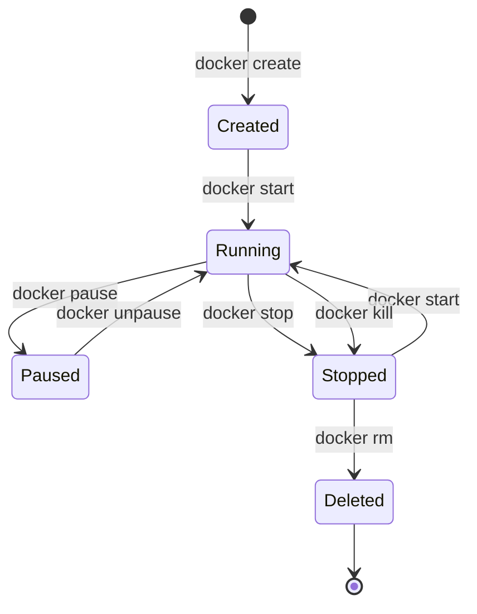

イメージを理解したところで、次はコンテナの操作を学びましょう。この記事では、Dockerコンテナの実行と管理に必要なすべての基本操作をカバーします。

## 最初のコンテナを実行する

`docker run`コマンドは、イメージから新しいコンテナを作成して起動します：

```bash
# 基本構文
docker run [OPTIONS] IMAGE [COMMAND] [ARG...]

# nginxを実行
docker run nginx

# カスタムコマンドで実行
docker run alpine echo "Hello, Docker!"
```

### よく使うrunオプション

| オプション | 説明 | 例 |
|----------|------|-----|
| `-d` | デタッチモード（バックグラウンド）で実行 | `docker run -d nginx` |
| `-p` | ポートマッピング（ホスト:コンテナ） | `docker run -p 8080:80 nginx` |
| `--name` | 名前を割り当て | `docker run --name web nginx` |
| `-e` | 環境変数を設定 | `docker run -e DEBUG=true app` |
| `-v` | ボリュームをマウント | `docker run -v /data:/app/data app` |
| `--rm` | 終了時にコンテナを削除 | `docker run --rm alpine echo "hi"` |
| `-it` | インタラクティブ＋TTY | `docker run -it alpine sh` |

### 実践的な例

```bash
# Webサーバーをバックグラウンドで実行、ポート8080でアクセス可能
docker run -d -p 8080:80 --name my-nginx nginx

# インタラクティブシェルを実行
docker run -it --name my-alpine alpine sh

# 環境変数付きで実行
docker run -d -e MYSQL_ROOT_PASSWORD=secret --name my-mysql mysql:8

# 自動クリーンアップ付きで実行
docker run --rm alpine cat /etc/os-release
```

## コンテナのライフサイクル

コンテナのライフサイクルを理解することは、効果的な管理に不可欠です：



### ライフサイクルコマンド

```bash
# 起動せずに作成
docker create --name my-container nginx

# 作成済みまたは停止中のコンテナを起動
docker start my-container

# 実行中のコンテナを停止（正常終了）
docker stop my-container

# コンテナを強制終了（即時）
docker kill my-container

# コンテナを再起動
docker restart my-container

# 一時停止/再開
docker pause my-container
docker unpause my-container

# 停止中のコンテナを削除
docker rm my-container

# 実行中のコンテナを強制削除
docker rm -f my-container
```

## コンテナの一覧表示

### 実行中のコンテナを表示

```bash
# 実行中のコンテナを一覧
docker ps

# 出力:
CONTAINER ID   IMAGE   COMMAND                  CREATED          STATUS          PORTS                  NAMES
abc123def456   nginx   "/docker-entrypoint.…"   10 minutes ago   Up 10 minutes   0.0.0.0:8080->80/tcp   my-nginx
```

### すべてのコンテナを表示

```bash
# すべてのコンテナを一覧（停止中を含む）
docker ps -a

# コンテナIDのみ表示
docker ps -q

# 最後に作成されたコンテナを表示
docker ps -l

# コンテナをフィルタ
docker ps -f "status=exited"
docker ps -f "name=my-"

# カスタムフォーマットで出力
docker ps --format "table {{.Names}}\t{{.Status}}\t{{.Ports}}"
```

### ステータスの理解

| ステータス | 説明 |
|----------|------|
| `Created` | コンテナは作成されたが起動されていない |
| `Up X minutes` | コンテナは実行中 |
| `Exited (0)` | コンテナは正常に停止した |
| `Exited (1)` | コンテナはエラーで停止した |
| `Paused` | コンテナは一時停止中 |
| `Restarting` | コンテナは再起動中 |

## コンテナのログ

ログはデバッグと監視に不可欠です：

```bash
# すべてのログを表示
docker logs my-nginx

# リアルタイムでログを追跡
docker logs -f my-nginx

# 最後のN行を表示
docker logs --tail 100 my-nginx

# タイムスタンプ付きでログを表示
docker logs -t my-nginx

# 特定の時間以降のログを表示
docker logs --since 2025-01-18T10:00:00 my-nginx
docker logs --since 30m my-nginx

# オプションを組み合わせる
docker logs -f --tail 50 -t my-nginx
```

### ロギングドライバー

Dockerは異なるロギングドライバーをサポートしています：

```bash
# 特定のロギングドライバーで実行
docker run -d --log-driver json-file --log-opt max-size=10m nginx

# ロギングドライバーを確認
docker inspect --format='{{.HostConfig.LogConfig.Type}}' my-nginx
```

| ドライバー | 説明 |
|----------|------|
| `json-file` | デフォルト、JSONとしてログを保存 |
| `syslog` | syslogに書き込み |
| `journald` | systemd journalに書き込み |
| `fluentd` | Fluentdに送信 |
| `awslogs` | AWS CloudWatchに送信 |
| `none` | ロギングを無効化 |

## コンテナ内でコマンドを実行

`docker exec`コマンドは実行中のコンテナ内でコマンドを実行します：

```bash
# 単一のコマンドを実行
docker exec my-nginx cat /etc/nginx/nginx.conf

# インタラクティブシェルを開始
docker exec -it my-nginx bash
docker exec -it my-nginx sh  # Alpineベースのイメージの場合

# 特定のユーザーとして実行
docker exec -u root my-nginx whoami

# コマンドに環境変数を設定
docker exec -e MY_VAR=value my-nginx env

# 作業ディレクトリを設定
docker exec -w /var/log my-nginx ls
```

### よくある使用例

```bash
# プロセスリストを確認
docker exec my-nginx ps aux

# 環境変数を表示
docker exec my-nginx env

# ネットワーク問題をデバッグ
docker exec my-nginx curl localhost

# データベースCLIにアクセス
docker exec -it my-mysql mysql -u root -p

# デバッグツールをインストール（一時的）
docker exec my-nginx apt-get update && apt-get install -y curl
```

## コンテナの検査

コンテナの詳細情報を取得します：

```bash
# 完全な検査（JSON出力）
docker inspect my-nginx

# 特定のフィールドを取得
docker inspect --format='{{.State.Status}}' my-nginx
docker inspect --format='{{.NetworkSettings.IPAddress}}' my-nginx
docker inspect --format='{{range .NetworkSettings.Networks}}{{.IPAddress}}{{end}}' my-nginx

# 環境変数を取得
docker inspect --format='{{json .Config.Env}}' my-nginx | jq

# マウントされたボリュームを取得
docker inspect --format='{{json .Mounts}}' my-nginx | jq
```

### 便利なinspectクエリ

| クエリ | 出力 |
|--------|------|
| `{{.State.Status}}` | 実行状態 |
| `{{.State.StartedAt}}` | 開始時刻 |
| `{{.NetworkSettings.IPAddress}}` | コンテナIP |
| `{{.Config.Env}}` | 環境変数 |
| `{{.HostConfig.Memory}}` | メモリ制限 |
| `{{.Mounts}}` | ボリュームマウント |

## コンテナのプロセスを表示

```bash
# コンテナ内のプロセスを表示
docker top my-nginx

# 出力:
UID    PID    PPID   C   STIME   TTY   TIME      CMD
root   1234   1233   0   10:00   ?     00:00:00  nginx: master process
nginx  1235   1234   0   10:00   ?     00:00:00  nginx: worker process
```

## リソース使用状況の統計

```bash
# リアルタイムのリソース使用量を表示
docker stats

# 特定のコンテナの統計を表示
docker stats my-nginx my-mysql

# ストリーミングなしで統計を表示
docker stats --no-stream

# カスタムフォーマット
docker stats --format "table {{.Name}}\t{{.CPUPerc}}\t{{.MemUsage}}"
```

```
CONTAINER ID   NAME       CPU %     MEM USAGE / LIMIT     MEM %     NET I/O          BLOCK I/O
abc123def456   my-nginx   0.00%     2.5MiB / 7.77GiB      0.03%     1.2kB / 1.1kB    0B / 0B
```

## ファイルのコピー

コンテナとホスト間でファイルをコピーします：

```bash
# コンテナからホストにコピー
docker cp my-nginx:/etc/nginx/nginx.conf ./nginx.conf

# ホストからコンテナにコピー
docker cp ./custom.conf my-nginx:/etc/nginx/conf.d/

# ディレクトリ全体をコピー
docker cp my-nginx:/var/log/nginx/ ./logs/

# 停止中のコンテナからもコピー可能
docker cp stopped-container:/data ./backup/
```

## コンテナの再起動ポリシー

自動再起動の動作を設定します：

```bash
# 常に再起動
docker run -d --restart always nginx

# 失敗時のみ再起動
docker run -d --restart on-failure nginx

# 失敗時に最大試行回数で再起動
docker run -d --restart on-failure:5 nginx

# 手動で停止しない限り再起動
docker run -d --restart unless-stopped nginx
```

| ポリシー | 説明 |
|---------|------|
| `no` | 再起動しない（デフォルト） |
| `always` | 常に再起動 |
| `on-failure` | 非ゼロ終了時のみ再起動 |
| `on-failure:N` | 失敗時に再起動、最大N回 |
| `unless-stopped` | alwaysと同様だが手動停止を尊重 |

### 再起動ポリシーの更新

```bash
# 既存のコンテナのポリシーを更新
docker update --restart unless-stopped my-nginx
```

## コンテナへのアタッチ

```bash
# 実行中のコンテナのメインプロセスにアタッチ
docker attach my-nginx

# 停止せずにデタッチ: Ctrl+P, Ctrl+Q
```

**注意**: `attach`はメインプロセス（PID 1）に接続します。新しいシェルには`exec`を使用してください。

## コンテナの名前変更

```bash
docker rename old-name new-name
```

## 一括操作

```bash
# すべての実行中のコンテナを停止
docker stop $(docker ps -q)

# すべての停止中のコンテナを削除
docker rm $(docker ps -aq -f "status=exited")

# すべてのコンテナを削除（注意！）
docker rm -f $(docker ps -aq)

# システムプルーン（未使用データを削除）
docker system prune

# 未使用のすべてを削除
docker system prune -a --volumes
```

## Docker Debugでのデバッグ

シェルのない最小イメージの場合：

```bash
# デバッグセッションを開始（Docker Desktop機能）
docker debug my-nginx

# または、デバッグコンテナを使用
docker run -it --rm --pid=container:my-nginx \
  --net=container:my-nginx \
  nicolaka/netshoot
```

## ベストプラクティス

### 1. 常にコンテナに名前を付ける

```bash
# 良い例
docker run -d --name redis-cache redis

# 自動生成名は避ける
docker run -d redis  # "eager_pike"のようなランダムな名前になる
```

### 2. 本番環境では再起動ポリシーを使用

```bash
docker run -d --restart unless-stopped --name web nginx
```

### 3. リソース制限を設定

```bash
docker run -d \
  --memory=512m \
  --cpus=0.5 \
  --name limited-app \
  myapp
```

### 4. 定期的にクリーンアップ

```bash
# 終了したコンテナを削除
docker container prune

# 確認付きで削除
docker container prune -f
```

## クイックリファレンス表

| 操作 | コマンド |
|------|---------|
| コンテナを実行 | `docker run -d --name NAME IMAGE` |
| 実行中を一覧 | `docker ps` |
| すべてを一覧 | `docker ps -a` |
| コンテナを停止 | `docker stop NAME` |
| コンテナを起動 | `docker start NAME` |
| 再起動 | `docker restart NAME` |
| ログを表示 | `docker logs -f NAME` |
| コマンドを実行 | `docker exec -it NAME sh` |
| 検査 | `docker inspect NAME` |
| 統計を表示 | `docker stats NAME` |
| ファイルをコピー | `docker cp NAME:/path ./local` |
| 削除 | `docker rm NAME` |

## 重要なポイント

1. **バックグラウンドには`-d`** - サービスにはデタッチモードで実行
2. **インタラクティブには`-it`** - シェルやデバッグに使用
3. **一時的には`--rm`** - 一回限りのコマンドには自動クリーンアップ
4. **`attach`ではなく`exec`を使用** - `exec`は新しいプロセスを開始、`attach`はPID 1に接続
5. **再起動ポリシーを設定** - サービスが障害から復旧できるように
6. **ログと統計で監視** - デバッグとパフォーマンスに不可欠

## 次のステップ

次の記事では、Dockerfileを使ってカスタムイメージを作成する方法を学びます。ゼロから独自のコンテナを定義しましょう。

## 参考文献

- Docker Deep Dive, 5th Edition - Nigel Poulton
- The Ultimate Docker Container Book, 3rd Edition - Dr. Gabriel N. Schenker
- [Docker CLIリファレンス](https://docs.docker.com/engine/reference/commandline/docker/)
