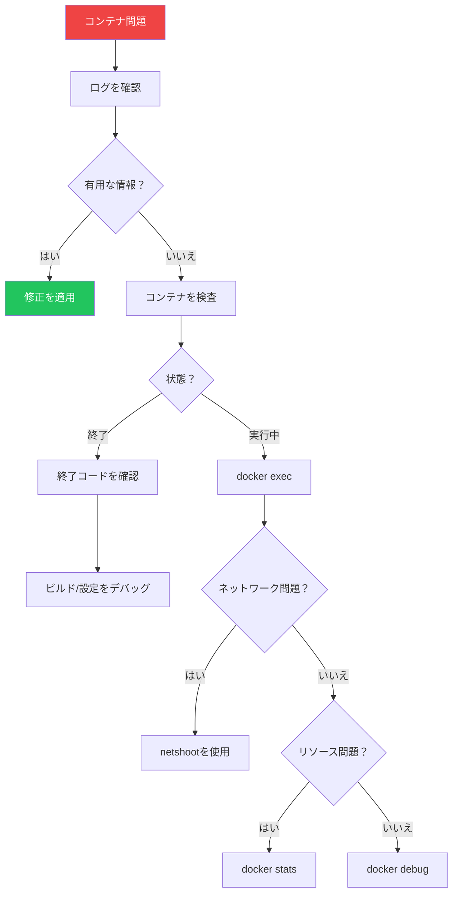

コンテナに問題が発生したとき、デバッグ方法を知っていることが不可欠です。この記事では、一般的なDocker問題を診断・修正するテクニックを解説します。

## コンテナログ

ログはデバッグの最初の防衛線です。

### 基本的なログコマンド

```bash
# すべてのログを表示
docker logs container_name

# リアルタイムでログを追跡
docker logs -f container_name

# 最後のN行を表示
docker logs --tail 100 container_name

# タイムスタンプ付きでログを表示
docker logs -t container_name

# 特定の時間以降のログを表示
docker logs --since "2025-01-18T10:00:00" container_name
docker logs --since 30m container_name  # 直近30分

# 特定の時間までのログを表示
docker logs --until "2025-01-18T11:00:00" container_name
```

### Docker Composeログ

```bash
# すべてのサービス
docker compose logs

# 特定のサービス
docker compose logs api

# tailで追跡
docker compose logs -f --tail 50 api db
```

### ログドライバー

```bash
# ログドライバーを確認
docker inspect --format='{{.HostConfig.LogConfig.Type}}' container_name

# 特定のドライバーで実行
docker run -d \
  --log-driver json-file \
  --log-opt max-size=10m \
  --log-opt max-file=3 \
  nginx
```

## コンテナ内でコマンドを実行

### docker exec

```bash
# インタラクティブシェル
docker exec -it container_name bash
docker exec -it container_name sh  # Alpine用

# 単一コマンドを実行
docker exec container_name cat /etc/hosts

# 別のユーザーとして実行
docker exec -u root container_name whoami

# 環境変数付き
docker exec -e DEBUG=true container_name env
```

### 便利なデバッグコマンド

```bash
# プロセスリストを確認
docker exec container_name ps aux

# 環境を表示
docker exec container_name env

# ディスク使用量を確認
docker exec container_name df -h

# ネットワーク設定を表示
docker exec container_name ip addr
docker exec container_name cat /etc/resolv.conf

# 接続をテスト
docker exec container_name ping -c 3 other_container
docker exec container_name curl -v http://api:3000/health
```

## コンテナの検査

### docker inspect

```bash
# コンテナの完全な詳細
docker inspect container_name

# 特定のフィールドを取得
docker inspect --format='{{.State.Status}}' container_name
docker inspect --format='{{.State.ExitCode}}' container_name
docker inspect --format='{{.NetworkSettings.IPAddress}}' container_name
docker inspect --format='{{json .Config.Env}}' container_name | jq
docker inspect --format='{{json .Mounts}}' container_name | jq
```

### コンテナの状態

```bash
# コンテナが停止した理由を確認
docker inspect --format='{{.State.Status}}' container_name
docker inspect --format='{{.State.ExitCode}}' container_name
docker inspect --format='{{.State.Error}}' container_name
docker inspect --format='{{.State.OOMKilled}}' container_name
```

| 終了コード | 意味 |
|----------|------|
| 0 | 成功 |
| 1 | 一般エラー |
| 126 | コマンドが実行不可 |
| 127 | コマンドが見つからない |
| 137 | Kill（OOMまたはSIGKILL） |
| 139 | セグメンテーションフォルト |
| 143 | 終了（SIGTERM） |

## ネットワークトラブルシューティング

### nicolaka/netshootの使用

netshootコンテナはネットワークデバッグに不可欠です：

```bash
# 同じネットワーク名前空間でデバッグ
docker run -it --rm \
  --network container:target_container \
  nicolaka/netshoot

# netshoot内で:
ip addr
ping other_container
nslookup api
curl http://api:3000/health
tcpdump -i eth0
traceroute google.com
```

### よくあるネットワーク問題

```bash
# ネットワーク接続を確認
docker exec container_name ping -c 3 db

# DNS解決
docker exec container_name nslookup api
docker exec container_name cat /etc/resolv.conf

# ポートリスニング
docker exec container_name netstat -tlnp
docker exec container_name ss -tlnp

# 公開ポートを確認
docker port container_name
```

### ネットワーク検査

```bash
# ネットワークを一覧
docker network ls

# ネットワークを検査
docker network inspect bridge

# ネットワーク上のコンテナIPを検索
docker network inspect mynetwork -f '{{range .Containers}}{{.Name}}: {{.IPv4Address}}{{"\n"}}{{end}}'
```

## ビルド問題のデバッグ

### 詳細出力でビルド

```bash
# 標準ビルド
docker build -t myapp .

# 進捗出力付き
docker build --progress=plain -t myapp .

# キャッシュなし
docker build --no-cache -t myapp .

# 特定のステージで停止
docker build --target builder -t myapp:builder .
```

### 失敗したビルドのデバッグ

```bash
# ビルドして中間コンテナを保持
docker build -t myapp . 2>&1 | tee build.log

# 最後に成功したレイヤーを実行
docker run -it <last-successful-image-id> sh
```

### BuildKitデバッグ

```bash
# BuildKitデバッグを有効化
BUILDKIT_PROGRESS=plain docker build -t myapp .

# 検査用にビルドキャッシュをエクスポート
docker build --build-arg BUILDKIT_INLINE_CACHE=1 -t myapp .
```

## Docker Debug（Docker Desktop）

Docker Desktopには組み込みのデバッグ機能があります：

```bash
# デバッグセッションを開始
docker debug container_name

# 特定のシェルでデバッグ
docker debug --shell bash container_name

# 停止したコンテナをデバッグ
docker debug --init container_name
```

## Slim/Distrolessイメージのデバッグ

シェルのない最小イメージの場合：

```bash
# ツールを一時的にコピー
docker cp /usr/local/bin/curl container_name:/tmp/

# デバッグコンテナを使用
docker run -it --rm \
  --pid=container:target \
  --net=container:target \
  busybox

# slimイメージ用のdocker debug
docker debug target_container
```

## リソース問題

### メモリ問題

```bash
# メモリ使用量を確認
docker stats container_name

# OOMでkillされたか確認
docker inspect --format='{{.State.OOMKilled}}' container_name

# コンテナイベントを表示
docker events --filter container=container_name
```

### CPU問題

```bash
# リアルタイム統計
docker stats --format "table {{.Name}}\t{{.CPUPerc}}\t{{.MemUsage}}"

# CPU制限を確認
docker inspect --format='{{.HostConfig.NanoCpus}}' container_name
```

## よくある問題と解決策

### コンテナがすぐに終了する

```bash
# 終了コードを確認
docker inspect --format='{{.State.ExitCode}}' container_name

# ログを確認
docker logs container_name

# よくある原因:
# - CMD/ENTRYPOINTがない
# - アプリが起動時にクラッシュ
# - 設定エラー

# インタラクティブに実行してデバッグ
docker run -it --rm myimage sh
```

### コンテナに接続できない

```bash
# コンテナが実行中か確認
docker ps -a

# ポートマッピングを確認
docker port container_name

# ネットワークを確認
docker network inspect bridge

# 別のコンテナからテスト
docker run --rm --network mynetwork alpine ping target_container
```

### コンテナが遅い

```bash
# リソース使用量を確認
docker stats container_name

# ディスクI/Oを確認
docker exec container_name iostat

# CPUスロットリングを確認
cat /sys/fs/cgroup/cpu/docker/<container-id>/cpu.stat
```

### ボリュームの権限問題

```bash
# ファイル所有権を確認
docker exec container_name ls -la /data

# 実行ユーザーを確認
docker exec container_name id

# 権限を修正
docker exec -u root container_name chown -R 1000:1000 /data
```

## デバッグワークフロー



## デバッグチェックリスト

| ステップ | コマンド |
|---------|---------|
| 1. 状態を確認 | `docker ps -a` |
| 2. ログを表示 | `docker logs -f container` |
| 3. 終了コードを確認 | `docker inspect --format='{{.State.ExitCode}}'` |
| 4. インタラクティブシェル | `docker exec -it container sh` |
| 5. リソースを確認 | `docker stats` |
| 6. ネットワークデバッグ | `docker run --network container:X netshoot` |
| 7. 詳細を検査 | `docker inspect container` |

## 重要なポイント

1. **ログから始める** - ほとんどの問題はログに見える
2. **docker execを使用** - 実行中のコンテナでインタラクティブにデバッグ
3. **終了コードを知る** - 何が問題だったかを教えてくれる
4. **ネットワークにはnetshoot** - ネットワークデバッグに不可欠
5. **slimイメージにはdocker debug** - シェルがないとき
6. **リソースを確認** - メモリとCPUの問題は一般的

## 次のステップ

次の記事では、本番環境向けのDocker監視とロギングを解説します。

## 参考文献

- Docker Deep Dive, 5th Edition - Nigel Poulton
- [Dockerデバッグドキュメント](https://docs.docker.com/engine/reference/commandline/debug/)
