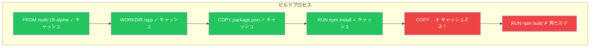

効率的なDockerイメージの構築は、高速なデプロイ、ストレージコストの削減、セキュリティの向上に不可欠です。この記事では、マルチステージビルド以外の最適化テクニックを解説します。

## なぜDockerイメージを最適化するのか？

| メリット | 影響 |
|---------|------|
| ビルドの高速化 | 開発者体験の向上 |
| プルの高速化 | デプロイの迅速化 |
| ストレージの削減 | クラウドコストの低減 |
| 攻撃面の縮小 | セキュリティの向上 |
| 帯域幅の節約 | CI/CDの高速化 |

## レイヤーキャッシュ戦略

Dockerは各レイヤーをキャッシュします。これを理解することが高速ビルドの鍵です。

### キャッシュの仕組み



**ルール:** レイヤーが変更されると、それ以降のすべてのレイヤーが再ビルドされます。

### レイヤー順序の最適化

```dockerfile
# 悪い例 - ソースの変更が依存関係を再ビルド
FROM node:18-alpine
WORKDIR /app
COPY . .
RUN npm install
RUN npm run build

# 良い例 - package.jsonが変更されない限り依存関係はキャッシュ
FROM node:18-alpine
WORKDIR /app
COPY package*.json ./
RUN npm install
COPY . .
RUN npm run build
```

### ランタイムと開発依存関係を分離

```dockerfile
# ビルド用にすべての依存関係をインストール
FROM node:18-alpine AS builder
WORKDIR /app
COPY package*.json ./
RUN npm ci
COPY . .
RUN npm run build

# 本番依存関係のみインストール
FROM node:18-alpine AS production
WORKDIR /app
COPY package*.json ./
RUN npm ci --only=production
COPY --from=builder /app/dist ./dist
```

## .dockerignore

`.dockerignore`ファイルはビルドコンテキストからファイルを除外し、ビルドを高速化しイメージを小さくします。

### 必須の.dockerignore

```
# 依存関係（コンテナ内でインストール）
node_modules
vendor/
venv/

# ビルド出力（コンテナ内で再作成）
dist/
build/
*.pyc
__pycache__

# 開発ファイル
.git
.gitignore
.env
.env.*
*.md
README*
LICENSE

# IDEとエディタファイル
.idea/
.vscode/
*.swp
*.swo

# テストとカバレッジ
coverage/
.nyc_output/
*.test.js
*.spec.js

# Dockerファイル（イメージに不要）
Dockerfile*
docker-compose*
.dockerignore

# CI/CD
.github/
.gitlab-ci.yml
Jenkinsfile

# ログ
*.log
npm-debug.log
```

### .dockerignoreの影響

```bash
# .dockerignoreなし
$ docker build -t myapp .
Sending build context to Docker daemon  500MB

# .dockerignoreあり
$ docker build -t myapp .
Sending build context to Docker daemon  5MB
```

## ベースイメージの選択

### Alpine vs Debian/Ubuntu

| 側面 | Alpine | Debian/Ubuntu |
|------|--------|---------------|
| サイズ | 〜5MB | 〜100-200MB |
| パッケージマネージャー | apk | apt |
| Cライブラリ | musl | glibc |
| 互換性 | 問題が発生する場合あり | 最も互換性が高い |
| セキュリティ更新 | 高速 | 定期的 |

```dockerfile
# Debianベース（大きいが互換性が高い）
FROM node:18
# 〜1GB

# Alpineベース（小さい）
FROM node:18-alpine
# 〜150MB

# Distroless（最小限）
FROM gcr.io/distroless/nodejs18
# 〜100MB

# Scratch（空、静的バイナリ用）
FROM scratch
# 0MBベース
```

### 各ベースの使い分け

| ユースケース | 推奨ベース |
|------------|----------|
| 一般的なアプリケーション | Alpineバリアント |
| C拡張を持つPython | Slim（Debianベース） |
| 静的Go/Rustバイナリ | ScratchまたはDistroless |
| 最大の互換性 | 標準のDebian/Ubuntu |
| 最大のセキュリティ | Distroless |

## レイヤーサイズの削減

### RUNコマンドを結合

```dockerfile
# 悪い例 - 3レイヤー、キャッシュ未クリーン
RUN apt-get update
RUN apt-get install -y curl wget
RUN rm -rf /var/lib/apt/lists/*

# 良い例 - 1レイヤー、キャッシュクリーン
RUN apt-get update && \
    apt-get install -y --no-install-recommends \
        curl \
        wget && \
    rm -rf /var/lib/apt/lists/*
```

### --no-install-recommendsを使用

```dockerfile
# 推奨パッケージもインストール（〜50%増）
RUN apt-get install -y python3

# 必要なものだけインストール
RUN apt-get install -y --no-install-recommends python3
```

### 同じレイヤーでクリーンアップ

```dockerfile
# 悪い例 - クリーンアップが新しいレイヤーを作成、サイズ削減されない
RUN apt-get update && apt-get install -y build-essential
RUN rm -rf /var/lib/apt/lists/*

# 良い例 - 同じレイヤーでクリーンアップしてサイズ削減
RUN apt-get update && \
    apt-get install -y --no-install-recommends build-essential && \
    rm -rf /var/lib/apt/lists/*
```

## 言語別の最適化

### Node.js

```dockerfile
FROM node:18-alpine

# npm installの代わりにnpm ciを使用（高速、再現可能）
COPY package*.json ./
RUN npm ci --only=production

# 必要なければpackage-lock.jsonを最終イメージにコピーしない
COPY --from=builder /app/dist ./dist
```

### Python

```dockerfile
FROM python:3.11-slim

# .pycファイルを防止し、バッファリングなしの出力を有効化
ENV PYTHONDONTWRITEBYTECODE=1
ENV PYTHONUNBUFFERED=1

# キャッシュなしでpipを使用
RUN pip install --no-cache-dir -r requirements.txt

# またはwheelを使用してより高速にインストール
COPY --from=builder /wheels /wheels
RUN pip install --no-cache-dir /wheels/*
```

### Go

```dockerfile
FROM golang:1.21-alpine AS builder

# 静的バイナリのためにCGOを無効化
ENV CGO_ENABLED=0

# 最適化付きでビルド
RUN go build -ldflags="-w -s" -o /app/main .

# 最小イメージにはscratchを使用
FROM scratch
COPY --from=builder /app/main /main
```

### Java

```dockerfile
# ランタイムにはJDKではなくJREを使用
FROM eclipse-temurin:17-jre-alpine

# jlinkでカスタム最小JREを作成（上級）
FROM eclipse-temurin:17-jdk-alpine AS builder
RUN jlink --add-modules java.base,java.logging \
    --strip-debug --no-man-pages --no-header-files \
    --compress=2 --output /javaruntime

FROM alpine:3.19
COPY --from=builder /javaruntime /opt/java
```

## 柔軟性のためのビルド引数

```dockerfile
ARG BASE_IMAGE=node:18-alpine
FROM ${BASE_IMAGE}

ARG NODE_ENV=production
ENV NODE_ENV=${NODE_ENV}

# ビルド引数に基づく条件付きインストール
ARG INSTALL_DEV_DEPS=false
RUN if [ "$INSTALL_DEV_DEPS" = "true" ]; then \
        npm install; \
    else \
        npm ci --only=production; \
    fi
```

```bash
# 本番ビルド
docker build -t myapp:prod .

# 開発ビルド
docker build --build-arg INSTALL_DEV_DEPS=true -t myapp:dev .
```

## イメージのスキャンと分析

### Docker Scout

```bash
# 脆弱性をスキャン
docker scout cves myimage:latest

# クイック概要
docker scout quickview myimage:latest

# 推奨事項
docker scout recommendations myimage:latest
```

### Dive - レイヤーを探索

```bash
# diveをインストール
brew install dive

# イメージレイヤーを分析
dive myimage:latest
```

Diveが表示するもの：
- 各レイヤーのサイズと内容
- 削除されたファイルによる無駄なスペース
- 最適化の提案

### Trivy

```bash
# 脆弱性をスキャン
trivy image myimage:latest

# 重要度フィルター付きでスキャン
trivy image --severity HIGH,CRITICAL myimage:latest
```

## BuildKit機能

BuildKitを有効にしてビルドを高速化：

```bash
# BuildKitを有効化
export DOCKER_BUILDKIT=1

# またはdocker-composeで
COMPOSE_DOCKER_CLI_BUILD=1 DOCKER_BUILDKIT=1 docker-compose build
```

### キャッシュマウント

```dockerfile
# syntax=docker/dockerfile:1.4
FROM node:18-alpine

# ビルド間でnpmパッケージをキャッシュ
RUN --mount=type=cache,target=/root/.npm \
    npm ci --only=production

# aptパッケージをキャッシュ
RUN --mount=type=cache,target=/var/cache/apt \
    apt-get update && apt-get install -y curl
```

### シークレットマウント

```dockerfile
# syntax=docker/dockerfile:1.4
FROM node:18-alpine

# イメージに残さずにシークレットを使用
RUN --mount=type=secret,id=npmrc,target=/root/.npmrc \
    npm install
```

```bash
docker build --secret id=npmrc,src=.npmrc -t myapp .
```

## 最適化チェックリスト

| カテゴリ | チェック |
|---------|---------|
| ベースイメージ | 最小限のベース（alpine/distroless）を使用？ |
| .dockerignore | node_modules、.gitなどを除外？ |
| レイヤー順序 | ソースコードより前に依存関係？ |
| RUNコマンド | 結合してクリーンアップ？ |
| マルチステージ | ビルドツールを最終イメージから除外？ |
| 依存関係 | 最終イメージに本番のみ？ |
| ユーザー | 非rootで実行？ |
| スキャン | 重大な脆弱性なし？ |

## サイズ比較の例

```dockerfile
# 未最適化: 〜1.5GB
FROM node:18
COPY . .
RUN npm install
CMD ["node", "server.js"]

# 最適化済み: 〜150MB
FROM node:18-alpine AS builder
WORKDIR /app
COPY package*.json ./
RUN npm ci
COPY . .
RUN npm run build

FROM node:18-alpine
WORKDIR /app
COPY --from=builder /app/dist ./dist
COPY --from=builder /app/node_modules ./node_modules
USER node
CMD ["node", "dist/server.js"]
```

**結果: 90%のサイズ削減！**

## 重要なポイント

1. **レイヤー順序が重要** - 変更頻度の低い命令を先に
2. **.dockerignoreを使用** - 小さいコンテキスト = 高速ビルド
3. **適切なベースイメージを選択** - ほとんどはAlpine、セキュリティにはDistroless
4. **RUNコマンドを結合してクリーンアップ** - レイヤー数とサイズを削減
5. **BuildKitを使用** - キャッシュとシークレットの最新機能
6. **定期的にスキャン** - 脆弱性を発見して修正

## 次のステップ

次の記事では、本番環境向けのDockerセキュリティベストプラクティスを解説します。

## 参考文献

- Docker Deep Dive, 5th Edition - Nigel Poulton
- Docker in Action, 2nd Edition - Jeffrey Nickoloff
- [Dockerfileを書くためのベストプラクティス](https://docs.docker.com/develop/develop-images/dockerfile_best-practices/)
