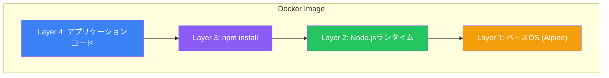

Dockerイメージはコンテナ化の基盤です。この記事では、イメージとは何か、内部でどのように動作するのか、そして管理のベストプラクティスについて解説します。

## Dockerイメージとは

Dockerイメージは、アプリケーションの実行に必要なすべてを含む読み取り専用パッケージです：

- アプリケーションコードとバイナリ
- ランタイム環境（Node.js、Python、Javaなど）
- システムライブラリと依存関係
- 環境変数と設定
- メタデータ（実行コマンド、公開ポートなど）

イメージを「停止したコンテナ」と考えてください。コンテナを起動すると、Dockerはイメージの上に書き込み可能なレイヤーを追加します。

## レイヤードファイルシステム

Dockerの最も強力な機能の1つがレイヤーアーキテクチャです。すべてのイメージは複数のスタックされたレイヤーで構成されています：



### レイヤーの仕組み

各レイヤーはファイルシステムの変更セットを表します：

| Dockerfile命令 | レイヤー作成？ | 説明 |
|--------------|-------------|------|
| `FROM` | はい | ベースイメージレイヤー |
| `RUN` | はい | コマンドを実行し、変更をキャプチャ |
| `COPY`/`ADD` | はい | イメージにファイルを追加 |
| `ENV` | いいえ | 環境変数を設定（メタデータ） |
| `EXPOSE` | いいえ | ポートをドキュメント化（メタデータ） |
| `CMD`/`ENTRYPOINT` | いいえ | デフォルトコマンドを設定（メタデータ） |

### レイヤーの共有

レイヤーはイメージ間で共有され、ディスク容量とダウンロード時間を節約します：

```bash
# 両方のイメージは同じベースレイヤーを共有
docker pull node:18-alpine    # Alpine + Node.jsレイヤーをダウンロード
docker pull node:20-alpine    # Alpineレイヤーを再利用、Node.js 20のみダウンロード
```

```
Image A (node:18-alpine)    Image B (node:20-alpine)
┌─────────────────────┐    ┌─────────────────────┐
│ Node.js 18 (固有)   │    │ Node.js 20 (固有)   │
├─────────────────────┤    ├─────────────────────┤
│                     │    │                     │
│   Alpine (共有)     │◄───│   Alpine (共有)     │
│                     │    │                     │
└─────────────────────┘    └─────────────────────┘
```

## イメージのプル

### 基本的なpullコマンド

```bash
# 最新のnginxイメージをプル
docker pull nginx

# 特定のバージョンをプル
docker pull nginx:1.25

# 特定のレジストリからプル
docker pull gcr.io/google-containers/nginx:latest
```

### pull出力の解説

```bash
$ docker pull redis:7
7: Pulling from library/redis
a2abf6c4d29d: Pull complete     # レイヤー1
c7a4e4382001: Pull complete     # レイヤー2
4044b9ba67c9: Pull complete     # レイヤー3
...
Digest: sha256:e50c7e23f79...   # 一意のコンテンツハッシュ
Status: Downloaded newer image for redis:7
```

各行はダウンロードされるレイヤーを表します。レイヤーがローカルに既に存在する場合は、ダウンロードの代わりに「Already exists」と表示されます。

## イメージの命名とタグ付け

イメージの命名を理解することは、Dockerを効果的に使う上で重要です。

### イメージ名の構造

```
[registry/][repository/]name[:tag][@digest]
```

| コンポーネント | 例 | 説明 |
|--------------|-----|------|
| Registry | `docker.io`, `gcr.io` | イメージの保存場所 |
| Repository | `library`, `myorg` | 名前空間/組織 |
| Name | `nginx`, `redis` | イメージ名 |
| Tag | `latest`, `1.25`, `alpine` | バージョン識別子 |
| Digest | `sha256:abc123...` | 不変のコンテンツハッシュ |

### 例

```bash
# 公式イメージ（Docker Hub）
nginx:latest
# 以下と同等: docker.io/library/nginx:latest

# ユーザー/組織イメージ
mycompany/myapp:v1.2.3

# プライベートレジストリ
gcr.io/my-project/myapp:latest

# ダイジェスト付き（不変の参照）
nginx@sha256:e50c7e23f79...
```

### タグ付けのベストプラクティス

| パターン | 例 | 用途 |
|---------|-----|------|
| セマンティックバージョニング | `v1.2.3` | 本番リリース |
| Git SHA | `abc1234` | CI/CDビルド |
| 日付ベース | `2025-01-18` | ナイトリービルド |
| 環境 | `staging`, `prod` | デプロイ先 |

```bash
# 既存のイメージにタグ付け
docker tag myapp:latest myapp:v1.0.0
docker tag myapp:latest myregistry.com/myapp:v1.0.0
```

## レジストリの操作

### Docker Hub

Docker Hubはデフォルトのパブリックレジストリです：

```bash
# Docker Hubにログイン
docker login

# イメージをプッシュ
docker push username/myapp:v1.0.0

# イメージをプル
docker pull username/myapp:v1.0.0
```

### プライベートレジストリ

```bash
# Amazon ECR
aws ecr get-login-password | docker login --username AWS --password-stdin 123456789.dkr.ecr.us-east-1.amazonaws.com

# Google Container Registry
gcloud auth configure-docker
docker push gcr.io/my-project/myapp:latest

# Azure Container Registry
az acr login --name myregistry
docker push myregistry.azurecr.io/myapp:latest
```

### レジストリの比較

| レジストリ | 最適な用途 | 特徴 |
|----------|----------|------|
| Docker Hub | パブリックイメージ、小規模チーム | 無料パブリックリポ、自動ビルド |
| Amazon ECR | AWSデプロイ | IAM統合、脆弱性スキャン |
| Google GCR | GCPデプロイ | Artifact Registry、Cloud Build統合 |
| Azure ACR | Azureデプロイ | AAD統合、地理的レプリケーション |
| GitHub GHCR | オープンソースプロジェクト | GitHub Actions統合 |

## イメージの一覧と検査

### ローカルイメージの一覧

```bash
# すべてのイメージを一覧
docker images

# 出力:
REPOSITORY    TAG       IMAGE ID       CREATED        SIZE
nginx         latest    a6bd71f48f68   2 days ago     187MB
redis         7         e50c7e23f79d   1 week ago     138MB
node          18        8f3d3c9c2d21   2 weeks ago    1.1GB

# イメージをフィルタ
docker images nginx
docker images --filter "dangling=true"

# イメージサイズを表示
docker images --format "{{.Repository}}:{{.Tag}} - {{.Size}}"
```

### イメージの詳細を検査

```bash
# 詳細情報を取得
docker inspect nginx:latest

# 特定のフィールドを取得
docker inspect --format='{{.Config.Env}}' nginx:latest
docker inspect --format='{{.Config.ExposedPorts}}' nginx:latest

# レイヤー履歴を表示
docker history nginx:latest
```

```bash
$ docker history nginx:latest
IMAGE          CREATED       CREATED BY                                      SIZE
a6bd71f48f68   2 days ago    CMD ["nginx" "-g" "daemon off;"]               0B
<missing>      2 days ago    EXPOSE map[80/tcp:{}]                          0B
<missing>      2 days ago    STOPSIGNAL SIGQUIT                             0B
<missing>      2 days ago    RUN /bin/sh -c set -x ...                      62MB
...
```

## ダイジェストによるプル

タグは可変です。同じタグが時間とともに異なるイメージを指すことがあります。不変の参照にはダイジェストを使用します：

```bash
# ダイジェストを取得
docker inspect --format='{{index .RepoDigests 0}}' nginx:latest
# 出力: nginx@sha256:e50c7e23f79d6...

# ダイジェストでプル（常に同じイメージを取得）
docker pull nginx@sha256:e50c7e23f79d6...
```

### ダイジェストを使うタイミング

| シナリオ | タグを使用 | ダイジェストを使用 |
|---------|----------|-----------------|
| 開発 | ✅ | |
| CI/CDパイプライン | | ✅ |
| 本番デプロイ | | ✅ |
| ドキュメント/チュートリアル | ✅ | |

## マルチアーキテクチャイメージ

最新のイメージはマニフェストを通じて複数のCPUアーキテクチャをサポートしています：

```bash
# サポートされているアーキテクチャを表示
docker manifest inspect nginx:latest
```

```json
{
  "manifests": [
    {
      "platform": { "architecture": "amd64", "os": "linux" }
    },
    {
      "platform": { "architecture": "arm64", "os": "linux" }
    },
    {
      "platform": { "architecture": "arm", "os": "linux", "variant": "v7" }
    }
  ]
}
```

Dockerは自動的にシステムに適したアーキテクチャをプルします。

## イメージの削除

```bash
# 特定のイメージを削除
docker rmi nginx:latest

# イメージIDで削除
docker rmi a6bd71f48f68

# 強制削除（コンテナが存在しても）
docker rmi -f nginx:latest

# 未使用のイメージをすべて削除
docker image prune

# すべてのイメージを削除（注意！）
docker rmi $(docker images -q)
```

### Danglingイメージ

Danglingイメージはタグのないレイヤーで、ビルド中によく作成されます：

```bash
# danglingイメージを一覧
docker images --filter "dangling=true"

# danglingイメージを削除
docker image prune

# 未使用のすべてのイメージを削除（danglingだけでなく）
docker image prune -a
```

## イメージのベストプラクティス

### 1. 特定のタグを使用する

```bash
# 悪い例 - 予測不可能
FROM node:latest

# 良い例 - 再現可能
FROM node:18.19.0-alpine
```

### 2. Alpineベースのイメージを優先する

```bash
# 通常のイメージ（〜1GB）
FROM node:18

# Alpineバリアント（〜150MB）
FROM node:18-alpine
```

### 3. 脆弱性をスキャンする

```bash
# Docker Scoutを使用
docker scout cves nginx:latest

# Trivyを使用
trivy image nginx:latest
```

### 4. .dockerignoreを使用する

```
# .dockerignore
node_modules
.git
*.md
Dockerfile
.dockerignore
```

## まとめ表

| 概念 | 説明 |
|------|------|
| イメージ | コンテナを作成するための読み取り専用テンプレート |
| レイヤー | イメージ内の単一のファイルシステム変更 |
| タグ | 人間が読めるバージョン識別子 |
| ダイジェスト | 不変のコンテンツベース識別子 |
| レジストリ | イメージの保存と配布のためのサービス |
| マニフェスト | イメージのレイヤーとプラットフォームを記述するメタデータ |

## 主要コマンドリファレンス

```bash
# プルとプッシュ
docker pull image:tag
docker push image:tag

# 一覧と検査
docker images
docker inspect image:tag
docker history image:tag

# タグ付けと削除
docker tag source:tag target:tag
docker rmi image:tag
docker image prune
```

## 重要なポイント

1. **イメージはレイヤーで構成される** - 各命令がキャッシュ可能なレイヤーを作成
2. **レイヤーは共有される** - 複数のイメージがベースレイヤーを共有可能
3. **タグは可変** - 不変の参照にはダイジェストを使用
4. **適切なベースイメージを選択** - Alpineイメージは小さいが追加作業が必要な場合も
5. **定期的にクリーンアップ** - 未使用のイメージはディスク容量を消費

## 次のステップ

次の記事では、Dockerコンテナの操作を学びます。コンテナの実行、停止、検査、管理を効果的に行う方法を習得しましょう。

## 参考文献

- Docker Deep Dive, 5th Edition - Nigel Poulton
- Docker: Up & Running, 3rd Edition - Sean P. Kane & Karl Matthias
- [Docker公式ドキュメント - Images](https://docs.docker.com/engine/reference/commandline/images/)
