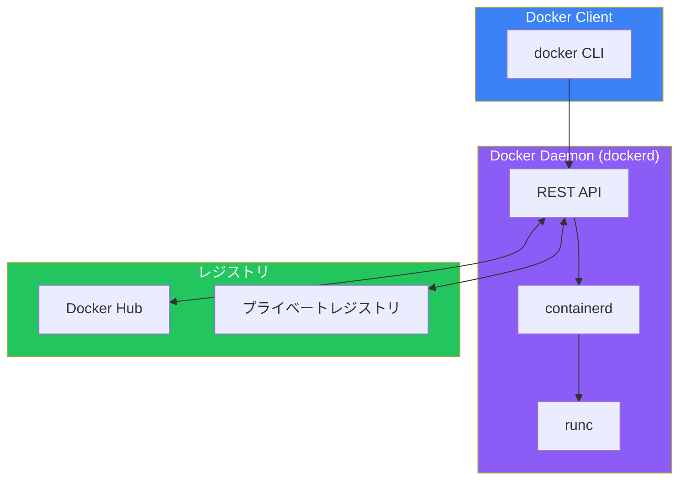
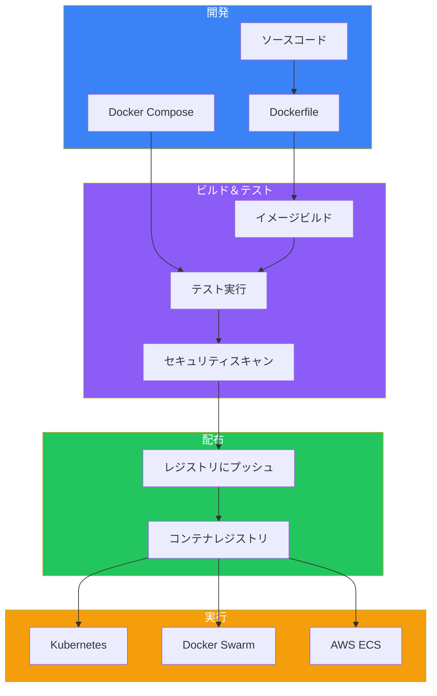

コンテナはアプリケーションの構築、配布、実行の方法を根本から変えました。この記事では、コンテナとは何か、なぜ重要なのか、そしてDockerがどのようにしてコンテナ化の標準となったのかを解説します。

## 問題：従来のサーバー利用効率

コンテナが登場する前、アプリケーションの実行にはインフラストラクチャの大きな課題がありました。

### 1サーバー1アプリケーション

従来、企業は単純だが無駄の多いパターンに従っていました：
1. 新しいアプリケーションが必要 → 新しいサーバーを購入
2. パフォーマンス要件を見積もる（通常は過大評価）
3. 結果：稼働率5-10%のサーバーが大量に発生

このアプローチはデータセンターで大量の無駄を生み出しました。使われていないCPU、メモリ、ストレージが、電力、冷却、メンテナンスのコストを消費し続けていたのです。

### 仮想マシンの登場

VMwareとハイパーバイザーは、1台の物理サーバーで複数のVMを動かすことで、この問題を部分的に解決しました：

```
┌─────────────────────────────────────────────────┐
│              物理サーバー                        │
├─────────────────────────────────────────────────┤
│               ハイパーバイザー                    │
├───────────┬───────────┬───────────┬─────────────┤
│    VM1    │    VM2    │    VM3    │    VM4      │
│  ┌─────┐  │  ┌─────┐  │  ┌─────┐  │  ┌─────┐    │
│  │ App │  │  │ App │  │  │ App │  │  │ App │    │
│  ├─────┤  │  ├─────┤  │  ├─────┤  │  ├─────┤    │
│  │ OS  │  │  │ OS  │  │  │ OS  │  │  │ OS  │    │
│  └─────┘  │  └─────┘  │  └─────┘  │  └─────┘    │
└───────────┴───────────┴───────────┴─────────────┘
```

VMはサーバー利用率を改善しましたが、新たな問題も生み出しました：
- 各VMに独自のOSが必要（リソースオーバーヘッド）
- VMの起動に数分かかる
- OSライセンスコストが増大
- 大きなディスクフットプリント

## コンテナの登場

コンテナは異なるアプローチをとります。ハードウェアを仮想化するのではなく、オペレーティングシステムを仮想化します：

```
┌─────────────────────────────────────────────────┐
│              物理サーバー                        │
├─────────────────────────────────────────────────┤
│            ホストオペレーティングシステム          │
├─────────────────────────────────────────────────┤
│              コンテナランタイム                   │
├───────────┬───────────┬───────────┬─────────────┤
│ コンテナ1 │ コンテナ2 │ コンテナ3 │ コンテナ4   │
│  ┌─────┐  │  ┌─────┐  │  ┌─────┐  │  ┌─────┐    │
│  │ App │  │  │ App │  │  │ App │  │  │ App │    │
│  └─────┘  │  └─────┘  │  └─────┘  │  └─────┘    │
└───────────┴───────────┴───────────┴─────────────┘
```

### 主な利点

| 項目 | VM | コンテナ |
|------|-----|---------|
| 起動時間 | 数分 | 数秒 |
| サイズ | GB単位 | MB単位 |
| OSオーバーヘッド | VMごとにフルOS | カーネル共有 |
| 分離レベル | ハードウェアレベル | プロセスレベル |
| 密度 | ホストあたり10-20台 | ホストあたり100台以上 |

## Dockerとは

Dockerはコンテナの構築、配布、実行を簡単にするプラットフォームです。Docker以前にもコンテナ技術は存在していました（LXC、Solaris Zones、BSD Jails）が、Dockerがそれを身近で実用的なものにしました。

### Dockerの革新

Dockerがコンテナ化を簡素化した要因：

1. **シンプルなCLI**：使いやすいコマンド（`docker run`、`docker build`）
2. **Dockerfile**：コンテナイメージを定義する宣言的な方法
3. **Docker Hub**：イメージを共有するパブリックレジストリ
4. **レイヤードファイルシステム**：効率的なストレージと配布

## Dockerアーキテクチャ

Dockerはクライアント・サーバーアーキテクチャを採用しています：



### 主要コンポーネント

| コンポーネント | 説明 |
|--------------|------|
| Docker Client | デーモンにコマンドを送信するCLIツール |
| Docker Daemon | コンテナを管理するバックグラウンドサービス |
| containerd | 業界標準のコンテナランタイム |
| runc | 低レベルコンテナランタイム（OCI準拠） |
| レジストリ | イメージの保存と配布 |

## 基本概念

### イメージ

イメージはアプリケーションの実行に必要なすべてを含む読み取り専用テンプレートです：
- アプリケーションコード
- ランタイム（Node.js、Python、Javaなど）
- ライブラリと依存関係
- 環境変数
- 設定ファイル

```bash
# Docker Hubからイメージをプル
docker pull nginx:latest

# ローカルイメージを一覧表示
docker images
```

### コンテナ

コンテナはイメージの実行インスタンスです。同じイメージから複数のコンテナを実行できます：

```bash
# コンテナを実行
docker run -d -p 80:80 nginx

# 実行中のコンテナを一覧表示
docker ps
```

### レジストリ

レジストリはイメージを保存・配布するサービスです。Docker Hubがデフォルトのパブリックレジストリですが、以下も利用可能です：
- Amazon ECR
- Google Container Registry
- Azure Container Registry
- プライベートレジストリ

## コンテナの仕組み（Linux）

コンテナはいくつかのLinuxカーネル機能を活用しています：

### Namespaces（名前空間）

Namespacesは各コンテナに独自のビューを与えることで分離を提供します：

| Namespace | 分離するもの |
|-----------|------------|
| PID | プロセスID |
| NET | ネットワークインターフェース |
| MNT | マウントポイント |
| UTS | ホスト名 |
| IPC | プロセス間通信 |
| USER | ユーザーとグループID |

### Control Groups（cgroups）

cgroupsはリソース使用量を制限・計測します：
- CPU時間
- メモリ
- ディスクI/O
- ネットワーク帯域幅

### Union Filesystem

複数のファイルシステムをレイヤーとして重ねることで、効率的なイメージの保存と共有を可能にします。

## Dockerのインストール

### Docker Desktop（Mac/Windows）

1. [docker.com](https://www.docker.com/products/docker-desktop)からDocker Desktopをダウンロード
2. インストーラーを実行
3. Docker Desktopを起動
4. インストールを確認：

```bash
docker version
docker run hello-world
```

### Linuxへのインストール

```bash
# Ubuntu/Debian
sudo apt-get update
sudo apt-get install docker-ce docker-ce-cli containerd.io

# ユーザーをdockerグループに追加
sudo usermod -aG docker $USER

# 確認
docker run hello-world
```

## 最初のコンテナを実行

シンプルなWebサーバーを実行してみましょう：

```bash
# nginxをデタッチモードで実行、ポート8080を80にマッピング
docker run -d -p 8080:80 --name my-nginx nginx

# 実行中か確認
docker ps

# ログを表示
docker logs my-nginx

# コンテナを停止
docker stop my-nginx

# コンテナを削除
docker rm my-nginx
```

## エコシステムにおけるDockerの位置づけ

Dockerは広範なコンテナエコシステムの一部として機能します：



## まとめ

| 概念 | 説明 |
|------|------|
| コンテナ | 独自のファイルシステム、ネットワーク、リソースを持つ分離されたプロセス |
| イメージ | コンテナを作成するための読み取り専用テンプレート |
| Docker Engine | コンテナの構築と実行のためのプラットフォーム |
| レジストリ | イメージの保存と配布のためのサービス |
| Namespaces | プロセス分離を提供するカーネル機能 |
| Cgroups | リソース制限のためのカーネル機能 |

## 重要なポイント

1. **コンテナはVMではない** - ホストカーネルを共有し、はるかに軽量
2. **Dockerはコンテナ化を簡素化した** - 開発者がアクセスしやすくなった
3. **イメージは不変** - コンテナはイメージから作成される
4. **分離はカーネルから得られる** - NamespacesとCgroupsがセキュリティを提供
5. **コンテナはポータブル** - Dockerが動く場所ならどこでも同じコンテナを実行可能

## 次のステップ

次の記事では、Dockerイメージについてより深く掘り下げます。レイヤー、タグ、レジストリの効果的な使い方を学びましょう。

## 参考文献

- Docker Deep Dive, 5th Edition - Nigel Poulton
- The Ultimate Docker Container Book, 3rd Edition - Dr. Gabriel N. Schenker
- [Docker公式ドキュメント](https://docs.docker.com/)
