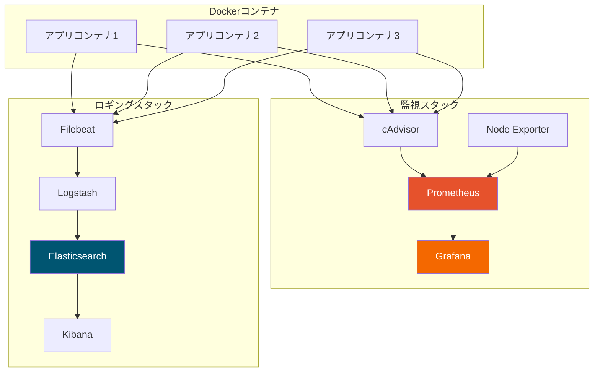

本番環境でコンテナを運用するには、パフォーマンス、リソース使用量、アプリケーションの動作を可視化する必要があります。この記事では、Docker環境の監視とロギングに必要なツールとテクニックを解説します。

## 監視アーキテクチャ

典型的なDockerの監視スタック：



## Dockerネイティブ監視

### docker stats

組み込みの監視コマンド：

```bash
# 全コンテナのリアルタイム統計
docker stats

# 特定のコンテナ
docker stats container1 container2

# カスタムフォーマット
docker stats --format "table {{.Name}}\t{{.CPUPerc}}\t{{.MemUsage}}\t{{.NetIO}}"

# 1回限りのスナップショット（ストリーミングなし）
docker stats --no-stream
```

### docker events

Dockerデーモンイベントを監視：

```bash
# すべてのイベントを監視
docker events

# イベントタイプでフィルタ
docker events --filter 'type=container'
docker events --filter 'event=start'
docker events --filter 'container=myapp'

# 時間ベースのフィルタ
docker events --since '2025-01-18T00:00:00' --until '2025-01-18T12:00:00'

# JSON出力
docker events --format '{{json .}}'
```

## cAdvisor

cAdvisor（Container Advisor）はコンテナのリソース使用量とパフォーマンスデータを提供します。

### cAdvisorの実行

```bash
docker run -d \
  --name cadvisor \
  --privileged \
  -p 8080:8080 \
  -v /:/rootfs:ro \
  -v /var/run:/var/run:ro \
  -v /sys:/sys:ro \
  -v /var/lib/docker/:/var/lib/docker:ro \
  -v /dev/disk/:/dev/disk:ro \
  gcr.io/cadvisor/cadvisor:latest
```

### cAdvisorメトリクス

Web UIは `http://localhost:8080`、メトリクスは `/metrics` でアクセス：

| メトリクス | 説明 |
|-----------|------|
| container_cpu_usage_seconds_total | 合計CPU使用量 |
| container_memory_usage_bytes | 現在のメモリ使用量 |
| container_network_receive_bytes_total | 受信ネットワークバイト |
| container_network_transmit_bytes_total | 送信ネットワークバイト |
| container_fs_usage_bytes | ファイルシステム使用量 |

## Prometheus

Prometheusはコンテナメトリクス収集の標準です。

### Prometheus設定

```yaml
# prometheus.yml
global:
  scrape_interval: 15s
  evaluation_interval: 15s

alerting:
  alertmanagers:
    - static_configs:
        - targets:
          - alertmanager:9093

rule_files:
  - "alerts/*.yml"

scrape_configs:
  - job_name: 'prometheus'
    static_configs:
      - targets: ['localhost:9090']

  - job_name: 'cadvisor'
    static_configs:
      - targets: ['cadvisor:8080']

  - job_name: 'node-exporter'
    static_configs:
      - targets: ['node-exporter:9100']

  - job_name: 'docker'
    static_configs:
      - targets: ['host.docker.internal:9323']
```

### PrometheusスタックのDocker Compose

```yaml
version: "3.8"

services:
  prometheus:
    image: prom/prometheus:latest
    ports:
      - "9090:9090"
    volumes:
      - ./prometheus.yml:/etc/prometheus/prometheus.yml
      - ./alerts:/etc/prometheus/alerts
      - prometheus_data:/prometheus
    command:
      - '--config.file=/etc/prometheus/prometheus.yml'
      - '--storage.tsdb.path=/prometheus'
      - '--storage.tsdb.retention.time=15d'
    networks:
      - monitoring

  cadvisor:
    image: gcr.io/cadvisor/cadvisor:latest
    privileged: true
    ports:
      - "8080:8080"
    volumes:
      - /:/rootfs:ro
      - /var/run:/var/run:ro
      - /sys:/sys:ro
      - /var/lib/docker/:/var/lib/docker:ro
      - /dev/disk/:/dev/disk:ro
    networks:
      - monitoring

  node-exporter:
    image: prom/node-exporter:latest
    ports:
      - "9100:9100"
    volumes:
      - /proc:/host/proc:ro
      - /sys:/host/sys:ro
      - /:/rootfs:ro
    command:
      - '--path.procfs=/host/proc'
      - '--path.sysfs=/host/sys'
      - '--path.rootfs=/rootfs'
    networks:
      - monitoring

volumes:
  prometheus_data:

networks:
  monitoring:
    driver: bridge
```

### アラートルール

```yaml
# alerts/container_alerts.yml
groups:
  - name: container_alerts
    rules:
      - alert: ContainerHighCPU
        expr: rate(container_cpu_usage_seconds_total[5m]) * 100 > 80
        for: 5m
        labels:
          severity: warning
        annotations:
          summary: "コンテナ {{ $labels.name }} のCPU使用率が高い"
          description: "CPU使用率が5分間80%を超えています"

      - alert: ContainerHighMemory
        expr: container_memory_usage_bytes / container_spec_memory_limit_bytes * 100 > 80
        for: 5m
        labels:
          severity: warning
        annotations:
          summary: "コンテナ {{ $labels.name }} のメモリ使用率が高い"

      - alert: ContainerDown
        expr: absent(container_last_seen{name=~".+"})
        for: 1m
        labels:
          severity: critical
        annotations:
          summary: "コンテナ {{ $labels.name }} がダウン"
```

## Grafana

GrafanaはPrometheusメトリクスの可視化を提供します。

### スタックにGrafanaを追加

```yaml
services:
  grafana:
    image: grafana/grafana:latest
    ports:
      - "3000:3000"
    environment:
      - GF_SECURITY_ADMIN_USER=admin
      - GF_SECURITY_ADMIN_PASSWORD=admin
      - GF_USERS_ALLOW_SIGN_UP=false
    volumes:
      - grafana_data:/var/lib/grafana
      - ./grafana/provisioning:/etc/grafana/provisioning
    networks:
      - monitoring
    depends_on:
      - prometheus

volumes:
  grafana_data:
```

### データソースのプロビジョニング

```yaml
# grafana/provisioning/datasources/prometheus.yml
apiVersion: 1

datasources:
  - name: Prometheus
    type: prometheus
    access: proxy
    url: http://prometheus:9090
    isDefault: true
    editable: false
```

### 便利なPromQLクエリ

| メトリクス | クエリ |
|-----------|--------|
| コンテナごとのCPU使用率 | `rate(container_cpu_usage_seconds_total{name!=""}[5m]) * 100` |
| メモリ使用量 | `container_memory_usage_bytes{name!=""}` |
| ネットワーク受信レート | `rate(container_network_receive_bytes_total[5m])` |
| ネットワーク送信レート | `rate(container_network_transmit_bytes_total[5m])` |
| コンテナ再起動 | `changes(container_start_time_seconds[1h])` |
| 実行中のコンテナ数 | `count(container_last_seen{name!=""})` |

## Dockerロギング

### ログドライバー

Dockerは複数のログドライバーをサポート：

```bash
# 現在のログドライバーを確認
docker info --format '{{.LoggingDriver}}'

# 特定のドライバーで実行
docker run -d \
  --log-driver json-file \
  --log-opt max-size=10m \
  --log-opt max-file=3 \
  nginx
```

| ドライバー | 説明 |
|------------|------|
| json-file | デフォルト、JSONファイルに記録 |
| syslog | syslogに送信 |
| journald | journaldに送信 |
| fluentd | Fluentdに送信 |
| gelf | Graylog拡張ログフォーマット |
| awslogs | Amazon CloudWatch |
| splunk | Splunk HTTPイベントコレクター |

### デフォルトログドライバーの設定

```json
// /etc/docker/daemon.json
{
  "log-driver": "json-file",
  "log-opts": {
    "max-size": "10m",
    "max-file": "3",
    "labels": "production_status",
    "env": "os,customer"
  }
}
```

## ELK Stackによるロギング

ELK Stack（Elasticsearch、Logstash、Kibana）は集中ログ管理を提供します。

### 完全なELK Docker Compose

```yaml
version: "3.8"

services:
  elasticsearch:
    image: docker.elastic.co/elasticsearch/elasticsearch:8.11.0
    environment:
      - discovery.type=single-node
      - xpack.security.enabled=false
      - "ES_JAVA_OPTS=-Xms512m -Xmx512m"
    volumes:
      - elasticsearch_data:/usr/share/elasticsearch/data
    ports:
      - "9200:9200"
    networks:
      - logging
    healthcheck:
      test: curl -s http://localhost:9200 >/dev/null || exit 1
      interval: 30s
      timeout: 10s
      retries: 5

  logstash:
    image: docker.elastic.co/logstash/logstash:8.11.0
    volumes:
      - ./logstash/pipeline:/usr/share/logstash/pipeline
    ports:
      - "5044:5044"
      - "9600:9600"
    environment:
      - "LS_JAVA_OPTS=-Xms256m -Xmx256m"
    networks:
      - logging
    depends_on:
      elasticsearch:
        condition: service_healthy

  kibana:
    image: docker.elastic.co/kibana/kibana:8.11.0
    ports:
      - "5601:5601"
    environment:
      - ELASTICSEARCH_HOSTS=http://elasticsearch:9200
    networks:
      - logging
    depends_on:
      elasticsearch:
        condition: service_healthy

  filebeat:
    image: docker.elastic.co/beats/filebeat:8.11.0
    user: root
    volumes:
      - ./filebeat/filebeat.yml:/usr/share/filebeat/filebeat.yml:ro
      - /var/lib/docker/containers:/var/lib/docker/containers:ro
      - /var/run/docker.sock:/var/run/docker.sock:ro
    networks:
      - logging
    depends_on:
      - logstash

volumes:
  elasticsearch_data:

networks:
  logging:
    driver: bridge
```

### Filebeat設定

```yaml
# filebeat/filebeat.yml
filebeat.inputs:
  - type: container
    paths:
      - '/var/lib/docker/containers/*/*.log'
    processors:
      - add_docker_metadata:
          host: "unix:///var/run/docker.sock"

filebeat.autodiscover:
  providers:
    - type: docker
      hints.enabled: true

processors:
  - add_host_metadata: ~
  - add_cloud_metadata: ~

output.logstash:
  hosts: ["logstash:5044"]
```

### Logstashパイプライン

```ruby
# logstash/pipeline/docker.conf
input {
  beats {
    port => 5044
  }
}

filter {
  if [container][name] {
    mutate {
      add_field => { "container_name" => "%{[container][name]}" }
    }
  }

  # JSONログをパース
  if [message] =~ /^\{/ {
    json {
      source => "message"
      target => "parsed"
      skip_on_invalid_json => true
    }
  }

  # 一般的なログフォーマットをパース
  grok {
    match => { "message" => "%{COMBINEDAPACHELOG}" }
    overwrite => [ "message" ]
    tag_on_failure => ["_grokparsefailure"]
  }

  # タイムスタンプを追加
  date {
    match => [ "timestamp", "ISO8601", "dd/MMM/yyyy:HH:mm:ss Z" ]
    target => "@timestamp"
  }
}

output {
  elasticsearch {
    hosts => ["elasticsearch:9200"]
    index => "docker-logs-%{+YYYY.MM.dd}"
  }
}
```

## Lokiによる軽量ロギング

LokiはELKの軽量な代替として、Grafana向けに設計されています。

### Lokiスタック

```yaml
version: "3.8"

services:
  loki:
    image: grafana/loki:latest
    ports:
      - "3100:3100"
    volumes:
      - ./loki/config.yml:/etc/loki/config.yml
      - loki_data:/loki
    command: -config.file=/etc/loki/config.yml
    networks:
      - logging

  promtail:
    image: grafana/promtail:latest
    volumes:
      - ./promtail/config.yml:/etc/promtail/config.yml
      - /var/lib/docker/containers:/var/lib/docker/containers:ro
      - /var/run/docker.sock:/var/run/docker.sock
    command: -config.file=/etc/promtail/config.yml
    networks:
      - logging

  grafana:
    image: grafana/grafana:latest
    ports:
      - "3000:3000"
    environment:
      - GF_AUTH_ANONYMOUS_ENABLED=true
      - GF_AUTH_ANONYMOUS_ORG_ROLE=Admin
    volumes:
      - ./grafana/provisioning:/etc/grafana/provisioning
    networks:
      - logging

volumes:
  loki_data:

networks:
  logging:
```

### Promtail設定

```yaml
# promtail/config.yml
server:
  http_listen_port: 9080
  grpc_listen_port: 0

positions:
  filename: /tmp/positions.yaml

clients:
  - url: http://loki:3100/loki/api/v1/push

scrape_configs:
  - job_name: docker
    docker_sd_configs:
      - host: unix:///var/run/docker.sock
        refresh_interval: 5s
    relabel_configs:
      - source_labels: ['__meta_docker_container_name']
        regex: '/(.*)'
        target_label: 'container'
      - source_labels: ['__meta_docker_container_log_stream']
        target_label: 'logstream'
      - source_labels: ['__meta_docker_container_label_com_docker_compose_service']
        target_label: 'service'
```

## アプリケーションメトリクス

### アプリケーションメトリクスの公開

カスタムアプリケーションメトリクスは `/metrics` エンドポイントで公開：

```javascript
// Node.js + prom-client
const express = require('express');
const client = require('prom-client');

const app = express();
const collectDefaultMetrics = client.collectDefaultMetrics;
collectDefaultMetrics();

// カスタムメトリクス
const httpRequestDuration = new client.Histogram({
  name: 'http_request_duration_seconds',
  help: 'HTTPリクエストの所要時間（秒）',
  labelNames: ['method', 'route', 'status_code'],
  buckets: [0.1, 0.5, 1, 2, 5]
});

app.use((req, res, next) => {
  const end = httpRequestDuration.startTimer();
  res.on('finish', () => {
    end({ method: req.method, route: req.path, status_code: res.statusCode });
  });
  next();
});

app.get('/metrics', async (req, res) => {
  res.set('Content-Type', client.register.contentType);
  res.end(await client.register.metrics());
});

app.listen(3000);
```

### アプリ用Prometheusスクレイプ設定

```yaml
scrape_configs:
  - job_name: 'myapp'
    docker_sd_configs:
      - host: unix:///var/run/docker.sock
    relabel_configs:
      - source_labels: [__meta_docker_container_label_prometheus_job]
        regex: (.+)
        target_label: job
      - source_labels: [__meta_docker_container_label_prometheus_port]
        regex: (.+)
        target_label: __address__
        replacement: '${1}'
```

## 完全な監視スタック

本番環境向けの監視・ロギングスタック：

```yaml
version: "3.8"

services:
  # メトリクス収集
  prometheus:
    image: prom/prometheus:latest
    ports:
      - "9090:9090"
    volumes:
      - ./prometheus:/etc/prometheus
      - prometheus_data:/prometheus
    command:
      - '--config.file=/etc/prometheus/prometheus.yml'
      - '--storage.tsdb.retention.time=15d'
    networks:
      - monitoring

  cadvisor:
    image: gcr.io/cadvisor/cadvisor:latest
    privileged: true
    volumes:
      - /:/rootfs:ro
      - /var/run:/var/run:ro
      - /sys:/sys:ro
      - /var/lib/docker/:/var/lib/docker:ro
    networks:
      - monitoring

  node-exporter:
    image: prom/node-exporter:latest
    volumes:
      - /proc:/host/proc:ro
      - /sys:/host/sys:ro
      - /:/rootfs:ro
    command:
      - '--path.procfs=/host/proc'
      - '--path.sysfs=/host/sys'
    networks:
      - monitoring

  # 可視化
  grafana:
    image: grafana/grafana:latest
    ports:
      - "3000:3000"
    environment:
      - GF_SECURITY_ADMIN_PASSWORD=admin
    volumes:
      - grafana_data:/var/lib/grafana
      - ./grafana/provisioning:/etc/grafana/provisioning
    networks:
      - monitoring

  # アラート
  alertmanager:
    image: prom/alertmanager:latest
    ports:
      - "9093:9093"
    volumes:
      - ./alertmanager:/etc/alertmanager
    command:
      - '--config.file=/etc/alertmanager/alertmanager.yml'
    networks:
      - monitoring

  # ロギング
  loki:
    image: grafana/loki:latest
    ports:
      - "3100:3100"
    volumes:
      - ./loki:/etc/loki
      - loki_data:/loki
    command: -config.file=/etc/loki/config.yml
    networks:
      - monitoring

  promtail:
    image: grafana/promtail:latest
    volumes:
      - ./promtail:/etc/promtail
      - /var/lib/docker/containers:/var/lib/docker/containers:ro
      - /var/run/docker.sock:/var/run/docker.sock
    command: -config.file=/etc/promtail/config.yml
    networks:
      - monitoring

volumes:
  prometheus_data:
  grafana_data:
  loki_data:

networks:
  monitoring:
    driver: bridge
```

## 重要なポイント

| ツール | 用途 |
|--------|------|
| docker stats | 簡易コンテナメトリクス |
| cAdvisor | コンテナリソースメトリクス |
| Prometheus | メトリクス収集とアラート |
| Grafana | 可視化ダッシュボード |
| ELK Stack | フル機能のログ集約 |
| Loki | 軽量ログ集約 |

## ベストプラクティス

1. **リソース制限を設定** - 監視ツールがリソースを消費しすぎないように
2. **保持期間を設定** - ストレージコストとデータニーズのバランス
3. **ラベルを使用** - サービス、環境などでメトリクスとログを整理
4. **アラートを設定** - データを収集するだけでなく、対応する
5. **スタックを保護** - 認証とネットワーク分離を使用
6. **監視システムを監視** - 監視スタック自体が健全か確認

## 次のステップ

次の記事では、GitHub ActionsによるDocker CI/CDパイプラインを解説します。

## 参考文献

- Docker Deep Dive, 5th Edition - Nigel Poulton
- [Prometheusドキュメント](https://prometheus.io/docs/)
- [Grafanaドキュメント](https://grafana.com/docs/)
- [Elastic Stackドキュメント](https://www.elastic.co/guide/)
