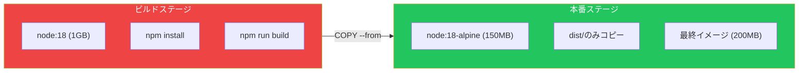

マルチステージビルドは、ビルド時の依存関係とランタイム要件を分離することで、軽量な本番イメージを作成できる強力なDockerfile機能です。この記事では、クリーンで保守しやすいDockerfileを維持しながら、イメージサイズを大幅に削減する方法を解説します。

## シングルステージビルドの問題

従来のシングルステージビルドは、すべてを最終イメージに含めます：

```dockerfile
# シングルステージビルド - 悪い例
FROM node:18

WORKDIR /app
COPY package*.json ./
RUN npm install
COPY . .
RUN npm run build

# 最終イメージに含まれるもの:
# - Node.jsランタイム（〜1GB）
# - すべての開発依存関係
# - ソースコード
# - ビルドツール
# 結果: 1.5GB以上のイメージ
```

このアプローチの結果：
- 大きなイメージサイズ（MBではなくGB）
- 不要なツールによるセキュリティリスク
- デプロイの遅延
- ストレージと帯域幅の浪費

## マルチステージビルドの基本

マルチステージビルドは複数の`FROM`文を使用し、各ステートメントが新しいビルドステージを開始します：

```dockerfile
# ステージ1: ビルド
FROM node:18 AS builder
WORKDIR /app
COPY package*.json ./
RUN npm install
COPY . .
RUN npm run build

# ステージ2: 本番
FROM node:18-alpine
WORKDIR /app
COPY --from=builder /app/dist ./dist
COPY --from=builder /app/node_modules ./node_modules
CMD ["node", "dist/server.js"]
```



## 主要な概念

### 名前付きステージ

```dockerfile
# 明確さのためにステージに名前を付ける
FROM node:18 AS builder
# ...

FROM nginx:alpine AS production
COPY --from=builder /app/dist /usr/share/nginx/html
```

### ステージからのコピー

```dockerfile
# 名前付きステージからコピー
COPY --from=builder /app/dist ./dist

# インデックス（0始まり）でステージからコピー
COPY --from=0 /app/dist ./dist

# 外部イメージからコピー
COPY --from=nginx:alpine /etc/nginx/nginx.conf /etc/nginx/
```

### 特定のステージをビルド

```bash
# 特定のステージまでのみビルド
docker build --target builder -t myapp:builder .

# 用途:
# - ビルドステージのテスト
# - 開発イメージの作成
# - CI/CDパイプライン
```

## 実践的な例

### Node.jsアプリケーション

```dockerfile
# ステージ1: 依存関係
FROM node:18-alpine AS deps
WORKDIR /app
COPY package*.json ./
RUN npm ci --only=production

# ステージ2: ビルド
FROM node:18-alpine AS builder
WORKDIR /app
COPY package*.json ./
RUN npm ci
COPY . .
RUN npm run build

# ステージ3: 本番
FROM node:18-alpine AS production
WORKDIR /app

# 非rootユーザーを作成
RUN addgroup -S nodejs && adduser -S nodejs -G nodejs

# 必要なものだけをコピー
COPY --from=deps /app/node_modules ./node_modules
COPY --from=builder /app/dist ./dist
COPY --from=builder /app/package.json ./

USER nodejs
EXPOSE 3000
CMD ["node", "dist/server.js"]
```

### Goアプリケーション

Goはマルチステージビルドに最適です。静的バイナリにコンパイル：

```dockerfile
# ステージ1: ビルド
FROM golang:1.21-alpine AS builder
WORKDIR /app

# 依存関係をダウンロード
COPY go.mod go.sum ./
RUN go mod download

# 静的バイナリをビルド
COPY . .
RUN CGO_ENABLED=0 GOOS=linux go build -a -installsuffix cgo -o main .

# ステージ2: 本番（scratch = 空のイメージ）
FROM scratch
COPY --from=builder /app/main /main
COPY --from=builder /etc/ssl/certs/ca-certificates.crt /etc/ssl/certs/
ENTRYPOINT ["/main"]
```

結果: 〜1GBではなく〜10MBのイメージ！

### Pythonアプリケーション

```dockerfile
# ステージ1: wheelをビルド
FROM python:3.11-slim AS builder
WORKDIR /app

RUN apt-get update && apt-get install -y --no-install-recommends \
    gcc \
    libpq-dev \
    && rm -rf /var/lib/apt/lists/*

COPY requirements.txt .
RUN pip wheel --no-cache-dir --wheel-dir /wheels -r requirements.txt

# ステージ2: 本番
FROM python:3.11-slim AS production
WORKDIR /app

# ランタイム依存関係のみインストール
RUN apt-get update && apt-get install -y --no-install-recommends \
    libpq5 \
    && rm -rf /var/lib/apt/lists/*

# ビルド済みwheelをコピー
COPY --from=builder /wheels /wheels
RUN pip install --no-cache-dir /wheels/*

# アプリケーションをコピー
COPY . .

RUN useradd --create-home appuser
USER appuser

EXPOSE 8000
CMD ["gunicorn", "--bind", "0.0.0.0:8000", "app:app"]
```

### React/フロントエンドアプリケーション

```dockerfile
# ステージ1: ビルド
FROM node:18-alpine AS builder
WORKDIR /app

COPY package*.json ./
RUN npm ci

COPY . .
RUN npm run build

# ステージ2: nginxで配信
FROM nginx:alpine AS production

# ビルドしたアセットをコピー
COPY --from=builder /app/build /usr/share/nginx/html

# nginx設定をコピー
COPY nginx.conf /etc/nginx/conf.d/default.conf

EXPOSE 80
CMD ["nginx", "-g", "daemon off;"]
```

結果: 〜1GB（node + node_modules）ではなく〜25MB（nginx + 静的ファイル）のイメージ！

### Java/Spring Bootアプリケーション

```dockerfile
# ステージ1: Mavenでビルド
FROM maven:3.9-eclipse-temurin-17 AS builder
WORKDIR /app

# 依存関係をキャッシュ
COPY pom.xml .
RUN mvn dependency:go-offline

# アプリケーションをビルド
COPY src ./src
RUN mvn package -DskipTests

# ステージ2: 本番
FROM eclipse-temurin:17-jre-alpine AS production
WORKDIR /app

# JARのみをコピー
COPY --from=builder /app/target/*.jar app.jar

RUN addgroup -S spring && adduser -S spring -G spring
USER spring

EXPOSE 8080
ENTRYPOINT ["java", "-jar", "app.jar"]
```

## 高度なパターン

### 開発 vs 本番

```dockerfile
# ベースステージ
FROM node:18-alpine AS base
WORKDIR /app
COPY package*.json ./

# 開発ステージ
FROM base AS development
RUN npm install
COPY . .
CMD ["npm", "run", "dev"]

# ビルドステージ
FROM base AS builder
RUN npm ci
COPY . .
RUN npm run build

# 本番ステージ
FROM node:18-alpine AS production
WORKDIR /app
COPY --from=builder /app/dist ./dist
COPY --from=builder /app/node_modules ./node_modules
CMD ["node", "dist/server.js"]
```

```bash
# 開発イメージをビルド
docker build --target development -t myapp:dev .

# 本番イメージをビルド
docker build --target production -t myapp:prod .
```

### テストステージ

```dockerfile
FROM node:18-alpine AS base
WORKDIR /app
COPY package*.json ./
RUN npm ci
COPY . .

FROM base AS test
RUN npm run test

FROM base AS builder
RUN npm run build

FROM node:18-alpine AS production
COPY --from=builder /app/dist ./dist
CMD ["node", "dist/server.js"]
```

```bash
# CIでテストを実行
docker build --target test -t myapp:test .
docker run --rm myapp:test
```

### 並列ビルド

```dockerfile
# これらのステージは並列でビルド可能
FROM node:18-alpine AS frontend-builder
WORKDIR /frontend
COPY frontend/package*.json ./
RUN npm ci
COPY frontend/ .
RUN npm run build

FROM golang:1.21-alpine AS backend-builder
WORKDIR /backend
COPY backend/go.* ./
RUN go mod download
COPY backend/ .
RUN go build -o server .

# 最終ステージで両方を結合
FROM alpine:3.19 AS production
COPY --from=frontend-builder /frontend/dist /app/public
COPY --from=backend-builder /backend/server /app/server
CMD ["/app/server"]
```

## サイズ比較

| アプリケーション | シングルステージ | マルチステージ | 削減率 |
|----------------|-----------------|---------------|--------|
| Node.js API | 1.2 GB | 150 MB | 87% |
| Go API | 800 MB | 10 MB | 99% |
| Reactアプリ | 1.1 GB | 25 MB | 98% |
| Python API | 900 MB | 200 MB | 78% |
| Java/Spring | 700 MB | 250 MB | 64% |

## ベストプラクティス

### 1. 変更頻度でステージを順序付け

```dockerfile
# 依存関係は変更頻度が低い - キャッシュされる
FROM node:18-alpine AS deps
COPY package*.json ./
RUN npm ci

# ソースコードは変更頻度が高い
FROM deps AS builder
COPY . .
RUN npm run build
```

### 2. AlpineまたはDistrolessベースイメージを使用

```dockerfile
# これの代わりに
FROM node:18  # 1GB

# これを使用
FROM node:18-alpine  # 150MB

# またはGoの場合
FROM gcr.io/distroless/static  # 2MB
```

### 3. 不要なファイルをコピーしない

```dockerfile
# 必要なものだけをコピー
COPY --from=builder /app/dist ./dist
COPY --from=builder /app/package.json ./

# すべてではなく
# COPY --from=builder /app .
```

### 4. .dockerignoreを使用

```
# .dockerignore
node_modules
npm-debug.log
.git
.gitignore
README.md
.env
coverage/
.nyc_output/
```

### 5. ビルドキャッシュを活用

```dockerfile
# 依存関係ファイルを先にコピー
COPY package*.json ./
RUN npm ci

# 次にソースをコピー（依存関係が変わらなければここでキャッシュが破棄）
COPY . .
RUN npm run build
```

## Docker Composeとの統合

```yaml
services:
  app:
    build:
      context: .
      target: production  # ターゲットステージを指定

  app-dev:
    build:
      context: .
      target: development
    volumes:
      - .:/app
    command: npm run dev
```

## まとめ

| 概念 | 説明 |
|------|------|
| マルチステージ | 1つのDockerfileに複数のFROM文 |
| 名前付きステージ | 明確さのための`AS stagename` |
| COPY --from | 前のステージからファイルをコピー |
| --target | 特定のステージのみをビルド |
| ビルドキャッシュ | 変更頻度でステージを順序付け |

## 重要なポイント

1. **ビルドとランタイムを分離** - ビルドツールを配布しない
2. **最小限のベースイメージを使用** - Alpine、distroless、またはscratch
3. **成果物のみをコピー** - ソースコードや開発依存関係は除外
4. **ステージに名前を付ける** - Dockerfileを読みやすく
5. **キャッシュを活用** - 変更頻度で順序付け
6. **CIでテスト** - `--target test`ステージを使用

## 次のステップ

次の記事では、マルチステージビルド以外のDockerイメージ最適化テクニックを学びます。

## 参考文献

- Docker Deep Dive, 5th Edition - Nigel Poulton
- Docker in Action, 2nd Edition - Jeffrey Nickoloff
- [Docker Multi-stage Builds](https://docs.docker.com/build/building/multi-stage/)
