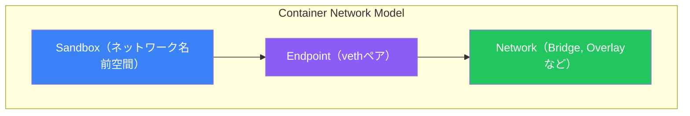
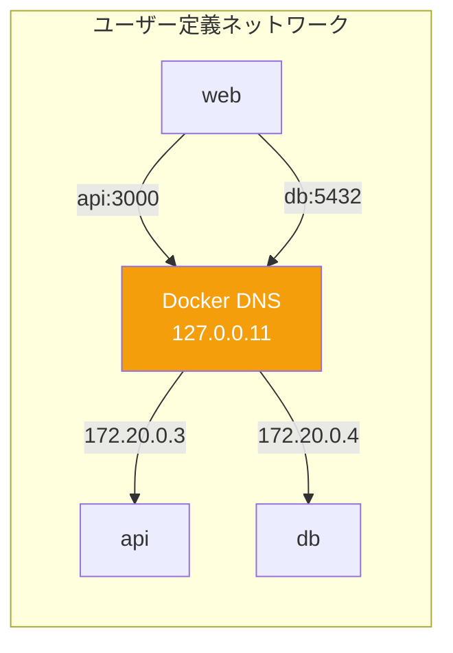
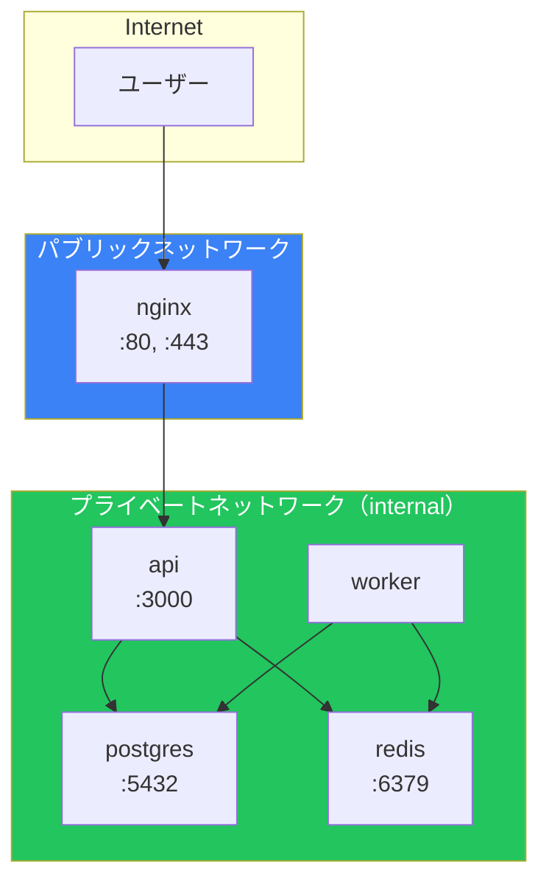

Dockerネットワーキングにより、コンテナは互いに、そして外部と通信できるようになります。この記事では、ネットワークタイプ、ポートマッピング、DNS、セキュアなコンテナ化アプリケーション構築のベストプラクティスを解説します。

## Container Network Model (CNM)

Dockerのネットワーキングは、3つの主要コンポーネントを持つContainer Network Modelに基づいています：



| コンポーネント | 説明 |
|--------------|------|
| **Sandbox** | 分離されたネットワークスタック（インターフェース、ルーティング、DNS） |
| **Endpoint** | SandboxをNetworkに接続する仮想ネットワークインターフェース |
| **Network** | 複数のEndpointを接続するソフトウェア定義ネットワーク |

## ネットワークドライバー

Dockerはいくつかの組み込みネットワークドライバーを提供しています：

```bash
# 利用可能なネットワークを一覧
docker network ls

# 出力:
NETWORK ID     NAME      DRIVER    SCOPE
abc123         bridge    bridge    local
def456         host      host      local
ghi789         none      null      local
```

| ドライバー | 説明 | ユースケース |
|----------|------|-------------|
| `bridge` | デフォルト、分離されたネットワーク | ほとんどのアプリケーション |
| `host` | ホストのネットワークスタックを共有 | パフォーマンス重視のアプリ |
| `none` | ネットワークなし | セキュリティ、分離された処理 |
| `overlay` | マルチホストネットワーキング | Docker Swarm、Kubernetes |
| `macvlan` | MACアドレスを割り当て | 直接LAN接続が必要なレガシーアプリ |

## Bridgeネットワーク

Bridgeネットワークは、Dockerのデフォルトで最も一般的に使用されるネットワークタイプです。

### デフォルトBridgeネットワーク

```bash
# デフォルトbridgeでコンテナを実行
docker run -d --name web nginx

# デフォルトbridgeを検査
docker network inspect bridge
```

デフォルトbridgeには制限があります：
- コンテナはIPアドレスでのみ通信可能（名前では不可）
- すべてのコンテナが同じbridgeを共有

### ユーザー定義Bridgeネットワーク

ユーザー定義bridgeは優れています：

```bash
# カスタムbridgeを作成
docker network create mynetwork

# カスタムネットワークでコンテナを実行
docker run -d --name web --network mynetwork nginx
docker run -d --name api --network mynetwork myapi

# コンテナは名前で互いにアクセス可能
docker exec web curl http://api:3000
```

**ユーザー定義bridgeの利点：**

| 機能 | デフォルトBridge | ユーザー定義Bridge |
|------|----------------|-------------------|
| DNS解決 | ❌（IPのみ） | ✅（名前で可能） |
| 分離 | 共有 | ネットワークごと |
| 接続/切断 | 再起動が必要 | ライブ接続 |
| コンテナリンク | 手動`--link` | 自動 |

### ネットワークの作成と管理

```bash
# オプション付きでネットワークを作成
docker network create \
  --driver bridge \
  --subnet 172.20.0.0/16 \
  --gateway 172.20.0.1 \
  --ip-range 172.20.240.0/20 \
  mynetwork

# 実行中のコンテナをネットワークに接続
docker network connect mynetwork existing-container

# ネットワークから切断
docker network disconnect mynetwork container-name

# ネットワークを削除
docker network rm mynetwork

# 未使用のすべてのネットワークを削除
docker network prune
```

## Hostネットワーク

Hostネットワークはネットワーク分離を解除します。コンテナはホストのネットワークスタックを共有します：

```bash
# hostネットワークを使用
docker run -d --network host nginx

# コンテナはホストポートに直接バインド
# ポートマッピング不要 - nginxはhost:80で利用可能
```

**hostネットワーキングを使うタイミング：**

| ユースケース | 理由 |
|------------|------|
| パフォーマンス重視のアプリ | NATオーバーヘッドなし |
| ホストネットワークアクセスが必要なアプリ | ポートスキャン、ネットワークツール |
| ポートマッピングが問題になる場合 | 多数の動的ポート |

**注意:** Hostネットワーキングは分離を減らし、Linuxでのみ動作します。

## Noneネットワーク

Noneネットワークは完全なネットワーク分離を提供します：

```bash
docker run -d --network none --name isolated alpine sleep infinity

# コンテナにはネットワークインターフェースがない（ループバック以外）
docker exec isolated ip addr
# loインターフェースのみ表示
```

ユースケース：
- 機密データの処理
- ネットワーキングが不要なバッチジョブ
- 最大限のセキュリティ分離

## ポートマッピング

ポートマッピングはコンテナポートをホストに公開します：

```bash
# ホストポート8080をコンテナポート80にマッピング
docker run -d -p 8080:80 nginx

# 特定のインターフェースにマッピング
docker run -d -p 127.0.0.1:8080:80 nginx

# ランダムなホストポートにマッピング
docker run -d -p 80 nginx

# 複数ポートをマッピング
docker run -d -p 80:80 -p 443:443 nginx

# UDPポートをマッピング
docker run -d -p 53:53/udp dns-server

# ポート範囲をマッピング
docker run -d -p 8000-8010:8000-8010 myapp
```

### ポートマッピングの確認

```bash
# ポートマッピングを一覧
docker port container-name

# 出力:
80/tcp -> 0.0.0.0:8080

# またはdocker psを使用
docker ps --format "table {{.Names}}\t{{.Ports}}"
```

## コンテナDNS

Dockerはユーザー定義ネットワーク内で自動DNS解決を提供します：



### DNS機能

```bash
# ネットワークとコンテナを作成
docker network create mynet
docker run -d --name db --network mynet postgres
docker run -d --name api --network mynet myapi

# apiコンテナは名前でdbにアクセス可能
docker exec api ping db
```

### カスタムDNS設定

```bash
# カスタムDNSサーバーを使用
docker run -d \
  --dns 8.8.8.8 \
  --dns 8.8.4.4 \
  --dns-search example.com \
  myapp

# ホストエントリを追加
docker run -d \
  --add-host myhost:192.168.1.100 \
  --add-host db:192.168.1.50 \
  myapp
```

## Docker Composeでのネットワーク設定

```yaml
services:
  frontend:
    build: ./frontend
    networks:
      - frontend-net
    ports:
      - "80:80"

  api:
    build: ./api
    networks:
      - frontend-net
      - backend-net
    expose:
      - "3000"  # 内部のみ、ホストにマッピングしない

  db:
    image: postgres:15
    networks:
      - backend-net
    # ポートを公開しない - backend-netからのみアクセス可能

networks:
  frontend-net:
    driver: bridge
  backend-net:
    driver: bridge
    internal: true  # 外部アクセスなし
```

### ネットワークエイリアス

```yaml
services:
  api:
    networks:
      frontend:
        aliases:
          - backend
          - api-service

networks:
  frontend:
```

コンテナはこれらの名前のいずれかで`api`にアクセスできます：`api`、`backend`、`api-service`。

## マルチティアアーキテクチャの例

```yaml
# docker-compose.yml
services:
  # パブリック層 - 外部からアクセス可能
  nginx:
    image: nginx:alpine
    ports:
      - "80:80"
      - "443:443"
    networks:
      - public
    volumes:
      - ./nginx.conf:/etc/nginx/nginx.conf:ro

  # アプリケーション層 - 内部のみ
  api:
    build: ./api
    networks:
      - public    # nginxからトラフィックを受信
      - private   # データベースに接続
    environment:
      DATABASE_URL: postgres://db:5432/mydb
    expose:
      - "3000"

  worker:
    build: ./worker
    networks:
      - private   # データベースアクセスのみ
    environment:
      DATABASE_URL: postgres://db:5432/mydb

  # データ層 - 最も制限
  db:
    image: postgres:15
    networks:
      - private
    volumes:
      - postgres_data:/var/lib/postgresql/data
    # ホストにポートを公開しない

  redis:
    image: redis:7-alpine
    networks:
      - private

networks:
  public:
    driver: bridge
  private:
    driver: bridge
    internal: true  # インターネットに到達不可

volumes:
  postgres_data:
```



## ネットワークの検査

```bash
# 詳細なネットワーク情報
docker network inspect mynetwork

# コンテナのIPアドレスを取得
docker inspect -f '{{range.NetworkSettings.Networks}}{{.IPAddress}}{{end}}' container-name

# ネットワーク上のコンテナを一覧
docker network inspect mynetwork -f '{{range .Containers}}{{.Name}} {{end}}'
```

## ネットワーキングのトラブルシューティング

### ネットワークツールコンテナでデバッグ

```bash
# デバッグにnicolaka/netshootを使用
docker run -it --rm --network container:myapp nicolaka/netshoot

# デバッグコンテナ内で:
curl localhost:3000
ping db
nslookup api
tcpdump -i eth0
```

### よくある問題と解決策

| 問題 | 考えられる原因 | 解決策 |
|------|--------------|--------|
| 名前でコンテナに到達できない | デフォルトbridge使用 | ユーザー定義ネットワークを使用 |
| 接続拒否 | 間違ったポートまたはサービス未起動 | ログを確認、ポートを検証 |
| 外部インターネットに到達できない | internalネットワーク | `internal: true`を削除 |
| ポートが既に使用中 | ホストポートの競合 | 別のホストポートを使用 |

### コンテナの接続性を確認

```bash
# コンテナのネットワーク設定を表示
docker exec myapp ip addr
docker exec myapp ip route
docker exec myapp cat /etc/resolv.conf

# 接続性をテスト
docker exec myapp ping other-container
docker exec myapp curl http://api:3000/health
```

## ベストプラクティス

### 1. ユーザー定義ネットワークを使用

```bash
# 常にカスタムネットワークを作成
docker network create app-network
docker run -d --network app-network myapp
```

### 2. 機能で分離

```yaml
networks:
  frontend:   # Webサーバー
  backend:    # アプリサーバー
  data:       # データベース
    internal: true
```

### 3. 機密サービスにはInternalネットワークを使用

```yaml
networks:
  database:
    internal: true  # インターネットアクセスなし
```

### 4. 必要なものだけを公開

```yaml
services:
  api:
    expose:
      - "3000"  # 内部のみ
    # 外部アクセスが必要でなければ'ports'は使わない
```

### 5. 開発時はLocalhostにバインド

```bash
# ホストマシンからのみアクセス可能
docker run -d -p 127.0.0.1:5432:5432 postgres
```

## まとめ表

| ネットワークタイプ | 分離 | DNS | 外部アクセス | ユースケース |
|-----------------|------|-----|------------|-------------|
| Bridge（デフォルト） | 中 | IPのみ | ポートマッピング経由 | 基本 |
| Bridge（カスタム） | 中 | 名前で可能 | ポートマッピング経由 | ほとんどのアプリ |
| Host | なし | ホストの | 直接 | パフォーマンス |
| None | 完全 | なし | なし | セキュリティ |
| Internal | 高 | 名前で可能 | なし | データ層 |

## 重要なポイント

1. **常にユーザー定義ネットワークを使用** - より良いDNSと分離
2. **セキュリティを考慮した設計** - 機密サービスにはinternalネットワークを使用
3. **ポート公開を制限** - 内部には`expose`、外部には`ports`
4. **Docker DNSを活用** - IPではなく名前でコンテナを参照
5. **機能で分離** - フロントエンド、バックエンド、データ層を分離
6. **デバッグコンテナを使用** - `nicolaka/netshoot`はトラブルシューティングに不可欠

## 次のステップ

次の記事では、最適化された本番イメージを作成するためのマルチステージビルドを学びます。

## 参考文献

- Docker Deep Dive, 5th Edition - Nigel Poulton
- The Ultimate Docker Container Book, 3rd Edition - Dr. Gabriel N. Schenker
- [Dockerネットワーキングドキュメント](https://docs.docker.com/network/)
