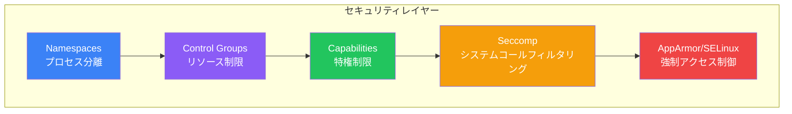

コンテナ化環境においてセキュリティは極めて重要です。この記事では、カーネルレベルからアプリケーションプラクティスまで、Dockerセキュリティを網羅し、安全なコンテナの構築と実行を支援します。

## Dockerセキュリティアーキテクチャ

Dockerセキュリティは、複数のLinuxカーネル機能のレイヤーに依存しています：



## 非rootユーザーとして実行

rootとしてコンテナを実行することは、最も一般的なセキュリティの間違いです。

### なぜ非rootが重要か

| リスク | rootとして実行 | 非rootとして実行 |
|--------|---------------|-----------------|
| コンテナエスケープ | ホストへの完全アクセス | 限定的なアクセス |
| ファイルシステムの損傷 | 何でも変更可能 | 制限付き |
| 特権昇格 | 容易 | はるかに困難 |

### Dockerfileで非rootユーザーを作成

```dockerfile
FROM node:18-alpine

# 非rootユーザーとグループを作成
RUN addgroup -S appgroup && adduser -S appuser -G appgroup

WORKDIR /app
COPY --chown=appuser:appgroup . .

# 非rootユーザーに切り替え
USER appuser

CMD ["node", "server.js"]
```

### 数値UIDを使用

```dockerfile
# システム間でより移植性が高い
USER 1000:1000

# または既存ユーザーを参照
FROM node:18-alpine
USER node  # nodeイメージに組み込みの非rootユーザー
```

### コンテナユーザーを確認

```bash
# どのユーザーが実行しているか確認
docker exec mycontainer whoami
docker exec mycontainer id
```

## Linux Capabilities

Capabilitiesはroot権限をより小さな単位に分割します。Dockerはデフォルトで多くを削除します。

### デフォルトのCapabilities

```bash
# デフォルトのcapabilitiesを表示
docker run --rm alpine sh -c 'apk add -q libcap && capsh --print'
```

Dockerが削除する危険なcapabilities：
- `CAP_SYS_ADMIN` - ファイルシステムのマウント、namespaceの設定
- `CAP_NET_ADMIN` - ネットワーク設定
- `CAP_SYS_PTRACE` - プロセストレース

### すべてのCapabilitiesを削除

```dockerfile
# docker-compose.ymlで
services:
  app:
    cap_drop:
      - ALL
    cap_add:
      - NET_BIND_SERVICE  # 必要なものだけ追加
```

```bash
# コマンドライン
docker run --cap-drop=ALL --cap-add=NET_BIND_SERVICE nginx
```

### 一般的なCapabilities

| Capability | 目的 | 不要なら削除 |
|------------|------|------------|
| `CHOWN` | ファイル所有権の変更 | はい |
| `SETUID` | ユーザーIDの変更 | はい |
| `NET_RAW` | RAWソケットの使用 | はい |
| `SYS_CHROOT` | chrootの使用 | はい |
| `MKNOD` | 特殊ファイルの作成 | はい |

## 読み取り専用ファイルシステム

セキュリティ向上のためにコンテナを不変に：

```bash
# 読み取り専用ルートファイルシステム
docker run --read-only nginx

# 特定のパスへの書き込みを許可
docker run --read-only \
  --tmpfs /tmp \
  --tmpfs /var/run \
  -v logs:/var/log \
  nginx
```

```yaml
# docker-compose.yml
services:
  app:
    read_only: true
    tmpfs:
      - /tmp
      - /var/run
    volumes:
      - logs:/var/log
```

## Seccompプロファイル

Seccompはコンテナが実行できるシステムコールをフィルタリングします。

### デフォルトSeccompプロファイル

Dockerのデフォルトプロファイルは約44の危険なsyscallをブロック：
- `reboot`
- `mount`
- `ptrace`
- `settimeofday`

### カスタムSeccompプロファイル

```json
{
  "defaultAction": "SCMP_ACT_ERRNO",
  "architectures": ["SCMP_ARCH_X86_64"],
  "syscalls": [
    {
      "names": ["read", "write", "open", "close", "stat"],
      "action": "SCMP_ACT_ALLOW"
    }
  ]
}
```

```bash
docker run --security-opt seccomp=custom-profile.json nginx
```

## AppArmorとSELinux

### AppArmor（Ubuntu/Debian）

```bash
# AppArmorがアクティブか確認
docker info | grep -i apparmor

# カスタムプロファイルを使用
docker run --security-opt apparmor=docker-nginx nginx
```

### SELinux（RHEL/CentOS）

```bash
# SELinuxラベル付きで実行
docker run --security-opt label=type:container_t nginx
```

## イメージセキュリティ

### 脆弱性スキャン

```bash
# Docker Scout
docker scout cves myimage:latest
docker scout quickview myimage:latest

# Trivy
trivy image myimage:latest
trivy image --severity HIGH,CRITICAL myimage:latest

# Grype
grype myimage:latest
```

### 信頼できるベースイメージ

```dockerfile
# 公式イメージを使用
FROM node:18-alpine

# 検証済みパブリッシャーを使用
FROM bitnami/nginx:latest

# 不変性のために特定のダイジェストに固定
FROM node@sha256:abc123...
```

### Docker Content Trustでイメージ署名

```bash
# コンテンツトラストを有効化
export DOCKER_CONTENT_TRUST=1

# 署名してプッシュ
docker push myregistry.com/myimage:v1.0

# 署名されたイメージのみプル
docker pull myregistry.com/myimage:v1.0
```

## シークレット管理

### これは絶対にしない

```dockerfile
# 悪い例 - イメージレイヤーにシークレット
ENV API_KEY=secret123
COPY .env /app/.env
RUN echo "password=secret" > /app/config
```

### Docker Secrets（Swarm）

```bash
# シークレットを作成
echo "mypassword" | docker secret create db_password -

# サービスで使用
docker service create \
  --secret db_password \
  --env DB_PASSWORD_FILE=/run/secrets/db_password \
  myapp
```

### Docker Compose Secrets

```yaml
services:
  app:
    secrets:
      - db_password
    environment:
      DB_PASSWORD_FILE: /run/secrets/db_password

secrets:
  db_password:
    file: ./secrets/db_password.txt
```

### BuildKitシークレットマウント

```dockerfile
# syntax=docker/dockerfile:1.4
RUN --mount=type=secret,id=npmrc,target=/root/.npmrc \
    npm install
```

```bash
docker build --secret id=npmrc,src=.npmrc -t myapp .
```

## ネットワークセキュリティ

### Internalネットワークを使用

```yaml
services:
  db:
    networks:
      - internal

networks:
  internal:
    internal: true  # 外部アクセスなし
```

### コンテナ間通信を無効化

```bash
# デーモンレベルで
dockerd --icc=false

# ネットワークごとに
docker network create --opt com.docker.network.bridge.enable_icc=false secure-net
```

### 不要なポートを公開しない

```yaml
services:
  db:
    # ホストに公開しない
    # ports:
    #   - "5432:5432"

    # 他のサービスは内部ネットワーク経由で接続
    expose:
      - "5432"
```

## リソース制限

DoS攻撃とリソース枯渇を防止：

```yaml
services:
  app:
    deploy:
      resources:
        limits:
          cpus: '0.5'
          memory: 512M
          pids: 100  # fork bomb防止
        reservations:
          memory: 256M
```

```bash
docker run -d \
  --memory=512m \
  --cpus=0.5 \
  --pids-limit=100 \
  myapp
```

## Rootless Docker

root権限なしでDockerデーモンを実行：

```bash
# rootless Dockerをインストール
curl -fsSL https://get.docker.com/rootless | sh

# rootlessデーモンを起動
systemctl --user start docker

# 環境を設定
export DOCKER_HOST=unix://$XDG_RUNTIME_DIR/docker.sock
```

## CI/CDでのセキュリティスキャン

```yaml
# GitHub Actionsの例
jobs:
  security-scan:
    runs-on: ubuntu-latest
    steps:
      - uses: actions/checkout@v4

      - name: Build image
        run: docker build -t myapp:${{ github.sha }} .

      - name: Run Trivy scan
        uses: aquasecurity/trivy-action@master
        with:
          image-ref: myapp:${{ github.sha }}
          severity: 'CRITICAL,HIGH'
          exit-code: '1'  # 脆弱性でビルド失敗
```

## セキュリティチェックリスト

| カテゴリ | チェック |
|---------|---------|
| **ユーザー** | 非rootとして実行？ |
| **Capabilities** | 不要なcapabilitiesを削除？ |
| **ファイルシステム** | 可能な限り読み取り専用？ |
| **イメージ** | 脆弱性をスキャン？ |
| **シークレット** | イメージや環境にない？ |
| **ネットワーク** | 最小限のポート公開？ |
| **リソース** | 制限を設定？ |
| **ベースイメージ** | 信頼できるソースから？ |

## 完全なセキュアDockerfile

```dockerfile
FROM node:18-alpine

# 非rootユーザーを作成
RUN addgroup -S nodejs && adduser -S nodejs -G nodejs

WORKDIR /app

# 適切な所有権でコピー
COPY --chown=nodejs:nodejs package*.json ./
RUN npm ci --only=production && npm cache clean --force

COPY --chown=nodejs:nodejs . .

# 不要なファイルを削除
RUN rm -rf .git .env* *.md

# 非rootに切り替え
USER nodejs

# 読み取り専用ファイルシステム互換
ENV NODE_ENV=production

EXPOSE 3000

# ヘルスチェック
HEALTHCHECK --interval=30s --timeout=3s \
  CMD wget --no-verbose --tries=1 --spider http://localhost:3000/health || exit 1

CMD ["node", "server.js"]
```

```yaml
# docker-compose.yml
services:
  app:
    build: .
    read_only: true
    tmpfs:
      - /tmp
    cap_drop:
      - ALL
    security_opt:
      - no-new-privileges:true
    deploy:
      resources:
        limits:
          memory: 512M
          cpus: '0.5'
```

## 重要なポイント

1. **絶対にrootとして実行しない** - 常に非rootユーザーを作成して使用
2. **Capabilitiesを削除** - すべて削除し、必要なものだけ追加
3. **読み取り専用ファイルシステムを使用** - 実行時の変更を防止
4. **イメージを定期的にスキャン** - 本番前に脆弱性を発見
5. **シークレットを適切に管理** - Docker secretsまたは外部vaultを使用
6. **リソースを制限** - DoSとリソース枯渇を防止
7. **ネットワーク分離** - internalネットワークを使用し、公開を最小化

## 次のステップ

次の記事では、コンテナオーケストレーションのためのDocker Swarmを学びます。

## 参考文献

- Docker Deep Dive, 5th Edition - Nigel Poulton
- [Dockerセキュリティドキュメント](https://docs.docker.com/engine/security/)
- [CIS Docker Benchmark](https://www.cisecurity.org/benchmark/docker)
