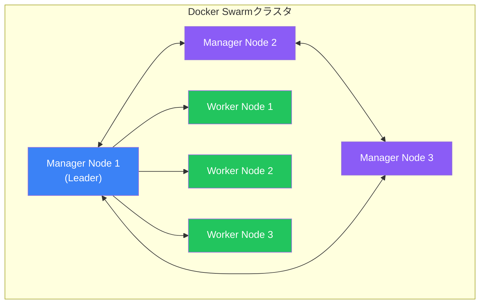

Docker SwarmはDockerネイティブのオーケストレーションソリューションで、複数ホスト間でコンテナを管理します。Kubernetesよりシンプルで、小〜中規模のデプロイに最適です。

## Docker Swarmとは

Docker SwarmはDockerホストのグループを単一の仮想ホストに変えます：



### 主要な概念

| 用語 | 説明 |
|------|------|
| **Node** | swarmに参加しているDockerホスト |
| **Manager** | クラスタ状態を管理するノード |
| **Worker** | コンテナを実行するノード |
| **Service** | 実行するタスクの定義 |
| **Task** | サービスの一部として実行されるコンテナ |
| **Stack** | 関連するサービスのグループ |

## Swarmのセットアップ

### Swarmの初期化

```bash
# 最初のmanagerノードで
docker swarm init --advertise-addr <MANAGER-IP>

# 出力に参加トークンが含まれる:
# workerを追加: docker swarm join --token SWMTKN-1-xxx... <MANAGER-IP>:2377
# managerを追加: docker swarm join-token manager
```

### ノードの参加

```bash
# workerノードで
docker swarm join --token SWMTKN-1-xxx... <MANAGER-IP>:2377

# 追加のmanagerノードで
docker swarm join --token SWMTKN-1-yyy... <MANAGER-IP>:2377
```

### クラスタの確認

```bash
# ノードを一覧
docker node ls

# 出力:
ID                           HOSTNAME    STATUS    AVAILABILITY   MANAGER STATUS
abc123...   *                manager1    Ready     Active         Leader
def456...                    manager2    Ready     Active         Reachable
ghi789...                    worker1     Ready     Active
```

## サービス

サービスはSwarmの主要な抽象化です。

### サービスの作成

```bash
# シンプルなサービスを作成
docker service create --name web --replicas 3 -p 80:80 nginx

# より多くのオプション付きで作成
docker service create \
  --name api \
  --replicas 5 \
  --publish 3000:3000 \
  --env NODE_ENV=production \
  --mount type=volume,source=data,target=/app/data \
  --constraint 'node.role==worker' \
  myapp:latest
```

### サービスの管理

```bash
# サービスを一覧
docker service ls

# サービスを検査
docker service inspect web --pretty

# サービスログを表示
docker service logs web
docker service logs -f web  # ログを追跡

# サービスをスケール
docker service scale web=5

# サービスを更新
docker service update --image nginx:1.25 web

# サービスを削除
docker service rm web
```

### サービスモード

```bash
# Replicated（デフォルト） - 特定の数のレプリカ
docker service create --mode replicated --replicas 3 nginx

# Global - ノードごとに1つのタスク
docker service create --mode global prometheus/node-exporter
```

## スタック

スタックはComposeファイルを使用してマルチサービスアプリケーションをデプロイできます。

### スタックファイル（docker-compose.yml）

```yaml
version: "3.8"

services:
  web:
    image: nginx:alpine
    deploy:
      replicas: 3
      update_config:
        parallelism: 1
        delay: 10s
      restart_policy:
        condition: on-failure
    ports:
      - "80:80"
    networks:
      - frontend

  api:
    image: myapp:latest
    deploy:
      replicas: 2
      placement:
        constraints:
          - node.role == worker
    environment:
      DATABASE_URL: postgres://db:5432/mydb
    networks:
      - frontend
      - backend

  db:
    image: postgres:15
    deploy:
      replicas: 1
      placement:
        constraints:
          - node.labels.db == true
    volumes:
      - db_data:/var/lib/postgresql/data
    networks:
      - backend
    secrets:
      - db_password

networks:
  frontend:
  backend:
    internal: true

volumes:
  db_data:

secrets:
  db_password:
    external: true
```

### スタックのデプロイ

```bash
# スタックをデプロイ
docker stack deploy -c docker-compose.yml myapp

# スタックを一覧
docker stack ls

# スタック内のサービスを一覧
docker stack services myapp

# スタック内のタスクを一覧
docker stack ps myapp

# スタックを削除
docker stack rm myapp
```

## オーバーレイネットワーク

オーバーレイネットワークはノード間のコンテナ通信を可能にします。

```bash
# オーバーレイネットワークを作成
docker network create --driver overlay --attachable mynetwork

# サービスで使用
docker service create --network mynetwork --name web nginx
```

### 暗号化オーバーレイ

```bash
# 暗号化オーバーレイを作成
docker network create \
  --driver overlay \
  --opt encrypted \
  secure-network
```

## ローリングアップデート

```yaml
services:
  web:
    image: nginx:latest
    deploy:
      replicas: 10
      update_config:
        parallelism: 2        # 一度に2つを更新
        delay: 10s            # バッチ間で10秒待機
        failure_action: rollback
        monitor: 60s          # 60秒間監視
        max_failure_ratio: 0.1  # 10%以上失敗でロールバック
      rollback_config:
        parallelism: 2
        delay: 5s
```

### 更新コマンド

```bash
# イメージを更新
docker service update --image nginx:1.25 web

# 失敗時にロールバック付きで更新
docker service update \
  --image nginx:1.25 \
  --update-failure-action rollback \
  web

# 以前のバージョンにロールバック
docker service rollback web
```

## 配置制約

タスクの実行場所を制御：

```yaml
services:
  api:
    deploy:
      placement:
        constraints:
          - node.role == worker
          - node.labels.region == us-east
          - node.hostname == worker1
        preferences:
          - spread: node.labels.zone
```

### ノードラベルを追加

```bash
# ノードにラベルを追加
docker node update --label-add region=us-east worker1
docker node update --label-add db=true worker2

# 制約で使用
docker service create \
  --constraint 'node.labels.db==true' \
  postgres
```

## シークレット管理

```bash
# ファイルからシークレットを作成
docker secret create db_password ./db_password.txt

# 標準入力から作成
echo "mypassword" | docker secret create db_password -

# シークレットを一覧
docker secret ls

# サービスで使用
docker service create \
  --secret db_password \
  --env DB_PASSWORD_FILE=/run/secrets/db_password \
  myapp
```

### スタックでのシークレット

```yaml
services:
  app:
    secrets:
      - db_password
      - api_key

secrets:
  db_password:
    external: true
  api_key:
    file: ./api_key.txt
```

## Configs

機密でない設定を保存：

```bash
# configを作成
docker config create nginx_conf ./nginx.conf

# サービスで使用
docker service create \
  --config source=nginx_conf,target=/etc/nginx/nginx.conf \
  nginx
```

## ヘルスチェック

```yaml
services:
  web:
    image: myapp:latest
    healthcheck:
      test: ["CMD", "curl", "-f", "http://localhost:3000/health"]
      interval: 30s
      timeout: 10s
      retries: 3
      start_period: 40s
    deploy:
      replicas: 3
```

## リソース制限

```yaml
services:
  api:
    deploy:
      resources:
        limits:
          cpus: '0.5'
          memory: 512M
        reservations:
          cpus: '0.25'
          memory: 256M
```

## Swarmの監視

```bash
# クラスタ情報
docker info

# ノードの詳細
docker node inspect worker1 --pretty

# サービスタスク
docker service ps web

# 異常なタスクをチェック
docker service ps web --filter "desired-state=running" \
  --format "{{.Name}} {{.CurrentState}}"
```

## 高可用性

### Managerノード

| Manager数 | 耐障害性 |
|----------|---------|
| 1 | 0（HAなし） |
| 3 | 1ノード障害 |
| 5 | 2ノード障害 |
| 7 | 3ノード障害 |

```bash
# workerをmanagerに昇格
docker node promote worker1

# managerをworkerに降格
docker node demote manager3
```

### メンテナンス用にノードをドレイン

```bash
# ノードをドレイン（タスクを移行）
docker node update --availability drain worker1

# オンラインに戻す
docker node update --availability active worker1
```

## 完全なスタック例

```yaml
version: "3.8"

services:
  traefik:
    image: traefik:v2.10
    command:
      - "--providers.docker.swarmMode=true"
      - "--entrypoints.web.address=:80"
    ports:
      - "80:80"
    volumes:
      - /var/run/docker.sock:/var/run/docker.sock:ro
    deploy:
      placement:
        constraints:
          - node.role == manager
    networks:
      - traefik-public

  api:
    image: myapp:latest
    deploy:
      replicas: 3
      labels:
        - "traefik.enable=true"
        - "traefik.http.routers.api.rule=Host(`api.example.com`)"
      update_config:
        parallelism: 1
        delay: 10s
    networks:
      - traefik-public
      - backend
    secrets:
      - db_password

  postgres:
    image: postgres:15
    deploy:
      replicas: 1
      placement:
        constraints:
          - node.labels.db == true
    environment:
      POSTGRES_PASSWORD_FILE: /run/secrets/db_password
    volumes:
      - postgres_data:/var/lib/postgresql/data
    networks:
      - backend
    secrets:
      - db_password

networks:
  traefik-public:
    driver: overlay
  backend:
    driver: overlay
    internal: true

volumes:
  postgres_data:

secrets:
  db_password:
    external: true
```

## 重要なポイント

1. **シンプルなセットアップ** - 1つのコマンドで初期化
2. **宣言的** - 望ましい状態を定義し、Swarmが維持
3. **組み込みロードバランシング** - 自動ルーティングメッシュ
4. **ローリングアップデート** - ゼロダウンタイムデプロイ
5. **シークレット管理** - 機密データの安全な取り扱い
6. **サービスディスカバリ** - サービス用の自動DNS

## 次のステップ

次の記事では、Dockerコンテナのデバッグとトラブルシューティングを解説します。

## 参考文献

- Docker Deep Dive, 5th Edition - Nigel Poulton
- [Docker Swarmドキュメント](https://docs.docker.com/engine/swarm/)
