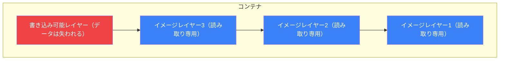
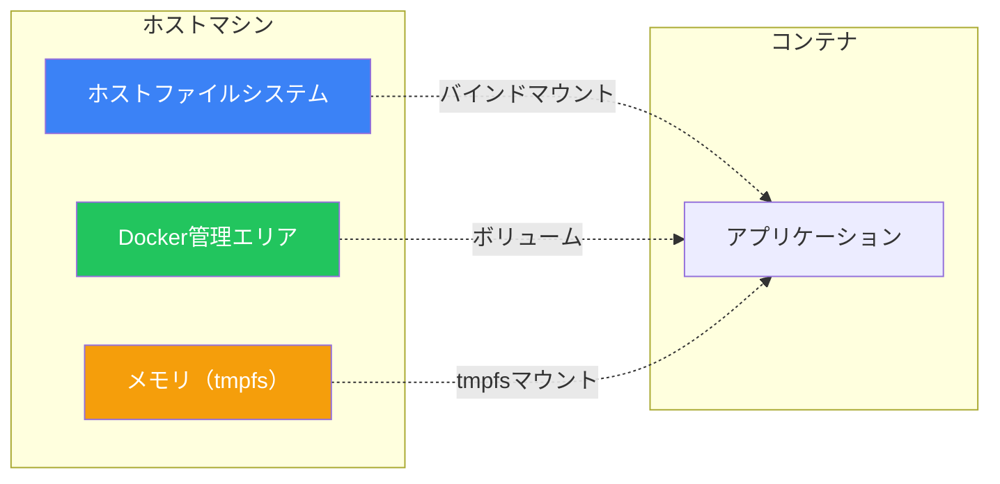
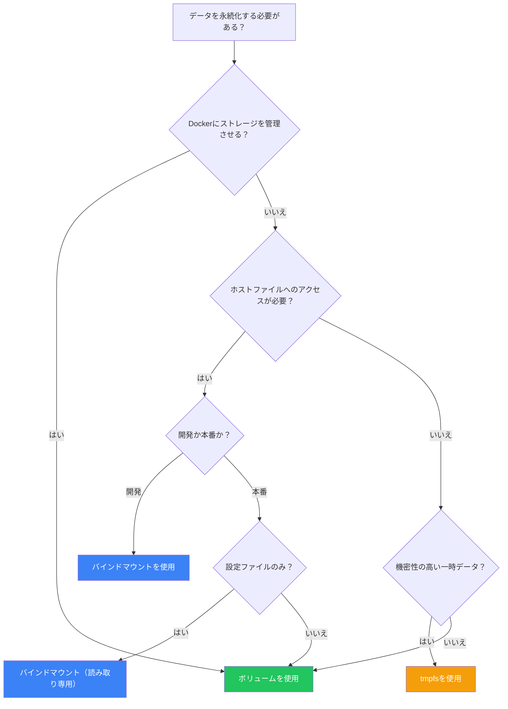

コンテナは設計上、一時的なものです。コンテナを削除すると、そのデータは失われます。Dockerはコンテナのライフサイクルを超えてデータを永続化するためのメカニズムを提供しています。この記事では、ボリューム、バインドマウント、tmpfsマウントについて解説します。

## コンテナファイルシステムの問題

デフォルトでは、コンテナ内のすべてのファイルは書き込み可能なコンテナレイヤーに保存されます：



**このアプローチの問題点：**
- コンテナを削除するとデータが失われる
- コンテナ間でデータを簡単に共有できない
- コンテナレイヤーへの書き込みは遅い（ストレージドライバーのため）
- データとともにコンテナサイズが増大する

## マウントの種類

Dockerはデータを永続化する3つの方法を提供しています：



| 種類 | 保存場所 | ユースケース |
|------|---------|-------------|
| **ボリューム** | Docker管理エリア | 本番データ、データベース |
| **バインドマウント** | 任意のホストパス | 開発、設定ファイル |
| **tmpfsマウント** | ホストメモリ | 機密データ、一時ファイル |

## Dockerボリューム

ボリュームはデータを永続化するための推奨方法です。Dockerがボリュームストレージを完全に管理します。

### ボリュームの作成

```bash
# 名前付きボリュームを作成
docker volume create mydata

# ボリュームを一覧
docker volume ls

# ボリュームを検査
docker volume inspect mydata

# 出力:
[
    {
        "Name": "mydata",
        "Driver": "local",
        "Mountpoint": "/var/lib/docker/volumes/mydata/_data",
        "Labels": {},
        "Scope": "local"
    }
]
```

### コンテナでボリュームを使用

```bash
# -vでボリュームをマウント
docker run -d \
  -v mydata:/var/lib/mysql \
  --name mysql \
  mysql:8

# --mountでボリュームをマウント（より明示的）
docker run -d \
  --mount source=mydata,target=/var/lib/mysql \
  --name mysql \
  mysql:8

# その場でボリュームを作成
docker run -d \
  -v newvolume:/data \
  alpine
```

### ボリューム構文の比較

```bash
# -v構文: name:path[:options]
-v mydata:/app/data
-v mydata:/app/data:ro

# --mount構文: key=valueペア
--mount source=mydata,target=/app/data
--mount source=mydata,target=/app/data,readonly
```

| 側面 | `-v` | `--mount` |
|------|------|-----------|
| 構文 | 短い | より冗長 |
| 存在しないボリューム | 自動作成 | エラー |
| 推奨 | 手軽に使用 | 本番環境 |

### Docker Composeでのボリューム

```yaml
services:
  db:
    image: postgres:15
    volumes:
      - postgres_data:/var/lib/postgresql/data
      - db_backup:/backup

volumes:
  postgres_data:
  db_backup:
    driver: local
    driver_opts:
      type: none
      o: bind
      device: /mnt/backup
```

### コンテナ間でボリュームを共有

```bash
# コンテナ1がデータを書き込む
docker run -d \
  -v shared_data:/data \
  --name writer \
  alpine sh -c "while true; do date >> /data/log.txt; sleep 1; done"

# コンテナ2がデータを読む
docker run --rm \
  -v shared_data:/data \
  alpine tail -f /data/log.txt
```

### ボリュームドライバー

```bash
# 異なるドライバーを使用
docker volume create \
  --driver local \
  --opt type=nfs \
  --opt o=addr=192.168.1.1,rw \
  --opt device=:/path/to/dir \
  nfs_volume

# クラウドストレージドライバー（プラグインが必要）
docker volume create \
  --driver rexray/ebs \
  --opt size=100 \
  aws_volume
```

## バインドマウント

バインドマウントはホストディレクトリをコンテナパスにマップします。開発ワークフローに最適です。

### バインドマウントの使用

```bash
# カレントディレクトリをマウント
docker run -d \
  -v $(pwd):/app \
  --name dev \
  node:18 npm run dev

# --mountでマウント
docker run -d \
  --mount type=bind,source=$(pwd),target=/app \
  node:18

# 読み取り専用バインドマウント
docker run -d \
  -v $(pwd)/config:/app/config:ro \
  myapp
```

### Docker Composeでのバインドマウント

```yaml
services:
  app:
    build: .
    volumes:
      # 開発用バインドマウント
      - ./src:/app/src
      # 読み取り専用設定
      - ./config:/app/config:ro
      # node_modulesを除外
      - /app/node_modules
```

### 開発ワークフローの例

```yaml
# docker-compose.yml
services:
  app:
    build:
      context: .
      target: development
    volumes:
      - .:/app
      - /app/node_modules  # node_modules用の匿名ボリューム
    ports:
      - "3000:3000"
    command: npm run dev
```

このパターンは：
1. ライブリロードのためにソースコードをマウント
2. `node_modules`には匿名ボリュームを使用（ホストへの上書きを防止）
3. エディターでの変更がすぐにコンテナに反映

## tmpfsマウント

tmpfsマウントはデータをメモリに保存します。データはホストファイルシステムに書き込まれません。

### tmpfsの使用

```bash
# tmpfsマウントを作成
docker run -d \
  --tmpfs /app/temp \
  myapp

# サイズ制限付き
docker run -d \
  --mount type=tmpfs,target=/app/temp,tmpfs-size=100m \
  myapp
```

### tmpfsを使うタイミング

| ユースケース | tmpfsを使う理由 |
|------------|---------------|
| 機密データ | ディスクに永続化されない |
| 一時ファイル | 高速アクセス、自動クリーンアップ |
| セッションデータ | メモリ並みの速度、コンテナスコープ |

```yaml
# docker-compose.yml
services:
  app:
    image: myapp
    tmpfs:
      - /app/temp
      - /app/cache:size=100m
```

## 実践的な例

### PostgreSQLと永続データ

```yaml
services:
  postgres:
    image: postgres:15-alpine
    environment:
      POSTGRES_PASSWORD: ${DB_PASSWORD}
    volumes:
      # データ永続化
      - postgres_data:/var/lib/postgresql/data
      # 初期化スクリプト（読み取り専用）
      - ./init:/docker-entrypoint-initdb.d:ro
    healthcheck:
      test: ["CMD-SHELL", "pg_isready -U postgres"]
      interval: 5s

volumes:
  postgres_data:
```

### Redisと永続化オプション

```yaml
services:
  redis:
    image: redis:7-alpine
    command: redis-server --appendonly yes
    volumes:
      - redis_data:/data

volumes:
  redis_data:
```

### MySQLバックアップパターン

```yaml
services:
  mysql:
    image: mysql:8
    volumes:
      - mysql_data:/var/lib/mysql
      - ./backup:/backup

  backup:
    image: mysql:8
    volumes:
      - ./backup:/backup
    depends_on:
      - mysql
    entrypoint: >
      sh -c "mysqldump -h mysql -u root -p$$MYSQL_ROOT_PASSWORD --all-databases > /backup/backup.sql"

volumes:
  mysql_data:
```

### マルチコンテナファイル共有

```yaml
services:
  # アプリケーションがファイルを生成
  generator:
    image: myapp
    volumes:
      - shared_files:/output

  # ワーカーがファイルを処理
  processor:
    image: processor
    volumes:
      - shared_files:/input:ro

  # Webサーバーがファイルを配信
  nginx:
    image: nginx:alpine
    volumes:
      - shared_files:/usr/share/nginx/html:ro
    ports:
      - "80:80"

volumes:
  shared_files:
```

## ボリュームの管理

### 一覧と検査

```bash
# すべてのボリュームを一覧
docker volume ls

# フィルター付きで一覧
docker volume ls -f dangling=true

# 詳細情報
docker volume inspect mydata
```

### ボリュームのバックアップ

```bash
# ボリュームをバックアップ
docker run --rm \
  -v mydata:/data \
  -v $(pwd):/backup \
  alpine tar cvf /backup/mydata.tar /data

# ボリュームを復元
docker run --rm \
  -v mydata:/data \
  -v $(pwd):/backup \
  alpine sh -c "cd /data && tar xvf /backup/mydata.tar --strip 1"
```

### データのコピー

```bash
# コンテナからホストにコピー
docker cp container_name:/path/to/data ./local/path

# ホストからボリュームにコピー
docker run --rm \
  -v mydata:/data \
  -v $(pwd)/source:/source \
  alpine cp -r /source/. /data/
```

### ボリュームの削除

```bash
# ボリュームを削除
docker volume rm mydata

# 未使用のすべてのボリュームを削除
docker volume prune

# 強制削除
docker volume prune -f

# コンテナ削除時にボリュームも削除
docker rm -v container_name
```

## ボリューム vs バインドマウント判断ガイド



| シナリオ | 推奨 |
|---------|------|
| データベースデータ | 名前付きボリューム |
| 開発ソースコード | バインドマウント |
| 設定ファイル | バインドマウント（読み取り専用） |
| 一時的/機密データ | tmpfs |
| コンテナ間の共有データ | 名前付きボリューム |
| クラウド/NFSストレージ | ドライバー付きボリューム |

## ベストプラクティス

### 1. 重要なデータには必ず名前付きボリュームを使用

```bash
# 悪い例 - 匿名ボリューム
docker run -v /var/lib/mysql mysql

# 良い例 - 名前付きボリューム
docker run -v mysql_data:/var/lib/mysql mysql
```

### 2. 可能な限り読み取り専用を使用

```yaml
volumes:
  - ./config:/app/config:ro
  - ./nginx.conf:/etc/nginx/nginx.conf:ro
```

### 3. コードとデータを分離

```yaml
services:
  app:
    volumes:
      - app_data:/app/data      # 永続データ
      - ./src:/app/src          # 開発コード
```

### 4. 定期的にバックアップ

```bash
# 自動バックアップスクリプト
#!/bin/bash
VOLUME_NAME=$1
BACKUP_DIR=/backups
DATE=$(date +%Y%m%d_%H%M%S)

docker run --rm \
  -v ${VOLUME_NAME}:/data \
  -v ${BACKUP_DIR}:/backup \
  alpine tar cvf /backup/${VOLUME_NAME}_${DATE}.tar /data
```

### 5. バインドマウントにシークレットを保存しない

```yaml
# 悪い例
volumes:
  - ./secrets:/app/secrets

# 良い例 - Dockerシークレットまたは環境変数を使用
secrets:
  db_password:
    file: ./secrets/db_password.txt
```

## まとめ表

| 機能 | ボリューム | バインドマウント | tmpfs |
|------|----------|---------------|-------|
| 場所 | Dockerエリア | 任意のホストパス | メモリ |
| 永続性 | あり | あり | なし |
| 共有 | 簡単 | 可能 | 不可 |
| パフォーマンス | 良好 | 最高（SSD） | 最速 |
| 移植性 | 高い | 低い | N/A |
| ユースケース | 本番データ | 開発 | 一時データ |

## 重要なポイント

1. **本番環境にはボリュームを推奨** - Dockerが管理、バックアップが容易
2. **開発にはバインドマウント** - 変更を即座に確認
3. **機密性の高い/一時データにはtmpfs** - ディスクに触れない
4. **ボリュームには必ず名前を付ける** - 匿名ボリュームは管理が難しい
5. **可能な限り読み取り専用を使用** - セキュリティリスクを軽減
6. **定期的にボリュームをバックアップ** - データ損失は現実の問題

## 次のステップ

次の記事では、Dockerネットワーキングについて解説します。コンテナの接続、サービスの公開、マルチティアアーキテクチャの構築を学びましょう。

## 参考文献

- Docker Deep Dive, 5th Edition - Nigel Poulton
- The Ultimate Docker Container Book, 3rd Edition - Dr. Gabriel N. Schenker
- [Dockerボリュームドキュメント](https://docs.docker.com/storage/volumes/)
