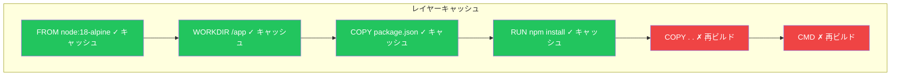

Dockerfileは、Dockerイメージを構築するための命令を含むテキストファイルです。この記事では、効率的で本番環境に対応したイメージを作成するための基本的なDockerfile命令とベストプラクティスを学びます。

## Dockerfileとは

Dockerfileは、Dockerイメージを構築するためのレシピです。ファイル内の各命令が、最終イメージのレイヤーを作成します：

```dockerfile
# Dockerfileの例
FROM node:18-alpine
WORKDIR /app
COPY package*.json ./
RUN npm install
COPY . .
EXPOSE 3000
CMD ["node", "server.js"]
```

## イメージのビルド

```bash
# 基本的なビルド
docker build -t myapp:v1 .

# 特定のDockerfileでビルド
docker build -t myapp:v1 -f Dockerfile.prod .

# キャッシュなしでビルド
docker build --no-cache -t myapp:v1 .

# ビルド引数付きでビルド
docker build --build-arg VERSION=1.0 -t myapp:v1 .
```

## 基本的な命令

### FROM - ベースイメージ

すべてのDockerfileは`FROM`で始まる必要があります。ベースイメージを設定します：

```dockerfile
# 公式イメージ
FROM node:18

# タグ付きの特定バージョン
FROM node:18.19.0-alpine

# 最小限のベースイメージ
FROM alpine:3.19

# 空のベース（静的バイナリ用）
FROM scratch
```

**ベストプラクティス**: `latest`ではなく、常に特定のタグを使用：

```dockerfile
# 悪い例 - 予測不可能
FROM node:latest

# 良い例 - 再現可能
FROM node:18.19.0-alpine
```

### RUN - コマンドの実行

`RUN`はビルドプロセス中にコマンドを実行します：

```dockerfile
# シェル形式
RUN apt-get update && apt-get install -y curl

# Exec形式（明確さのため推奨）
RUN ["apt-get", "update"]

# バックスラッシュで複数行
RUN apt-get update && \
    apt-get install -y \
        curl \
        wget \
        git && \
    rm -rf /var/lib/apt/lists/*
```

**ベストプラクティス**: 関連するコマンドを結合してレイヤーを削減：

```dockerfile
# 悪い例 - 複数のレイヤーを作成
RUN apt-get update
RUN apt-get install -y curl
RUN apt-get install -y wget

# 良い例 - 単一レイヤー、クリーンアップを含む
RUN apt-get update && \
    apt-get install -y curl wget && \
    rm -rf /var/lib/apt/lists/*
```

### COPY vs ADD

両方ともイメージにファイルをコピーしますが、違いがあります：

```dockerfile
# COPY - シンプルなファイル/ディレクトリコピー
COPY package.json /app/
COPY src/ /app/src/

# ADD - 追加機能（必要な場合のみ使用）
ADD https://example.com/file.tar.gz /app/  # URLをダウンロード
ADD archive.tar.gz /app/                     # アーカイブを自動展開
```

| 機能 | COPY | ADD |
|------|------|-----|
| ファイルをコピー | ✅ | ✅ |
| ディレクトリをコピー | ✅ | ✅ |
| URLダウンロード | ❌ | ✅ |
| アーカイブ自動展開 | ❌ | ✅ |
| 推奨 | ✅ | 必要な場合のみ |

**ベストプラクティス**: ADDの機能が特に必要でなければ`COPY`を使用。

### WORKDIR - 作業ディレクトリの設定

後続の命令の作業ディレクトリを設定します：

```dockerfile
WORKDIR /app

# 以降のすべてのコマンドは/appで実行
COPY . .
RUN npm install
CMD ["node", "server.js"]
```

**ベストプラクティス**: `RUN cd`の代わりに`WORKDIR`を使用：

```dockerfile
# 悪い例
RUN cd /app && npm install

# 良い例
WORKDIR /app
RUN npm install
```

### ENV - 環境変数

コンテナで利用可能な環境変数を設定します：

```dockerfile
# 単一の変数
ENV NODE_ENV=production

# 複数の変数
ENV NODE_ENV=production \
    PORT=3000 \
    DEBUG=false

# 変数の使用
ENV APP_HOME=/app
WORKDIR $APP_HOME
```

### ARG - ビルド時変数

ビルド中にのみ利用可能な変数：

```dockerfile
ARG NODE_VERSION=18
FROM node:${NODE_VERSION}-alpine

ARG BUILD_DATE
ARG GIT_SHA
LABEL build-date=$BUILD_DATE
LABEL git-sha=$GIT_SHA
```

```bash
# ビルド時に値を渡す
docker build --build-arg NODE_VERSION=20 --build-arg GIT_SHA=$(git rev-parse HEAD) -t myapp .
```

| 側面 | ENV | ARG |
|------|-----|-----|
| ビルド中に利用可能 | ✅ | ✅ |
| 実行時に利用可能 | ✅ | ❌ |
| 実行時に上書き可能 | ✅ (`-e`で) | ❌ |

### EXPOSE - ポートのドキュメント化

コンテナがリッスンするポートをドキュメント化します：

```dockerfile
# 単一ポート
EXPOSE 3000

# 複数ポート
EXPOSE 80 443

# UDPポート
EXPOSE 53/udp
```

**注意**: `EXPOSE`はドキュメントのみです。ポートを公開するには`-p`が必要です：

```bash
docker run -p 8080:3000 myapp
```

### CMD vs ENTRYPOINT

両方ともデフォルトコマンドを指定しますが、目的が異なります：

#### CMD - デフォルトコマンド

```dockerfile
# Exec形式（推奨）
CMD ["node", "server.js"]

# シェル形式
CMD node server.js

# ENTRYPOINTのデフォルトパラメータとして
CMD ["--port", "3000"]
```

CMDは実行時に上書き可能：
```bash
docker run myapp node other-script.js  # CMDを上書き
```

#### ENTRYPOINT - 固定コマンド

```dockerfile
# Exec形式
ENTRYPOINT ["node", "server.js"]

# シェル形式（非推奨）
ENTRYPOINT node server.js
```

ENTRYPOINT引数は追加される：
```bash
docker run myapp --port 8080  # 実行: node server.js --port 8080
```

#### 組み合わせパターン

```dockerfile
ENTRYPOINT ["node"]
CMD ["server.js"]
```

```bash
docker run myapp                    # 実行: node server.js
docker run myapp other-script.js    # 実行: node other-script.js
```

### 比較表

| 側面 | CMD | ENTRYPOINT |
|------|-----|------------|
| 目的 | デフォルトコマンド/引数 | 固定実行ファイル |
| 実行時の上書き | 置き換えられる | 引数が追加される |
| ユースケース | 柔軟なデフォルト | コンテナを実行ファイルとして |

## 完全な例：Node.jsアプリケーション

```dockerfile
# ビルドステージ
FROM node:18-alpine AS builder

WORKDIR /app

# パッケージファイルを先にコピー（キャッシュ効率化）
COPY package*.json ./

# 依存関係をインストール
RUN npm ci --only=production

# ソースコードをコピー
COPY . .

# 本番ステージ
FROM node:18-alpine

# 非rootユーザーを作成
RUN addgroup -S appgroup && adduser -S appuser -G appgroup

WORKDIR /app

# ビルダーからコピー
COPY --from=builder /app/node_modules ./node_modules
COPY --from=builder /app .

# 所有権を設定
RUN chown -R appuser:appgroup /app

# 非rootユーザーに切り替え
USER appuser

# 環境設定
ENV NODE_ENV=production
ENV PORT=3000

# ドキュメント
EXPOSE 3000

# ヘルスチェック
HEALTHCHECK --interval=30s --timeout=3s --start-period=5s --retries=3 \
    CMD wget --no-verbose --tries=1 --spider http://localhost:3000/health || exit 1

# 起動コマンド
CMD ["node", "server.js"]
```

## 完全な例：Pythonアプリケーション

```dockerfile
FROM python:3.11-slim

# Pythonが.pycファイルを書き込むのを防止
ENV PYTHONDONTWRITEBYTECODE=1
# Pythonがstdout/stderrをバッファリングするのを防止
ENV PYTHONUNBUFFERED=1

WORKDIR /app

# システム依存関係をインストール
RUN apt-get update && \
    apt-get install -y --no-install-recommends gcc && \
    rm -rf /var/lib/apt/lists/*

# キャッシュのためにrequirementsを先にコピー
COPY requirements.txt .
RUN pip install --no-cache-dir -r requirements.txt

# アプリケーションをコピー
COPY . .

# 非rootユーザーを作成
RUN useradd --create-home appuser && \
    chown -R appuser:appuser /app
USER appuser

EXPOSE 8000

CMD ["gunicorn", "--bind", "0.0.0.0:8000", "app:app"]
```

## 追加の命令

### LABEL - メタデータ

```dockerfile
LABEL maintainer="developer@example.com"
LABEL version="1.0"
LABEL description="My application"

# OCI標準ラベル
LABEL org.opencontainers.image.source="https://github.com/user/repo"
LABEL org.opencontainers.image.version="1.0.0"
```

### USER - ユーザー設定

```dockerfile
# 非rootユーザーを作成して切り替え
RUN addgroup -S mygroup && adduser -S myuser -G mygroup
USER myuser

# または数値UIDを使用
USER 1000
```

### VOLUME - マウントポイントの宣言

```dockerfile
VOLUME /data
VOLUME ["/var/log", "/var/data"]
```

### HEALTHCHECK - コンテナヘルス

```dockerfile
HEALTHCHECK --interval=30s --timeout=3s --retries=3 \
    CMD curl -f http://localhost:3000/health || exit 1

# ヘルスチェックを無効化
HEALTHCHECK NONE
```

### SHELL - デフォルトシェルの変更

```dockerfile
# WindowsでPowerShellに変更
SHELL ["powershell", "-Command"]

# またはbashを使用
SHELL ["/bin/bash", "-c"]
```

## ビルドコンテキストと.dockerignore

ビルドコンテキストはDockerデーモンに送信されるディレクトリです。`.dockerignore`でファイルを除外：

```
# .dockerignore
node_modules
npm-debug.log
.git
.gitignore
Dockerfile
.dockerignore
*.md
.env
.env.*
coverage/
.nyc_output/
```

## レイヤーキャッシュ

Dockerは各レイヤーをキャッシュします。変更頻度の低いものから高いものへ命令を順序付け：

```dockerfile
# 良い順序（安定 → 変更が多い）
FROM node:18-alpine          # めったに変更されない
WORKDIR /app                 # めったに変更されない
COPY package*.json ./        # 依存関係が変わると変更
RUN npm install              # package.jsonが変わらなければキャッシュ
COPY . .                     # 頻繁に変更
CMD ["node", "server.js"]    # めったに変更されない
```



## ベストプラクティスまとめ

| プラクティス | 説明 |
|------------|------|
| 特定のベースイメージタグを使用 | 再現可能なビルドを保証 |
| レイヤーを最小化 | RUNコマンドを結合 |
| 変更頻度で順序付け | 安定した命令を先に |
| .dockerignoreを使用 | ビルドコンテキストサイズを削減 |
| 不要なパッケージをインストールしない | 小さいイメージ、攻撃面の縮小 |
| 非rootユーザーを使用 | セキュリティのベストプラクティス |
| ADDよりCOPYを使用 | ADD機能が必要でなければ |
| 同じレイヤーでクリーンアップ | パッケージマネージャーキャッシュを削除 |

## Dockerfileのリント

hadolintを使用してDockerfileをチェック：

```bash
# hadolintをインストール
brew install hadolint

# Dockerfileをリント
hadolint Dockerfile

# またはDockerを使用
docker run --rm -i hadolint/hadolint < Dockerfile
```

## クイックリファレンス

```dockerfile
FROM image:tag              # ベースイメージ
WORKDIR /path               # 作業ディレクトリ設定
COPY src dest               # ファイルをコピー
ADD src dest                # 追加機能付きコピー
RUN command                 # コマンド実行
ENV KEY=value               # 環境変数設定
ARG NAME=default            # ビルド引数
EXPOSE port                 # ポートをドキュメント化
USER username               # ユーザー設定
VOLUME /path                # ボリューム宣言
HEALTHCHECK CMD command     # ヘルスチェック
CMD ["executable", "arg"]   # デフォルトコマンド
ENTRYPOINT ["executable"]   # 固定コマンド
```

## 重要なポイント

1. **シンプルに始める** - 動作するDockerfileから始め、後で最適化
2. **特定のタグを使用** - 本番環境では絶対に`latest`を使わない
3. **キャッシュを活用** - 変更頻度で命令を順序付け
4. **イメージサイズを最小化** - alpineイメージ、マルチステージビルドを使用
5. **非rootで実行** - 非rootユーザーを作成して使用
6. **クリーンアップ** - キャッシュと不要なファイルを削除

## 次のステップ

次の記事では、Docker Composeを学びます。単一の設定ファイルでマルチコンテナアプリケーションを定義して実行する方法を習得しましょう。

## 参考文献

- Docker Deep Dive, 5th Edition - Nigel Poulton
- Docker in Action, 2nd Edition - Jeffrey Nickoloff
- [Dockerfileリファレンス](https://docs.docker.com/engine/reference/builder/)
