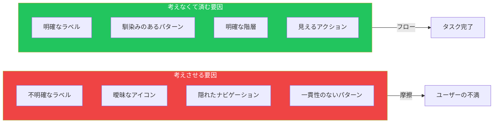
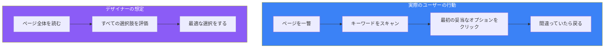

## はじめに

「Don't make me think（考えさせるな）」は、Steve Krugが同名の著書で提唱した、Webユーザビリティにおける最も重要な原則です。このシンプルながら強力な考え方は、20年以上にわたってインターフェースデザイナーの指針となってきました。

この原則の意味するところは：**ユーザーがインターフェースの使い方を考えるために立ち止まるたびに、摩擦が生まれている**ということです。優れたデザインは自明であるべきで、ユーザーは努力なしに「理解できる」必要があります。

## 「考える」とはどういうことか

ユーザーがインターフェースに遭遇したとき、以下のような疑問は望ましくない認知負荷を表しています：

- 「ここはどこ？」
- 「どこから始めればいい？」
- 「このページで最も重要なものは何？」
- 「なぜこんな名前にしたの？」
- 「これはクリックできる？」
- 「探しているものはどこ？」



## Krugのユーザビリティ3法則

### 第一法則：考えさせるな

ユーザーの頭に浮かぶすべての疑問符は、認知負荷を増加させます：

| 思考の種類 | 例 | 解決策 |
|-----------|-----|-------|
| ラベルの混乱 | 「求人」vs「採用情報」vs「キャリア」 | 最も一般的な用語を使う |
| クリックの不確実性 | このテキストはリンク？ | クリック可能な要素を明確に |
| 機能の発見 | 検索はどこ？ | 慣例に従う |
| ナビゲーションの迷い | 戻るにはどうする？ | 明確な道標を提供 |

### 第二法則：クリック数は関係ない

ユーザーはクリックすることを気にしません。**クリックについて考えること**を気にするのです。考えが必要な1クリックより、考えなくて済む3クリックの方が良いのです。

```typescript
// 悪い例: 1クリックだが考える必要がある
<Dropdown
  options={['表示', '編集', '削除', '共有', 'アーカイブ', 'エクスポート', '複製']}
/>

// 良い例: クリック数は多いが明確な道筋
<Button onClick={viewItem}>詳細を見る</Button>
// 詳細ページで: 明確な編集、削除、共有ボタン
```

### 第三法則：言葉を半分に減らせ

無駄な言葉を省きましょう。そして残りの半分も削りましょう。ほとんどのWebページには、ユーザーが決して読まない多くのテキストが含まれています。

## ユーザーは実際にどうWebを使うか

これらの原則を適用するには、実際のユーザー行動を理解することが重要です。

### ユーザーは読まない—スキャンする



### ユーザーは最適な選択をしない—満足化する

「満足化（Satisficing）」とは、ユーザーが最良の選択肢を探すのではなく、**最初の妥当な選択肢**をクリックすることを意味します。この行動に合わせて設計しましょう：

```tsx
// 満足化行動に合わせた設計
function SearchResults({ results }) {
  return (
    <div>
      {/* 最も関連性の高い結果を視覚的に目立たせる */}
      <FeaturedResult result={results[0]} />

      {/* その他の結果は明確に二次的に */}
      <div className="other-results">
        {results.slice(1).map(result => (
          <ResultItem key={result.id} result={result} />
        ))}
      </div>
    </div>
  );
}
```

### ユーザーは仕組みを理解しない—なんとか使う

ユーザーは説明書をほとんど読みません。すぐに使い始めて、使いながら理解していきます。ユーザーが「正しい」使い方を理解していなくても機能するインターフェースを設計しましょう。

## 実践的な実装

### ページを自明にする

自明なページは以下の質問に即座に答えられます：

1. **これは何のサイト？**（アイデンティティ）
2. **今いるページは？**（位置）
3. **主要なセクションは？**（ナビゲーション）
4. **このレベルでの選択肢は？**（コンテンツ）
5. **全体の中でどこにいる？**（ポジション）
6. **検索はどうやる？**（検索）

```tsx
function PageLayout({ children, title, breadcrumbs }) {
  return (
    <div>
      {/* アイデンティティ - 常に表示 */}
      <Header logo={<Logo />} />

      {/* ポジション - どこにいる？ */}
      <Breadcrumbs items={breadcrumbs} />

      {/* 位置 - 何のページ？ */}
      <h1>{title}</h1>

      {/* ナビゲーション - 主要セクション */}
      <MainNav />

      {/* コンテンツ - 現在の選択肢 */}
      <main>{children}</main>

      {/* 検索 - 常にアクセス可能 */}
      <SearchBox />
    </div>
  );
}
```

### 明確な視覚的階層を作る

視覚的階層は、ユーザーが考えなくても何が重要かを伝えます：

```css
/* 視覚的な重みによる明確な階層 */
.page-title {
  font-size: 2rem;
  font-weight: 700;
  color: #111;
}

.section-title {
  font-size: 1.5rem;
  font-weight: 600;
  color: #333;
}

.subsection-title {
  font-size: 1.25rem;
  font-weight: 500;
  color: #555;
}

.body-text {
  font-size: 1rem;
  font-weight: 400;
  color: #666;
}
```

### 慣例を使う

Webの慣例が強力なのは、ユーザーがすでに知っているからです。慣例に逆らうとユーザーは考えざるを得なくなります：

| 慣例 | ユーザーの期待 | やってはいけないこと |
|-----|--------------|-------------------|
| ロゴの位置 | 左上、ホームへリンク | 中央や右にロゴ |
| 検索アイコン | 虫眼鏡 | 双眼鏡や懐中電灯 |
| カート | 右上 | ページ下部 |
| 主要アクション | 目立つボタン、右側 | 左側のテキストリンク |
| ナビゲーション | 上部か左側 | 下部のみ |

### クリック可能なものを明確に

ユーザーが何がクリックできるか推測する必要があってはいけません：

```tsx
// 悪い例: クリックできる？
<span className="text-blue-500">詳細を見る</span>

// 良い例: 明らかにリンク
<a href="/details" className="text-blue-500 underline hover:text-blue-700">
  詳細を見る →
</a>

// 悪い例: フラットで不明確
<div className="p-2 bg-gray-100">送信</div>

// 良い例: 明らかにボタン
<button className="px-4 py-2 bg-blue-600 text-white rounded hover:bg-blue-700
                   shadow-sm active:shadow-inner transition">
  送信
</button>
```

## 「考える」瞬間のテスト

### トランクテスト

サイトのランダムなページに着地したと想像してください。すぐに以下に答えられますか：

1. これは何のサイト？
2. 今いるページは？
3. 主要なセクションは？
4. このレベルでの選択肢は？
5. どうやってここに来た？
6. 検索はどうやる？

### 5秒テスト

誰かにページを5秒間見せてから隠します。質問：

- ページは何についてだった？
- 主な選択肢は何だった？
- 最初に何をクリックする？

自信を持って答えられなければ、ページは考えすぎを要求しています。

## まとめ

| 原則 | アクション |
|-----|----------|
| 考えさせるな | すべての疑問符を排除 |
| ユーザーはスキャンする | 明確な視覚的階層を作る |
| ユーザーは満足化する | 最良の選択肢を最初に |
| ユーザーはなんとか使う | 誤用に対応した設計 |
| クリック vs 思考 | 簡単なクリックは難しい決断に勝る |
| 言葉 | 半分に減らし、さらに半分に |

目標はインターフェースを単純化することではなく、**自明にする**ことです。ユーザーが製品の使い方を考える必要がなくなれば、やりたいことに集中できるようになります。

## 参考文献

- Krug, Steve. "Don't Make Me Think: A Common Sense Approach to Web Usability" (2nd Edition)
- Nielsen Norman Group - Usability 101
- Laws of UX - https://lawsofux.com
