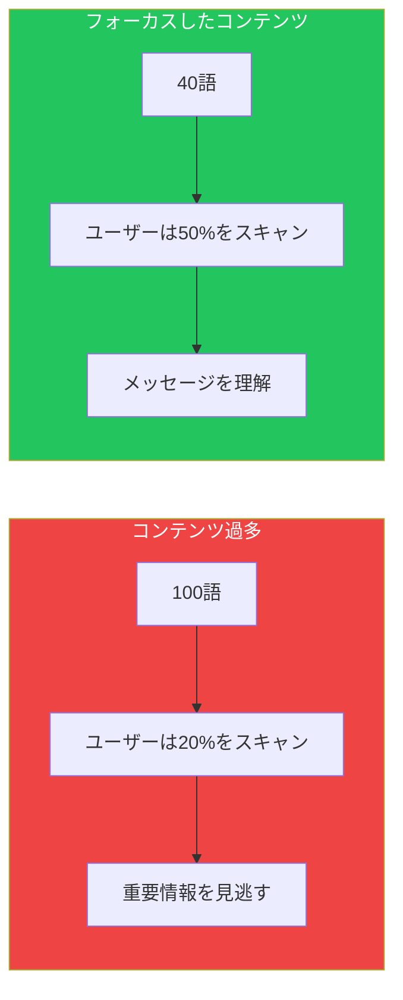

## はじめに

Web設計に恩恵をもたらした多くの教訓の中で、最も強力なものの1つはE.B.Whiteの「The Elements of Style」から来ています：

> **「無駄な言葉を省け。」**
>
> 力強い文章は簡潔である。文には不要な単語があってはならず、段落には不要な文があってはならない。それは絵に不要な線があってはならず、機械に不要な部品があってはならないのと同じ理由による。

Steve Krugはこの原則をWebに適用しました：**各ページの言葉を半分に減らし、さらに残りの半分を削れ。**

この記事では、ページを使いにくくするコンテンツの無駄を特定し、排除する方法を紹介します。

## Webで言葉が重要な理由

ユーザーはWebページを読まない—スキャンします。不要な言葉はすべて：

- 重要なコンテンツと注目を奪い合う
- 認知負荷を増加させる
- ページを圧倒的に感じさせる
- 重要なメッセージが見られる可能性を減らす



## コンテンツの無駄の種類

### 1. ハッピートーク

何も有用なことを言わない導入テキスト—Webにおける世間話のようなもの。

```markdown
## Before（ハッピートーク）
「革新的な新しいプラットフォームへようこそ！お越しいただき大変嬉しく思います。
Acme Corpでは、お客様を第一に考えています。私たちのチームは最高の
体験を提供するために懸命に働いてきました。お探しのものすべてを
見つけていただけることを願っています！」

## After（有用なコンテンツ）
「Acmeはチームが半分の時間でプロジェクトを管理するのを助けます。無料トライアルを始めましょう。」

---

## Before（ハッピートーク）
「会社概要ページをご覧いただきありがとうございます！私たちの素晴らしい会社と、
ここに至るまでの信じられないような旅について詳しく知りたいと思っていただき
嬉しく思います。」

## After（有用なコンテンツ）
「2020年設立。世界中の50,000チームにサービスを提供。」
```

### 2. ユーザーがすでに知っていることを伝える説明

ユーザーはWebの使い方を知っています。基本的なインタラクションを説明しないでください。

```markdown
## 不要な説明
❌ 「以下のフォームに記入し、送信ボタンをクリックして情報をお送りください。」
❌ 「上部のナビゲーションメニューを使用してサイトを探索してください。」
❌ 「任意のアイテムをクリックして詳細を表示します。」
❌ 「下にスクロールしてさらにコンテンツを見る。」

## ただ見せる
✓ [フォームを表示]
✓ [ナビゲーションを表示]
✓ [アイテムを表示]
✓ [コンテンツを表示]
```

### 3. マーケティングの空文句

情報を追加しない空虚な最上級表現。

```markdown
## Before（空文句）
「私たちの世界クラスの、業界をリードする、最先端のソリューションは
革新的なテクノロジーを活用して、あなたの期待を超え、ビジネスを変革する
クラス最高の結果を提供します。」

## After（具体的）
「レポート生成時間を4時間から10分に短縮。」

---

## 削除すべき空文句
- 「革新的な」→ 実際に何をするか？
- 「シームレスな」→ 具体的にどう？
- 「堅牢な」→ どんな機能？
- 「直感的な」→ ユーザーが判断すること
- 「クラス最高の」→ 誰によると？
- 「世界クラスの」→ 何と比較して？
```

### 4. 冗長なフレーズ

短くできる一般的なフレーズ。

| Before | After |
|--------|-------|
| 「〜するために」 | 「〜に」 |
| 「〜という事実により」 | 「〜なので」 |
| 「現時点において」 | 「今」 |
| 「〜の場合には」 | 「〜なら」 |
| 「〜することが可能」 | 「〜できる」 |
| 「〜する能力がある」 | 「〜できる」 |
| 「〜の理由は〜だから」 | 「〜なので」 |
| 「〜にもかかわらず」 | 「〜だが」 |
| 「〜の目的で」 | 「〜に」 |
| 「近い将来」 | 「まもなく」 |

### 5. 明らかな記述

言わなくてもわかることは言わない。

```markdown
## 不要
❌ 「会社概要：私たちの会社についてもっと知る」
❌ 「お問い合わせ：私たちに連絡を取る」
❌ 「FAQ：よくある質問」
❌ 「検索：サイトを検索する」

## ラベルだけ
✓ 「会社概要」
✓ 「お問い合わせ」
✓ 「FAQ」
✓ 「検索」
```

## 原則の適用

### 編集プロセス

```tsx
function ContentEditor({ initialContent }) {
  const [content, setContent] = useState(initialContent);
  const [round, setRound] = useState(0);

  const wordCount = content.split(/\s+/).length;
  const targetWords = Math.floor(initialContent.split(/\s+/).length * 0.25);

  return (
    <div>
      <h2>ラウンド {round + 1}: 残りの語数を50%削減</h2>

      <textarea
        value={content}
        onChange={(e) => setContent(e.target.value)}
        className="w-full h-64"
      />

      <div className="flex justify-between mt-4">
        <div>
          <p>現在: {wordCount}語</p>
          <p>目標: 約{targetWords}語</p>
        </div>

        <button onClick={() => setRound(r => r + 1)}>
          次の削減ラウンド
        </button>
      </div>

      <div className="mt-4">
        <h3>削減ガイド:</h3>
        <ul>
          <li>ラウンド1: ハッピートークと導入を削除</li>
          <li>ラウンド2: フレーズを短くし冗長性を削除</li>
          <li>ラウンド3: 残りの空文句を削減</li>
          <li>ラウンド4: 残りのすべての言葉を疑問視</li>
        </ul>
      </div>
    </div>
  );
}
```

### Before/Afterの例

**ホームページヒーロー:**

```markdown
## Before（68語）
「CloudSyncへようこそ、あなたの働き方を変革する革新的なクラウドストレージ
ソリューション！私たちの最先端テクノロジーはすべてのデバイス間でシームレスな
同期を提供し、どこにいても重要なファイルにアクセスできることを保証します。
CloudSyncのパワーをすでに発見した何百万もの満足した顧客に加わりましょう。
今日サインアップして、ファイルストレージの未来を体験してください！」

## After（17語）
「CloudSync：あなたのファイル、どこでも。全デバイスで動作、自動同期。
200万ユーザーが利用中。30日間無料お試し。」
```

**機能説明:**

```markdown
## Before（52語）
「高度なアナリティクスダッシュボードは、洗練された可視化ツールと包括的な
レポート機能を使用して、データに深い洞察を得る能力を提供します。
直感的なインターフェースで、ビジネスを前進させ目標を達成するのに役立つ
データ駆動型の意思決定ができます。」

## After（15語）
「アナリティクスダッシュボード：トレンドを見る、KPIを追跡、レポートをエクスポート。
リアルタイムデータでより速い意思決定を。」
```

**エラーメッセージ:**

```markdown
## Before（34語）
「申し訳ございませんが、現時点でリクエストを処理できませんでした。
要求されたアクションを完了できないエラーが発生しました。
後でもう一度お試しいただくか、サポートチームにお問い合わせください。」

## After（13語）
「問題が発生しました。もう一度お試しいただくか、
support@example.comにお問い合わせください。」
```

## 異なるコンテンツタイプのガイドライン

### ナビゲーションラベル

```tsx
const navigationGuidelines = {
  do: [
    "製品",          // 「私たちの製品」ではなく
    "料金",          // 「料金情報」ではなく
    "ブログ",        // 「私たちのブログ」ではなく
    "ヘルプ",        // 「ヘルプセンター」や「カスタマーサポート」ではなく
    "ログイン",      // 「アカウントにログイン」ではなく
  ],
  dont: [
    "ホーム",        // ロゴがすでにこの役割
    "ここをクリック",   // 絶対に使わない
    "詳しく見る",    // 何について？
    "始める",        // コンテキストなしで
  ]
};
```

### ボタンテキスト

```tsx
const buttonGuidelines = {
  good: [
    "保存",
    "送信",
    "ダウンロード",
    "今すぐ購入",
    "カートに追加",
    "アカウント作成",
  ],
  avoid: [
    "送信する",              // 何を送信？
    "ここをクリック",         // 絶対ダメ
    "続ける",                // どこに？
    "処理",                  // あいまいすぎる
    "情報を送信する",         // 冗長
  ]
};
```

### フォームラベル

```markdown
## 冗長
❌ 「メールアドレスを入力してください：」
❌ 「お名前（姓名）：」
❌ 「アカウント用のパスワードを作成：」

## 簡潔
✓ 「メール」
✓ 「氏名」
✓ 「パスワード」
```

### エラーメッセージ

```tsx
const errorMessagePatterns = {
  // パターン: 何が起きた + 何をする
  good: [
    "メールは既に登録済みです。ログインするか、別のメールを使用してください。",
    "パスワードが短すぎます。8文字以上を使用してください。",
    "支払いが拒否されました。別のカードをお試しください。",
  ],
  bad: [
    "エラー：エラーが発生しました。",
    "無効な入力です。情報を確認してもう一度お試しください。",
    "問題が発生しました。ご不便をおかけして申し訳ございません。",
  ]
};
```

## 簡潔さの必要性を説得する

### 可読性指標

```tsx
function ContentAnalyzer({ text }) {
  const words = text.split(/\s+/).length;
  const sentences = text.split(/[.!?。！？]+/).length;
  const avgWordsPerSentence = words / sentences;

  return (
    <div className="space-y-4">
      <div>
        <h3>コンテンツ統計</h3>
        <p>語数: {words}</p>
        <p>文数: {sentences}</p>
        <p>平均語数/文: {avgWordsPerSentence.toFixed(1)}</p>
      </div>

      <div>
        <h3>推奨事項</h3>
        {avgWordsPerSentence > 20 && (
          <p className="text-red-600">
            ⚠️ 文が長すぎます。目標：各文20語以下。
          </p>
        )}
        {words > 100 && (
          <p className="text-yellow-600">
            ⚠️ 小さなセクションに分割することを検討してください。
          </p>
        )}
      </div>
    </div>
  );
}
```

### スキャンテスト

何が目立つかを確認してコンテンツをテスト：

```tsx
function ScanningTest({ content }) {
  const [showHighlights, setShowHighlights] = useState(false);

  // ユーザーがスキャン時に実際に見るものをシミュレート
  const highlightKeywords = (text: string) => {
    const keywords = extractKeywords(text);
    return text.split(' ').map((word, i) => (
      <span
        key={i}
        className={keywords.includes(word.toLowerCase())
          ? 'bg-yellow-200 font-bold'
          : 'text-gray-400'
        }
      >
        {word}{' '}
      </span>
    ));
  };

  return (
    <div>
      <button onClick={() => setShowHighlights(!showHighlights)}>
        {showHighlights ? '全文を表示' : 'スキャンビューを表示'}
      </button>

      <div className="mt-4 p-4 border rounded">
        {showHighlights ? highlightKeywords(content) : content}
      </div>

      {showHighlights && (
        <p className="mt-2 text-sm text-gray-600">
          これはユーザーがスキャン時に大まかに見るものです。
          重要なメッセージは目立っていますか？
        </p>
      )}
    </div>
  );
}
```

## コンテンツ編集チェックリスト

```markdown
## 公開前チェックリスト

### ハッピートーク
- [ ] 「〜へようこそ...」を削除
- [ ] 「〜いただきありがとう...」を削除
- [ ] 「〜で嬉しく思います...」を削除
- [ ] 自画自賛の言葉を削除

### 説明
- [ ] 明らかな説明を削除
- [ ] ユーザーに「クリック」や「スクロール」を言う必要はない
- [ ] フォームの説明は最小限

### マーケティングの空文句
- [ ] 最上級表現を具体的な内容に置き換え
- [ ] あいまいな主張ではなく数字
- [ ] 利点は具体的で抽象的でない

### 冗長性
- [ ] 繰り返しの情報なし
- [ ] フレーズを単語に短縮
- [ ] 明らかなことを述べない

### 最終テスト
- [ ] 声に出して読む—自然に聞こえる？
- [ ] 意味を失わずに削除できる文はある？
- [ ] ユーザーは実際にこれを読む？
```

## まとめ

| コンテンツタイプ | 目標 | 例 |
|--------------|-----|---|
| 見出し | 3〜8語 | 「時間を追跡。請求。支払いを受ける。」 |
| 小見出し | 5〜12語 | 「あなたの時間がどこに行くか確認」 |
| 本文段落 | 2〜3の短い文 | 1段落に1つのアイデア |
| ボタンテキスト | 1〜3語 | 「無料トライアル開始」 |
| エラーメッセージ | 問題 + 解決策 | 「パスワードが短い。8文字以上を。」 |
| ナビゲーション | 1〜2語 | 「料金」「ヘルプ」「ブログ」 |

覚えておいてください：**削る言葉はすべてユーザーへのギフトです。** 少ないテキストは、より速い理解、より迅速な決定、より良い体験を意味します。

目標は単に短いコンテンツではなく、ユーザーが実際に読むコンテンツです。

## 参考文献

- Krug, Steve. "Don't Make Me Think", Chapter 5
- Strunk & White. "The Elements of Style"
- Nielsen Norman Group - How Users Read on the Web
- Redish, Janice. "Letting Go of the Words"
