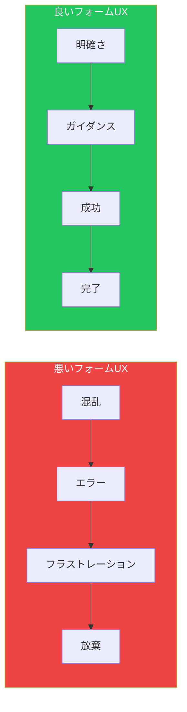
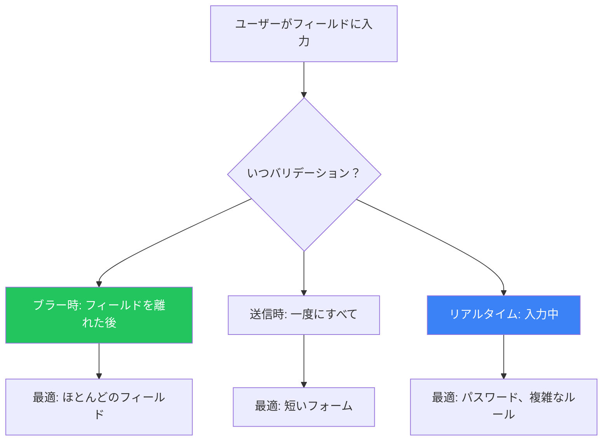

## はじめに

フォームはあらゆるアプリケーションにおける重要な接点です。ユーザーはフォームを通じてサインアップし、購入し、フィードバックを提供し、重要なタスクを完了します。しかしフォームはしばしばフラストレーションの原因となります。設計が不十分なフォームは、コンバージョン率とユーザー満足度を破壊する可能性があります。

この記事では、ユーザーが素早く正確に完了できるフォームを作成するための実証済みパターンを解説します。

## フォーム設計の課題

フォームは一見シンプルに見えます。数十年のフォーム設計例があり、UIフレームワークは既製のフォーム要素を提供しています。しかし、不十分なフォーム設計は以下につながります：

- サインアップやチェックアウトの放棄
- ユーザーのフラストレーションとサポート問い合わせ
- 無効なデータがシステムに入る
- アクセシビリティの障壁



## 必須のフォームパターン

### 1. 適切なデフォルトとスマート事前入力

可能な限りフィールドを事前入力し、ユーザーの労力を減らします。

```tsx
function ShippingForm({ user, recentOrders }) {
  // ユーザーデータに基づくスマートデフォルト
  const defaultValues = {
    // 保存された住所を使用
    address: user.savedAddress || '',
    city: user.savedCity || '',

    // ロケールから国を推測
    country: user.locale?.split('-')[1] || 'JP',

    // 最新の配送方法を使用
    shippingMethod: recentOrders[0]?.shippingMethod || 'standard',
  };

  return (
    <form>
      <Input
        name="address"
        label="住所"
        defaultValue={defaultValues.address}
      />
      <Input
        name="city"
        label="市区町村"
        defaultValue={defaultValues.city}
      />
      <Select
        name="country"
        label="国"
        defaultValue={defaultValues.country}
        options={countries}
      />
      <RadioGroup
        name="shippingMethod"
        label="配送方法"
        defaultValue={defaultValues.shippingMethod}
        options={shippingOptions}
      />
    </form>
  );
}
```

**デフォルト値を使用するタイミング：**

| シナリオ | デフォルト戦略 |
|---------|-------------|
| リピーター | 保存データから事前入力 |
| 位置情報フィールド | IP/ブラウザから検出 |
| 日付ピッカー | 今日の日付または論理的な開始日 |
| 数量 | 1（最も一般的） |
| 通貨 | ユーザーのロケールに基づく |
| 国コード | 位置情報に基づく |

### 2. 寛容なフォーマット

複数の形式で入力を受け付けます。期待する形式をユーザーに推測させないでください。

```tsx
function PhoneInput({ value, onChange }) {
  const normalizePhone = (input: string) => {
    // すべての非数字を除去
    const digits = input.replace(/\D/g, '');

    // 表示用にフォーマット
    if (digits.length <= 3) return digits;
    if (digits.length <= 7) return `${digits.slice(0, 3)}-${digits.slice(3)}`;
    return `${digits.slice(0, 3)}-${digits.slice(3, 7)}-${digits.slice(7, 11)}`;
  };

  return (
    <div>
      <label>電話番号</label>
      <input
        type="tel"
        value={value}
        onChange={(e) => onChange(normalizePhone(e.target.value))}
        placeholder="090-1234-5678"
      />
      <span className="text-sm text-gray-500">
        どの形式でも可: 09012345678, 090-1234-5678
      </span>
    </div>
  );
}

function DateInput({ value, onChange }) {
  const parseDate = (input: string) => {
    // 複数の形式を受け入れる
    const formats = [
      /^(\d{4})-(\d{2})-(\d{2})$/,     // 2024-01-15
      /^(\d{4})\/(\d{2})\/(\d{2})$/,   // 2024/01/15
      /^(\d{4})年(\d{1,2})月(\d{1,2})日$/, // 2024年1月15日
    ];

    for (const format of formats) {
      const match = input.match(format);
      if (match) {
        // 標準形式に変換
        return normalizeToISO(match);
      }
    }
    return input;
  };

  return (
    <input
      type="text"
      value={value}
      onChange={(e) => onChange(parseDate(e.target.value))}
      placeholder="日付を入力（任意の形式）"
    />
  );
}
```

### 3. 入力ヒントとプレースホルダー

有用なヒントでユーザーをガイドしますが、プレースホルダーだけに頼らないでください。

```tsx
function FormField({ label, hint, error, children }) {
  return (
    <div className="space-y-1">
      <label className="block font-medium text-gray-900">
        {label}
      </label>

      {/* ヒントは入力の上に表示して可視性を確保 */}
      {hint && (
        <p className="text-sm text-gray-500">{hint}</p>
      )}

      {children}

      {/* エラーは入力の下に表示 */}
      {error && (
        <p className="text-sm text-red-600" role="alert">
          {error}
        </p>
      )}
    </div>
  );
}

// 使用例
<FormField
  label="ユーザー名"
  hint="3〜20文字、英数字のみ"
  error={errors.username}
>
  <input
    name="username"
    placeholder="例: john_doe123"  // 例示、指示ではない
    className="w-full px-3 py-2 border rounded"
  />
</FormField>

<FormField
  label="パスワード"
  hint="8文字以上で、数字と特殊文字を各1つ以上含む"
>
  <input
    type="password"
    name="password"
    className="w-full px-3 py-2 border rounded"
  />
</FormField>
```

**ヒントのガイドライン：**

| すべきこと | すべきでないこと |
|----------|---------------|
| 入力前にフォーマット要件を表示 | エラーになるまで要件を隠す |
| プレースホルダーに例を使用 | プレースホルダーに指示を入れる |
| 入力中もヒントを表示し続ける | フォーカス時にヒントを消す |
| なぜその情報が必要か説明 | 文脈なしに尋ねる |

### 4. 構造化されたフォーマット

複雑な入力には、エラーを防ぐための構造を提供します。

```tsx
function CreditCardInput() {
  const [cardNumber, setCardNumber] = useState(['', '', '', '']);

  const handleChange = (index: number, value: string) => {
    const digits = value.replace(/\D/g, '').slice(0, 4);
    const newCardNumber = [...cardNumber];
    newCardNumber[index] = digits;
    setCardNumber(newCardNumber);

    // 次のフィールドに自動移動
    if (digits.length === 4 && index < 3) {
      document.getElementById(`card-${index + 1}`)?.focus();
    }
  };

  return (
    <div>
      <label className="block font-medium mb-2">カード番号</label>
      <div className="flex gap-2">
        {cardNumber.map((segment, index) => (
          <input
            key={index}
            id={`card-${index}`}
            type="text"
            inputMode="numeric"
            maxLength={4}
            value={segment}
            onChange={(e) => handleChange(index, e.target.value)}
            className="w-16 px-2 py-2 border rounded text-center"
            placeholder="••••"
          />
        ))}
      </div>
    </div>
  );
}

function ExpiryDateInput() {
  return (
    <div className="flex items-center gap-2">
      <select name="expiry-month" className="px-3 py-2 border rounded">
        <option value="">月</option>
        {Array.from({ length: 12 }, (_, i) => (
          <option key={i} value={String(i + 1).padStart(2, '0')}>
            {String(i + 1).padStart(2, '0')}
          </option>
        ))}
      </select>
      <span>/</span>
      <select name="expiry-year" className="px-3 py-2 border rounded">
        <option value="">年</option>
        {Array.from({ length: 10 }, (_, i) => {
          const year = new Date().getFullYear() + i;
          return (
            <option key={year} value={String(year).slice(-2)}>
              {String(year).slice(-2)}
            </option>
          );
        })}
      </select>
    </div>
  );
}
```

### 5. オートコンプリート

インテリジェントな提案でタイピングを減らし、タイプミスを防ぎます。

```tsx
function AddressAutocomplete({ onSelect }) {
  const [query, setQuery] = useState('');
  const [suggestions, setSuggestions] = useState([]);
  const [isOpen, setIsOpen] = useState(false);

  useEffect(() => {
    if (query.length < 3) {
      setSuggestions([]);
      return;
    }

    const timer = setTimeout(async () => {
      const results = await fetchAddressSuggestions(query);
      setSuggestions(results);
      setIsOpen(true);
    }, 300); // デバウンス

    return () => clearTimeout(timer);
  }, [query]);

  return (
    <div className="relative">
      <input
        type="text"
        value={query}
        onChange={(e) => setQuery(e.target.value)}
        onFocus={() => suggestions.length && setIsOpen(true)}
        placeholder="住所を入力してください..."
        className="w-full px-3 py-2 border rounded"
        aria-autocomplete="list"
        aria-expanded={isOpen}
      />

      {isOpen && suggestions.length > 0 && (
        <ul
          className="absolute z-10 w-full mt-1 bg-white border rounded shadow-lg
                     max-h-60 overflow-auto"
          role="listbox"
        >
          {suggestions.map((suggestion, index) => (
            <li
              key={index}
              onClick={() => {
                onSelect(suggestion);
                setQuery(suggestion.formatted);
                setIsOpen(false);
              }}
              className="px-3 py-2 cursor-pointer hover:bg-gray-100"
              role="option"
            >
              <div className="font-medium">{suggestion.primary}</div>
              <div className="text-sm text-gray-500">{suggestion.secondary}</div>
            </li>
          ))}
        </ul>
      )}
    </div>
  );
}
```

### 6. エラーメッセージ

ユーザーを成功に導く、具体的で有用なエラーメッセージを表示します。

```tsx
function validateEmail(email: string): string | null {
  if (!email) {
    return 'メールアドレスは必須です';
  }
  if (!email.includes('@')) {
    return 'メールアドレスに@を含めてください';
  }
  if (!email.match(/^[^\s@]+@[^\s@]+\.[^\s@]+$/)) {
    return '有効なメールアドレスを入力してください（例: name@example.com）';
  }
  return null;
}

function validatePassword(password: string): string | null {
  const issues = [];

  if (password.length < 8) {
    issues.push('8文字以上');
  }
  if (!/\d/.test(password)) {
    issues.push('数字1つ');
  }
  if (!/[!@#$%^&*]/.test(password)) {
    issues.push('特殊文字1つ（!@#$%^&*）');
  }

  if (issues.length > 0) {
    return `パスワードには${issues.join('、')}が必要です`;
  }
  return null;
}

function FormInput({ name, label, validate, type = 'text' }) {
  const [value, setValue] = useState('');
  const [error, setError] = useState<string | null>(null);
  const [touched, setTouched] = useState(false);

  const handleBlur = () => {
    setTouched(true);
    setError(validate(value));
  };

  return (
    <div className="space-y-1">
      <label className="block font-medium">{label}</label>
      <input
        type={type}
        name={name}
        value={value}
        onChange={(e) => {
          setValue(e.target.value);
          // 入力中はエラーをクリア
          if (error) setError(null);
        }}
        onBlur={handleBlur}
        className={`
          w-full px-3 py-2 border rounded transition
          ${touched && error
            ? 'border-red-500 bg-red-50'
            : 'border-gray-300'
          }
        `}
        aria-invalid={touched && !!error}
        aria-describedby={error ? `${name}-error` : undefined}
      />
      {touched && error && (
        <p
          id={`${name}-error`}
          className="text-sm text-red-600 flex items-center gap-1"
          role="alert"
        >
          <span aria-hidden="true">⚠</span>
          {error}
        </p>
      )}
    </div>
  );
}
```

**エラーメッセージのガイドライン：**

| 悪い例 | 良い例 |
|-------|-------|
| 「無効な入力」 | 「有効なメールアドレスを入力してください（例: name@example.com）」 |
| 「エラー」 | 「パスワードは8文字以上必要です」 |
| 「必須項目」 | 「続行するにはお名前を入力してください」 |
| 「形式エラー」 | 「電話番号は10〜11桁で入力してください」 |

### 7. パスワード強度メーター

パスワードの品質についてリアルタイムでフィードバックを提供します。

```tsx
function PasswordStrengthMeter({ password }) {
  const getStrength = (pwd: string) => {
    let score = 0;
    if (pwd.length >= 8) score++;
    if (pwd.length >= 12) score++;
    if (/[a-z]/.test(pwd) && /[A-Z]/.test(pwd)) score++;
    if (/\d/.test(pwd)) score++;
    if (/[^a-zA-Z0-9]/.test(pwd)) score++;
    return score;
  };

  const strength = getStrength(password);
  const levels = ['非常に弱い', '弱い', '普通', '良い', '強い'];
  const colors = ['bg-red-500', 'bg-orange-500', 'bg-yellow-500', 'bg-blue-500', 'bg-green-500'];

  return (
    <div className="mt-2">
      {/* 視覚的なバー */}
      <div className="flex gap-1">
        {[0, 1, 2, 3, 4].map((index) => (
          <div
            key={index}
            className={`
              h-1 flex-1 rounded
              ${index < strength ? colors[strength - 1] : 'bg-gray-200'}
            `}
          />
        ))}
      </div>

      {/* テキストラベル */}
      {password && (
        <p className={`text-sm mt-1 ${
          strength <= 2 ? 'text-red-600' : 'text-green-600'
        }`}>
          {levels[strength - 1] || '非常に弱い'}
        </p>
      )}

      {/* 要件チェックリスト */}
      <ul className="mt-2 text-sm space-y-1">
        <Requirement met={password.length >= 8}>
          8文字以上
        </Requirement>
        <Requirement met={/[A-Z]/.test(password)}>
          大文字1つ
        </Requirement>
        <Requirement met={/[a-z]/.test(password)}>
          小文字1つ
        </Requirement>
        <Requirement met={/\d/.test(password)}>
          数字1つ
        </Requirement>
        <Requirement met={/[^a-zA-Z0-9]/.test(password)}>
          特殊文字1つ
        </Requirement>
      </ul>
    </div>
  );
}

function Requirement({ met, children }) {
  return (
    <li className={`flex items-center gap-2 ${met ? 'text-green-600' : 'text-gray-500'}`}>
      <span>{met ? '✓' : '○'}</span>
      {children}
    </li>
  );
}
```

## フォームレイアウトのベストプラクティス

### シングルカラムレイアウト

シングルカラムのフォームはスキャンしやすく、完了しやすいです。

```tsx
function RegistrationForm() {
  return (
    <form className="max-w-md mx-auto space-y-6">
      {/* シングルカラム、論理的な順序 */}
      <FormField label="氏名" name="name" />
      <FormField label="メールアドレス" name="email" type="email" />
      <FormField label="パスワード" name="password" type="password" />
      <FormField label="パスワード確認" name="confirmPassword" type="password" />

      <button type="submit" className="w-full btn-primary">
        アカウント作成
      </button>
    </form>
  );
}
```

### 関連フィールドをグループ化

```tsx
function CheckoutForm() {
  return (
    <form className="space-y-8">
      {/* 連絡先グループ */}
      <fieldset>
        <legend className="text-lg font-semibold mb-4">
          連絡先情報
        </legend>
        <div className="space-y-4">
          <FormField label="メールアドレス" name="email" />
          <FormField label="電話番号" name="phone" />
        </div>
      </fieldset>

      {/* 配送先グループ */}
      <fieldset>
        <legend className="text-lg font-semibold mb-4">
          配送先住所
        </legend>
        <div className="space-y-4">
          <FormField label="住所" name="address" />
          <div className="grid grid-cols-2 gap-4">
            <FormField label="市区町村" name="city" />
            <FormField label="郵便番号" name="postalCode" />
          </div>
        </div>
      </fieldset>

      {/* 支払いグループ */}
      <fieldset>
        <legend className="text-lg font-semibold mb-4">
          支払い情報
        </legend>
        <div className="space-y-4">
          <FormField label="カード番号" name="cardNumber" />
          <div className="grid grid-cols-2 gap-4">
            <FormField label="有効期限" name="expiry" />
            <FormField label="セキュリティコード" name="cvv" />
          </div>
        </div>
      </fieldset>
    </form>
  );
}
```

## フォームバリデーションのタイミング



```tsx
function SmartValidationForm() {
  return (
    <form>
      {/* リアルタイム: パスワードは即時フィードバックが必要 */}
      <PasswordField validateOnChange />

      {/* ブラー時: メールはフィールドを離れた時にバリデーション */}
      <EmailField validateOnBlur />

      {/* 送信時: オプションフィールドは最後にバリデーション */}
      <OptionalField validateOnSubmit />
    </form>
  );
}
```

## まとめ

| パターン | 目的 | 主なメリット |
|---------|-----|------------|
| 適切なデフォルト | 既知の値を事前入力 | タイピングを削減 |
| 寛容なフォーマット | 複数の入力形式を受け入れる | フォーマットエラーを防止 |
| 入力ヒント | 期待する入力をガイド | 混乱を軽減 |
| 構造化フォーマット | 複雑な入力を部品に分割 | エラーを防止 |
| オートコンプリート | 有効な値を提案 | 完了を高速化 |
| エラーメッセージ | 何が間違ったか説明 | 成功へ導く |
| パスワードメーター | パスワード品質を表示 | リアルタイムフィードバック |

フォーム設計の目標は、完了を楽にすることです。すべてのフィールドはその存在を正当化し、すべてのインタラクションは自然に感じられ、すべてのエラーは回復可能であるべきです。

## 参考文献

- Tidwell, Jenifer, et al. "Designing Interfaces" (3rd Edition), Chapter 10
- Luke Wroblewski. "Web Form Design"
- Nielsen Norman Group - Form Design Guidelines
- Baymard Institute - Checkout UX Research
