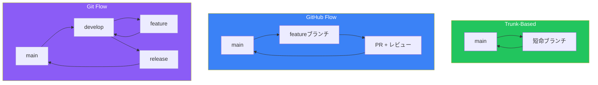
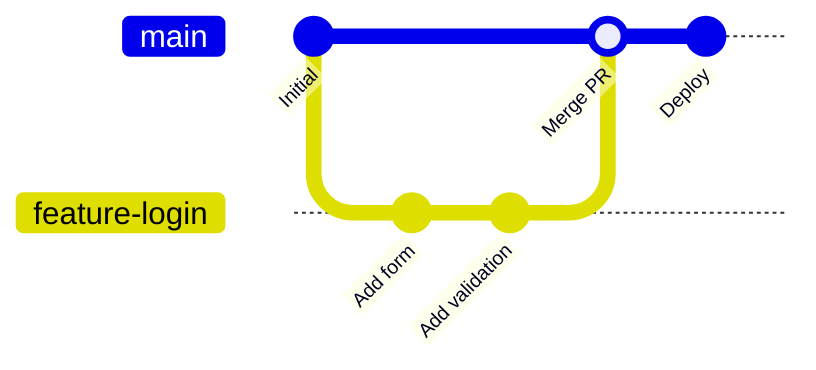
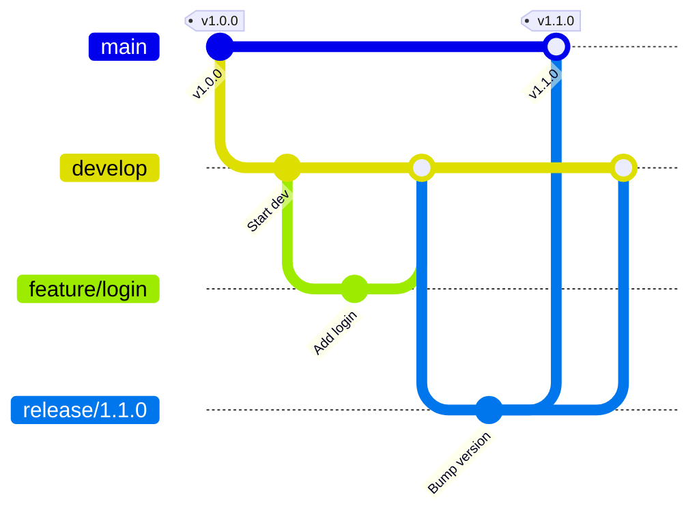
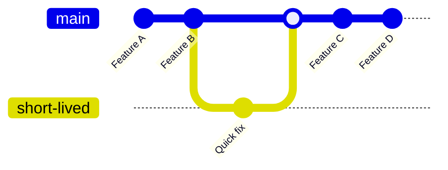
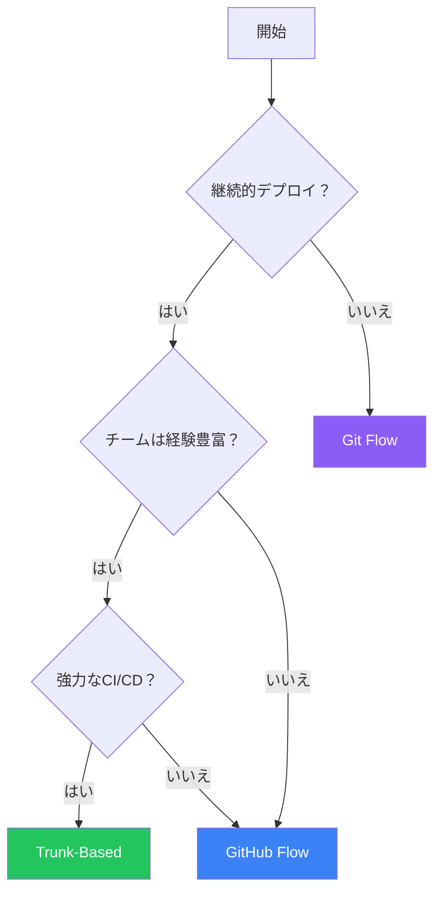
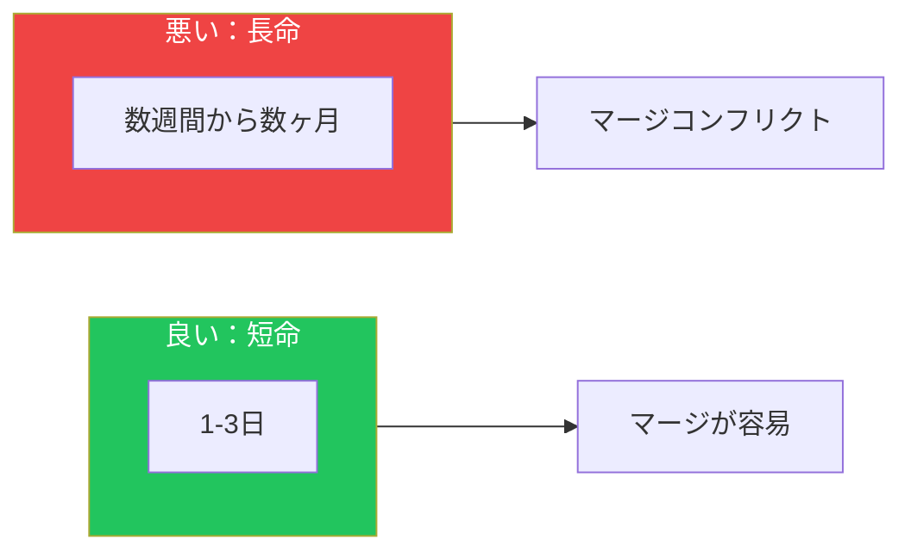

## はじめに

ブランチ戦略は、チームがコード変更をどのように整理し、協力し、ソフトウェアをリリースするかを定義します。適切な戦略は、チームの規模、リリース頻度、プロジェクトの複雑さによって異なります。

この記事では、最も人気のある3つの戦略を比較し、適切なものを選ぶ手助けをします。

## 3つの主要な戦略



## GitHub Flow

### 概要

GitHub Flowは、継続的デプロイに最適なシンプルで軽量なワークフローです：



### プロセス

1. `main`から**ブランチを作成**
2. 説明的なコミットで**変更を加える**
3. 議論のために**Pull Requestを開く**
4. コードを**レビューして議論**
5. ブランチからテスト用に**デプロイ**（オプション）
6. 承認後に`main`へ**マージ**
7. 本番環境に**デプロイ**

### GitHub Flowを使うべき場合

| 適している | 向いていない |
|----------|-------------|
| 継続的デプロイ | 定期リリース |
| 小〜中規模チーム | 複数バージョンの本番運用 |
| Webアプリケーション | ストア審査のあるモバイルアプリ |
| SaaS製品 | 規制環境 |

### 実装

```yaml
# ブランチ命名規則
feature/user-authentication
fix/login-validation-bug
docs/api-endpoints
refactor/database-queries
```

```yaml
# .github/workflows/github-flow.yml
name: GitHub Flow CI/CD

on:
  push:
    branches: [main]
  pull_request:
    branches: [main]

jobs:
  test:
    runs-on: ubuntu-latest
    steps:
      - uses: actions/checkout@v4
      - run: npm test

  deploy:
    if: github.ref == 'refs/heads/main'
    needs: test
    runs-on: ubuntu-latest
    steps:
      - uses: actions/checkout@v4
      - run: ./deploy.sh
```

## Git Flow

### 概要

Git Flowは、定期リリース向けのより構造化されたワークフローです：



### ブランチの種類

| ブランチ | 目的 | 寿命 |
|--------|------|------|
| `main` | 本番対応コード | 永続 |
| `develop` | 統合ブランチ | 永続 |
| `feature/*` | 新機能 | マージまで |
| `release/*` | リリース準備 | リリースまで |
| `hotfix/*` | 本番修正 | マージまで |

### プロセス

1. `develop`から`feature/`ブランチで**開発**
2. PRで`develop`に**機能をマージ**
3. 準備ができたら`develop`から**リリースブランチを作成**
4. **リリースを確定**（バージョン更新、変更履歴）
5. `main`と`develop`の両方に**リリースをマージ**
6. `main`でリリースに**タグ付け**
7. 必要に応じて`main`から**ホットフィックス**、両方にマージバック

### Git Flowを使うべき場合

| 適している | 向いていない |
|----------|-------------|
| 定期リリース | 継続的デプロイ |
| 複数バージョン | 高速イテレーション |
| 大規模チーム | 小規模チーム |
| バージョン付きオープンソース | SaaS製品 |

### 実装

```bash
# Git Flowの初期化
git flow init

# 機能の開始
git flow feature start user-authentication

# 機能の終了
git flow feature finish user-authentication

# リリースの開始
git flow release start 1.2.0

# リリースの終了
git flow release finish 1.2.0

# ホットフィックス
git flow hotfix start 1.2.1
git flow hotfix finish 1.2.1
```

### ワークフロー設定

```yaml
# .github/workflows/git-flow.yml
name: Git Flow CI

on:
  push:
    branches: [main, develop, 'release/**', 'hotfix/**']
  pull_request:
    branches: [develop]

jobs:
  test:
    runs-on: ubuntu-latest
    steps:
      - uses: actions/checkout@v4
      - run: npm test

  release:
    if: startsWith(github.ref, 'refs/heads/release/')
    needs: test
    runs-on: ubuntu-latest
    steps:
      - uses: actions/checkout@v4
      - run: npm run build
      - run: ./deploy-staging.sh

  production:
    if: github.ref == 'refs/heads/main'
    needs: test
    runs-on: ubuntu-latest
    steps:
      - uses: actions/checkout@v4
      - run: npm run build
      - run: ./deploy-production.sh
```

## Trunk-Based Development

### 概要

Trunk-Based Developmentは、メインブランチへの小さく頻繁なコミットを重視します：



### 主要な原則

1. **短命ブランチ**（理想的には1日未満）
2. 未完成の機能には**フィーチャーフラグ**
3. 高速フィードバックの**継続的インテグレーション**
4. mainへの**小さく頻繁なコミット**

### Trunk-Basedを使うべき場合

| 適している | 向いていない |
|----------|-------------|
| 高パフォーマンスチーム | 経験の浅いチーム |
| 継続的デプロイ | 規制されたリリース |
| 強力なCI/CD | テストカバレッジが弱い |
| 経験豊富な開発者 | ジュニア中心のチーム |

### フィーチャーフラグ

Trunk-Based開発には不可欠：

```typescript
// フィーチャーフラグの実装
const features = {
  newCheckout: process.env.FEATURE_NEW_CHECKOUT === 'true',
  darkMode: process.env.FEATURE_DARK_MODE === 'true',
};

function CheckoutPage() {
  if (features.newCheckout) {
    return <NewCheckout />;
  }
  return <LegacyCheckout />;
}
```

### 実装

```yaml
# .github/workflows/trunk-based.yml
name: Trunk-Based CI

on:
  push:
    branches: [main]

jobs:
  # 高速フィードバックが重要
  quick-check:
    runs-on: ubuntu-latest
    timeout-minutes: 5
    steps:
      - uses: actions/checkout@v4
      - run: npm run lint
      - run: npm run test:unit

  # 継続的にデプロイ
  deploy:
    needs: quick-check
    runs-on: ubuntu-latest
    steps:
      - uses: actions/checkout@v4
      - run: npm run build
      - run: ./deploy.sh
```

## 比較マトリックス

| 観点 | GitHub Flow | Git Flow | Trunk-Based |
|-----|-------------|----------|-------------|
| **複雑さ** | 低 | 高 | 中 |
| **リリース頻度** | 継続的 | 定期 | 継続的 |
| **mainブランチ** | 常にデプロイ可能 | 本番 | 常にデプロイ可能 |
| **featureブランチ** | あり | あり | 最小限 |
| **releaseブランチ** | なし | あり | なし |
| **ホットフィックス** | 修正 → main | hotfix → main + develop | 修正 → main |
| **最適な用途** | Webアプリ | バージョン管理ソフト | 高速チーム |

## 適切な戦略の選択

### 決定フローチャート



### チーム規模別

| チーム規模 | 推奨 | 理由 |
|----------|------|------|
| 1-3人 | Trunk-BasedまたはGitHub Flow | オーバーヘッドが少ない |
| 4-10人 | GitHub Flow | 構造と速度のバランス |
| 10人以上 | Git FlowまたはGitHub Flow | より多くの調整が必要 |

### リリースタイプ別

| リリースタイプ | 推奨 | 理由 |
|--------------|------|------|
| 継続的（SaaS） | GitHub FlowまたはTrunk-Based | 高速イテレーション |
| 定期（月次） | Git Flow | リリース準備時間 |
| 複数バージョン | Git Flow | バージョンブランチサポート |
| モバイルアプリ | Git Flow | アプリストア審査時間 |

## ブランチ命名規則

### 一貫した命名

```
# 機能ブランチ
feature/TICKET-123-user-authentication
feature/add-payment-gateway

# バグ修正
fix/TICKET-456-login-error
bugfix/null-pointer-exception

# リリース（Git Flow）
release/1.2.0
release/2.0.0-beta

# ホットフィックス
hotfix/1.2.1
hotfix/security-patch

# その他
docs/api-documentation
refactor/database-layer
test/integration-tests
```

### ブランチルールによる自動化

```yaml
# .github/workflows/branch-naming.yml
name: Branch Naming Check

on:
  pull_request:

jobs:
  check-branch-name:
    runs-on: ubuntu-latest
    steps:
      - name: Check branch name
        run: |
          BRANCH="${{ github.head_ref }}"
          PATTERN="^(feature|fix|bugfix|hotfix|release|docs|refactor|test)/.+"
          if [[ ! $BRANCH =~ $PATTERN ]]; then
            echo "Branch name '$BRANCH' doesn't match pattern"
            exit 1
          fi
```

## ベストプラクティス

### 1. ブランチを短命に保つ



### 2. メインブランチを保護

```yaml
# ブランチ保護ルール
- プルリクエストレビューを必須
- ステータスチェックの通過を必須
- 線形履歴を必須（オプション）
- プッシュ可能者を制限
- 署名付きコミットを必須（オプション）
```

### 3. すべてを自動化

- PRでリンティング
- PRでテスト
- デプロイプレビュー
- 承認後の自動マージ

### 4. 戦略をドキュメント化

`CONTRIBUTING.md`を作成：

```markdown
## ブランチ戦略

GitHub Flowを使用しています：

1. `main`からfeatureブランチを作成
2. 変更を加える
3. レビュー用にPRを開く
4. 承認後にマージ
5. 変更は自動的にデプロイ

### ブランチ命名

- `feature/説明` - 新機能
- `fix/説明` - バグ修正
- `docs/説明` - ドキュメント
```

## まとめ

| 戦略 | 最適な用途 | 避けるべき場合 |
|-----|----------|--------------|
| **GitHub Flow** | Webアプリ、SaaS、継続的デプロイ | バージョン付きリリースが必要 |
| **Git Flow** | バージョン管理ソフト、定期リリース | 継続的にデプロイする |
| **Trunk-Based** | 経験豊富なチーム、高速イテレーション | 経験やCI/CDが不足 |

チームのニーズに合った戦略を選び、成長に合わせて反復してください。最良の戦略は、チームが一貫して従うものです。

## 参考資料

- O'Reilly - Version Control with Git, Chapter 18
- Packt - DevOps Unleashed with Git and GitHub, Chapter 3
- Atlassian - Git Workflows
- trunk-baseddevelopment.com
