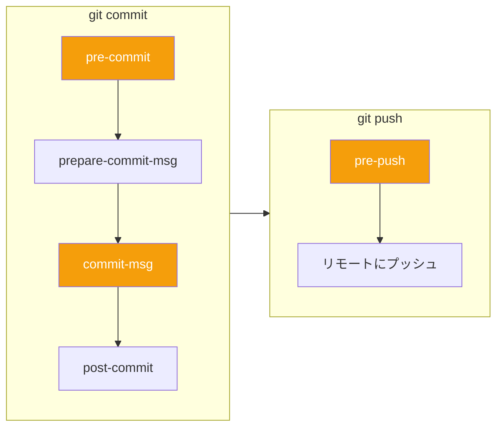

## はじめに

Git hooksは、Gitワークフローの特定のポイントで自動的に実行されるスクリプトです。コード品質の強制、コミットの検証、反復的なタスクの自動化を、コードがリポジトリに到達する前に行うことができます。

この記事では、プロジェクトでGit hooksを効果的に使用する方法を解説します。

## Git Hooksの動作



## 利用可能なフック

### クライアントサイドフック

| フック | トリガー | 一般的な用途 |
|-------|---------|------------|
| `pre-commit` | コミット作成前 | リント、フォーマット、テスト |
| `prepare-commit-msg` | エディタが開く前 | テンプレートメッセージ |
| `commit-msg` | メッセージ入力後 | フォーマット検証 |
| `post-commit` | コミット作成後 | 通知 |
| `pre-push` | リモートへのプッシュ前 | フルテストスイート |
| `pre-rebase` | リベース開始前 | 特定ブランチでの防止 |

### サーバーサイドフック

| フック | トリガー | 一般的な用途 |
|-------|---------|------------|
| `pre-receive` | プッシュ受け入れ前 | 全コミットの検証 |
| `update` | 各ref更新前 | ブランチ別ポリシー |
| `post-receive` | プッシュ受け入れ後 | デプロイ、通知 |

## 基本的なフックの作成

### フックの場所

フックは`.git/hooks/`に配置されます：

```bash
ls .git/hooks/
# applypatch-msg.sample  pre-push.sample
# commit-msg.sample      pre-rebase.sample
# post-update.sample     prepare-commit-msg.sample
# pre-applypatch.sample  update.sample
# pre-commit.sample
```

### シンプルなpre-commitフック

```bash
#!/bin/sh
# .git/hooks/pre-commit

# リンティングを実行
npm run lint
if [ $? -ne 0 ]; then
    echo "リンティングが失敗しました。コミット前にエラーを修正してください。"
    exit 1
fi

# テストを実行
npm test
if [ $? -ne 0 ]; then
    echo "テストが失敗しました。コミット前に修正してください。"
    exit 1
fi

exit 0
```

実行可能にします：

```bash
chmod +x .git/hooks/pre-commit
```

### コミットメッセージの検証

```bash
#!/bin/sh
# .git/hooks/commit-msg

commit_msg_file=$1
commit_msg=$(cat "$commit_msg_file")

# Conventional Commit形式をチェック
pattern="^(feat|fix|docs|style|refactor|test|chore)(\(.+\))?: .{1,50}"

if ! echo "$commit_msg" | grep -qE "$pattern"; then
    echo "エラー: コミットメッセージがConventional形式に従っていません。"
    echo "期待される形式: <type>(<scope>): <subject>"
    echo "例: feat(auth): add login functionality"
    exit 1
fi

exit 0
```

## Huskyの使用（推奨）

HuskyはGit hooksの管理を簡単にし、チーム間で共有できるようにします。

### インストール

```bash
npm install husky --save-dev
npx husky init
```

これにより`.husky/`ディレクトリが作成されます：

```
.husky/
├── _/
│   └── husky.sh
└── pre-commit
```

### pre-commitフックの設定

```bash
# .husky/pre-commit
npm run lint
npm test
```

### commit-msgフックの設定

```bash
npx husky add .husky/commit-msg 'npx commitlint --edit $1'
```

```bash
# .husky/commit-msg
npx commitlint --edit $1
```

### pre-pushフックの設定

```bash
npx husky add .husky/pre-push 'npm run test:e2e'
```

## lint-staged：ステージされたファイルのみにリンターを実行

すべてのファイルでリンターを実行すると遅くなります。lint-stagedはステージされたファイルのみに実行します。

### インストール

```bash
npm install lint-staged --save-dev
```

### 設定

```json
// package.json
{
  "lint-staged": {
    "*.{js,jsx,ts,tsx}": [
      "eslint --fix",
      "prettier --write"
    ],
    "*.{css,scss}": [
      "stylelint --fix"
    ],
    "*.{json,md}": [
      "prettier --write"
    ]
  }
}
```

### Huskyとの連携

```bash
# .husky/pre-commit
npx lint-staged
```

## commitlint：コミットメッセージ規約の強制

### インストール

```bash
npm install @commitlint/cli @commitlint/config-conventional --save-dev
```

### 設定

```javascript
// commitlint.config.js
module.exports = {
  extends: ['@commitlint/config-conventional'],
  rules: {
    'type-enum': [
      2,
      'always',
      [
        'feat',     // 新機能
        'fix',      // バグ修正
        'docs',     // ドキュメント
        'style',    // フォーマット
        'refactor', // リファクタリング
        'test',     // テスト
        'chore',    // メンテナンス
        'perf',     // パフォーマンス
        'ci',       // CI変更
        'build',    // ビルド変更
        'revert'    // コミット取り消し
      ]
    ],
    'subject-max-length': [2, 'always', 72],
    'body-max-line-length': [2, 'always', 100]
  }
};
```

### コミット形式

```
<type>(<scope>): <subject>

<body>

<footer>
```

例：

```
feat(auth): add Google OAuth login

Implement Google OAuth 2.0 authentication flow.
Users can now sign in with their Google accounts.

Closes #123
```

```
fix(api): handle null response from payment gateway

The payment gateway sometimes returns null for declined cards.
Added null check to prevent crashes.

Fixes #456
```

## 完全なセットアップ例

### package.json

```json
{
  "name": "my-project",
  "scripts": {
    "lint": "eslint src/",
    "format": "prettier --write src/",
    "test": "jest",
    "test:e2e": "cypress run",
    "prepare": "husky"
  },
  "devDependencies": {
    "husky": "^9.0.0",
    "lint-staged": "^15.0.0",
    "@commitlint/cli": "^18.0.0",
    "@commitlint/config-conventional": "^18.0.0",
    "eslint": "^8.0.0",
    "prettier": "^3.0.0"
  },
  "lint-staged": {
    "*.{js,ts,tsx}": ["eslint --fix", "prettier --write"],
    "*.{json,md,yml}": ["prettier --write"]
  }
}
```

### Huskyフック

```bash
# .husky/pre-commit
npx lint-staged

# .husky/commit-msg
npx commitlint --edit $1

# .husky/pre-push
npm run test
```

## 高度なフックの例

### 保護ブランチへのコミット防止

```bash
#!/bin/sh
# .husky/pre-commit

branch=$(git symbolic-ref --short HEAD)
protected_branches="main master develop"

for protected in $protected_branches; do
    if [ "$branch" = "$protected" ]; then
        echo "エラー: $branchへの直接コミットは許可されていません。"
        echo "featureブランチを作成してください。"
        exit 1
    fi
done

npx lint-staged
```

### シークレットのチェック

```bash
#!/bin/sh
# .husky/pre-commit

# 潜在的なシークレットをチェック
if git diff --cached --name-only | xargs grep -l -E "(api[_-]?key|password|secret|token|private[_-]?key)" 2>/dev/null; then
    echo "警告: ステージされたファイルにシークレットの可能性があります。"
    echo "コミット前に確認してください。"
    read -p "それでも続行しますか？ (y/n) " answer
    if [ "$answer" != "y" ]; then
        exit 1
    fi
fi

npx lint-staged
```

### ファイルに基づいて異なるチェックを実行

```bash
#!/bin/sh
# .husky/pre-commit

# ステージされたファイルのリストを取得
staged_files=$(git diff --cached --name-only)

# TypeScriptファイルが変更されたかチェック
if echo "$staged_files" | grep -q '\.tsx\?$'; then
    echo "TypeScriptファイルが変更されました。型チェックを実行..."
    npx tsc --noEmit
fi

# テストファイルが変更されたかチェック
if echo "$staged_files" | grep -q '\.test\.[jt]sx\?$'; then
    echo "テストファイルが変更されました。テストを実行..."
    npm test
fi

npx lint-staged
```

### Issue番号をコミットに追加

```bash
#!/bin/sh
# .husky/prepare-commit-msg

commit_msg_file=$1
branch=$(git symbolic-ref --short HEAD)

# ブランチ名からissue番号を抽出（例：feature/PROJ-123-description）
issue=$(echo "$branch" | grep -oE '[A-Z]+-[0-9]+')

if [ -n "$issue" ]; then
    # コミットメッセージの先頭にissue番号を追加
    sed -i.bak "1s/^/[$issue] /" "$commit_msg_file"
fi
```

## チーム間でのフック共有

### 問題：.git/hooksは追跡されない

`.git/hooks/`内のフックはバージョン管理されません。

### 解決策1：Husky（推奨）

Huskyは追跡される`.husky/`にフックを保存します：

```
.husky/
├── pre-commit
├── commit-msg
└── pre-push
```

### 解決策2：カスタムフックディレクトリ

```bash
# カスタムフックパスを設定
git config core.hooksPath .githooks

# または.gitconfigですべてのリポジトリに
[core]
    hooksPath = ~/.git-hooks
```

### 解決策3：npm postinstall

```json
{
  "scripts": {
    "postinstall": "cp -r hooks/* .git/hooks/ && chmod +x .git/hooks/*"
  }
}
```

## フックのバイパス

時にはフックをスキップする必要があります：

```bash
# pre-commitとcommit-msgフックをスキップ
git commit --no-verify -m "WIP: temporary commit"

# pre-pushフックをスキップ
git push --no-verify
```

必要な場合にのみ控えめに使用してください。

## トラブルシューティング

### フックが実行されない

```bash
# フックが実行可能かチェック
ls -la .git/hooks/pre-commit

# 実行可能にする
chmod +x .git/hooks/pre-commit
```

### フックがサイレントに失敗

```bash
# デバッグを追加
#!/bin/sh
set -x  # コマンドを実行時に出力
set -e  # エラー時に終了
```

### Windowsの改行コード

```bash
# Windowsでフックが失敗する場合、改行コードを確認
# CRLFではなくLFであるべき
```

## まとめ

| ツール | 目的 |
|-------|------|
| **Git hooks** | Gitイベントでスクリプトを実行 |
| **Husky** | フックを管理、チームと共有 |
| **lint-staged** | ステージされたファイルのみにリンター実行 |
| **commitlint** | コミットメッセージ形式を強制 |

Git hooksは問題がリポジトリに到達する前にキャッチし、時間を節約してコード品質を維持します。

## 参考資料

- O'Reilly - Version Control with Git, Chapter 14
- Git Documentation - Git Hooks
- Husky Documentation
- Conventional Commits Specification
