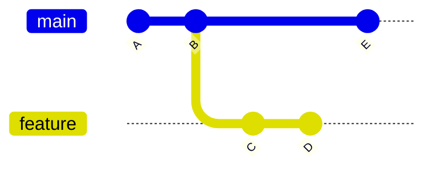
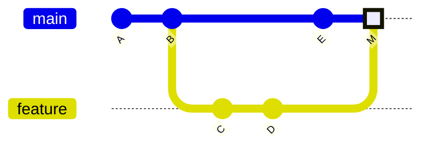
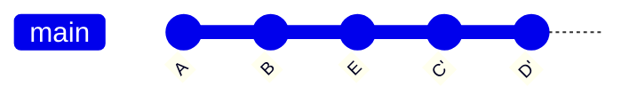
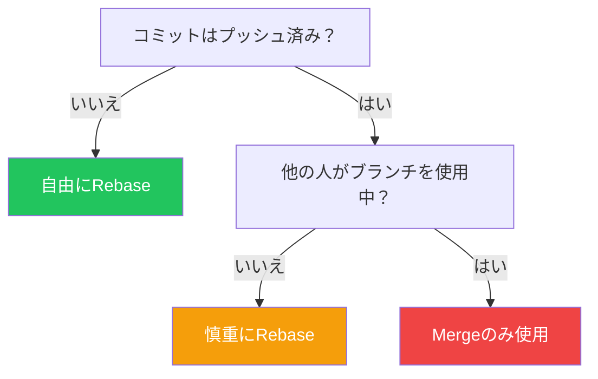

## はじめに

`git merge`と`git rebase`はどちらも一方のブランチから別のブランチに変更を統合しますが、根本的に異なる方法で行います。それぞれをいつ使うべきかを理解することは、クリーンで有用なGit履歴を維持するために不可欠です。

この記事では、両者の違い、ユースケース、ベストプラクティスを説明します。

## 根本的な違い



### Merge後



### Rebase + Fast-Forward後



## Git Merge

### 動作原理

Mergeは2つのブランチを組み合わせる新しいコミットを作成します：

```bash
# featureブランチでmainをマージ
git checkout feature
git merge main

# またはfeatureをmainにマージ
git checkout main
git merge feature
```

### Mergeの種類

| 種類 | 条件 | 結果 |
|-----|------|------|
| **Fast-forward** | 分岐なし | 線形履歴 |
| **Three-way** | ブランチが分岐 | マージコミット |
| **Squash** | コミットを結合 | 単一の新しいコミット |

### Fast-Forward Merge

```bash
# featureがmainより先に進んでいて分岐がない場合
git checkout main
git merge feature
# マージコミットは作成されない
```

### Three-Way Merge

```bash
# 両方のブランチに新しいコミットがある場合
git checkout main
git merge feature
# マージコミットが作成される
```

### Squash Merge

```bash
# featureのすべてのコミットを1つに結合
git checkout main
git merge --squash feature
git commit -m "Add feature X"
```

## Git Rebase

### 動作原理

Rebaseはあなたのコミットを別のブランチの上に再適用します：

```bash
# featureブランチでmainにrebase
git checkout feature
git rebase main
```

### 何が起こるか

1. Gitが共通の祖先を見つける
2. あなたのコミットをパッチとして保存
3. ターゲットブランチにリセット
4. あなたのコミットを1つずつ適用

```bash
# rebase前
main:    A - B - E
feature: A - B - C - D

# rebase後
main:    A - B - E
feature: A - B - E - C' - D'
```

### Interactive Rebase

コミットを修正、結合、または並べ替え：

```bash
git rebase -i HEAD~3
# または
git rebase -i main
```

エディタで：

```
pick abc123 Add login form
squash def456 Fix typo in login
pick ghi789 Add validation

# コマンド:
# p, pick = コミットを使用
# r, reword = コミットを使用するがメッセージを編集
# e, edit = コミットを使用するが修正のために停止
# s, squash = コミットを使用するが前のものに統合
# f, fixup = squashと同様だがメッセージを破棄
# d, drop = コミットを削除
```

## 比較

| 観点 | Merge | Rebase |
|-----|-------|--------|
| **履歴** | 完全な履歴を保持 | 線形履歴を作成 |
| **マージコミット** | あり（three-wayの場合） | なし |
| **元のコミット** | 保持される | 書き換えられる（新しいSHA） |
| **共有ブランチに安全** | はい | いいえ |
| **コンフリクト解決** | 1回 | コミットごと |

## Mergeを使うべき時

### 1. 共有ブランチの統合

```bash
# 共有ブランチをfeatureにマージ
git checkout feature
git merge main

# 安全：履歴を書き換えない
```

### 2. 履歴の保持

```bash
# 機能がいつ統合されたかを追跡する必要がある場合
git merge --no-ff feature
# 常にマージコミットを作成
```

### 3. プルリクエストの完了

```bash
# GitHub/GitLabのデフォルト動作
# トレーサビリティのためにマージコミットを作成
```

### マージコミットメッセージ

```
Merge branch 'feature/user-auth' into main

* feature/user-auth:
  Add password validation
  Implement login form
  Create user model
```

## Rebaseを使うべき時

### 1. featureブランチの更新

```bash
# PR前にmainから最新の変更を取得
git checkout feature
git rebase main
git push --force-with-lease
```

### 2. ローカルコミットの整理

```bash
# プッシュ前にWIPコミットをsquash
git rebase -i HEAD~5
```

### 3. 線形履歴の維持

```bash
# 線形履歴を好むプロジェクト向け
git checkout main
git rebase feature
# その後fast-forwardマージ
```

## ゴールデンルール

**共有ブランチにプッシュされたコミットは決してrebaseしない。**



## コンフリクトの処理

### Mergeのコンフリクト

```bash
git merge feature
# CONFLICT in file.txt

# file.txtを編集して解決
git add file.txt
git commit  # マージを完了
```

### Rebaseのコンフリクト

```bash
git rebase main
# CONFLICT in file.txt

# file.txtを編集して解決
git add file.txt
git rebase --continue  # 次のコミットへ

# または完全に中止
git rebase --abort
```

### コンフリクトマーカー

```
<<<<<<< HEAD
現在のブランチの内容
=======
入ってくるブランチの内容
>>>>>>> feature
```

## 実践的なワークフロー

### ワークフロー1: Merge前にRebase

```bash
# 1. featureを最新のmainで更新
git checkout feature
git fetch origin
git rebase origin/main

# 2. 更新したブランチをプッシュ
git push --force-with-lease

# 3. PRを作成またはマージ
git checkout main
git merge feature
```

### ワークフロー2: Squash and Merge

```bash
# GitHub PRでよく使われる
# PRのすべてのコミットを1つに結合
git checkout main
git merge --squash feature
git commit -m "Add user authentication (#123)"
```

### ワークフロー3: クリーンな履歴のためのInteractive Rebase

```bash
# PR作成前にコミットを整理
git rebase -i main

# エディタで:
pick abc123 Add user model
squash def456 WIP: user model
squash ghi789 Fix user model typo
pick jkl012 Add authentication service
fixup mno345 Fix auth bug

# 結果: クリーンで論理的なコミット
```

## 安全にForce Push

rebaseすると、force pushが必要になります：

```bash
# 危険: チェックなしでリモートを上書き
git push --force

# 安全: リモートに新しいコミットがあると失敗
git push --force-with-lease

# より安全: 期待するリモート状態を指定
git push --force-with-lease=origin/feature
```

## Rebase戦略

### マージコミットの保持

```bash
# rebase中にマージコミットを保持
git rebase --rebase-merges main
```

### Autosquash

```bash
# squash用にコミットをマーク
git commit --fixup=abc123
git commit --squash=def456

# interactive rebaseで自動配置
git rebase -i --autosquash main
```

## ベストプラクティス

### 1. チームの規約を確立

チームのアプローチをドキュメント化：

```markdown
## Gitワークフロー

### featureブランチ
- PR作成前にmainにrebase
- WIPコミットをinteractive rebaseでsquash

### プルリクエスト
- 単一の論理的な変更にはsquash mergeを使用
- 大きな機能にはmerge commitを使用

### 禁止事項
- mainやdevelopにforce push
- 共有ブランチをrebase
```

### 2. コミットを小さく焦点を絞って

```bash
# 良い: 各コミットがアトミック
git commit -m "Add User model"
git commit -m "Add UserRepository"
git commit -m "Add UserController"

# 悪い: 大きく焦点がぼやけたコミット
git commit -m "Add user functionality"
```

### 3. 良いコミットメッセージを書く

```
Add user authentication with JWT

- Implement login/logout endpoints
- Add JWT token generation
- Include refresh token rotation
- Add rate limiting for login attempts

Closes #123
```

### 4. よく使う操作にエイリアスを使用

```bash
# .gitconfig
[alias]
  rb = rebase
  rbi = rebase -i
  rbc = rebase --continue
  rba = rebase --abort
  fpush = push --force-with-lease
```

## 決定マトリックス

| シナリオ | 推奨 |
|---------|------|
| ローカルブランチをmainから更新 | Rebase |
| featureをmainにマージ | Merge（またはsquash merge） |
| 共有ブランチ | Mergeのみ |
| ローカルコミットの整理 | Interactive rebase |
| 完全な履歴の保持 | Merge with --no-ff |
| 線形履歴が必要 | Rebase + fast-forward |

## まとめ

| コマンド | 使用するタイミング | 結果 |
|---------|------------------|------|
| `git merge` | 共有ブランチの統合 | 履歴を保持、マージコミット |
| `git merge --squash` | クリーンな単一コミット統合 | 1つの新しいコミット |
| `git rebase` | ローカルブランチの更新 | 線形履歴、新しいコミット |
| `git rebase -i` | コミットの整理 | 変更されたコミット履歴 |

mergeとrebaseはどちらも不可欠なツールです。重要なのは、それぞれがいつ適切かを知り、チーム内で一貫性を維持することです。

## 参考資料

- O'Reilly - Version Control with Git, Chapters 6, 9
- Packt - DevOps Unleashed with Git and GitHub, Chapter 3
- Atlassian - Merging vs Rebasing
