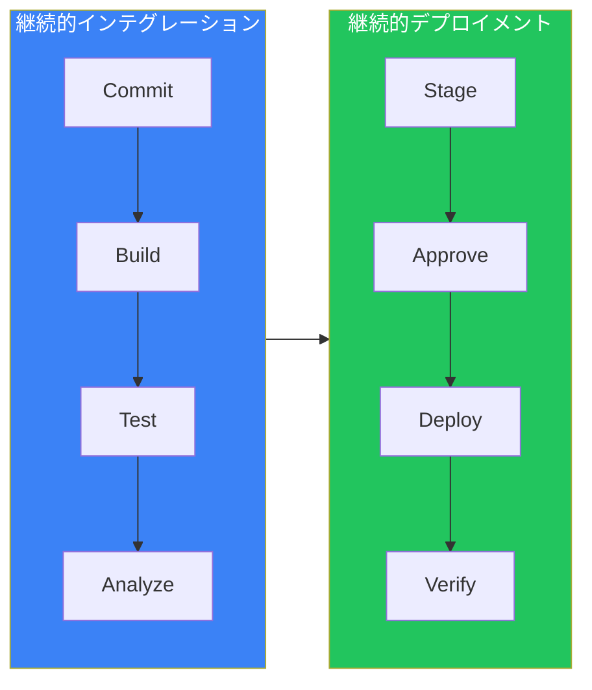
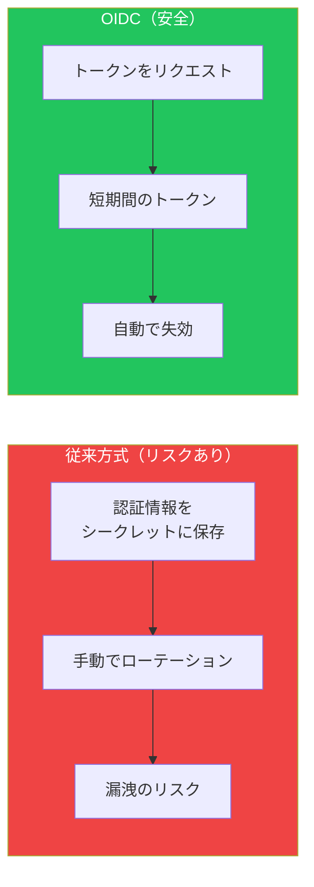
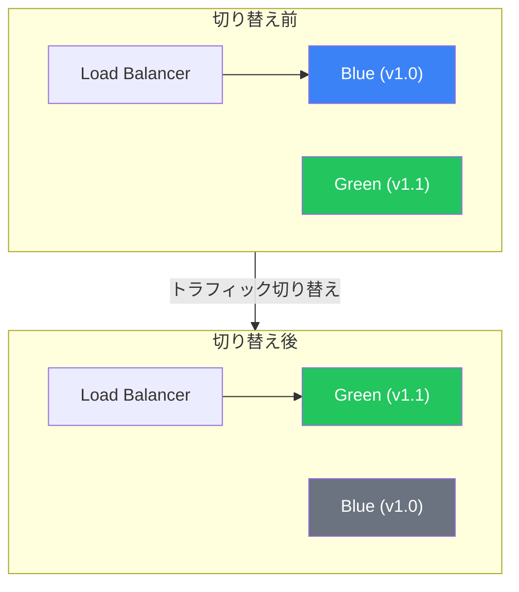

## はじめに

継続的インテグレーションと継続的デプロイメント（CI/CD）は、コードのビルド、テスト、デプロイのプロセスを自動化します。GitHub Actionsは、本番グレードのCI/CDパイプラインを実装するための強力な機能を提供します。

この記事では、堅牢なCI/CDワークフローを構築するためのベストプラクティスを解説します。

## CI/CDパイプラインの概要



## 継続的インテグレーションのベストプラクティス

### 1. 高速なフィードバックループ

開発者の生産性を維持するためにCIを高速に保ちます：

```yaml
name: CI

on:
  pull_request:
    branches: [main]

jobs:
  # まず素早いチェック
  lint:
    runs-on: ubuntu-latest
    steps:
      - uses: actions/checkout@v4
      - uses: actions/setup-node@v4
        with:
          node-version: '20'
          cache: 'npm'
      - run: npm ci
      - run: npm run lint

  # ユニットテストは並列で
  test:
    runs-on: ubuntu-latest
    steps:
      - uses: actions/checkout@v4
      - uses: actions/setup-node@v4
        with:
          node-version: '20'
          cache: 'npm'
      - run: npm ci
      - run: npm test

  # lintとtestが通った場合のみビルド
  build:
    needs: [lint, test]
    runs-on: ubuntu-latest
    steps:
      - uses: actions/checkout@v4
      - uses: actions/setup-node@v4
        with:
          node-version: '20'
          cache: 'npm'
      - run: npm ci
      - run: npm run build
```

### 2. 効率的なキャッシュ

依存関係をキャッシュしてビルドを高速化：

```yaml
- name: Cache dependencies
  uses: actions/cache@v4
  with:
    path: |
      ~/.npm
      node_modules
    key: ${{ runner.os }}-node-${{ hashFiles('**/package-lock.json') }}
    restore-keys: |
      ${{ runner.os }}-node-

- name: Cache build output
  uses: actions/cache@v4
  with:
    path: .next/cache
    key: ${{ runner.os }}-nextjs-${{ hashFiles('**/package-lock.json') }}-${{ hashFiles('**/*.js', '**/*.jsx', '**/*.ts', '**/*.tsx') }}
    restore-keys: |
      ${{ runner.os }}-nextjs-${{ hashFiles('**/package-lock.json') }}-
```

### 3. パスフィルタリング

関連ファイルが変更された場合のみワークフローを実行：

```yaml
on:
  push:
    branches: [main]
    paths:
      - 'src/**'
      - 'package.json'
      - 'package-lock.json'
      - '.github/workflows/ci.yml'
    paths-ignore:
      - '**.md'
      - 'docs/**'
```

### 4. アーティファクト管理

後のステージ用にビルド成果物をアップロード：

```yaml
- name: Build
  run: npm run build

- name: Upload artifact
  uses: actions/upload-artifact@v4
  with:
    name: build-${{ github.sha }}
    path: dist/
    retention-days: 7
    if-no-files-found: error
```

## 環境と承認

### 環境のセットアップ

環境は保護ルールとシークレットを提供します：

```yaml
jobs:
  deploy-staging:
    runs-on: ubuntu-latest
    environment:
      name: staging
      url: https://staging.example.com

    steps:
      - name: Deploy to staging
        run: ./deploy.sh
        env:
          DEPLOY_TOKEN: ${{ secrets.DEPLOY_TOKEN }}

  deploy-production:
    needs: deploy-staging
    runs-on: ubuntu-latest
    environment:
      name: production
      url: https://example.com

    steps:
      - name: Deploy to production
        run: ./deploy.sh
        env:
          DEPLOY_TOKEN: ${{ secrets.DEPLOY_TOKEN }}
```

### 環境保護ルール

GitHub Settings > Environmentsで設定：

| ルール | 目的 |
|-------|------|
| **Required reviewers** | デプロイ前の手動承認 |
| **Wait timer** | N分間デプロイを遅延 |
| **Deployment branches** | デプロイ可能なブランチを制限 |
| **Environment secrets** | 環境固有のシークレット |

## OIDC認証

### なぜOIDCなのか？

OpenID Connectは長期間有効な認証情報を不要にします：



### AWS OIDC設定

```yaml
jobs:
  deploy:
    runs-on: ubuntu-latest
    permissions:
      id-token: write
      contents: read

    steps:
      - uses: actions/checkout@v4

      - name: Configure AWS credentials
        uses: aws-actions/configure-aws-credentials@v4
        with:
          role-to-assume: arn:aws:iam::123456789012:role/GitHubActions
          aws-region: us-east-1

      - name: Deploy to S3
        run: aws s3 sync ./dist s3://my-bucket
```

### Azure OIDC設定

```yaml
jobs:
  deploy:
    runs-on: ubuntu-latest
    permissions:
      id-token: write
      contents: read

    steps:
      - uses: actions/checkout@v4

      - name: Azure Login
        uses: azure/login@v1
        with:
          client-id: ${{ secrets.AZURE_CLIENT_ID }}
          tenant-id: ${{ secrets.AZURE_TENANT_ID }}
          subscription-id: ${{ secrets.AZURE_SUBSCRIPTION_ID }}

      - name: Deploy to Azure
        run: az webapp deploy --name myapp --src-path ./dist
```

### Google Cloud OIDC設定

```yaml
jobs:
  deploy:
    runs-on: ubuntu-latest
    permissions:
      id-token: write
      contents: read

    steps:
      - uses: actions/checkout@v4

      - name: Authenticate to GCP
        uses: google-github-actions/auth@v2
        with:
          workload_identity_provider: 'projects/123/locations/global/workloadIdentityPools/pool/providers/github'
          service_account: 'deploy@project.iam.gserviceaccount.com'

      - name: Deploy to Cloud Run
        run: gcloud run deploy myservice --source .
```

## デプロイ戦略

### Blue-Greenデプロイ

環境を切り替えることでゼロダウンタイムデプロイを実現：



```yaml
jobs:
  deploy:
    runs-on: ubuntu-latest
    steps:
      - name: Deploy to inactive environment
        run: |
          INACTIVE=$(./get-inactive-env.sh)
          ./deploy.sh $INACTIVE

      - name: Run smoke tests
        run: ./smoke-test.sh $INACTIVE_URL

      - name: Switch traffic
        if: success()
        run: ./switch-traffic.sh

      - name: Rollback on failure
        if: failure()
        run: ./rollback.sh
```

### Canaryデプロイ

ユーザーのサブセットに段階的にロールアウト：

```yaml
jobs:
  deploy-canary:
    runs-on: ubuntu-latest
    steps:
      - name: Deploy canary (10% traffic)
        run: ./deploy-canary.sh --percentage 10

      - name: Monitor for 5 minutes
        run: |
          sleep 300
          ./check-metrics.sh --threshold error_rate=0.01

      - name: Increase to 50%
        run: ./deploy-canary.sh --percentage 50

      - name: Monitor for 5 minutes
        run: |
          sleep 300
          ./check-metrics.sh --threshold error_rate=0.01

      - name: Full rollout
        run: ./deploy-canary.sh --percentage 100
```

### Rollingデプロイ

インスタンスを1つずつ更新：

```yaml
jobs:
  rolling-deploy:
    runs-on: ubuntu-latest
    strategy:
      max-parallel: 1
      matrix:
        instance: [1, 2, 3, 4]

    steps:
      - name: Deploy to instance ${{ matrix.instance }}
        run: ./deploy-instance.sh ${{ matrix.instance }}

      - name: Health check
        run: ./health-check.sh ${{ matrix.instance }}

      - name: Wait before next
        run: sleep 60
```

## 完全なCI/CDワークフロー

```yaml
name: CI/CD Pipeline

on:
  push:
    branches: [main]
  pull_request:
    branches: [main]

env:
  NODE_VERSION: '20'

jobs:
  # CIステージ
  lint:
    runs-on: ubuntu-latest
    steps:
      - uses: actions/checkout@v4
      - uses: actions/setup-node@v4
        with:
          node-version: ${{ env.NODE_VERSION }}
          cache: 'npm'
      - run: npm ci
      - run: npm run lint

  test:
    runs-on: ubuntu-latest
    steps:
      - uses: actions/checkout@v4
      - uses: actions/setup-node@v4
        with:
          node-version: ${{ env.NODE_VERSION }}
          cache: 'npm'
      - run: npm ci
      - run: npm test -- --coverage
      - uses: actions/upload-artifact@v4
        with:
          name: coverage
          path: coverage/

  build:
    needs: [lint, test]
    runs-on: ubuntu-latest
    steps:
      - uses: actions/checkout@v4
      - uses: actions/setup-node@v4
        with:
          node-version: ${{ env.NODE_VERSION }}
          cache: 'npm'
      - run: npm ci
      - run: npm run build
      - uses: actions/upload-artifact@v4
        with:
          name: build
          path: dist/

  # CDステージ - mainブランチのみ
  deploy-staging:
    if: github.ref == 'refs/heads/main' && github.event_name == 'push'
    needs: build
    runs-on: ubuntu-latest
    environment:
      name: staging
      url: https://staging.example.com
    permissions:
      id-token: write
      contents: read

    steps:
      - uses: actions/download-artifact@v4
        with:
          name: build
          path: dist/

      - name: Configure AWS credentials
        uses: aws-actions/configure-aws-credentials@v4
        with:
          role-to-assume: ${{ secrets.AWS_ROLE_ARN }}
          aws-region: us-east-1

      - name: Deploy to staging
        run: aws s3 sync dist/ s3://staging-bucket

      - name: Run E2E tests
        run: npm run test:e2e -- --url https://staging.example.com

  deploy-production:
    needs: deploy-staging
    runs-on: ubuntu-latest
    environment:
      name: production
      url: https://example.com
    permissions:
      id-token: write
      contents: read

    steps:
      - uses: actions/download-artifact@v4
        with:
          name: build
          path: dist/

      - name: Configure AWS credentials
        uses: aws-actions/configure-aws-credentials@v4
        with:
          role-to-assume: ${{ secrets.AWS_ROLE_ARN }}
          aws-region: us-east-1

      - name: Deploy to production
        run: aws s3 sync dist/ s3://production-bucket

      - name: Verify deployment
        run: curl -f https://example.com/health
```

## モニタリングと可観測性

### デプロイ追跡

```yaml
- name: Notify deployment start
  uses: slackapi/slack-github-action@v1
  with:
    payload: |
      {
        "text": "🚀 Deploying ${{ github.sha }} to ${{ inputs.environment }}"
      }
  env:
    SLACK_WEBHOOK_URL: ${{ secrets.SLACK_WEBHOOK }}

- name: Deploy
  run: ./deploy.sh

- name: Notify deployment complete
  if: success()
  uses: slackapi/slack-github-action@v1
  with:
    payload: |
      {
        "text": "✅ Deployment successful"
      }
```

### ヘルスチェック

```yaml
- name: Verify deployment
  run: |
    for i in {1..10}; do
      if curl -f https://example.com/health; then
        echo "Health check passed"
        exit 0
      fi
      echo "Attempt $i failed, retrying..."
      sleep 30
    done
    echo "Health check failed after 10 attempts"
    exit 1
```

## まとめ

| プラクティス | メリット |
|------------|---------|
| **高速フィードバック** | 重いビルドの前に素早くlint/test |
| **キャッシュ** | ビルド時間を大幅に短縮 |
| **パスフィルタリング** | 不要な実行をスキップ |
| **環境** | 保護と承認ゲート |
| **OIDC** | 認証情報不要の安全な認証 |
| **Blue-Green** | ゼロダウンタイムデプロイ |
| **Canary** | 段階的で安全なロールアウト |
| **モニタリング** | デプロイ状況の可視化 |

これらのプラクティスは、GitHub Actionsで信頼性が高く、安全で効率的なCI/CDパイプラインを構築するのに役立ちます。

## 参考資料

- Manning - GitHub Actions in Action, Chapters 8-9
- Packt - DevOps Unleashed with Git and GitHub, Chapter 5
- GitHub Docs - Deploying with GitHub Actions
