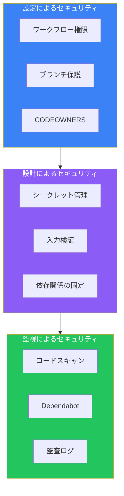
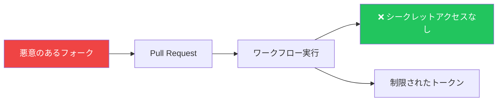

## はじめに

GitHub Actionsはコードを自動的に実行するため、セキュリティが重要です。侵害されたワークフローは、シークレットの漏洩、悪意のあるコードの挿入、またはサプライチェーン全体の侵害につながる可能性があります。

この記事では、ワークフローとリポジトリを保護するためのセキュリティベストプラクティスを解説します。

## セキュリティの層



## シークレット管理

### シークレットの安全な使用

```yaml
# 良い例：環境変数として渡す
- name: Deploy
  env:
    API_KEY: ${{ secrets.API_KEY }}
  run: ./deploy.sh

# 悪い例：コマンドにインライン（ログに漏れる可能性）
- run: ./deploy.sh --key=${{ secrets.API_KEY }}  # これはやめましょう！
```

### シークレットのマスキング

GitHubはログ内のシークレットを自動的にマスクしますが、注意が必要です：

```yaml
# シークレットが露出する可能性
- run: |
    KEY=${{ secrets.API_KEY }}
    echo "Key length: ${#KEY}"  # 安全
    echo "Key: $KEY"            # マスクされるが避けるべき

# より良い方法：シークレットをechoしない
- run: |
    if [ -z "$API_KEY" ]; then
      echo "API key not set"
      exit 1
    fi
  env:
    API_KEY: ${{ secrets.API_KEY }}
```

### シークレットローテーション戦略

| シークレットの種類 | ローテーション頻度 | 方法 |
|------------------|------------------|------|
| APIトークン | 90日 | スクリプトで自動化 |
| SSHキー | 6ヶ月 | 重複期間を設けて手動 |
| クラウド認証情報 | 代わりにOIDCを使用 | ローテーション不要 |
| 署名キー | 1年 | 慎重に移行 |

## GITHUB_TOKEN権限

### デフォルト権限の問題

デフォルトの`GITHUB_TOKEN`は必要以上の権限を持つことが多いです：

```yaml
# ワークフローレベルで権限を制限
permissions:
  contents: read  # コードの読み取りのみ

jobs:
  build:
    runs-on: ubuntu-latest
    steps:
      - uses: actions/checkout@v4
      - run: npm build
```

### 最小権限の原則

```yaml
name: CI/CD

permissions:
  contents: read  # すべてのジョブのデフォルト

jobs:
  test:
    runs-on: ubuntu-latest
    # 継承: contents: read
    steps:
      - uses: actions/checkout@v4
      - run: npm test

  deploy:
    runs-on: ubuntu-latest
    permissions:
      contents: read
      id-token: write    # OIDC用
      deployments: write # デプロイステータス用
    steps:
      - uses: actions/checkout@v4
      - name: Deploy
        run: ./deploy.sh
```

### 権限リファレンス

| 権限 | ユースケース |
|-----|-------------|
| `contents: read` | コードのチェックアウト |
| `contents: write` | コミットのプッシュ、リリース作成 |
| `pull-requests: write` | PRへのコメント |
| `issues: write` | Issueの作成/更新 |
| `id-token: write` | OIDC認証 |
| `packages: write` | GitHub Packagesへの公開 |
| `security-events: write` | コードスキャン結果のアップロード |

## インジェクションからの保護

### スクリプトインジェクションの脆弱性

```yaml
# 脆弱：ユーザー入力をスクリプトに直接使用
- name: Greet
  run: echo "Hello ${{ github.event.issue.title }}"

# タイトルが: "; rm -rf / # の場合
# コマンドは: echo "Hello "; rm -rf / #" になる
```

### 安全な入力処理

```yaml
# 安全：環境変数を使用
- name: Greet
  env:
    TITLE: ${{ github.event.issue.title }}
  run: echo "Hello $TITLE"

# 安全：中間変数を使用
- name: Process PR
  run: |
    BODY="${PR_BODY}"
    echo "Processing: ${BODY:0:100}"  # 最初の100文字のみ
  env:
    PR_BODY: ${{ github.event.pull_request.body }}
```

### 注意が必要なコンテキスト

| コンテキスト | リスクレベル | 理由 |
|------------|------------|------|
| `github.event.issue.title` | 高 | ユーザー制御 |
| `github.event.issue.body` | 高 | ユーザー制御 |
| `github.event.pull_request.title` | 高 | ユーザー制御 |
| `github.event.comment.body` | 高 | ユーザー制御 |
| `github.head_ref` | 中 | ブランチ名、ユーザー制御 |
| `github.ref` | 低 | 使用可能な文字が限定 |

## アクションのセキュリティ

### アクションのバージョン固定

```yaml
# リスクあり：可変参照の使用
- uses: actions/checkout@main     # いつでも変更可能
- uses: actions/checkout@v4       # パッチで変更可能

# 安全：コミットSHAに固定
- uses: actions/checkout@8ade135a41bc03ea155e62e844d188df1ea18608  # v4.1.0
```

### サードパーティアクションの検証

アクションを使用する前に：

1. **ソースを確認**: アクションのリポジトリをレビュー
2. **発行者を検証**: 信頼できる組織からか？
3. **コードを読む**: 特に広い権限を持つアクション
4. **脆弱性をチェック**: IssueやセキュリティAdvisoryを確認

```yaml
# 公式アクションを優先
- uses: actions/checkout@v4          # GitHub公式
- uses: aws-actions/configure-aws-credentials@v4  # AWS公式

# 未知の発行者には注意
- uses: random-user/some-action@v1   # まず慎重にレビュー
```

### アクション用のDependabot

```yaml
# .github/dependabot.yml
version: 2
updates:
  - package-ecosystem: "github-actions"
    directory: "/"
    schedule:
      interval: "weekly"
    commit-message:
      prefix: "chore(deps)"
```

## フォークとプルリクエストのセキュリティ

### Pwn Requestの問題

フォークからの`pull_request`でワークフローが実行される場合：



### 安全なワークフロー設定

```yaml
# 信頼できないPR（フォークから）用
on:
  pull_request:
    types: [opened, synchronize]

permissions:
  contents: read
  # フォークPRには書き込み権限なし

jobs:
  test:
    runs-on: ubuntu-latest
    steps:
      - uses: actions/checkout@v4
      - run: npm test  # 安全：シークレット不要

# 信頼できるPR（レビュー後）用
on:
  pull_request_target:
    types: [opened, synchronize]

jobs:
  deploy-preview:
    if: github.event.pull_request.head.repo.full_name == github.repository
    runs-on: ubuntu-latest
    steps:
      - uses: actions/checkout@v4
        with:
          ref: ${{ github.event.pull_request.head.sha }}
      - name: Deploy preview
        env:
          DEPLOY_TOKEN: ${{ secrets.DEPLOY_TOKEN }}
        run: ./deploy-preview.sh
```

### pull_request vs pull_request_target

| イベント | 実行するコード | シークレット | 用途 |
|---------|--------------|-------------|------|
| `pull_request` | PRブランチ | なし（フォーク） | 安全なテスト |
| `pull_request_target` | ベースブランチ | あり | ラベル付け、コメント |

## サプライチェーンセキュリティ

### ソフトウェア部品表（SBOM）

```yaml
- name: Generate SBOM
  uses: anchore/sbom-action@v0
  with:
    path: .
    format: spdx-json
    output-file: sbom.spdx.json

- name: Upload SBOM
  uses: actions/upload-artifact@v4
  with:
    name: sbom
    path: sbom.spdx.json
```

### 依存関係スキャン

```yaml
# .github/workflows/security.yml
name: Security Scan

on:
  push:
    branches: [main]
  schedule:
    - cron: '0 0 * * *'

jobs:
  dependency-review:
    runs-on: ubuntu-latest
    steps:
      - uses: actions/checkout@v4
      - uses: actions/dependency-review-action@v3
        with:
          fail-on-severity: moderate

  codeql:
    runs-on: ubuntu-latest
    permissions:
      security-events: write
    steps:
      - uses: actions/checkout@v4
      - uses: github/codeql-action/init@v2
        with:
          languages: javascript
      - uses: github/codeql-action/analyze@v2
```

### コンテナスキャン

```yaml
- name: Build image
  run: docker build -t myapp:${{ github.sha }} .

- name: Scan image
  uses: aquasecurity/trivy-action@master
  with:
    image-ref: myapp:${{ github.sha }}
    format: 'sarif'
    output: 'trivy-results.sarif'
    severity: 'CRITICAL,HIGH'

- name: Upload results
  uses: github/codeql-action/upload-sarif@v2
  with:
    sarif_file: 'trivy-results.sarif'
```

## ブランチ保護とルールセット

### 必須ステータスチェック

リポジトリ設定で構成：

```yaml
# マージ前に通過が必要なチェック
name: Required Checks

on:
  pull_request:
    branches: [main]

jobs:
  test:
    runs-on: ubuntu-latest
    steps:
      - uses: actions/checkout@v4
      - run: npm test

  security:
    runs-on: ubuntu-latest
    steps:
      - uses: actions/checkout@v4
      - run: npm audit
```

### CODEOWNERS

特定のチームからのレビューを必須に：

```
# .github/CODEOWNERS

# セキュリティチームはワークフロー変更をレビュー必須
.github/workflows/ @org/security-team

# インフラチームはデプロイ設定を担当
deploy/ @org/infrastructure
terraform/ @org/infrastructure

# すべての変更には少なくとも1人のレビューが必要
* @org/developers
```

## セキュリティチェックリスト

```markdown
## ワークフローセキュリティチェックリスト

### 権限
- [ ] ワークフローレベルで明示的な権限を設定
- [ ] 各ジョブに最小権限を使用
- [ ] GITHUB_TOKENの使用をレビュー

### シークレット
- [ ] ログやコマンドラインにシークレットなし
- [ ] 環境変数経由でシークレットを渡す
- [ ] 可能な場合はOIDCを使用

### アクション
- [ ] SHAまたは特定バージョンにアクションを固定
- [ ] サードパーティアクションのコードをレビュー
- [ ] アクション用のDependabotを有効化

### 入力
- [ ] ユーザー入力をスクリプトで直接使用しない
- [ ] 信頼できないデータには環境変数を使用
- [ ] 必要に応じて入力検証

### フォークPR
- [ ] pull_requestで機密操作を行わない
- [ ] pull_request_targetを慎重に使用
- [ ] フォークにシークレットを公開しない

### 監視
- [ ] コードスキャンを有効化
- [ ] 依存関係レビューを設定
- [ ] 監査ログを定期的にレビュー
```

## まとめ

| 領域 | 主要なプラクティス |
|-----|------------------|
| **シークレット** | 環境変数で、インラインは絶対禁止 |
| **権限** | 最小権限、明示的な宣言 |
| **アクション** | SHAに固定、サードパーティを検証 |
| **入力** | 信頼せず、常にサニタイズ |
| **フォークPR** | 信頼できない場合は`pull_request`を使用 |
| **サプライチェーン** | SBOM、スキャン、Dependabot |
| **ブランチ保護** | 必須チェック、CODEOWNERS |

セキュリティは継続的なプロセスです。定期的にワークフローをレビューし、依存関係を更新し、新しい脆弱性について情報を収集し続けましょう。

## 参考資料

- Manning - GitHub Actions in Action, Chapter 10
- O'Reilly - Learning GitHub Actions, Chapter 9
- GitHub Docs - Security Hardening for GitHub Actions
- OWASP - CI/CD Security Guidance
