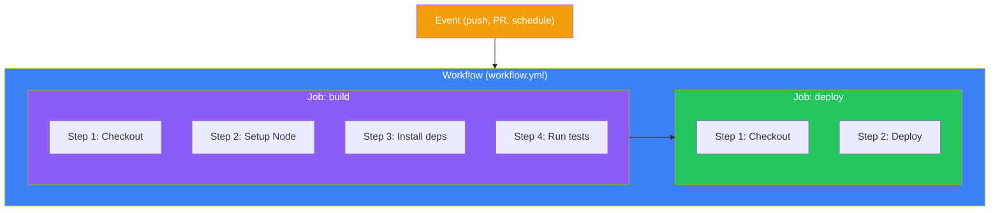
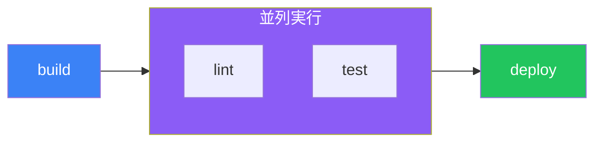

## はじめに

GitHub Actionsは、GitHubに組み込まれた強力な自動化プラットフォームです。リポジトリ内で直接ソフトウェア開発ワークフローを自動化できます。コードのビルドとテストからアプリケーションのデプロイまで、あらゆる作業を自動化できます。

この記事では、効果的なワークフローを作成するために必要な基本概念を解説します。

## コアコンセプト



### 階層構造の概要

| コンポーネント | 説明 |
|--------------|------|
| **Workflow** | YAMLファイルで定義された自動化プロセス |
| **Event** | ワークフローを開始するトリガー |
| **Job** | 同じランナー上で実行されるステップの集合 |
| **Step** | ジョブ内の個々のタスク |
| **Action** | 再利用可能なコードユニット |
| **Runner** | ワークフローを実行するサーバー |

## YAML構文の基礎

ワークフローはYAMLで記述します。主要な構文ルールは以下の通りです：

```yaml
# キーと値のペア
name: My Workflow

# ネスト構造はインデント（スペース2つ）を使用
jobs:
  build:
    runs-on: ubuntu-latest

# リストはハイフンを使用
steps:
  - name: First step
  - name: Second step

# 複数行の文字列
run: |
  echo "Line 1"
  echo "Line 2"

# 1行の文字列
run: echo "Single line"
```

## ワークフローファイルの構造

ワークフローファイルは `.github/workflows/` ディレクトリに配置します：

```yaml
# .github/workflows/ci.yml
name: CI Pipeline

on:
  push:
    branches: [main]
  pull_request:
    branches: [main]

jobs:
  build:
    runs-on: ubuntu-latest

    steps:
      - name: Checkout code
        uses: actions/checkout@v4

      - name: Setup Node.js
        uses: actions/setup-node@v4
        with:
          node-version: '20'

      - name: Install dependencies
        run: npm ci

      - name: Run tests
        run: npm test
```

## イベントトリガー

### プッシュとプルリクエストイベント

```yaml
on:
  push:
    branches:
      - main
      - 'release/**'
    paths:
      - 'src/**'
      - '!src/**/*.md'
    tags:
      - 'v*'

  pull_request:
    branches: [main]
    types: [opened, synchronize, reopened]
```

### スケジュールトリガー

```yaml
on:
  schedule:
    # 毎日UTC 00:00に実行
    - cron: '0 0 * * *'
    # 毎週月曜日UTC 9:00に実行
    - cron: '0 9 * * 1'
```

### 手動トリガー

```yaml
on:
  workflow_dispatch:
    inputs:
      environment:
        description: 'デプロイ環境'
        required: true
        default: 'staging'
        type: choice
        options:
          - staging
          - production

      debug:
        description: 'デバッグモードを有効化'
        required: false
        type: boolean
        default: false
```

### トリガーの比較

| トリガー | ユースケース |
|---------|-------------|
| `push` | 指定ブランチへのすべてのコミットで実行 |
| `pull_request` | PRのオープンや更新時に実行 |
| `schedule` | 定期タスク（ナイトリービルド、クリーンアップ） |
| `workflow_dispatch` | オプション入力付きの手動実行 |
| `workflow_call` | 別のワークフローから呼び出し |
| `repository_dispatch` | API経由の外部イベントでトリガー |

## ジョブとステップ

### ジョブの設定

```yaml
jobs:
  build:
    name: Build Application
    runs-on: ubuntu-latest
    timeout-minutes: 30

    steps:
      - uses: actions/checkout@v4
      - run: npm ci
      - run: npm run build

  test:
    name: Run Tests
    runs-on: ubuntu-latest
    needs: build  # buildジョブの完了を待つ

    steps:
      - uses: actions/checkout@v4
      - run: npm ci
      - run: npm test
```

### ステップ：アクション vs コマンド

```yaml
steps:
  # 事前ビルドされたアクションを使用
  - name: Checkout repository
    uses: actions/checkout@v4
    with:
      fetch-depth: 0

  # シェルコマンドを実行
  - name: Build project
    run: |
      npm ci
      npm run build
    working-directory: ./frontend

  # 特定のシェルを使用
  - name: PowerShell script
    shell: pwsh
    run: Get-Process
```

### ジョブの依存関係



```yaml
jobs:
  build:
    runs-on: ubuntu-latest
    steps:
      - run: echo "Building..."

  lint:
    needs: build
    runs-on: ubuntu-latest
    steps:
      - run: echo "Linting..."

  test:
    needs: build
    runs-on: ubuntu-latest
    steps:
      - run: echo "Testing..."

  deploy:
    needs: [lint, test]  # 両方の完了を待つ
    runs-on: ubuntu-latest
    steps:
      - run: echo "Deploying..."
```

## 式とコンテキスト

### コンテキストの使用

```yaml
steps:
  - name: Show context information
    run: |
      echo "Repository: ${{ github.repository }}"
      echo "Branch: ${{ github.ref_name }}"
      echo "Actor: ${{ github.actor }}"
      echo "Event: ${{ github.event_name }}"
      echo "SHA: ${{ github.sha }}"
```

### 主要なコンテキスト

| コンテキスト | 説明 |
|-------------|------|
| `github` | ワークフロー実行情報 |
| `env` | 環境変数 |
| `vars` | リポジトリ/組織変数 |
| `secrets` | 暗号化されたシークレット |
| `job` | 現在のジョブ情報 |
| `steps` | ステップの出力とステータス |
| `runner` | ランナー情報 |
| `matrix` | 現在のジョブのマトリックス値 |

### 条件付き実行

```yaml
steps:
  - name: mainブランチのみ
    if: github.ref == 'refs/heads/main'
    run: echo "On main branch"

  - name: プルリクエストのみ
    if: github.event_name == 'pull_request'
    run: echo "This is a PR"

  - name: 前のステップが失敗しても実行
    if: always()
    run: echo "This always runs"

  - name: 失敗時のみ実行
    if: failure()
    run: echo "Previous step failed"

  - name: フォークではスキップ
    if: github.repository == 'owner/repo'
    run: echo "Not a fork"
```

## 環境変数

### 変数の定義

```yaml
env:
  # ワークフローレベル
  NODE_ENV: production

jobs:
  build:
    runs-on: ubuntu-latest
    env:
      # ジョブレベル
      CI: true

    steps:
      - name: Build
        env:
          # ステップレベル
          API_URL: https://api.example.com
        run: |
          echo "NODE_ENV: $NODE_ENV"
          echo "CI: $CI"
          echo "API_URL: $API_URL"
```

### シークレットの使用

```yaml
steps:
  - name: Deploy
    env:
      API_KEY: ${{ secrets.API_KEY }}
    run: ./deploy.sh

  - name: Login to Docker Hub
    uses: docker/login-action@v3
    with:
      username: ${{ secrets.DOCKER_USERNAME }}
      password: ${{ secrets.DOCKER_PASSWORD }}
```

## 実践例：完全なCIワークフロー

```yaml
name: CI

on:
  push:
    branches: [main, develop]
  pull_request:
    branches: [main]

env:
  NODE_VERSION: '20'

jobs:
  lint:
    name: Lint Code
    runs-on: ubuntu-latest
    steps:
      - uses: actions/checkout@v4

      - name: Setup Node.js
        uses: actions/setup-node@v4
        with:
          node-version: ${{ env.NODE_VERSION }}
          cache: 'npm'

      - run: npm ci
      - run: npm run lint

  test:
    name: Run Tests
    runs-on: ubuntu-latest
    steps:
      - uses: actions/checkout@v4

      - name: Setup Node.js
        uses: actions/setup-node@v4
        with:
          node-version: ${{ env.NODE_VERSION }}
          cache: 'npm'

      - run: npm ci
      - run: npm test -- --coverage

      - name: Upload coverage
        uses: actions/upload-artifact@v4
        with:
          name: coverage
          path: coverage/

  build:
    name: Build
    runs-on: ubuntu-latest
    needs: [lint, test]
    steps:
      - uses: actions/checkout@v4

      - name: Setup Node.js
        uses: actions/setup-node@v4
        with:
          node-version: ${{ env.NODE_VERSION }}
          cache: 'npm'

      - run: npm ci
      - run: npm run build

      - name: Upload build artifacts
        uses: actions/upload-artifact@v4
        with:
          name: build
          path: dist/
```

## ベストプラクティス

### 1. アクションのバージョンを固定する

```yaml
# 良い例：特定のバージョンまたはSHAを使用
- uses: actions/checkout@v4
- uses: actions/setup-node@v4.0.2
- uses: actions/checkout@8ade135a41bc03ea155e62e844d188df1ea18608

# 避けるべき：latestやブランチの使用
- uses: actions/checkout@main  # これはやめましょう
```

### 2. キャッシュを使用する

```yaml
- name: Cache node modules
  uses: actions/cache@v4
  with:
    path: ~/.npm
    key: ${{ runner.os }}-node-${{ hashFiles('**/package-lock.json') }}
    restore-keys: |
      ${{ runner.os }}-node-
```

### 3. シークレットの露出を最小化

```yaml
# 良い例：環境変数として渡す
- name: Deploy
  env:
    TOKEN: ${{ secrets.DEPLOY_TOKEN }}
  run: ./deploy.sh

# 避けるべき：コマンド内にインライン（ログに漏れる可能性）
- run: ./deploy.sh ${{ secrets.DEPLOY_TOKEN }}  # これはやめましょう
```

### 4. タイムアウトを設定する

```yaml
jobs:
  build:
    runs-on: ubuntu-latest
    timeout-minutes: 15  # 暴走ジョブを防止
```

## まとめ

| 概念 | ポイント |
|-----|---------|
| **Workflow** | `.github/workflows/`内のYAMLファイル |
| **トリガー** | `push`, `pull_request`, `schedule`, `workflow_dispatch` |
| **ジョブ** | デフォルトで並列実行、`needs`で依存関係を指定 |
| **ステップ** | アクションには`uses`、コマンドには`run` |
| **コンテキスト** | `${{ github.* }}`, `${{ secrets.* }}`など |
| **条件** | `if`式で実行を制御 |

これらの基礎を身につければ、コードをプッシュしたりプルリクエストを開いたりするたびに、アプリケーションを自動的にビルド、テスト、デプロイするワークフローを作成できます。

## 参考資料

- Manning - GitHub Actions in Action, Chapter 3
- O'Reilly - Learning GitHub Actions, Chapters 1-4
- GitHub Docs - Workflow Syntax
