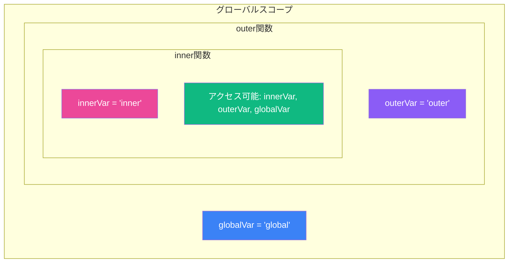
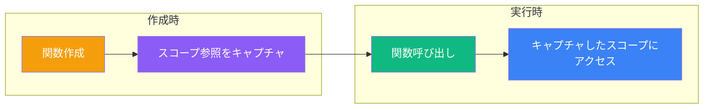

クロージャは JavaScript で最も強力でありながら、誤解されやすい概念の一つです。データのプライバシー、関数ファクトリ、コールバックなど、JavaScript プログラミングの基本となるパターンを可能にします。クロージャの謎を解き明かし、内部でどのように動作するか見ていきましょう。

## クロージャとは？

クロージャは、外側のスコープの変数を「記憶」する関数です。外側の関数の実行が終了した後でも、その変数にアクセスできます。言い換えれば、クロージャは内側の関数から外側の関数のスコープにアクセスする手段を提供します。

```javascript
function createGreeting(greeting) {
  // この内側の関数がクロージャです
  return function(name) {
    return `${greeting}, ${name}!`;
  };
}

const sayHello = createGreeting("Hello");
const sayHi = createGreeting("Hi");

console.log(sayHello("Alice")); // "Hello, Alice!"
console.log(sayHi("Bob"));      // "Hi, Bob!"
```

`createGreeting` の実行が終了しても、返された関数はまだ `greeting` 変数にアクセスできます。これがクロージャの本質です。

## レキシカルスコープの理解

クロージャを理解するには、まずレキシカルスコープを理解する必要があります。JavaScript はレキシカルスコープを使用します。つまり、関数のスコープは呼び出された場所ではなく、ソースコード内で書かれた場所によって決定されます。



```javascript
const globalVar = "global";

function outer() {
  const outerVar = "outer";

  function inner() {
    const innerVar = "inner";
    // 3つすべての変数にアクセス可能
    console.log(globalVar, outerVar, innerVar);
  }

  inner();
}

outer(); // "global outer inner"
```

内側の関数は、自身のスコープ、外側の関数のスコープ、グローバルスコープの変数にアクセスできます。このスコープの連鎖を**スコープチェーン**と呼びます。

## クロージャの動作原理

関数が作成されると、周囲のスコープへの参照をキャプチャします。このキャプチャされた環境は関数と共に保存され、どこへ行っても一緒についていきます。



```javascript
function counter() {
  let count = 0; // この変数は返される関数に「囲まれて」いる

  return function() {
    count += 1;
    return count;
  };
}

const increment = counter();
console.log(increment()); // 1
console.log(increment()); // 2
console.log(increment()); // 3

// counter() を呼び出すたびに独自の count を持つ新しいクロージャが作成される
const anotherCounter = counter();
console.log(anotherCounter()); // 1（increment とは独立）
```

## 実践的なユースケース

### 1. データのプライバシーとカプセル化

クロージャを使用すると、外部からアクセスできないプライベート変数を作成できます：

```javascript
function createBankAccount(initialBalance) {
  let balance = initialBalance; // プライベート変数

  return {
    deposit(amount) {
      if (amount > 0) {
        balance += amount;
        return balance;
      }
    },
    withdraw(amount) {
      if (amount > 0 && amount <= balance) {
        balance -= amount;
        return balance;
      }
      return "残高不足";
    },
    getBalance() {
      return balance;
    }
  };
}

const account = createBankAccount(100);
console.log(account.getBalance()); // 100
account.deposit(50);
console.log(account.getBalance()); // 150
console.log(account.balance);      // undefined（プライベート！）
```

### 2. 関数ファクトリ

汎用的なテンプレートから特化した関数を作成：

```javascript
function multiply(factor) {
  return function(number) {
    return number * factor;
  };
}

const double = multiply(2);
const triple = multiply(3);
const tenTimes = multiply(10);

console.log(double(5));   // 10
console.log(triple(5));   // 15
console.log(tenTimes(5)); // 50
```

### 3. メモ化（キャッシュ）

計算コストの高い結果をキャッシュ：

```javascript
function memoize(fn) {
  const cache = {};

  return function(...args) {
    const key = JSON.stringify(args);

    if (key in cache) {
      console.log("キャッシュから結果を返却");
      return cache[key];
    }

    const result = fn.apply(this, args);
    cache[key] = result;
    return result;
  };
}

const expensiveOperation = memoize(function(n) {
  console.log("計算中...");
  return n * n;
});

console.log(expensiveOperation(5)); // 計算中... 25
console.log(expensiveOperation(5)); // キャッシュから結果を返却 25
console.log(expensiveOperation(6)); // 計算中... 36
```

### 4. 状態を持つイベントハンドラ

イベントハンドラの呼び出し間で状態を維持：

```javascript
function createClickCounter(buttonId) {
  let clicks = 0;

  document.getElementById(buttonId).addEventListener("click", function() {
    clicks += 1;
    console.log(`ボタンが ${clicks} 回クリックされました`);
  });
}

createClickCounter("myButton");
```

## よくある落とし穴：ループ内のクロージャ

クロージャで最もよくある間違いはループに関するものです：

```javascript
// 問題：すべての関数が同じ変数を共有している
for (var i = 0; i < 3; i++) {
  setTimeout(function() {
    console.log(i);
  }, 100);
}
// 出力: 3, 3, 3（0, 1, 2 ではない！）
```

これは `var` が関数スコープであるため、すべてのコールバックが同じ `i` 変数を共有し、ループ終了後は 3 になっているからです。

### 解決策

**解決策 1: `let` を使用（推奨）**

```javascript
for (let i = 0; i < 3; i++) {
  setTimeout(function() {
    console.log(i);
  }, 100);
}
// 出力: 0, 1, 2
```

`let` は各イテレーションで新しいバインディングを作成するため、各クロージャが独自の `i` をキャプチャします。

**解決策 2: IIFE で新しいスコープを作成**

```javascript
for (var i = 0; i < 3; i++) {
  (function(j) {
    setTimeout(function() {
      console.log(j);
    }, 100);
  })(i);
}
// 出力: 0, 1, 2
```

**解決策 3: ファクトリ関数を使用**

```javascript
function createLogger(value) {
  return function() {
    console.log(value);
  };
}

for (var i = 0; i < 3; i++) {
  setTimeout(createLogger(i), 100);
}
// 出力: 0, 1, 2
```

## クロージャのメモリに関する考慮事項

クロージャは外側のスコープ変数への参照を保持するため、クロージャが存在する限りそれらの変数はガベージコレクションされません：

```javascript
function createHugeArray() {
  const hugeData = new Array(1000000).fill("data");

  return function() {
    // hugeData を使用しなくても、まだメモリに残っている
    return "Hello";
  };
}

const fn = createHugeArray();
// fn のクロージャが参照しているため、hugeData はまだメモリに残っている
```

メモリリークを避けるために、クロージャがキャプチャする内容に注意しましょう：

```javascript
function createOptimized() {
  const hugeData = new Array(1000000).fill("data");
  const result = hugeData.length; // 必要なものだけを抽出

  return function() {
    return result; // 配列ではなく結果だけをキャプチャ
  };
}
```

## まとめ

- **クロージャ**は、そのレキシカルスコープの外で実行されても、そのスコープを記憶する関数です
- 関数が外側のスコープの変数にアクセスすると、自動的に作成されます
- **レキシカルスコープ**は、スコープがコードの実行場所ではなく、書かれた場所によって決定されることを意味します
- **データのプライバシー**、**関数ファクトリ**、**メモ化**、**状態の維持**にクロージャを使用しましょう
- **ループ内のクロージャの落とし穴**に注意し、`var` の代わりに `let` を使用しましょう
- クロージャが大きなデータ構造をキャプチャする場合の**メモリへの影響**を考慮しましょう

クロージャは学ぶ必要のある特別な構文ではなく、JavaScript がスコープを処理する方法の自然な結果です。レキシカルスコープを理解すれば、クロージャは直感的になり、クリーンで保守しやすいコードを書くために非常に役立ちます。

## 参考資料

- Flanagan, David. *JavaScript: The Definitive Guide*, 7th Edition. O'Reilly Media, 2020.
- Haverbeke, Marijn. *Eloquent JavaScript*, 4th Edition. No Starch Press, 2024.
