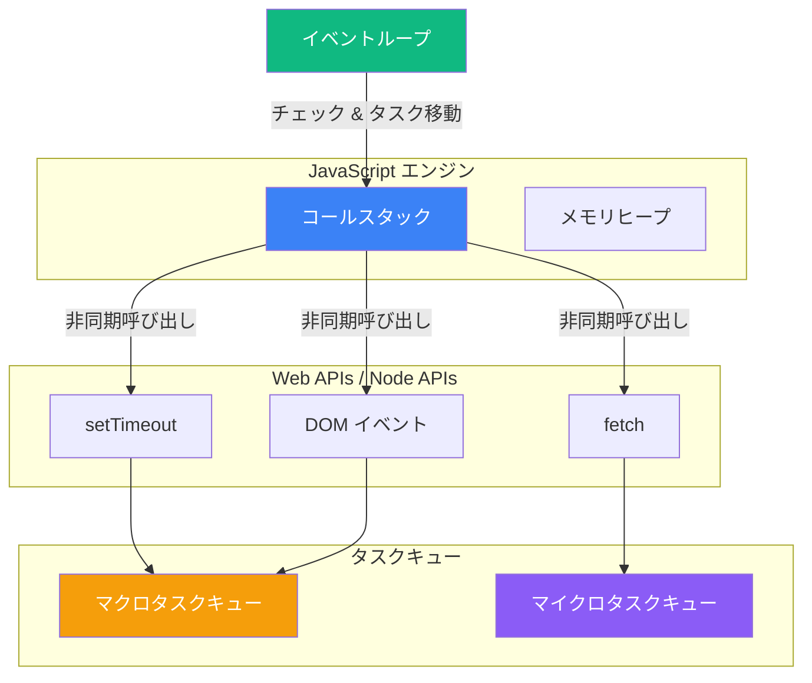
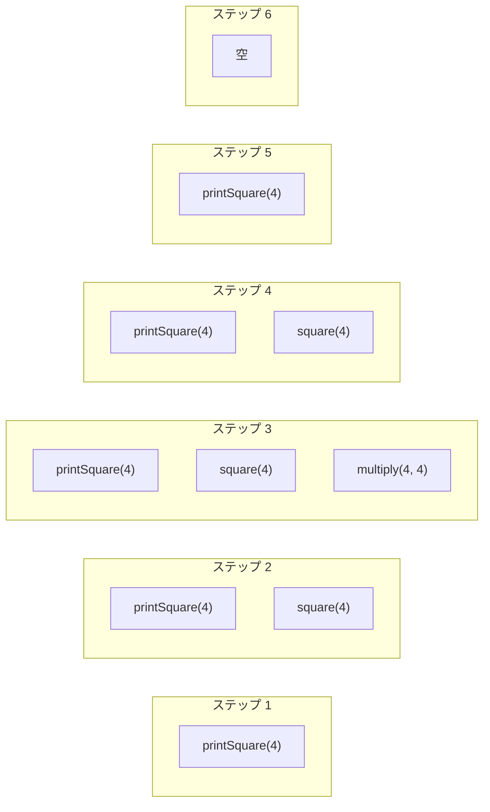
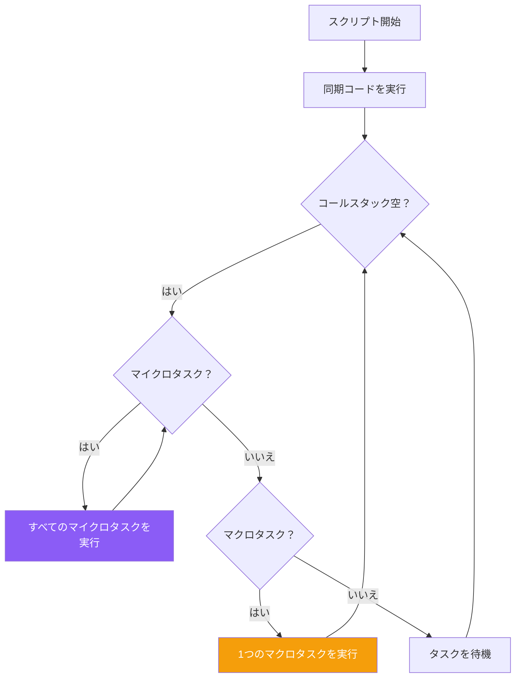

JavaScript はシングルスレッドです。つまり、一度に1つのコードしか実行できません。しかし、ネットワークリクエスト、タイマー、ユーザーイベントなどの非同期操作をシームレスに処理できます。これはどうして可能なのでしょうか？答えはイベントループにあります。これは JavaScript でノンブロッキング I/O を実現する基本的な仕組みです。

## JavaScript ランタイム

イベントループに入る前に、JavaScript ランタイムの構成要素を理解しましょう：



- **コールスタック**: 関数呼び出しを追跡する場所
- **メモリヒープ**: オブジェクトが保存される場所
- **Web/Node APIs**: ブラウザまたは Node.js が提供する非同期操作用 API
- **タスクキュー**: コールバックが実行を待つ場所
- **イベントループ**: コールバックをコールスタックに移動させる調整役

## コールスタック

コールスタックは関数の実行を追跡するデータ構造です。関数が呼び出されるとスタックにプッシュされ、戻るとポップされます。

```javascript
function multiply(a, b) {
  return a * b;
}

function square(n) {
  return multiply(n, n);
}

function printSquare(n) {
  const result = square(n);
  console.log(result);
}

printSquare(4);
```



スタックが大きくなりすぎると（例：無限再帰）、「スタックオーバーフロー」エラーが発生します。

## 非同期操作

`setTimeout` のような非同期関数を呼び出すと、操作はブラウザ/Node.js API に渡されます：

```javascript
console.log("Start");

setTimeout(() => {
  console.log("Timeout callback");
}, 0);

console.log("End");

// 出力:
// Start
// End
// Timeout callback
```

0ms の遅延でも、コールバックはすぐには実行されません。理由は以下の通りです：

```mermaid
sequenceDiagram
    participant Stack as コールスタック
    participant APIs as Web APIs
    participant Queue as タスクキュー
    participant Loop as イベントループ

    Stack->>Stack: console.log("Start")
    Stack->>APIs: setTimeout(callback, 0)
    Stack->>Stack: console.log("End")
    APIs->>Queue: callback（0ms後）
    Note over Stack: スタックが空
    Loop->>Stack: キューからコールバックを移動
    Stack->>Stack: console.log("Timeout callback")
```

## イベントループ

イベントループは継続的にチェックします：

1. コールスタックは空か？
2. キューで待機しているコールバックはあるか？
3. 両方が yes なら、次のコールバックをコールスタックに移動

```javascript
// 簡略化されたイベントループの疑似コード
while (true) {
  if (callStack.isEmpty()) {
    if (microtaskQueue.hasTask()) {
      callStack.push(microtaskQueue.dequeue());
    } else if (macrotaskQueue.hasTask()) {
      callStack.push(macrotaskQueue.dequeue());
    }
  }
}
```

## マクロタスク vs マイクロタスク

2種類のタスクキューがあります：

### マクロタスク（タスクキュー）
- `setTimeout`、`setInterval`
- `setImmediate`（Node.js）
- I/O 操作
- UI レンダリング
- イベントコールバック

### マイクロタスク（ジョブキュー）
- `Promise.then()`、`catch()`、`finally()`
- `queueMicrotask()`
- `MutationObserver`
- `async/await`（Promise を使用）

**重要な違い**: すべてのマイクロタスクは次のマクロタスクより前に処理されます。

```javascript
console.log("1: Script start");

setTimeout(() => {
  console.log("2: setTimeout");
}, 0);

Promise.resolve()
  .then(() => console.log("3: Promise 1"))
  .then(() => console.log("4: Promise 2"));

console.log("5: Script end");

// 出力:
// 1: Script start
// 5: Script end
// 3: Promise 1
// 4: Promise 2
// 2: setTimeout
```



## 複雑な例

より複雑な例をたどってみましょう：

```javascript
console.log("1");

setTimeout(() => console.log("2"), 0);

Promise.resolve()
  .then(() => {
    console.log("3");
    setTimeout(() => console.log("4"), 0);
  })
  .then(() => console.log("5"));

setTimeout(() => {
  console.log("6");
  Promise.resolve().then(() => console.log("7"));
}, 0);

console.log("8");
```

**出力**: `1, 8, 3, 5, 2, 6, 7, 4`

**説明**:
1. `1` - 同期
2. `8` - 同期
3. `3` - 最初のマイクロタスク（Promise）
4. `5` - チェーンされたマイクロタスク
5. `2` - 最初のマクロタスク（setTimeout）
6. `6` - 2番目のマクロタスク
7. `7` - マクロタスク内からのマイクロタスク（次のマクロタスク前に実行）
8. `4` - 3番目のマクロタスク（Promise 内からキューに追加）

## なぜこれが重要か

イベントループを理解すると以下のことに役立ちます：

### 1. メインスレッドのブロックを避ける

```javascript
// 悪い例: UI をブロックする
function heavyComputation() {
  for (let i = 0; i < 1000000000; i++) {
    // CPU集約的な処理
  }
}

// 良い例: チャンクに分割
function heavyComputationAsync(data, callback) {
  const chunkSize = 10000;
  let index = 0;

  function processChunk() {
    const end = Math.min(index + chunkSize, data.length);
    for (; index < end; index++) {
      // アイテムを処理
    }

    if (index < data.length) {
      setTimeout(processChunk, 0); // イベントループに譲る
    } else {
      callback();
    }
  }

  processChunk();
}
```

### 2. タイミングの問題を理解する

```javascript
// これは期待通りに動作しない
for (var i = 0; i < 3; i++) {
  setTimeout(() => console.log(i), 0);
}
// 出力: 3, 3, 3

// すべてのコールバックはループ終了後に実行されるため
// 代わりに let を使用：
for (let i = 0; i < 3; i++) {
  setTimeout(() => console.log(i), 0);
}
// 出力: 0, 1, 2
```

### 3. 実行順序を制御する

```javascript
// DOM 更新後にコードを実行することを保証
function updateAndProcess() {
  element.textContent = "Updated";

  // DOM 更新は同期だが、レンダリングは違う
  // 現在のタスク後、レンダリング前に実行するにはマイクロタスクを使用
  queueMicrotask(() => {
    // ブラウザがレンダリングする前に実行
    console.log("更新後、レンダリング前");
  });

  // レンダリング後に実行するにはマクロタスクを使用
  setTimeout(() => {
    // ブラウザがレンダリングした後に実行
    console.log("レンダリング後");
  }, 0);
}
```

## requestAnimationFrame

アニメーションには、ブラウザが再描画する前に実行される `requestAnimationFrame` を使用します：

```javascript
function animate() {
  // アニメーション状態を更新
  element.style.transform = `translateX(${position}px)`;
  position += 1;

  // 次のフレームをスケジュール
  requestAnimationFrame(animate);
}

requestAnimationFrame(animate);
```

`requestAnimationFrame` のコールバックは以下の順で実行されます：
- マイクロタスクの後
- 次の再描画の前
- 約60fps（またはディスプレイのリフレッシュレート）

## まとめ

- JavaScript は**シングルスレッド**だが、イベントループを通じて非同期操作を処理
- **コールスタック**は関数の実行を追跡
- **非同期操作**はブラウザ/Node.js API によって処理される
- **マイクロタスク**（Promise）は**マクロタスク**（setTimeout）より優先される
- すべてのマイクロタスクは次のマクロタスク前に実行される
- これを理解すると**メインスレッドのブロック**や**タイミングバグ**を避けられる
- スムーズなアニメーションには `requestAnimationFrame` を使用

イベントループは JavaScript の非同期プログラミングモデルを機能させるものです。これを理解することで、より効率的なコードを書き、タイミング関連の問題を自信を持ってデバッグできます。

## 参考資料

- Flanagan, David. *JavaScript: The Definitive Guide*, 7th Edition. O'Reilly Media, 2020.
- [MDN Web Docs: イベントループ](https://developer.mozilla.org/ja/docs/Web/JavaScript/Event_loop)
- [Jake Archibald: In The Loop](https://www.youtube.com/watch?v=cCOL7MC4Pl0)
