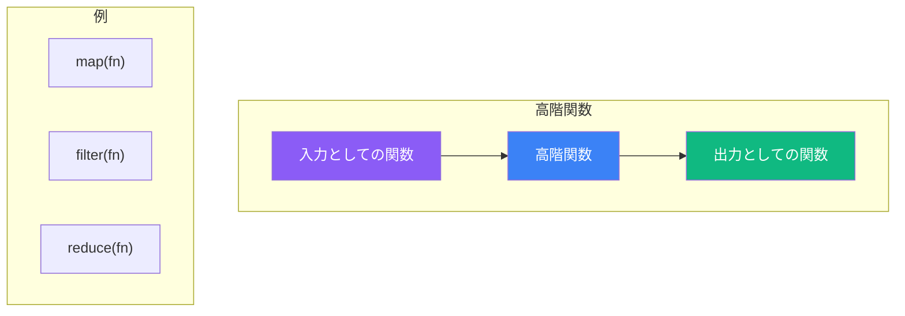
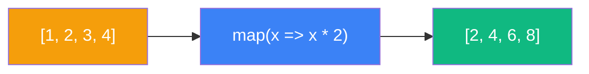
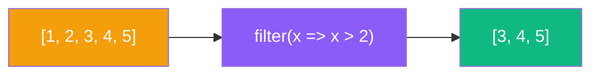
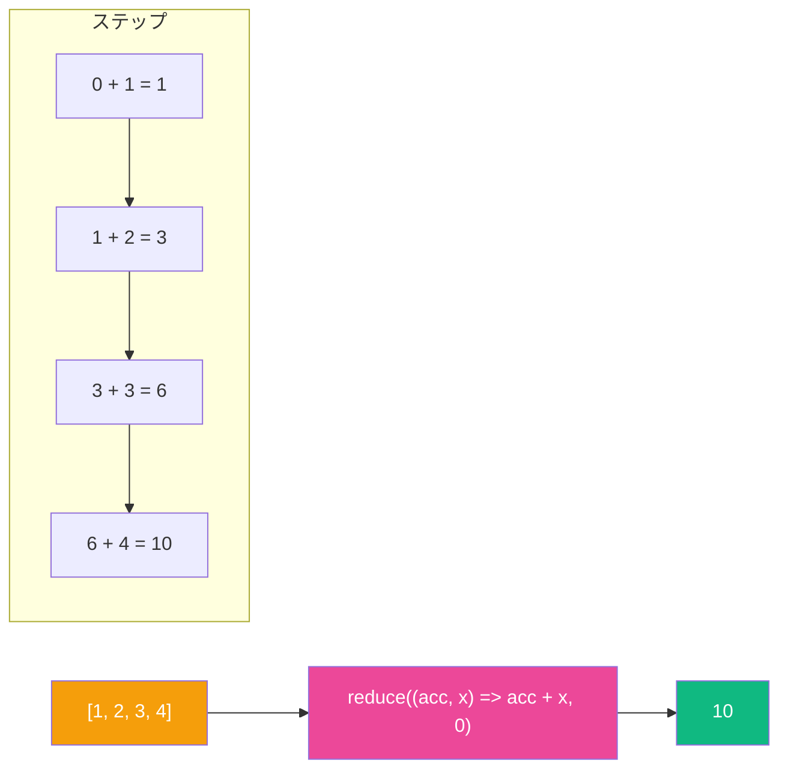
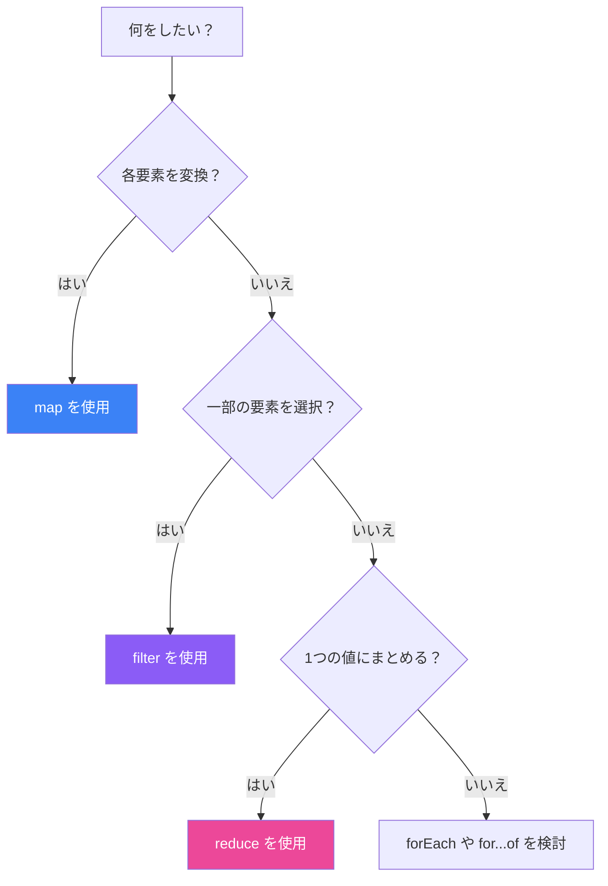

高階関数は、クリーンで宣言的なコードを書くための JavaScript の最も強力な機能の一つです。共通のパターンを抽象化し、表現力豊かにデータを操作できます。この記事では、高階関数とは何かを探り、最も重要な3つの配列メソッド `map`、`filter`、`reduce` をマスターします。

## 高階関数とは？

高階関数とは、以下のいずれかを満たす関数です：

1. **1つ以上の関数を引数として受け取る**、または
2. **関数を戻り値として返す**



```javascript
// 関数を引数として受け取る
function executeOperation(operation, a, b) {
  return operation(a, b);
}

const add = (x, y) => x + y;
const multiply = (x, y) => x * y;

console.log(executeOperation(add, 5, 3));      // 8
console.log(executeOperation(multiply, 5, 3)); // 15

// 関数を返す
function createMultiplier(factor) {
  return (number) => number * factor;
}

const double = createMultiplier(2);
console.log(double(5)); // 10
```

## ビッグスリー: map, filter, reduce

### map: すべての要素を変換

`map` は、元の配列のすべての要素に関数を適用して新しい配列を作成します。変換に最適です。



```javascript
const numbers = [1, 2, 3, 4, 5];

// 各数値を2倍にする
const doubled = numbers.map(n => n * 2);
console.log(doubled); // [2, 4, 6, 8, 10]

// オブジェクトを変換
const users = [
  { name: "Alice", age: 25 },
  { name: "Bob", age: 30 },
  { name: "Charlie", age: 35 }
];

const names = users.map(user => user.name);
console.log(names); // ["Alice", "Bob", "Charlie"]

// 計算されたプロパティを追加
const usersWithId = users.map((user, index) => ({
  ...user,
  id: index + 1
}));
```

**`map` を使うとき：**
- 配列の各要素を変換したい
- 出力配列は入力と同じ長さ
- フィルタリングや集計をしない

### filter: 条件に一致する要素を選択

`filter` は、テストに合格した（コールバックから `true` を返す）要素のみを含む新しい配列を作成します。



```javascript
const numbers = [1, 2, 3, 4, 5, 6, 7, 8, 9, 10];

// 偶数を取得
const evens = numbers.filter(n => n % 2 === 0);
console.log(evens); // [2, 4, 6, 8, 10]

// オブジェクトをフィルタリング
const products = [
  { name: "ノートPC", price: 1000, inStock: true },
  { name: "スマホ", price: 500, inStock: false },
  { name: "タブレット", price: 300, inStock: true },
  { name: "時計", price: 200, inStock: true }
];

// 在庫があり400ドル未満の商品
const affordable = products.filter(
  p => p.inStock && p.price < 400
);
console.log(affordable);
// [{ name: "タブレット", ... }, { name: "時計", ... }]

// falsy な値を削除
const mixed = [0, "hello", "", null, 42, undefined, "world"];
const truthy = mixed.filter(Boolean);
console.log(truthy); // ["hello", 42, "world"]
```

**`filter` を使うとき：**
- 要素のサブセットを選択したい
- 出力は入力より少ない要素になる可能性がある
- 各要素を条件に対してテストしている

### reduce: 単一の値に集約

`reduce` は3つの中で最も強力で柔軟です。結果を蓄積する関数を適用して、配列を単一の値に縮約します。



```javascript
const numbers = [1, 2, 3, 4, 5];

// すべての数値を合計
const sum = numbers.reduce((acc, n) => acc + n, 0);
console.log(sum); // 15

// 最大値を見つける
const max = numbers.reduce((acc, n) => n > acc ? n : acc, numbers[0]);
console.log(max); // 5

// 出現回数をカウント
const fruits = ["apple", "banana", "apple", "orange", "banana", "apple"];
const count = fruits.reduce((acc, fruit) => {
  acc[fruit] = (acc[fruit] || 0) + 1;
  return acc;
}, {});
console.log(count); // { apple: 3, banana: 2, orange: 1 }

// プロパティでグループ化
const people = [
  { name: "Alice", department: "Engineering" },
  { name: "Bob", department: "Marketing" },
  { name: "Charlie", department: "Engineering" },
  { name: "Diana", department: "Marketing" }
];

const byDepartment = people.reduce((acc, person) => {
  const dept = person.department;
  acc[dept] = acc[dept] || [];
  acc[dept].push(person);
  return acc;
}, {});
```

**`reduce` を使うとき：**
- すべての要素を単一の値に結合したい
- 配列からオブジェクトや異なるデータ構造を構築している
- 計算にアキュムレータが必要

## 適切なメソッドの選択



| 操作 | メソッド | 戻り値 |
|------|----------|--------|
| すべての要素を変換 | `map` | 新しい配列（同じ長さ） |
| 条件に合う要素を選択 | `filter` | 新しい配列（元の長さ以下） |
| 単一の値にまとめる | `reduce` | 任意の値 |

## メソッドのチェーン

これらのメソッドの素晴らしい点の一つは、チェーンできることです：

```javascript
const orders = [
  { product: "ノートPC", price: 1000, quantity: 2 },
  { product: "スマホ", price: 500, quantity: 3 },
  { product: "タブレット", price: 300, quantity: 1 },
  { product: "時計", price: 200, quantity: 5 }
];

// 500ドル超の注文の合計金額
const expensiveOrdersTotal = orders
  .filter(order => order.price > 300)        // 高価な商品を選択
  .map(order => order.price * order.quantity) // 合計を計算
  .reduce((sum, total) => sum + total, 0);    // すべてを合計

console.log(expensiveOrdersTotal); // 3500

// 成人の名前をソートして取得
const people = [
  { name: "Charlie", age: 17 },
  { name: "Alice", age: 25 },
  { name: "Bob", age: 30 },
  { name: "Diana", age: 16 }
];

const adultNames = people
  .filter(p => p.age >= 18)
  .map(p => p.name)
  .sort();

console.log(adultNames); // ["Alice", "Bob"]
```

## 一般的なパターンと例

### 配列のフラット化

```javascript
const nested = [[1, 2], [3, 4], [5, 6]];

// reduce を使用
const flattened = nested.reduce((acc, arr) => acc.concat(arr), []);
console.log(flattened); // [1, 2, 3, 4, 5, 6]

// モダンな代替手段: flat()
console.log(nested.flat()); // [1, 2, 3, 4, 5, 6]
```

### 重複の削除

```javascript
const numbers = [1, 2, 2, 3, 3, 3, 4, 4, 5];

// reduce を使用
const unique = numbers.reduce((acc, n) => {
  if (!acc.includes(n)) acc.push(n);
  return acc;
}, []);

// より良い方法: Set を使用
const uniqueSet = [...new Set(numbers)];
console.log(uniqueSet); // [1, 2, 3, 4, 5]
```

### 統計の計算

```javascript
const scores = [85, 90, 78, 92, 88, 76, 95, 89];

const stats = scores.reduce((acc, score, index, array) => {
  acc.sum += score;
  acc.min = Math.min(acc.min, score);
  acc.max = Math.max(acc.max, score);
  if (index === array.length - 1) {
    acc.average = acc.sum / array.length;
  }
  return acc;
}, { sum: 0, min: Infinity, max: -Infinity, average: 0 });

console.log(stats);
// { sum: 693, min: 76, max: 95, average: 86.625 }
```

## パフォーマンスの考慮事項

チェーンは優雅ですが、各メソッドが新しい配列を作成し、すべての要素を反復処理することに注意してください：

```javascript
// 効率が低い: 3回の反復
const result = largeArray
  .filter(x => x > 0)
  .map(x => x * 2)
  .reduce((sum, x) => sum + x, 0);

// より効率的: 1回の反復
const result = largeArray.reduce((sum, x) => {
  if (x > 0) {
    sum += x * 2;
  }
  return sum;
}, 0);
```

小〜中規模の配列では可読性を優先しましょう。大きな配列でパフォーマンスが重要なコードでは、操作を結合することを検討してください。

## まとめ

- **高階関数**は関数を引数として受け取るか、関数を返す
- **`map`** はすべての要素を変換する（配列の長さは同じ）
- **`filter`** はテストに合格した要素を選択する（長さが減る可能性あり）
- **`reduce`** は要素を単一の値に集約する（最も柔軟）
- 読みやすく宣言的なデータ変換のために**メソッドをチェーン**する
- 大きなデータセットを扱う際は**パフォーマンスを考慮**する

これら3つのメソッドをマスターすると、JavaScript の書き方が変わります。読みやすく、テストしやすく、保守しやすい関数型で宣言的なスタイルを促進します。

## 参考資料

- Flanagan, David. *JavaScript: The Definitive Guide*, 7th Edition. O'Reilly Media, 2020.
- Haverbeke, Marijn. *Eloquent JavaScript*, 4th Edition. No Starch Press, 2024.
