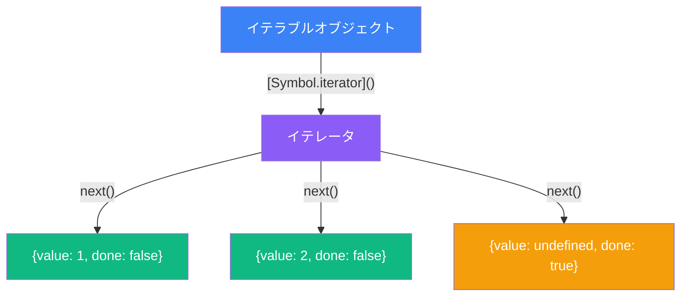
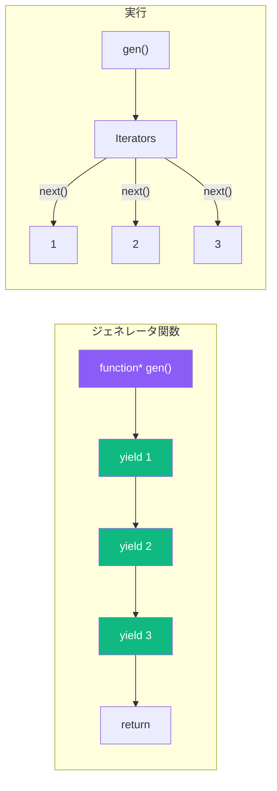
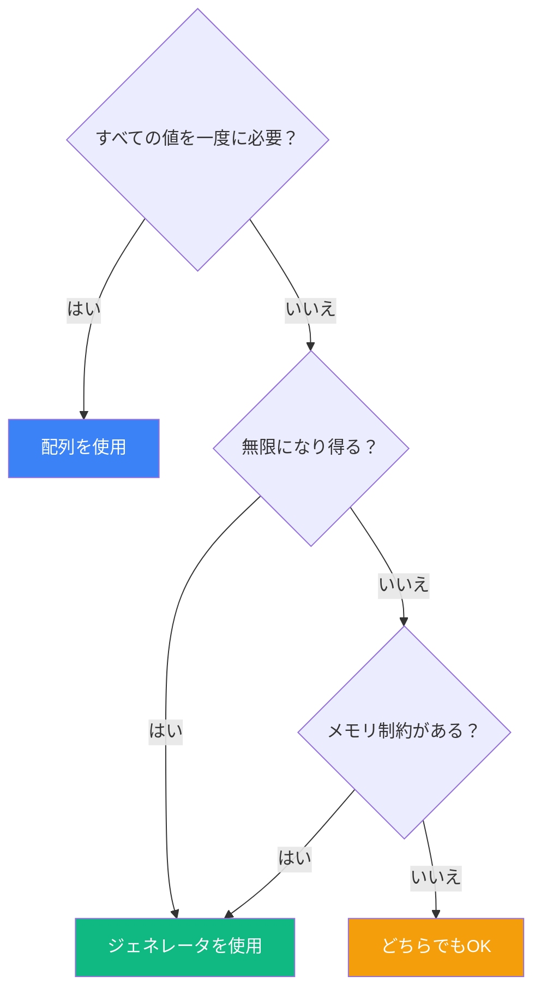

`for...of` ループがどのように動作するか疑問に思ったことはありませんか？配列はスプレッドできるのに、通常のオブジェクトはなぜできないのでしょう？答えは JavaScript のイテレーションプロトコルにあります。これは異なるデータ構造間で一貫した反復処理を可能にする強力な仕組みです。イテレータとジェネレータを探求して、この基本的な概念を理解しましょう。

## イテレーションプロトコル

JavaScript はオブジェクトをイテラブル（反復可能）にする2つのプロトコルを定義しています：

1. **イテラブルプロトコル**: オブジェクトがイテレータを返す `[Symbol.iterator]` メソッドを持っていればイテラブル
2. **イテレータプロトコル**: イテレータは `{ value, done }` を返す `next()` メソッドを持つオブジェクト



```javascript
// 配列はイテラブル
const arr = [1, 2, 3];
const iterator = arr[Symbol.iterator]();

console.log(iterator.next()); // { value: 1, done: false }
console.log(iterator.next()); // { value: 2, done: false }
console.log(iterator.next()); // { value: 3, done: false }
console.log(iterator.next()); // { value: undefined, done: true }
```

## ビルトインのイテラブル

JavaScript にはいくつかのビルトインイテラブルオブジェクトがあります：

```javascript
// 配列
for (const item of [1, 2, 3]) {
  console.log(item);
}

// 文字列
for (const char of "Hello") {
  console.log(char);
}

// Map
const map = new Map([["a", 1], ["b", 2]]);
for (const [key, value] of map) {
  console.log(key, value);
}

// Set
const set = new Set([1, 2, 3]);
for (const item of set) {
  console.log(item);
}

// arguments オブジェクト
function example() {
  for (const arg of arguments) {
    console.log(arg);
  }
}
```

## カスタムイテラブルの作成

イテレーションプロトコルを実装することで、任意のオブジェクトをイテラブルにできます：

```javascript
const range = {
  start: 1,
  end: 5,

  [Symbol.iterator]() {
    let current = this.start;
    const end = this.end;

    return {
      next() {
        if (current <= end) {
          return { value: current++, done: false };
        }
        return { value: undefined, done: true };
      }
    };
  }
};

for (const num of range) {
  console.log(num); // 1, 2, 3, 4, 5
}

// スプレッドも使える
console.log([...range]); // [1, 2, 3, 4, 5]
```

### クラスをイテラブルにする

```javascript
class Playlist {
  constructor() {
    this.songs = [];
  }

  add(song) {
    this.songs.push(song);
    return this;
  }

  [Symbol.iterator]() {
    let index = 0;
    const songs = this.songs;

    return {
      next() {
        if (index < songs.length) {
          return { value: songs[index++], done: false };
        }
        return { done: true };
      }
    };
  }
}

const playlist = new Playlist()
  .add("曲 A")
  .add("曲 B")
  .add("曲 C");

for (const song of playlist) {
  console.log(`再生中: ${song}`);
}
```

## ジェネレータ関数

ジェネレータ関数は、イテレータを作成するより簡単な方法を提供します。`function*` 構文と `yield` キーワードを使用します：



```javascript
function* numberGenerator() {
  yield 1;
  yield 2;
  yield 3;
}

const gen = numberGenerator();
console.log(gen.next()); // { value: 1, done: false }
console.log(gen.next()); // { value: 2, done: false }
console.log(gen.next()); // { value: 3, done: false }
console.log(gen.next()); // { value: undefined, done: true }

// ジェネレータはイテラブル
for (const num of numberGenerator()) {
  console.log(num); // 1, 2, 3
}
```

### ジェネレータによる簡潔な range

range の例はジェネレータを使うとずっとシンプルになります：

```javascript
function* range(start, end) {
  for (let i = start; i <= end; i++) {
    yield i;
  }
}

console.log([...range(1, 5)]); // [1, 2, 3, 4, 5]

for (const num of range(10, 15)) {
  console.log(num); // 10, 11, 12, 13, 14, 15
}
```

## 遅延評価

ジェネレータの最も強力な機能の一つは遅延評価です。値は必要になったときだけ計算されます：

```javascript
function* infiniteSequence() {
  let n = 0;
  while (true) {
    yield n++;
  }
}

// ハングしない！値はオンデマンドで生成される
const infinite = infiniteSequence();
console.log(infinite.next().value); // 0
console.log(infinite.next().value); // 1
console.log(infinite.next().value); // 2

// 最初の5つの値を取得
function* take(iterable, count) {
  let i = 0;
  for (const item of iterable) {
    if (i >= count) return;
    yield item;
    i++;
  }
}

console.log([...take(infiniteSequence(), 5)]); // [0, 1, 2, 3, 4]
```

### フィボナッチ数列

```javascript
function* fibonacci() {
  let [prev, curr] = [0, 1];
  while (true) {
    yield curr;
    [prev, curr] = [curr, prev + curr];
  }
}

// 最初の10個のフィボナッチ数を取得
const fib = fibonacci();
const first10 = [];
for (let i = 0; i < 10; i++) {
  first10.push(fib.next().value);
}
console.log(first10); // [1, 1, 2, 3, 5, 8, 13, 21, 34, 55]
```

## yield* による委譲

`yield*` 式は別のイテラブルまたはジェネレータに委譲します：

```javascript
function* inner() {
  yield 2;
  yield 3;
}

function* outer() {
  yield 1;
  yield* inner(); // inner ジェネレータに委譲
  yield 4;
}

console.log([...outer()]); // [1, 2, 3, 4]

// ネストした配列のフラット化
function* flatten(arr) {
  for (const item of arr) {
    if (Array.isArray(item)) {
      yield* flatten(item); // 再帰的な委譲
    } else {
      yield item;
    }
  }
}

const nested = [1, [2, [3, 4]], 5];
console.log([...flatten(nested)]); // [1, 2, 3, 4, 5]
```

## 双方向通信

ジェネレータは `next()` を通じて値を受け取ることができます：

```javascript
function* conversation() {
  const name = yield "お名前は？";
  const hobby = yield `こんにちは、${name}さん！趣味は何ですか？`;
  yield `${hobby}は楽しそうですね、${name}さん！`;
}

const talk = conversation();
console.log(talk.next().value);        // "お名前は？"
console.log(talk.next("太郎").value);  // "こんにちは、太郎さん！趣味は何ですか？"
console.log(talk.next("プログラミング").value); // "プログラミングは楽しそうですね、太郎さん！"
```

## 実践的なユースケース

### ページネーションされた API データ

```javascript
async function* fetchPages(baseUrl) {
  let page = 1;
  let hasMore = true;

  while (hasMore) {
    const response = await fetch(`${baseUrl}?page=${page}`);
    const data = await response.json();

    yield data.items;

    hasMore = data.hasNextPage;
    page++;
  }
}

// 使用例
async function processAllPages() {
  for await (const items of fetchPages("/api/products")) {
    for (const item of items) {
      console.log(item);
    }
  }
}
```

### ツリーの走査

```javascript
function* traverseTree(node) {
  yield node.value;

  if (node.children) {
    for (const child of node.children) {
      yield* traverseTree(child);
    }
  }
}

const tree = {
  value: 1,
  children: [
    { value: 2, children: [{ value: 4 }, { value: 5 }] },
    { value: 3, children: [{ value: 6 }] }
  ]
};

console.log([...traverseTree(tree)]); // [1, 2, 4, 5, 3, 6]
```

### ID ジェネレータ

```javascript
function* idGenerator(prefix = "id") {
  let id = 1;
  while (true) {
    yield `${prefix}-${id++}`;
  }
}

const userIdGen = idGenerator("user");
const orderIdGen = idGenerator("order");

console.log(userIdGen.next().value);  // "user-1"
console.log(userIdGen.next().value);  // "user-2"
console.log(orderIdGen.next().value); // "order-1"
```

## イテラブル vs 配列



| 特徴 | 配列 | イテレータ/ジェネレータ |
|------|------|------------------------|
| メモリ | すべての値を保存 | オンデマンドで値を生成 |
| 無限シーケンス | 不可能 | 可能 |
| 複数回の反復 | 可能 | 1回のみ |
| ランダムアクセス | 可能（`arr[i]`） | 不可能 |

## まとめ

- **イテレーションプロトコル**は、イテラブル（`[Symbol.iterator]` を持つ）とイテレータ（`next()` を持つ）で構成される
- ビルトインのイテラブルには配列、文字列、Map、Set などがある
- `[Symbol.iterator]()` を実装して**カスタムイテラブル**を作成できる
- **ジェネレータ関数**（`function*`）はイテレータを作成する簡単な方法を提供
- `yield` は実行を一時停止し値を生成する
- `yield*` は別のイテラブルに委譲する
- ジェネレータは**遅延評価**を可能にし、無限シーケンスを扱える
- 非同期イテレーションには **`for await...of`** を使用

イテレータとジェネレータを理解すると、単純な変換から複雑な非同期データストリームまで、データのシーケンスを扱う強力なパターンが使えるようになります。

## 参考資料

- Flanagan, David. *JavaScript: The Definitive Guide*, 7th Edition. O'Reilly Media, 2020.
- Haverbeke, Marijn. *Eloquent JavaScript*, 4th Edition. No Starch Press, 2024.
