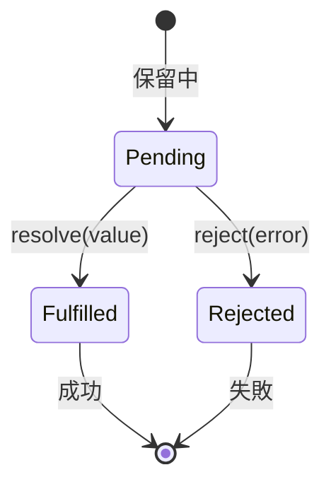
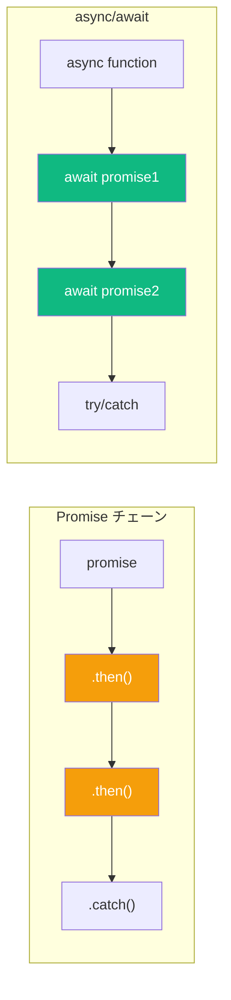

JavaScript は非同期操作を処理する2つの方法を提供します：`.then()` チェーンを使った Promise と、より現代的な `async/await` 構文です。`async/await` は Promise の上に構築されていますが、使い勝手とユースケースは異なります。両方のアプローチを探り、いつどちらを使うべきか学びましょう。

## おさらい：Promise とは？

Promise は、まだ利用できないかもしれない値を表します。3つの状態のいずれかになります：



```javascript
const promise = new Promise((resolve, reject) => {
  // 非同期操作
  setTimeout(() => {
    const success = true;
    if (success) {
      resolve("データを読み込みました");
    } else {
      reject(new Error("読み込みに失敗しました"));
    }
  }, 1000);
});
```

## Promise チェーン vs async/await

同じタスク（ユーザーデータとその投稿を取得する）で両方のアプローチを比較しましょう。

### Promise チェーンのアプローチ

```javascript
function getUserWithPosts(userId) {
  return fetch(`/api/users/${userId}`)
    .then(response => response.json())
    .then(user => {
      return fetch(`/api/users/${userId}/posts`)
        .then(response => response.json())
        .then(posts => ({ user, posts }));
    });
}

getUserWithPosts(1)
  .then(({ user, posts }) => {
    console.log(user, posts);
  })
  .catch(error => {
    console.error(error);
  });
```

### async/await のアプローチ

```javascript
async function getUserWithPosts(userId) {
  const userResponse = await fetch(`/api/users/${userId}`);
  const user = await userResponse.json();

  const postsResponse = await fetch(`/api/users/${userId}/posts`);
  const posts = await postsResponse.json();

  return { user, posts };
}

try {
  const { user, posts } = await getUserWithPosts(1);
  console.log(user, posts);
} catch (error) {
  console.error(error);
}
```

`async/await` バージョンは同期コードのように読めるため、フローを理解しやすくなります。

## 構文の比較



| 特徴 | Promise チェーン | async/await |
|------|-----------------|-------------|
| 構文 | `.then()`、`.catch()` | `await`、`try/catch` |
| 可読性 | 順次操作ではネストする | 線形で同期コードのよう |
| エラー処理 | `.catch()` または第2引数 | `try/catch` ブロック |
| デバッグ | ステップ実行が難しい | 同期コードのように簡単 |

## エラー処理

### Promise: .catch() メソッド

```javascript
fetchUser(1)
  .then(user => fetchPosts(user.id))
  .then(posts => console.log(posts))
  .catch(error => {
    // チェーン内のどのエラーもキャッチ
    console.error("エラー:", error.message);
  });
```

### async/await: try/catch

```javascript
async function loadUserPosts() {
  try {
    const user = await fetchUser(1);
    const posts = await fetchPosts(user.id);
    console.log(posts);
  } catch (error) {
    // 同期コードと同じエラー処理パターン
    console.error("エラー:", error.message);
  }
}
```

### 特定のエラーを処理

```javascript
async function loadData() {
  try {
    const user = await fetchUser(1);

    try {
      const posts = await fetchPosts(user.id);
      return { user, posts };
    } catch (postsError) {
      // 投稿のエラーを特別に処理
      return { user, posts: [] };
    }
  } catch (userError) {
    // ユーザーのエラーを処理
    throw new Error("ユーザーを読み込めませんでした");
  }
}
```

## 並列実行

`async/await` でよくある間違いは、並列実行できる操作を順次実行してしまうことです。

### 順次実行（遅い）

```javascript
async function loadAll() {
  const users = await fetchUsers();    // 待機...
  const posts = await fetchPosts();    // 待機...
  const comments = await fetchComments(); // 待機...
  return { users, posts, comments };
}
// 合計時間: users + posts + comments
```

### Promise.all で並列実行（速い）

```javascript
async function loadAll() {
  const [users, posts, comments] = await Promise.all([
    fetchUsers(),
    fetchPosts(),
    fetchComments()
  ]);
  return { users, posts, comments };
}
// 合計時間: max(users, posts, comments)
```



```mermaid
gantt
    title 実行時間の比較
    dateFormat X
    axisFormat %s

    section 順次実行
    fetchUsers    :0, 3
    fetchPosts    :3, 5
    fetchComments :5, 7

    section 並列実行
    fetchUsers    :0, 3
    fetchPosts    :0, 2
    fetchComments :0, 2
```

## Promise コンビネータ

JavaScript は複数の Promise を処理するためのいくつかのメソッドを提供します：

### Promise.all - すべて成功が必要

```javascript
const results = await Promise.all([
  fetchUser(1),
  fetchUser(2),
  fetchUser(3)
]);
// 結果の配列を返す
// いずれかの Promise が reject されると reject
```

### Promise.allSettled - すべての結果を取得

```javascript
const results = await Promise.allSettled([
  fetchUser(1),
  fetchUser(2), // これは失敗
  fetchUser(3)
]);
// { status, value/reason } の配列を返す
// reject されない
// [
//   { status: "fulfilled", value: user1 },
//   { status: "rejected", reason: Error },
//   { status: "fulfilled", value: user3 }
// ]
```

### Promise.race - 最初に完了したもの

```javascript
const result = await Promise.race([
  fetchFromServer1(),
  fetchFromServer2()
]);
// 最初に resolve/reject された結果を返す
```

### Promise.any - 最初の成功

```javascript
const result = await Promise.any([
  fetchFromServer1(), // 失敗
  fetchFromServer2(), // 最初に成功
  fetchFromServer3()
]);
// 最初に fulfilled された結果を返す
// すべての Promise が reject された場合のみ reject
```

## どちらを使うべきか

### async/await を使う場面:

- 互いに依存する順次操作
- 複雑な制御フロー（条件、ループ）
- try/catch によるよりクリーンなエラー処理
- より簡単なデバッグが必要な場合

```javascript
async function processItems(items) {
  const results = [];

  for (const item of items) {
    if (item.needsProcessing) {
      const result = await processItem(item);
      results.push(result);
    }
  }

  return results;
}
```

### Promise チェーンを使う場面:

- シンプルな変換
- 関数型プログラミングスタイル
- 再利用可能な Promise パイプラインの構築

```javascript
function processUser(userId) {
  return fetchUser(userId)
    .then(user => enrichUserData(user))
    .then(user => validateUser(user))
    .then(user => saveUser(user));
}
```

### 適切に組み合わせる

```javascript
async function complexOperation() {
  // 明確さのために await を使用
  const user = await fetchUser(1);

  // 並列操作には Promise.all を使用
  const [posts, followers] = await Promise.all([
    fetchPosts(user.id),
    fetchFollowers(user.id)
  ]);

  // シンプルな変換にはチェーンを使用
  const enrichedPosts = await Promise.all(
    posts.map(post =>
      fetchComments(post.id)
        .then(comments => ({ ...post, comments }))
    )
  );

  return { user, posts: enrichedPosts, followers };
}
```

## 一般的なパターン

### 指数バックオフによるリトライ

```javascript
async function fetchWithRetry(url, maxRetries = 3) {
  for (let i = 0; i < maxRetries; i++) {
    try {
      return await fetch(url);
    } catch (error) {
      if (i === maxRetries - 1) throw error;
      await new Promise(r => setTimeout(r, 2 ** i * 1000));
    }
  }
}
```

### タイムアウトラッパー

```javascript
function withTimeout(promise, ms) {
  const timeout = new Promise((_, reject) =>
    setTimeout(() => reject(new Error("タイムアウト")), ms)
  );
  return Promise.race([promise, timeout]);
}

// 使用例
const data = await withTimeout(fetchData(), 5000);
```

### 結果付き順次処理

```javascript
async function processSequentially(items, processor) {
  const results = [];
  for (const item of items) {
    results.push(await processor(item));
  }
  return results;
}

// または reduce を使ったより関数型なスタイル
function processSequentially(items, processor) {
  return items.reduce(
    (promise, item) =>
      promise.then(results =>
        processor(item).then(result => [...results, result])
      ),
    Promise.resolve([])
  );
}
```

## まとめ

| 側面 | Promise チェーン | async/await |
|------|-----------------|-------------|
| 可読性 | 中程度 | 高い |
| エラー処理 | `.catch()` | `try/catch` |
| デバッグ | 難しい | 簡単 |
| 並列操作 | `Promise.all()` | `Promise.all()` + await |
| 順次操作 | ネストした `.then()` | 線形コード |
| 適した用途 | シンプルなチェーン、FPスタイル | 複雑なフロー |

両方のアプローチは有効で、多くの場合一緒に使うのが最適です。可読性から `async/await` をほとんどのケースで使用しますが、並列実行や特定のコンビネータの動作が必要な場合は `Promise.all()` などの Promise メソッドを躊躇なく使いましょう。

## 参考資料

- Flanagan, David. *JavaScript: The Definitive Guide*, 7th Edition. O'Reilly Media, 2020.
- Osmani, Addy. *Learning JavaScript Design Patterns*, 2nd Edition. O'Reilly Media, 2023.
