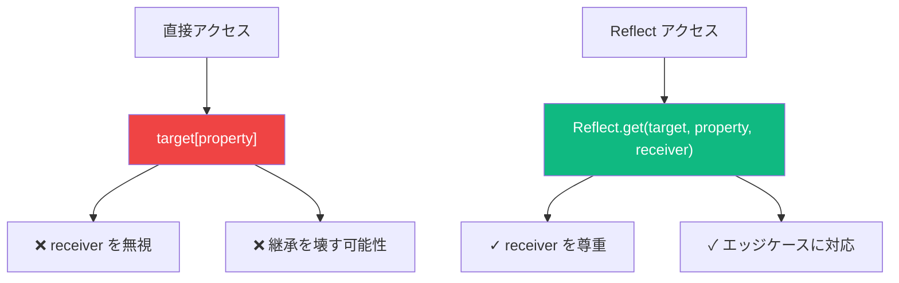

JavaScript の Proxy は、オブジェクトの操作を傍受してカスタマイズできる強力なメタプログラミング機能です。Proxy を使えば、予想外の振る舞いをするオブジェクトを作成したり、バリデーション、ロギング、さらにはリアクティブシステムを構築することもできます。Proxy の仕組みと実践的な応用を探っていきましょう。

## Proxy とは？

Proxy はオブジェクト（「ターゲット」と呼ばれる）をラップし、ハンドラオブジェクトで定義された「トラップ」を通じて、プロパティアクセス、代入、関数呼び出しなどの操作を傍受します。


```javascript
const target = {
  message: "Hello, World!"
};

const handler = {
  get(target, property) {
    console.log(`プロパティにアクセス: ${property}`);
    return target[property];
  }
};

const proxy = new Proxy(target, handler);

console.log(proxy.message);
// ログ: "プロパティにアクセス: message"
// 戻り値: "Hello, World!"
```

## 一般的なトラップ

ハンドラオブジェクトは、さまざまな操作を傍受するトラップを定義できます：

| トラップ | 傍受する操作 |
|----------|--------------|
| `get` | プロパティの読み取り（`obj.prop`） |
| `set` | プロパティの書き込み（`obj.prop = value`） |
| `has` | `in` 演算子 |
| `deleteProperty` | `delete` 演算子 |
| `apply` | 関数呼び出し |
| `construct` | `new` 演算子 |
| `ownKeys` | `Object.keys()`、`for...in` |
| `getOwnPropertyDescriptor` | `Object.getOwnPropertyDescriptor()` |

## get と set トラップ

最もよく使われるトラップは `get` と `set` です：

```javascript
const user = {
  firstName: "太郎",
  lastName: "山田",
  age: 30
};

const handler = {
  get(target, property) {
    if (property === "fullName") {
      return `${target.lastName} ${target.firstName}`;
    }
    return property in target ? target[property] : `プロパティ "${property}" は見つかりません`;
  },

  set(target, property, value) {
    if (property === "age" && typeof value !== "number") {
      throw new TypeError("年齢は数値でなければなりません");
    }
    if (property === "age" && value < 0) {
      throw new RangeError("年齢は負の数にできません");
    }
    target[property] = value;
    return true; // 成功を示す
  }
};

const proxyUser = new Proxy(user, handler);

console.log(proxyUser.fullName);     // "山田 太郎"（計算されたプロパティ）
console.log(proxyUser.unknown);       // "プロパティ "unknown" は見つかりません"

proxyUser.age = 31;                   // OK
proxyUser.age = -5;                   // RangeError: 年齢は負の数にできません
proxyUser.age = "三十";               // TypeError: 年齢は数値でなければなりません
```

## 実践的なユースケース

### 1. バリデーション

データを自動的に検証するオブジェクトを作成：

```javascript
function createValidator(schema) {
  return {
    set(target, property, value) {
      if (property in schema) {
        const validator = schema[property];
        if (!validator(value)) {
          throw new Error(`${property} の値が無効です`);
        }
      }
      target[property] = value;
      return true;
    }
  };
}

const userSchema = {
  email: (v) => /^[^\s@]+@[^\s@]+\.[^\s@]+$/.test(v),
  age: (v) => typeof v === "number" && v >= 0 && v <= 150,
  name: (v) => typeof v === "string" && v.length > 0
};

const user = new Proxy({}, createValidator(userSchema));

user.name = "Alice";                  // OK
user.email = "alice@example.com";     // OK
user.age = 25;                        // OK

user.email = "invalid-email";         // Error: email の値が無効です
user.age = -5;                        // Error: age の値が無効です
```

### 2. ロギングとデバッグ

オブジェクトのすべての操作を追跡：

```javascript
function createLoggingProxy(target, name = "Object") {
  return new Proxy(target, {
    get(target, property) {
      console.log(`[GET] ${name}.${String(property)}`);
      return target[property];
    },
    set(target, property, value) {
      console.log(`[SET] ${name}.${String(property)} = ${JSON.stringify(value)}`);
      target[property] = value;
      return true;
    },
    deleteProperty(target, property) {
      console.log(`[DELETE] ${name}.${String(property)}`);
      delete target[property];
      return true;
    }
  });
}

const config = createLoggingProxy({ debug: false }, "config");

config.debug = true;      // [SET] config.debug = true
console.log(config.debug); // [GET] config.debug
delete config.debug;       // [DELETE] config.debug
```

### 3. デフォルト値

存在しないプロパティにデフォルト値を提供：

```javascript
function withDefaults(target, defaults) {
  return new Proxy(target, {
    get(target, property) {
      if (property in target) {
        return target[property];
      }
      return defaults[property];
    }
  });
}

const settings = withDefaults(
  { theme: "dark" },
  { theme: "light", language: "ja", fontSize: 14 }
);

console.log(settings.theme);    // "dark"（ターゲットから）
console.log(settings.language); // "ja"（デフォルトから）
console.log(settings.fontSize); // 14（デフォルトから）
```

### 4. 負のインデックス

Python スタイルの負のインデックスを有効にする：

```javascript
function createNegativeArray(array) {
  return new Proxy(array, {
    get(target, property) {
      const index = Number(property);
      if (!isNaN(index) && index < 0) {
        return target[target.length + index];
      }
      return target[property];
    },
    set(target, property, value) {
      const index = Number(property);
      if (!isNaN(index) && index < 0) {
        target[target.length + index] = value;
      } else {
        target[property] = value;
      }
      return true;
    }
  });
}

const arr = createNegativeArray([1, 2, 3, 4, 5]);

console.log(arr[-1]); // 5（最後の要素）
console.log(arr[-2]); // 4（最後から2番目）

arr[-1] = 10;
console.log(arr); // [1, 2, 3, 4, 10]
```

### 5. オブザーバブルオブジェクト（リアクティブプログラミング）

変更時に通知するオブジェクトを作成：

```javascript
function createObservable(target, callback) {
  return new Proxy(target, {
    set(target, property, value) {
      const oldValue = target[property];
      target[property] = value;
      callback(property, value, oldValue);
      return true;
    }
  });
}

const state = createObservable(
  { count: 0, name: "App" },
  (property, newValue, oldValue) => {
    console.log(`${property} が ${oldValue} から ${newValue} に変更されました`);
  }
);

state.count = 1;    // "count が 0 から 1 に変更されました"
state.name = "New"; // "name が App から New に変更されました"
```

## Reflect API

Reflect API は Proxy トラップに対応するメソッドを提供します。Reflect を使用すると適切なデフォルトの動作が保証されます：

```javascript
const handler = {
  get(target, property, receiver) {
    console.log(`${String(property)} を取得`);
    // 適切なデフォルトの動作のために Reflect を使用
    return Reflect.get(target, property, receiver);
  },

  set(target, property, value, receiver) {
    console.log(`${String(property)} を ${value} に設定`);
    // 成功/失敗を示す true/false を返す
    return Reflect.set(target, property, value, receiver);
  }
};

const obj = new Proxy({ x: 1 }, handler);
obj.x = 2; // getter/setter と継承を適切に処理
```

### なぜ Reflect を使うのか？



```javascript
const parent = {
  get value() {
    return this._value * 2;
  }
};

const child = Object.create(parent);
child._value = 5;

const proxy = new Proxy(child, {
  get(target, property, receiver) {
    // Reflect なしでは、getter 内の 'this' が間違ったものになる
    return Reflect.get(target, property, receiver);
  }
});

console.log(proxy.value); // 10（'this' として proxy を正しく使用）
```

## 取り消し可能な Proxy

無効化できる Proxy を作成：

```javascript
const { proxy, revoke } = Proxy.revocable(
  { secret: "password123" },
  {
    get(target, property) {
      return target[property];
    }
  }
);

console.log(proxy.secret); // "password123"

revoke(); // Proxy を無効化

console.log(proxy.secret); // TypeError: 取り消された proxy に対して 'get' を実行できません
```

これは一時的なアクセスパターンやセキュリティ重視のシナリオに便利です。

## パフォーマンスの考慮事項

Proxy はオブジェクト操作にオーバーヘッドを追加します。パフォーマンスが重要なコードでは：

```javascript
// 遅い: 頻繁にアクセスされるオブジェクトへの Proxy
const proxyData = new Proxy(data, handler);
for (let i = 0; i < 1000000; i++) {
  proxyData.value; // 毎回トラップが呼ばれる
}

// 速い: 可能な場合はターゲットに直接アクセス
const value = proxyData.value; // 一度だけ取得
for (let i = 0; i < 1000000; i++) {
  // キャッシュした値を使用
}
```

## まとめ

- **Proxy** はオブジェクトをラップして操作を傍受・カスタマイズする
- **トラップ**は特定の操作を傍受するハンドラメソッド
- よく使われるトラップ: `get`、`set`、`has`、`deleteProperty`、`apply`
- ユースケースには**バリデーション**、**ロギング**、**デフォルト値**、**リアクティブプログラミング**がある
- **Reflect** API はデフォルトのトラップ動作を提供
- **取り消し可能な Proxy** は必要に応じて無効化できる
- ホットパスで Proxy を使用する際は**パフォーマンス**を考慮

Proxy は、通常の JavaScript オブジェクトでは不可能なパターンを可能にする強力なメタプログラミングツールです。パフォーマンスのオーバーヘッドはありますが、その柔軟性からフレームワーク、バリデーションシステム、リアクティブアーキテクチャの構築に非常に有用です。

## 参考資料

- Flanagan, David. *JavaScript: The Definitive Guide*, 7th Edition. O'Reilly Media, 2020.
- [MDN Web Docs: Proxy](https://developer.mozilla.org/ja/docs/Web/JavaScript/Reference/Global_Objects/Proxy)
