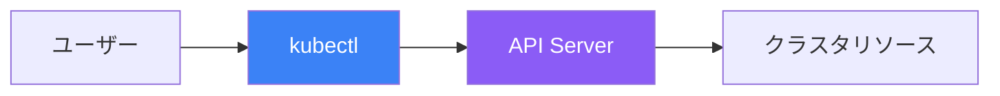

kubectlはKubernetesクラスタとやり取りするためのコマンドラインインターフェースです。この記事では、効果的なクラスタ管理のための必須コマンドとテクニックを解説します。

## kubectlとは？

kubectl（「キューブコントロール」または「キューブシーティーエル」と発音）はKubernetes公式のCLIツールです。Kubernetes APIサーバーと通信してクラスタリソースを管理します。



## 設定とコンテキスト

### kubeconfigファイル

kubectlは設定ファイル（通常は`~/.kube/config`）を使用してクラスタ接続情報を保存します。

```yaml
# ~/.kube/config 構造
apiVersion: v1
kind: Config
clusters:
  - name: production
    cluster:
      server: https://prod-cluster.example.com
      certificate-authority: /path/to/ca.crt
  - name: development
    cluster:
      server: https://dev-cluster.example.com
contexts:
  - name: prod-context
    context:
      cluster: production
      user: admin
      namespace: default
  - name: dev-context
    context:
      cluster: development
      user: developer
current-context: dev-context
users:
  - name: admin
    user:
      client-certificate: /path/to/cert.crt
      client-key: /path/to/key.key
```

### コンテキストコマンド

```bash
# 現在のコンテキストを表示
kubectl config current-context

# すべてのコンテキストを一覧表示
kubectl config get-contexts

# コンテキストを切り替え
kubectl config use-context prod-context

# コンテキストのデフォルトnamespaceを設定
kubectl config set-context --current --namespace=my-namespace

# 設定全体を表示
kubectl config view
```

## 基本リソースコマンド

### リソースの表示

```bash
# リソースを取得（pods、services、deploymentsなど）
kubectl get pods
kubectl get services
kubectl get deployments
kubectl get all

# すべてのnamespaceのリソースを取得
kubectl get pods --all-namespaces
kubectl get pods -A  # 短縮形

# 詳細情報付きでリソースを取得
kubectl get pods -o wide

# 異なる出力形式でリソースを取得
kubectl get pods -o yaml
kubectl get pods -o json
kubectl get pods -o name

# カスタムカラム出力
kubectl get pods -o custom-columns=NAME:.metadata.name,STATUS:.status.phase

# リアルタイムでリソースを監視
kubectl get pods -w
kubectl get pods --watch
```

### リソースの詳細表示

```bash
# リソースの詳細情報を取得
kubectl describe pod my-pod
kubectl describe deployment my-deployment
kubectl describe node my-node

# 複数リソースの詳細表示
kubectl describe pods
```

### リソースの作成

```bash
# YAMLファイルから作成
kubectl apply -f deployment.yaml
kubectl create -f deployment.yaml

# URLから作成
kubectl apply -f https://example.com/deployment.yaml

# 複数ファイルから作成
kubectl apply -f ./manifests/

# 標準入力から作成
cat <<EOF | kubectl apply -f -
apiVersion: v1
kind: Pod
metadata:
  name: nginx
spec:
  containers:
  - name: nginx
    image: nginx
EOF

# 命令的な作成
kubectl create deployment nginx --image=nginx
kubectl create service clusterip nginx --tcp=80:80
kubectl create configmap my-config --from-literal=key=value
kubectl create secret generic my-secret --from-literal=password=secret
```

### リソースの更新

```bash
# ファイルから変更を適用
kubectl apply -f deployment.yaml

# リソースを直接編集
kubectl edit deployment my-deployment

# イメージを更新
kubectl set image deployment/my-deployment container=nginx:1.25

# Deploymentをスケール
kubectl scale deployment my-deployment --replicas=5

# リソースをパッチ
kubectl patch deployment my-deployment -p '{"spec":{"replicas":3}}'

# リソースを置換（削除して再作成）
kubectl replace -f deployment.yaml
```

### リソースの削除

```bash
# 名前で削除
kubectl delete pod my-pod
kubectl delete deployment my-deployment

# ファイルから削除
kubectl delete -f deployment.yaml

# namespace内のすべてのPodを削除
kubectl delete pods --all

# ラベルセレクタで削除
kubectl delete pods -l app=nginx

# 強制削除（graceful terminationをスキップ）
kubectl delete pod my-pod --force --grace-period=0
```

## ラベルとセレクタ

### ラベルの操作

```bash
# ラベルを表示
kubectl get pods --show-labels

# ラベルを追加
kubectl label pod my-pod environment=production

# ラベルを更新（上書き）
kubectl label pod my-pod environment=staging --overwrite

# ラベルを削除
kubectl label pod my-pod environment-

# ラベルでフィルタ
kubectl get pods -l app=nginx
kubectl get pods -l 'app in (nginx, apache)'
kubectl get pods -l app!=nginx
kubectl get pods -l 'environment,tier=frontend'
```

### アノテーション

```bash
# アノテーションを追加
kubectl annotate pod my-pod description="My application"

# アノテーションを削除
kubectl annotate pod my-pod description-

# アノテーションを表示
kubectl get pod my-pod -o jsonpath='{.metadata.annotations}'
```

## デバッグコマンド

### ログ

```bash
# Podのログを表示
kubectl logs my-pod

# リアルタイムでログを追跡
kubectl logs -f my-pod

# 特定のコンテナのログを表示
kubectl logs my-pod -c my-container

# 前のコンテナのログを表示（再起動後）
kubectl logs my-pod --previous

# 最後のN行を表示
kubectl logs my-pod --tail=100

# 時間以降のログを表示
kubectl logs my-pod --since=1h
kubectl logs my-pod --since-time=2025-01-18T10:00:00Z

# ラベル付きのすべてのPodのログを表示
kubectl logs -l app=nginx --all-containers
```

### コマンド実行

```bash
# コンテナ内でコマンドを実行
kubectl exec my-pod -- ls /app

# 対話型シェル
kubectl exec -it my-pod -- /bin/bash
kubectl exec -it my-pod -- /bin/sh

# 特定のコンテナで実行
kubectl exec -it my-pod -c my-container -- /bin/bash

# ワンオフコマンドを実行
kubectl run debug --image=busybox --rm -it -- /bin/sh
```

### ポートフォワーディング

```bash
# ローカルポートをPodに転送
kubectl port-forward my-pod 8080:80

# Serviceに転送
kubectl port-forward svc/my-service 8080:80

# Deploymentに転送
kubectl port-forward deployment/my-deployment 8080:80

# すべてのインターフェースでリッスン
kubectl port-forward --address 0.0.0.0 my-pod 8080:80
```

### ファイルコピー

```bash
# Podからローカルにコピー
kubectl cp my-pod:/app/logs/app.log ./app.log

# ローカルからPodにコピー
kubectl cp ./config.yaml my-pod:/app/config.yaml

# 特定のコンテナでコピー
kubectl cp my-pod:/app/data ./data -c my-container
```

## リソース管理

### リソース使用量

```bash
# ノードのリソース使用量を表示
kubectl top nodes

# Podのリソース使用量を表示
kubectl top pods
kubectl top pods --all-namespaces
kubectl top pods --containers

# CPUまたはメモリでソート
kubectl top pods --sort-by=cpu
kubectl top pods --sort-by=memory
```

### ドライランと差分

```bash
# 適用せずに変更をプレビュー
kubectl apply -f deployment.yaml --dry-run=client
kubectl apply -f deployment.yaml --dry-run=server

# 作成せずにYAMLを生成
kubectl create deployment nginx --image=nginx --dry-run=client -o yaml

# 適用前に差分を表示
kubectl diff -f deployment.yaml
```

## 便利なショートカットとヒント

### コマンドエイリアス

```bash
# ~/.bashrcまたは~/.zshrcに追加
alias k='kubectl'
alias kgp='kubectl get pods'
alias kgs='kubectl get services'
alias kgd='kubectl get deployments'
alias kga='kubectl get all'
alias kd='kubectl describe'
alias kl='kubectl logs'
alias ke='kubectl exec -it'
alias ka='kubectl apply -f'
alias kdel='kubectl delete'
```

### シェル自動補完

```bash
# Bash
source <(kubectl completion bash)
echo 'source <(kubectl completion bash)' >> ~/.bashrc

# Zsh
source <(kubectl completion zsh)
echo 'source <(kubectl completion zsh)' >> ~/.zshrc

# エイリアスと併用
complete -o default -F __start_kubectl k
```

### JSONPathクエリ

```bash
# 特定のフィールドを取得
kubectl get pod my-pod -o jsonpath='{.status.phase}'

# 複数フィールドを取得
kubectl get pods -o jsonpath='{range .items[*]}{.metadata.name}{"\t"}{.status.phase}{"\n"}{end}'

# コンテナイメージを取得
kubectl get pods -o jsonpath='{.items[*].spec.containers[*].image}'

# ノードIPを取得
kubectl get nodes -o jsonpath='{.items[*].status.addresses[?(@.type=="InternalIP")].address}'
```

## 一般的なコマンドリファレンス

| コマンド | 説明 |
|---------|------|
| `kubectl get` | リソースを一覧表示 |
| `kubectl describe` | リソースの詳細情報を表示 |
| `kubectl create` | リソースを命令的に作成 |
| `kubectl apply` | 設定を宣言的に適用 |
| `kubectl delete` | リソースを削除 |
| `kubectl edit` | エディタでリソースを編集 |
| `kubectl exec` | コンテナ内でコマンドを実行 |
| `kubectl logs` | コンテナログを表示 |
| `kubectl port-forward` | ポートをPodに転送 |
| `kubectl cp` | Pod間でファイルをコピー |
| `kubectl top` | リソース使用量を表示 |
| `kubectl scale` | Deploymentをスケール |
| `kubectl rollout` | ロールアウトを管理 |

## 重要なポイント

1. **基本をマスター** - get、describe、apply、deleteがコアコマンド
2. **コンテキストを活用** - クラスタとnamespace間を簡単に切り替え
3. **すべてにラベルを付ける** - ラベルがフィルタリングと選択を強力に
4. **JSONPathを学ぶ** - リソースから特定のデータを抽出
5. **エイリアスを設定** - コマンドショートカットで時間を節約
6. **dry-runを使用** - 適用前に変更をプレビュー

## 次のステップ

次の記事では、Kubernetesの基本的な構成要素であるPodについて詳しく解説します。

## 参考文献

- The Kubernetes Book, 3rd Edition - Nigel Poulton
- Kubernetes: Up and Running, 3rd Edition - Burns, Beda, Hightower
- [kubectlチートシート](https://kubernetes.io/docs/reference/kubectl/cheatsheet/)
