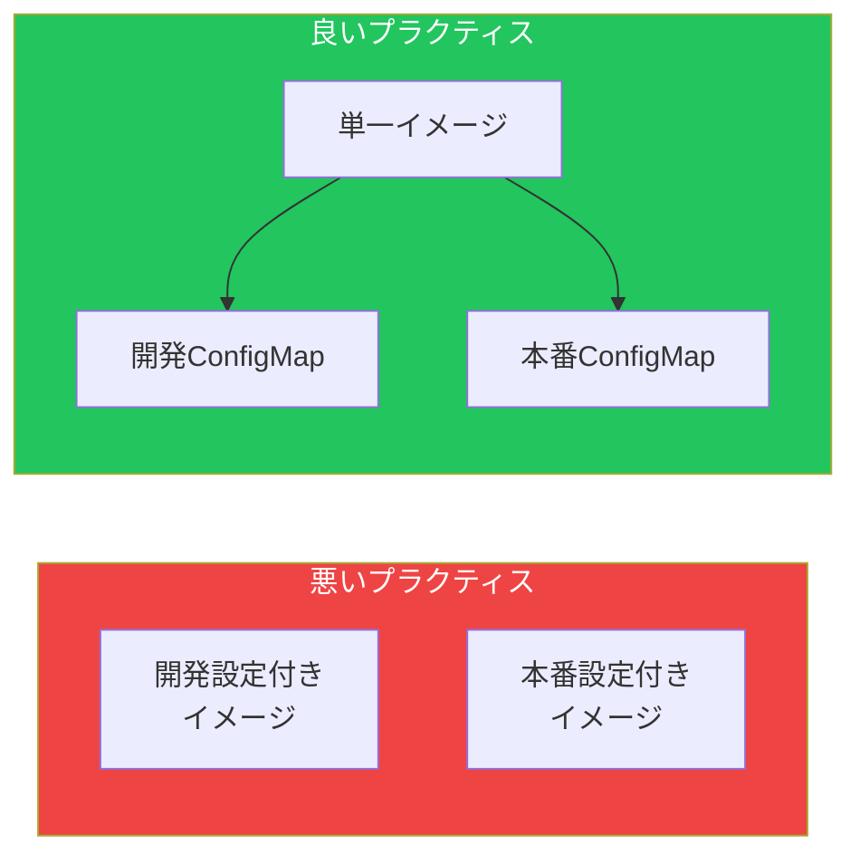

ConfigMapとSecretsは、設定をコンテナイメージから分離し、アプリケーションをより移植性が高く管理しやすくします。この記事では、Kubernetesでの設定の作成、使用、管理を解説します。

## なぜ設定を外部化するのか？

イメージに設定をハードコードすると問題が発生します：
- 設定変更のためにイメージを再ビルド
- 同じイメージが異なる環境で動作しない
- シークレットがイメージレイヤーに露出



## ConfigMap

ConfigMapは機密でない設定データをキーバリューペアとして保存します。

### ConfigMapの作成

#### リテラル値から

```bash
kubectl create configmap app-config \
  --from-literal=DATABASE_HOST=postgres \
  --from-literal=DATABASE_PORT=5432 \
  --from-literal=LOG_LEVEL=info
```

#### ファイルから

```bash
# 設定ファイルを作成
cat > app.properties << EOF
database.host=postgres
database.port=5432
log.level=info
EOF

# ファイルからConfigMapを作成
kubectl create configmap app-config --from-file=app.properties

# カスタムキー名で作成
kubectl create configmap app-config --from-file=config.properties=app.properties
```

#### ディレクトリから

```bash
kubectl create configmap app-config --from-file=./config/
```

#### YAMLから

```yaml
apiVersion: v1
kind: ConfigMap
metadata:
  name: app-config
data:
  # シンプルなキーバリューペア
  DATABASE_HOST: postgres
  DATABASE_PORT: "5432"
  LOG_LEVEL: info

  # 複数行の設定ファイル
  app.properties: |
    database.host=postgres
    database.port=5432
    log.level=info

  # JSON設定
  config.json: |
    {
      "database": {
        "host": "postgres",
        "port": 5432
      },
      "logging": {
        "level": "info"
      }
    }
```

### ConfigMapの使用

#### 環境変数として

```yaml
apiVersion: v1
kind: Pod
metadata:
  name: app
spec:
  containers:
    - name: app
      image: myapp:1.0
      env:
        # 単一キー
        - name: DB_HOST
          valueFrom:
            configMapKeyRef:
              name: app-config
              key: DATABASE_HOST

        # すべてのキーを環境変数として
      envFrom:
        - configMapRef:
            name: app-config
          prefix: CONFIG_  # オプションのプレフィックス
```

#### ボリュームマウントとして

```yaml
apiVersion: v1
kind: Pod
metadata:
  name: app
spec:
  containers:
    - name: app
      image: myapp:1.0
      volumeMounts:
        - name: config-volume
          mountPath: /etc/config
          readOnly: true
  volumes:
    - name: config-volume
      configMap:
        name: app-config
        # オプション：特定のキーを選択
        items:
          - key: app.properties
            path: application.properties
          - key: config.json
            path: config.json
```

#### 特定ファイルをマウント

```yaml
volumes:
  - name: config-volume
    configMap:
      name: app-config
      items:
        - key: app.properties
          path: app.properties
          mode: 0644  # ファイル権限
```

## Secrets

Secretsはパスワード、トークン、証明書などの機密データを保存します。

### Secretタイプ

| タイプ | 説明 |
|--------|------|
| `Opaque` | デフォルト、任意のデータ |
| `kubernetes.io/tls` | TLS証明書 |
| `kubernetes.io/dockerconfigjson` | Dockerレジストリ認証情報 |
| `kubernetes.io/basic-auth` | Basic認証 |
| `kubernetes.io/ssh-auth` | SSH認証情報 |
| `kubernetes.io/service-account-token` | サービスアカウントトークン |

### Secretsの作成

#### リテラル値から

```bash
kubectl create secret generic db-credentials \
  --from-literal=username=admin \
  --from-literal=password=secretpassword
```

#### ファイルから

```bash
# 機密データを含むファイルを作成
echo -n 'admin' > username.txt
echo -n 'secretpassword' > password.txt

kubectl create secret generic db-credentials \
  --from-file=username=username.txt \
  --from-file=password=password.txt

# クリーンアップ
rm username.txt password.txt
```

#### YAMLから（Base64エンコード）

```yaml
apiVersion: v1
kind: Secret
metadata:
  name: db-credentials
type: Opaque
data:
  # Base64エンコードされた値
  username: YWRtaW4=        # echo -n 'admin' | base64
  password: c2VjcmV0cGFzcw==  # echo -n 'secretpass' | base64
```

#### stringDataを使用（自動エンコード）

```yaml
apiVersion: v1
kind: Secret
metadata:
  name: db-credentials
type: Opaque
stringData:
  # プレーンテキスト値（自動エンコード）
  username: admin
  password: secretpassword
```

### TLS Secrets

```bash
# TLSシークレットを作成
kubectl create secret tls my-tls-secret \
  --cert=tls.crt \
  --key=tls.key
```

```yaml
apiVersion: v1
kind: Secret
metadata:
  name: my-tls-secret
type: kubernetes.io/tls
data:
  tls.crt: <base64エンコードされた証明書>
  tls.key: <base64エンコードされた鍵>
```

### Dockerレジストリシークレット

```bash
kubectl create secret docker-registry regcred \
  --docker-server=registry.example.com \
  --docker-username=user \
  --docker-password=password \
  --docker-email=user@example.com
```

```yaml
apiVersion: v1
kind: Pod
metadata:
  name: app
spec:
  imagePullSecrets:
    - name: regcred
  containers:
    - name: app
      image: registry.example.com/myapp:1.0
```

### Secretsの使用

#### 環境変数として

```yaml
apiVersion: v1
kind: Pod
metadata:
  name: app
spec:
  containers:
    - name: app
      image: myapp:1.0
      env:
        - name: DB_USERNAME
          valueFrom:
            secretKeyRef:
              name: db-credentials
              key: username
        - name: DB_PASSWORD
          valueFrom:
            secretKeyRef:
              name: db-credentials
              key: password
```

#### ボリュームマウントとして

```yaml
apiVersion: v1
kind: Pod
metadata:
  name: app
spec:
  containers:
    - name: app
      image: myapp:1.0
      volumeMounts:
        - name: secrets-volume
          mountPath: /etc/secrets
          readOnly: true
  volumes:
    - name: secrets-volume
      secret:
        secretName: db-credentials
        defaultMode: 0400  # 所有者のみ読み取り可
```

## 不変のConfigMapとSecrets

偶発的な変更を防ぎ、パフォーマンスを向上：

```yaml
apiVersion: v1
kind: ConfigMap
metadata:
  name: immutable-config
immutable: true  # 作成後は変更不可
data:
  key: value
```

## 自動更新

### ボリュームマウントは自動的に更新される

ConfigMap/Secretが更新されると、マウントされたファイルは最終的に更新されます（最大1分かかる場合があります）。

```yaml
# ConfigMapがマウントされたPod
spec:
  containers:
    - name: app
      volumeMounts:
        - name: config
          mountPath: /etc/config
  volumes:
    - name: config
      configMap:
        name: app-config  # 更新が伝播
```

### 環境変数は更新されない

環境変数はPod起動時に設定され、変更されません。

```yaml
# 環境変数の変更にはPodの再起動が必要
spec:
  containers:
    - name: app
      envFrom:
        - configMapRef:
            name: app-config  # 自動更新なし
```

## 完全な例

```yaml
# ConfigMap
apiVersion: v1
kind: ConfigMap
metadata:
  name: webapp-config
data:
  APP_ENV: production
  APP_PORT: "8080"
  nginx.conf: |
    server {
      listen 80;
      location / {
        proxy_pass http://localhost:8080;
      }
    }
---
# Secret
apiVersion: v1
kind: Secret
metadata:
  name: webapp-secrets
type: Opaque
stringData:
  DB_PASSWORD: supersecret
  API_KEY: abc123xyz
---
# 両方を使用するDeployment
apiVersion: apps/v1
kind: Deployment
metadata:
  name: webapp
spec:
  replicas: 3
  selector:
    matchLabels:
      app: webapp
  template:
    metadata:
      labels:
        app: webapp
    spec:
      containers:
        - name: app
          image: mywebapp:1.0
          ports:
            - containerPort: 8080

          # ConfigMapからの環境変数
          envFrom:
            - configMapRef:
                name: webapp-config

          # Secretからの環境変数
          env:
            - name: DB_PASSWORD
              valueFrom:
                secretKeyRef:
                  name: webapp-secrets
                  key: DB_PASSWORD
            - name: API_KEY
              valueFrom:
                secretKeyRef:
                  name: webapp-secrets
                  key: API_KEY

          # ボリュームマウント
          volumeMounts:
            - name: nginx-config
              mountPath: /etc/nginx/conf.d
              readOnly: true

      volumes:
        - name: nginx-config
          configMap:
            name: webapp-config
            items:
              - key: nginx.conf
                path: default.conf
```

## ConfigMapとSecretsの操作

### 一般的なコマンド

```bash
# 一覧表示
kubectl get configmaps
kubectl get secrets

# 詳細表示
kubectl describe configmap app-config
kubectl describe secret db-credentials

# データを表示
kubectl get configmap app-config -o yaml
kubectl get secret db-credentials -o yaml

# シークレット値をデコード
kubectl get secret db-credentials -o jsonpath='{.data.password}' | base64 -d

# 編集
kubectl edit configmap app-config

# 削除
kubectl delete configmap app-config
kubectl delete secret db-credentials
```

### ConfigMapの更新

```bash
# ConfigMap全体を置換
kubectl create configmap app-config \
  --from-file=app.properties \
  --dry-run=client -o yaml | kubectl apply -f -

# 特定のキーをパッチ
kubectl patch configmap app-config \
  --patch '{"data":{"LOG_LEVEL":"debug"}}'
```

## ベストプラクティス

| プラクティス | 推奨事項 |
|-------------|---------|
| **シークレットをコミットしない** | GitにSecretsを保存しない |
| **RBACを使用** | Secretsを読める人を制限 |
| **保存時の暗号化を有効化** | etcdデータを暗号化 |
| **シークレットをローテーション** | 定期的に認証情報を更新 |
| **外部シークレットマネージャーを使用** | Vault、AWS Secrets Manager |
| **可能な限り不変にする** | 偶発的な変更を防止 |
| **stringDataを使用** | base64エンコードエラーを回避 |

## 外部シークレット管理

### External Secrets Operator

```yaml
apiVersion: external-secrets.io/v1beta1
kind: ExternalSecret
metadata:
  name: db-credentials
spec:
  refreshInterval: 1h
  secretStoreRef:
    name: vault-backend
    kind: ClusterSecretStore
  target:
    name: db-credentials
  data:
    - secretKey: password
      remoteRef:
        key: secret/database
        property: password
```

## ConfigMap vs Secret

| 観点 | ConfigMap | Secret |
|------|-----------|--------|
| データタイプ | 非機密 | 機密 |
| エンコーディング | プレーンテキスト | Base64 |
| サイズ制限 | 1MB | 1MB |
| RBAC | 標準 | 制限可能 |
| etcd暗号化 | なし | オプション |

## 重要なポイント

1. **設定を外部化** - イメージにハードコードしない
2. **非機密データにはConfigMap** - URL、ポート、フラグ
3. **機密データにはSecrets** - パスワード、トークン、キー
4. **ボリュームマウントは自動更新** - 環境変数はされない
5. **外部シークレットマネージャーを使用** - 本番環境のセキュリティに
6. **保存時の暗号化を有効化** - etcd内のSecretsを保護

## 次のステップ

次の記事では、PersistentVolumeとStatefulSetによる永続ストレージを解説します。

## 参考文献

- The Kubernetes Book, 3rd Edition - Nigel Poulton
- Kubernetes: Up and Running, 3rd Edition - Burns, Beda, Hightower
- [Kubernetes ConfigMapドキュメント](https://kubernetes.io/docs/concepts/configuration/configmap/)
