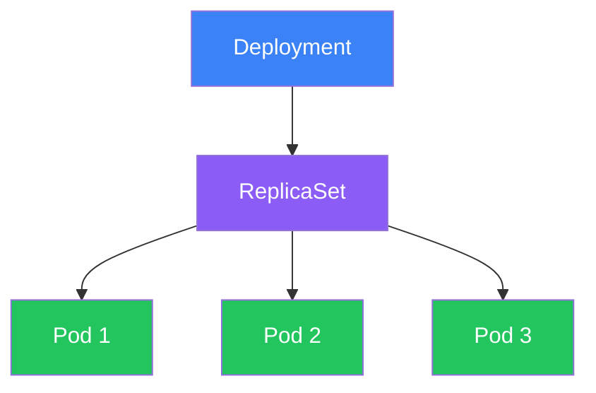
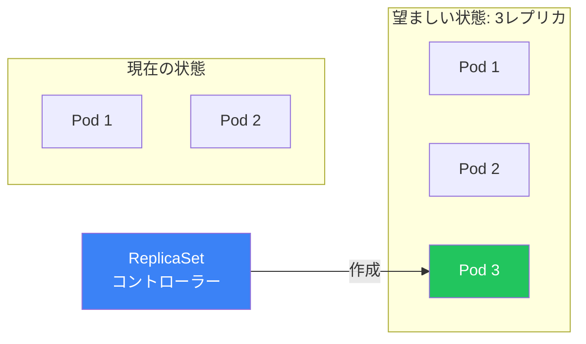
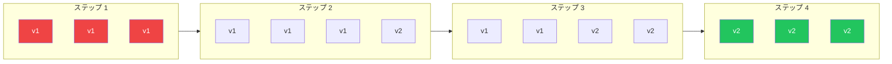
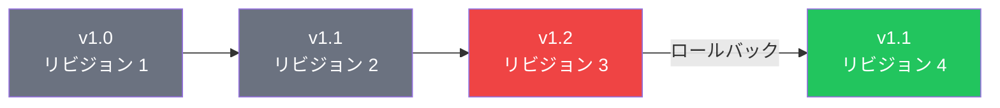

DeploymentはKubernetesでPodを管理する推奨方法です。宣言的な更新、ローリングデプロイ、ロールバック機能を提供します。この記事では、Deployment、ReplicaSet、デプロイ戦略を解説します。

## 階層構造の理解



| リソース | 目的 |
|---------|------|
| **Deployment** | ReplicaSetを管理、更新とロールバックを処理 |
| **ReplicaSet** | 指定された数のPodレプリカが実行されていることを保証 |
| **Pod** | 実際のコンテナを実行 |

## ReplicaSet

### ReplicaSetとは？

ReplicaSetは、指定された数のPodレプリカが常に実行されていることを保証します。

```yaml
apiVersion: apps/v1
kind: ReplicaSet
metadata:
  name: nginx-replicaset
spec:
  replicas: 3
  selector:
    matchLabels:
      app: nginx
  template:
    metadata:
      labels:
        app: nginx
    spec:
      containers:
        - name: nginx
          image: nginx:1.25
          ports:
            - containerPort: 80
```

### ReplicaSetの動作



### なぜDeploymentを使うのか？

| 機能 | ReplicaSet | Deployment |
|------|------------|------------|
| レプリカ管理 | 可能 | 可能 |
| ローリングアップデート | 不可 | 可能 |
| ロールバック | 不可 | 可能 |
| 更新履歴 | なし | あり |
| 一時停止/再開 | 不可 | 可能 |

## Deployment

### 基本的なDeployment

```yaml
apiVersion: apps/v1
kind: Deployment
metadata:
  name: nginx-deployment
  labels:
    app: nginx
spec:
  replicas: 3
  selector:
    matchLabels:
      app: nginx
  template:
    metadata:
      labels:
        app: nginx
    spec:
      containers:
        - name: nginx
          image: nginx:1.25
          ports:
            - containerPort: 80
          resources:
            requests:
              memory: "64Mi"
              cpu: "250m"
            limits:
              memory: "128Mi"
              cpu: "500m"
```

### 完全なDeployment例

```yaml
apiVersion: apps/v1
kind: Deployment
metadata:
  name: web-app
  labels:
    app: web-app
  annotations:
    kubernetes.io/change-cause: "Initial deployment"
spec:
  replicas: 3
  revisionHistoryLimit: 10
  progressDeadlineSeconds: 600

  selector:
    matchLabels:
      app: web-app

  strategy:
    type: RollingUpdate
    rollingUpdate:
      maxSurge: 1
      maxUnavailable: 0

  template:
    metadata:
      labels:
        app: web-app
        version: v1.0.0
    spec:
      containers:
        - name: web
          image: myapp:1.0.0
          ports:
            - containerPort: 8080
          env:
            - name: NODE_ENV
              value: "production"
          resources:
            requests:
              memory: "256Mi"
              cpu: "500m"
            limits:
              memory: "512Mi"
              cpu: "1000m"
          readinessProbe:
            httpGet:
              path: /health
              port: 8080
            initialDelaySeconds: 5
            periodSeconds: 10
          livenessProbe:
            httpGet:
              path: /health
              port: 8080
            initialDelaySeconds: 15
            periodSeconds: 20
```

## デプロイ戦略

### RollingUpdate（デフォルト）

古いPodを新しいPodに徐々に置き換えます。

```yaml
spec:
  strategy:
    type: RollingUpdate
    rollingUpdate:
      maxSurge: 1        # 望ましい数を超える最大Pod数
      maxUnavailable: 0  # 利用不可にできる最大Pod数
```



### Recreate戦略

新しいPodを作成する前にすべての古いPodを終了します（ダウンタイムが発生）。

```yaml
spec:
  strategy:
    type: Recreate
```

### 戦略の比較

| 戦略 | ダウンタイム | リソース使用 | 使用場面 |
|------|------------|-------------|---------|
| RollingUpdate | なし | 更新中は高い | 本番環境 |
| Recreate | あり | 通常 | 開発、互換性のないバージョン |

### 高度なRollingUpdate設定

```yaml
spec:
  strategy:
    type: RollingUpdate
    rollingUpdate:
      maxSurge: 25%        # パーセンテージまたは絶対数
      maxUnavailable: 25%
  minReadySeconds: 10      # 利用可能としてマークする前の待機時間
  progressDeadlineSeconds: 600  # 進行のタイムアウト
```

## スケーリング

### 手動スケーリング

```bash
# Deploymentをスケール
kubectl scale deployment nginx-deployment --replicas=5

# ゼロにスケール（すべてのPodを停止）
kubectl scale deployment nginx-deployment --replicas=0

# 複数のDeploymentをスケール
kubectl scale deployment nginx-deployment web-app --replicas=3
```

### 宣言的スケーリング

```yaml
spec:
  replicas: 5  # この値を更新
```

```bash
kubectl apply -f deployment.yaml
```

### Horizontal Pod Autoscaler（HPA）

```yaml
apiVersion: autoscaling/v2
kind: HorizontalPodAutoscaler
metadata:
  name: web-app-hpa
spec:
  scaleTargetRef:
    apiVersion: apps/v1
    kind: Deployment
    name: web-app
  minReplicas: 2
  maxReplicas: 10
  metrics:
    - type: Resource
      resource:
        name: cpu
        target:
          type: Utilization
          averageUtilization: 70
    - type: Resource
      resource:
        name: memory
        target:
          type: Utilization
          averageUtilization: 80
```

```bash
# 命令的にHPAを作成
kubectl autoscale deployment web-app --min=2 --max=10 --cpu-percent=70

# HPAステータスを表示
kubectl get hpa
kubectl describe hpa web-app-hpa
```

## ローリングアップデート

### コンテナイメージを更新

```bash
# イメージを更新
kubectl set image deployment/nginx-deployment nginx=nginx:1.26

# 記録付きで更新（非推奨だが動作する）
kubectl set image deployment/nginx-deployment nginx=nginx:1.26 --record

# 変更理由のアノテーションを使用して更新
kubectl annotate deployment/nginx-deployment kubernetes.io/change-cause="Update to nginx 1.26"
```

### ロールアウトステータスを監視

```bash
# ロールアウトステータスを監視
kubectl rollout status deployment/nginx-deployment

# ロールアウト履歴を表示
kubectl rollout history deployment/nginx-deployment

# 特定のリビジョンを表示
kubectl rollout history deployment/nginx-deployment --revision=2
```

### 一時停止と再開

```bash
# ロールアウトを一時停止（複数の変更を行う）
kubectl rollout pause deployment/nginx-deployment

# 変更を行う
kubectl set image deployment/nginx-deployment nginx=nginx:1.26
kubectl set resources deployment/nginx-deployment -c=nginx --limits=memory=256Mi

# ロールアウトを再開
kubectl rollout resume deployment/nginx-deployment
```

## ロールバック

### 前のバージョンにロールバック

```bash
# 前のリビジョンにロールバック
kubectl rollout undo deployment/nginx-deployment

# 特定のリビジョンにロールバック
kubectl rollout undo deployment/nginx-deployment --to-revision=2
```

### ロールバックワークフロー



### リビジョン履歴の管理

```yaml
spec:
  revisionHistoryLimit: 10  # 最後の10個のReplicaSetを保持
```

## Deploymentの操作

### 一般的なコマンド

```bash
# Deploymentを作成
kubectl apply -f deployment.yaml
kubectl create deployment nginx --image=nginx:1.25

# Deploymentを一覧表示
kubectl get deployments
kubectl get deploy -o wide

# Deploymentを詳細表示
kubectl describe deployment nginx-deployment

# Deploymentを編集
kubectl edit deployment nginx-deployment

# Deploymentを削除
kubectl delete deployment nginx-deployment
```

### 関連リソースの表示

```bash
# Deploymentが管理するReplicaSetを表示
kubectl get replicasets -l app=nginx

# Deploymentが管理するPodを表示
kubectl get pods -l app=nginx

# すべての関連リソースを表示
kubectl get all -l app=nginx
```

## ラベルとセレクタ

### セレクタタイプ

```yaml
# 等価ベースのセレクタ
selector:
  matchLabels:
    app: nginx
    environment: production

# 集合ベースのセレクタ
selector:
  matchLabels:
    app: nginx
  matchExpressions:
    - key: environment
      operator: In
      values: [production, staging]
    - key: version
      operator: NotIn
      values: [deprecated]
```

### 重要なラベルルール

| ルール | 説明 |
|--------|------|
| セレクタはテンプレートラベルと一致必須 | Podテンプレートには一致するラベルが必要 |
| セレクタは不変 | 作成後は変更不可 |
| ラベルは更新可能 | Podテンプレートラベルは更新可能 |

## DaemonSetとStatefulSet

### DaemonSet

各ノードで1つのPodが実行されることを保証します。

```yaml
apiVersion: apps/v1
kind: DaemonSet
metadata:
  name: log-collector
spec:
  selector:
    matchLabels:
      app: log-collector
  template:
    metadata:
      labels:
        app: log-collector
    spec:
      containers:
        - name: fluentd
          image: fluentd:latest
```

### StatefulSet

安定したネットワークIDとストレージを必要とするステートフルアプリケーション用。

```yaml
apiVersion: apps/v1
kind: StatefulSet
metadata:
  name: database
spec:
  serviceName: database
  replicas: 3
  selector:
    matchLabels:
      app: database
  template:
    metadata:
      labels:
        app: database
    spec:
      containers:
        - name: postgres
          image: postgres:15
```

### 比較

| 機能 | Deployment | DaemonSet | StatefulSet |
|------|------------|-----------|-------------|
| レプリカ | 設定可能 | ノードごとに1つ | 設定可能 |
| Pod名 | ランダム | ランダム | 順序付き（web-0、web-1） |
| ストレージ | 共有 | ノードごと | Podごと（永続） |
| 更新 | ローリング | ローリング | 順序付き |
| 使用例 | ステートレスアプリ | ノードエージェント | データベース |

## ベストプラクティス

| プラクティス | 推奨事項 |
|-------------|---------|
| **Deploymentを使用** | 素のPodやReplicaSetではなく |
| **リソースリミットを設定** | リソース枯渇を防止 |
| **ヘルスプローブを設定** | 適切なローリングアップデートを有効化 |
| **意味のあるラベルを使用** | app、version、environment |
| **リビジョン履歴を設定** | ロールバックに十分な数を保持 |
| **maxUnavailable: 0を使用** | ゼロダウンタイム更新のため |

## 重要なポイント

1. **Deploymentを使用** - ReplicaSetを管理し、更新/ロールバックを提供
2. **RollingUpdateがデフォルト** - ダウンタイムなしの段階的更新
3. **プローブを設定** - 安全なローリングアップデートに必須
4. **ロールアウトを監視** - `kubectl rollout status`を使用
5. **リビジョン履歴を保持** - 素早いロールバックを可能に
6. **HPAを使用** - メトリクスに基づく自動スケーリング

## 次のステップ

次の記事では、アプリケーションを公開するためのKubernetes Serviceを解説します。

## 参考文献

- The Kubernetes Book, 3rd Edition - Nigel Poulton
- Kubernetes: Up and Running, 3rd Edition - Burns, Beda, Hightower
- [Kubernetes Deploymentドキュメント](https://kubernetes.io/docs/concepts/workloads/controllers/deployment/)
