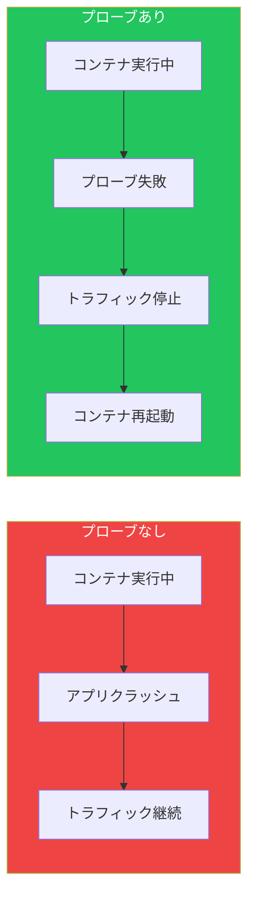

ヘルスプローブとライフサイクルフックは、Kubernetesでアプリケーションを確実に実行するための機能です。プローブは異常なコンテナを検出し、ライフサイクルフックは優雅な起動と終了を可能にします。

## ヘルスプローブの重要性



## 3種類のプローブ

| プローブ | 目的 | 失敗時のアクション |
|---------|------|------------------|
| Liveness | コンテナは生きているか？ | コンテナを再起動 |
| Readiness | トラフィックを処理できるか？ | Serviceから除外 |
| Startup | コンテナは起動したか？ | 他のプローブをブロック |

## Livenessプローブ

コンテナが実行中だが異常（デッドロック、ハング）かどうかを検出。

### HTTP Livenessプローブ

```yaml
apiVersion: v1
kind: Pod
metadata:
  name: web-app
spec:
  containers:
    - name: app
      image: myapp:1.0
      livenessProbe:
        httpGet:
          path: /healthz
          port: 8080
        initialDelaySeconds: 10
        periodSeconds: 5
        timeoutSeconds: 3
        failureThreshold: 3
        successThreshold: 1
```

### TCP Livenessプローブ

```yaml
livenessProbe:
  tcpSocket:
    port: 3306
  initialDelaySeconds: 15
  periodSeconds: 10
```

### Exec Livenessプローブ

```yaml
livenessProbe:
  exec:
    command:
      - cat
      - /tmp/healthy
  initialDelaySeconds: 5
  periodSeconds: 5
```

## Readinessプローブ

コンテナがトラフィックを受け入れられるか判断。失敗するとServiceエンドポイントから除外。

```yaml
apiVersion: v1
kind: Pod
metadata:
  name: web-app
spec:
  containers:
    - name: app
      image: myapp:1.0
      readinessProbe:
        httpGet:
          path: /ready
          port: 8080
        initialDelaySeconds: 5
        periodSeconds: 5
        failureThreshold: 3
```

### ReadinessとLivenessの違い


## Startupプローブ

起動が遅いコンテナ用。成功するまでLiveness/Readinessプローブを無効化。

```yaml
apiVersion: v1
kind: Pod
metadata:
  name: legacy-app
spec:
  containers:
    - name: app
      image: legacy:1.0
      startupProbe:
        httpGet:
          path: /healthz
          port: 8080
        failureThreshold: 30
        periodSeconds: 10
      livenessProbe:
        httpGet:
          path: /healthz
          port: 8080
        periodSeconds: 10
```

これにより、Livenessプローブが開始する前に最大5分（30 × 10秒）の起動時間を確保。

## プローブ設定パラメータ

| パラメータ | デフォルト | 説明 |
|-----------|----------|------|
| initialDelaySeconds | 0 | 最初のプローブまでの待機時間 |
| periodSeconds | 10 | プローブ間隔 |
| timeoutSeconds | 1 | プローブタイムアウト |
| successThreshold | 1 | 正常判定に必要な成功回数 |
| failureThreshold | 3 | アクション前の失敗回数 |

## ライフサイクルフック

コンテナの起動時と終了時にコマンドを実行。


### postStartフック

コンテナ作成直後に実行（ENTRYPOINTより先に実行される保証はない）。

```yaml
apiVersion: v1
kind: Pod
metadata:
  name: app
spec:
  containers:
    - name: app
      image: myapp:1.0
      lifecycle:
        postStart:
          exec:
            command:
              - /bin/sh
              - -c
              - echo "Container started" >> /var/log/startup.log
```

### preStopフック

コンテナがSIGTERMを受信する前に実行。優雅な終了に有用。

```yaml
apiVersion: v1
kind: Pod
metadata:
  name: web-server
spec:
  containers:
    - name: nginx
      image: nginx:1.25
      lifecycle:
        preStop:
          exec:
            command:
              - /bin/sh
              - -c
              - nginx -s quit && sleep 10
```

### HTTPライフサイクルフック

```yaml
lifecycle:
  preStop:
    httpGet:
      path: /shutdown
      port: 8080
```

## 優雅な終了パターン

```yaml
apiVersion: apps/v1
kind: Deployment
metadata:
  name: web-app
spec:
  replicas: 3
  template:
    spec:
      terminationGracePeriodSeconds: 60
      containers:
        - name: app
          image: myapp:1.0
          ports:
            - containerPort: 8080
          readinessProbe:
            httpGet:
              path: /ready
              port: 8080
            periodSeconds: 5
          lifecycle:
            preStop:
              exec:
                command:
                  - /bin/sh
                  - -c
                  - sleep 5
```

### 終了シーケンス

1. Podが終了対象としてマーク
2. Serviceエンドポイントから除外
3. preStopフックを実行
4. コンテナにSIGTERMを送信
5. terminationGracePeriodSecondsまで待機
6. まだ実行中ならSIGKILL

## 完全な例

```yaml
apiVersion: apps/v1
kind: Deployment
metadata:
  name: production-app
spec:
  replicas: 3
  selector:
    matchLabels:
      app: production-app
  template:
    metadata:
      labels:
        app: production-app
    spec:
      terminationGracePeriodSeconds: 30
      containers:
        - name: app
          image: myapp:1.0
          ports:
            - containerPort: 8080
          startupProbe:
            httpGet:
              path: /healthz
              port: 8080
            failureThreshold: 30
            periodSeconds: 2
          livenessProbe:
            httpGet:
              path: /healthz
              port: 8080
            initialDelaySeconds: 0
            periodSeconds: 10
            timeoutSeconds: 5
            failureThreshold: 3
          readinessProbe:
            httpGet:
              path: /ready
              port: 8080
            initialDelaySeconds: 0
            periodSeconds: 5
            timeoutSeconds: 3
            failureThreshold: 3
          lifecycle:
            preStop:
              exec:
                command: ["/bin/sh", "-c", "sleep 5"]
```

## ベストプラクティス

| プラクティス | 推奨事項 |
|-------------|---------|
| 常にReadinessプローブを使用 | 準備できていないPodへのトラフィックを防止 |
| 遅いアプリにはStartupプローブ | 誤った再起動を防止 |
| プローブは軽量に | 下流の依存関係をチェックしない |
| 適切なタイムアウト設定 | アプリケーションの動作に合わせる |
| 優雅な終了にpreStopを使用 | 処理中のリクエストを完了させる |

## よくある問題

### 攻撃的すぎるLivenessプローブ

```yaml
# 悪い例：正常だが遅いコンテナを再起動してしまう
livenessProbe:
  httpGet:
    path: /healthz
    port: 8080
  initialDelaySeconds: 1
  periodSeconds: 1
  failureThreshold: 1

# 良い例：適切なしきい値
livenessProbe:
  httpGet:
    path: /healthz
    port: 8080
  initialDelaySeconds: 10
  periodSeconds: 10
  failureThreshold: 3
```

### プローブで依存関係をチェック

```yaml
# 悪い例：データベースがダウンすると失敗
livenessProbe:
  httpGet:
    path: /healthz  # データベース接続をチェック

# 良い例：コンテナの健全性のみチェック
livenessProbe:
  httpGet:
    path: /healthz  # アプリが動作していれば200を返す
```

## 重要なポイント

1. **Livenessは異常なコンテナを再起動** - デッドロック検出に使用
2. **Readinessはトラフィックを制御** - 起動時や一時的な不可用状態に使用
3. **Startupは遅いコンテナ用** - 早すぎる再起動を防止
4. **preStopで優雅な終了** - 処理中のリクエストを完了
5. **依存関係をチェックしない** - プローブはコンテナの健全性のみ確認

## 参考文献

- The Kubernetes Book, 3rd Edition - Nigel Poulton
- Kubernetes: Up and Running, 3rd Edition - Burns, Beda, Hightower
- [Kubernetesプローブドキュメント](https://kubernetes.io/docs/tasks/configure-pod-container/configure-liveness-readiness-startup-probes/)
