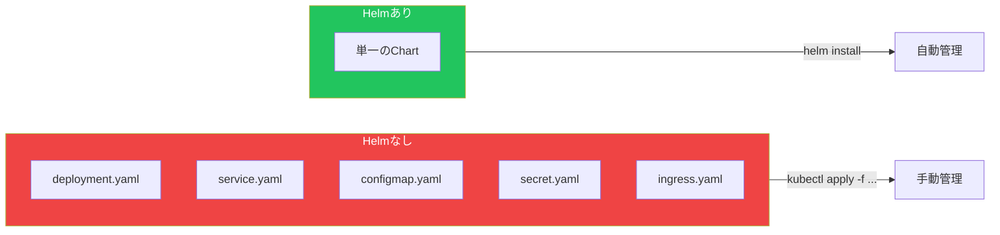
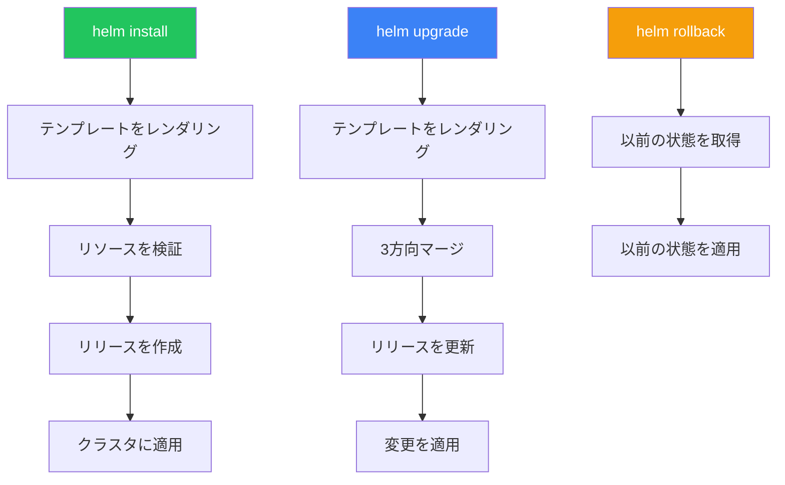

HelmはKubernetesのパッケージマネージャーで、再利用可能なChartを通じてアプリケーションデプロイを簡素化します。テンプレート化、バージョニング、リリース管理を処理します。

## なぜHelmなのか？



## Helmの概念

| 概念 | 説明 |
|-----|------|
| Chart | Kubernetesリソースのパッケージ |
| Release | Chartのインストール済みインスタンス |
| Repository | Chartのコレクション |
| Values | Chartカスタマイズ用の設定 |
| Template | プレースホルダー付きKubernetesマニフェスト |

## Helmのインストール

```bash
# macOS
brew install helm

# Linux
curl https://raw.githubusercontent.com/helm/helm/main/scripts/get-helm-3 | bash

# インストール確認
helm version
```

## リポジトリの操作

```bash
# 公式リポジトリを追加
helm repo add bitnami https://charts.bitnami.com/bitnami

# 他のリポジトリを追加
helm repo add prometheus-community https://prometheus-community.github.io/helm-charts
helm repo add ingress-nginx https://kubernetes.github.io/ingress-nginx

# リポジトリを更新
helm repo update

# リポジトリを一覧表示
helm repo list

# Chartを検索
helm search repo nginx
helm search hub prometheus  # Artifact Hubを検索
```

## Chartのインストール

### 基本的なインストール

```bash
# リリース名を指定してインストール
helm install my-nginx bitnami/nginx

# 特定のnamespaceにインストール
helm install my-nginx bitnami/nginx -n web --create-namespace

# カスタム値でインストール
helm install my-nginx bitnami/nginx --set service.type=ClusterIP

# valuesファイルからインストール
helm install my-nginx bitnami/nginx -f values.yaml
```

### Valuesファイル

```yaml
# values.yaml
replicaCount: 3

image:
  repository: nginx
  tag: "1.25"

service:
  type: LoadBalancer
  port: 80

resources:
  limits:
    cpu: 200m
    memory: 256Mi
  requests:
    cpu: 100m
    memory: 128Mi

ingress:
  enabled: true
  hostname: myapp.example.com
```

## リリース管理

```bash
# リリースを一覧表示
helm list
helm list -n my-namespace
helm list --all-namespaces

# リリースステータスを取得
helm status my-nginx

# リリースのvaluesを取得
helm get values my-nginx
helm get values my-nginx --all  # デフォルト含む

# リリースのマニフェストを取得
helm get manifest my-nginx

# リリースをアップグレード
helm upgrade my-nginx bitnami/nginx --set replicaCount=5
helm upgrade my-nginx bitnami/nginx -f new-values.yaml

# リリースをロールバック
helm rollback my-nginx 1  # リビジョン1にロールバック
helm history my-nginx     # リビジョン履歴を表示

# リリースをアンインストール
helm uninstall my-nginx
```

## Chartの作成

### Chart構造

```
mychart/
├── Chart.yaml          # Chartメタデータ
├── values.yaml         # デフォルト値
├── charts/             # 依存関係
├── templates/          # Kubernetesマニフェスト
│   ├── deployment.yaml
│   ├── service.yaml
│   ├── ingress.yaml
│   ├── _helpers.tpl    # テンプレートヘルパー
│   └── NOTES.txt       # インストール後のメモ
└── .helmignore         # 無視するファイル
```

### Chart.yaml

```yaml
apiVersion: v2
name: myapp
description: マイアプリケーション用Helm Chart
type: application
version: 0.1.0        # Chartバージョン
appVersion: "1.0.0"   # アプリケーションバージョン

dependencies:
  - name: postgresql
    version: "12.x.x"
    repository: https://charts.bitnami.com/bitnami
    condition: postgresql.enabled
```

### values.yaml

```yaml
replicaCount: 1

image:
  repository: myapp
  pullPolicy: IfNotPresent
  tag: ""

nameOverride: ""
fullnameOverride: ""

service:
  type: ClusterIP
  port: 80

ingress:
  enabled: false
  className: ""
  hosts:
    - host: chart-example.local
      paths:
        - path: /
          pathType: ImplementationSpecific

resources: {}

postgresql:
  enabled: true
  auth:
    database: myapp
```

### テンプレート例

```yaml
# templates/deployment.yaml
apiVersion: apps/v1
kind: Deployment
metadata:
  name: {{ include "myapp.fullname" . }}
  labels:
    {{- include "myapp.labels" . | nindent 4 }}
spec:
  replicas: {{ .Values.replicaCount }}
  selector:
    matchLabels:
      {{- include "myapp.selectorLabels" . | nindent 6 }}
  template:
    metadata:
      labels:
        {{- include "myapp.selectorLabels" . | nindent 8 }}
    spec:
      containers:
        - name: {{ .Chart.Name }}
          image: "{{ .Values.image.repository }}:{{ .Values.image.tag | default .Chart.AppVersion }}"
          imagePullPolicy: {{ .Values.image.pullPolicy }}
          ports:
            - name: http
              containerPort: 80
          {{- if .Values.resources }}
          resources:
            {{- toYaml .Values.resources | nindent 12 }}
          {{- end }}
```

### ヘルパーテンプレート

```yaml
# templates/_helpers.tpl
{{/*
Chart名とバージョンを作成
*/}}
{{- define "myapp.chart" -}}
{{- printf "%s-%s" .Chart.Name .Chart.Version | replace "+" "_" | trunc 63 | trimSuffix "-" }}
{{- end }}

{{/*
共通ラベル
*/}}
{{- define "myapp.labels" -}}
helm.sh/chart: {{ include "myapp.chart" . }}
{{ include "myapp.selectorLabels" . }}
app.kubernetes.io/version: {{ .Chart.AppVersion | quote }}
app.kubernetes.io/managed-by: {{ .Release.Service }}
{{- end }}

{{/*
セレクターラベル
*/}}
{{- define "myapp.selectorLabels" -}}
app.kubernetes.io/name: {{ include "myapp.name" . }}
app.kubernetes.io/instance: {{ .Release.Name }}
{{- end }}
```

## テンプレート関数

### 一般的な関数

```yaml
# 文字列関数
{{ .Values.name | upper }}
{{ .Values.name | lower }}
{{ .Values.name | title }}
{{ .Values.name | quote }}
{{ .Values.name | default "defaultValue" }}
{{ .Values.name | trim }}

# 制御構造
{{- if .Values.ingress.enabled }}
# Ingress設定
{{- end }}

{{- range .Values.hosts }}
- host: {{ . }}
{{- end }}

# withステートメント
{{- with .Values.nodeSelector }}
nodeSelector:
  {{- toYaml . | nindent 8 }}
{{- end }}
```

### インデント

```yaml
# nindentは改行+インデントを追加
resources:
  {{- toYaml .Values.resources | nindent 2 }}

# indentは改行なし
resources: {{ toYaml .Values.resources | indent 2 }}
```

## Chartのテスト

```bash
# 新しいChartを作成
helm create myapp

# Chartをlint
helm lint ./myapp

# テンプレートをローカルでレンダリング
helm template my-release ./myapp
helm template my-release ./myapp -f custom-values.yaml

# ドライランインストール
helm install my-release ./myapp --dry-run --debug

# Chartをパッケージ
helm package ./myapp

# ローカルChartからインストール
helm install my-release ./myapp
```

## Chart依存関係

```bash
# 依存関係を更新
helm dependency update ./myapp

# 依存関係を一覧表示
helm dependency list ./myapp

# 依存関係をビルド
helm dependency build ./myapp
```

## リリースワークフロー



## ベストプラクティス

| プラクティス | 推奨事項 |
|-------------|---------|
| Chartをバージョン管理 | セマンティックバージョニングを使用 |
| valuesファイルを使用 | 設定をテンプレートから分離 |
| valuesを文書化 | 各値を説明するコメントを追加 |
| デプロイ前にテスト | --dry-runとhelm lintを使用 |
| Chartバージョンを固定 | 依存関係でバージョンを指定 |
| namespaceを使用 | リリースをnamespaceで分離 |

## Helmコマンドリファレンス

```bash
# リポジトリ管理
helm repo add <name> <url>
helm repo update
helm repo list
helm repo remove <name>

# Chart管理
helm search repo <keyword>
helm show values <chart>
helm show chart <chart>
helm pull <chart>

# リリース管理
helm install <release> <chart>
helm upgrade <release> <chart>
helm rollback <release> <revision>
helm uninstall <release>
helm list
helm status <release>
helm history <release>

# 開発
helm create <name>
helm lint <path>
helm template <release> <path>
helm package <path>
```

## 重要なポイント

1. **Helmはデプロイを簡素化** - 複数のマニフェストを1つのChartにパッケージ
2. **Valuesでカスタマイズ** - テンプレートを変更せずにデフォルトをオーバーライド
3. **Releaseは状態を追跡** - デプロイのバージョン管理とロールバックが容易
4. **テンプレートはGo構文** - 複雑なロジックにsprig関数を学ぶ
5. **Chartは再利用可能** - インフラストラクチャを共有・バージョン管理

## 参考文献

- [Helmドキュメント](https://helm.sh/docs/)
- [Artifact Hub](https://artifacthub.io/)
- The Kubernetes Book, 3rd Edition - Nigel Poulton
