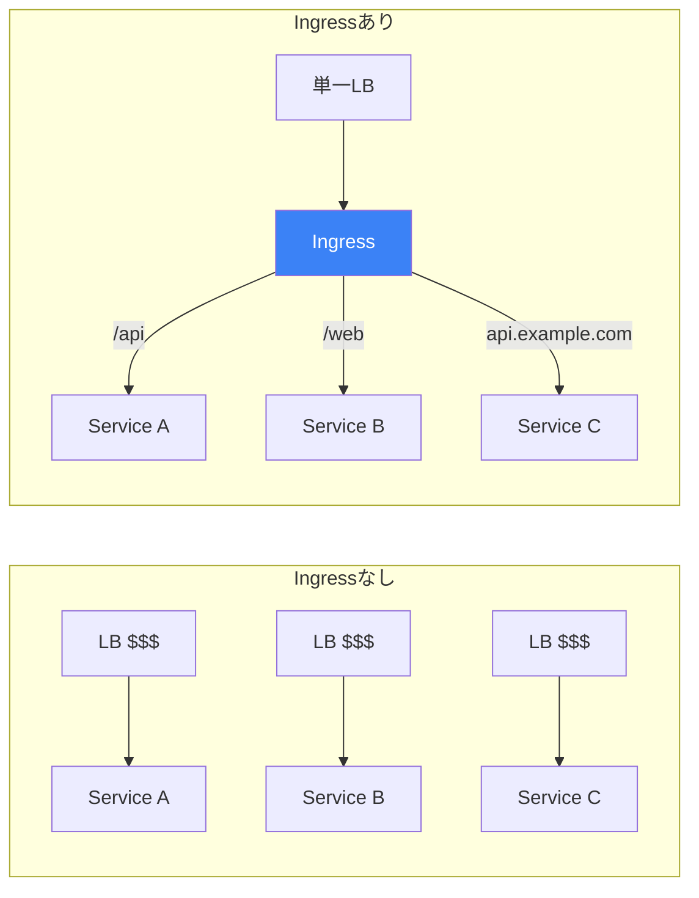
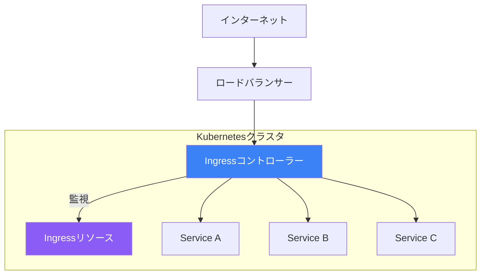

Ingressはクラスタ内のサービスへのHTTPおよびHTTPSルーティングを提供します。パスベースルーティング、ホストベースルーティング、TLS終端などの機能を提供します。この記事では、Ingressの概念、コントローラー、設定を解説します。

## なぜIngressが必要か？

LoadBalancerサービスは機能しますが、制限があります：
- 各サービスに専用のロードバランサーが必要（コストがかかる）
- HTTPレベルのルーティングがない（パス、ホスト）
- TLS終端がアプリケーションレベル



## Ingressアーキテクチャ



### コンポーネント

| コンポーネント | 説明 |
|---------------|------|
| **Ingressリソース** | ルーティングルールを定義するKubernetesオブジェクト |
| **Ingressコントローラー** | ルーティングを実装するPod（nginx、traefikなど） |
| **ロードバランサー** | インターネットからのエントリーポイント |

## Ingressコントローラー

Kubernetesにはデフォルトでは Ingressコントローラーが含まれていません。インストールする必要があります。

### 人気のコントローラー

| コントローラー | 説明 |
|---------------|------|
| **NGINX Ingress** | 最も人気、機能豊富 |
| **Traefik** | クラウドネイティブ、自動HTTPS |
| **HAProxy** | 高パフォーマンス |
| **Contour** | Envoyベース、VMwareプロジェクト |
| **AWS ALB** | AWS Application Load Balancer |
| **GKE Ingress** | Google Cloudネイティブ |

### NGINX Ingressコントローラーのインストール

```bash
# Helmを使用
helm repo add ingress-nginx https://kubernetes.github.io/ingress-nginx
helm repo update
helm install ingress-nginx ingress-nginx/ingress-nginx

# kubectlを使用
kubectl apply -f https://raw.githubusercontent.com/kubernetes/ingress-nginx/controller-v1.9.0/deploy/static/provider/cloud/deploy.yaml

# インストールを確認
kubectl get pods -n ingress-nginx
kubectl get svc -n ingress-nginx
```

## 基本的なIngress

### シンプルなパスベースルーティング

```yaml
apiVersion: networking.k8s.io/v1
kind: Ingress
metadata:
  name: simple-ingress
spec:
  ingressClassName: nginx
  rules:
    - http:
        paths:
          - path: /api
            pathType: Prefix
            backend:
              service:
                name: api-service
                port:
                  number: 80
          - path: /web
            pathType: Prefix
            backend:
              service:
                name: web-service
                port:
                  number: 80
```

### パスタイプ

| PathType | 動作 |
|----------|------|
| **Prefix** | URLパスプレフィックスにマッチ |
| **Exact** | 正確なURLパスにマッチ |
| **ImplementationSpecific** | コントローラー依存 |

```yaml
# Prefix: /apiは/api、/api/、/api/usersにマッチ
- path: /api
  pathType: Prefix

# Exact: /apiは/apiのみにマッチ
- path: /api
  pathType: Exact
```

## ホストベースルーティング

ホスト名に基づいてルーティング：

```yaml
apiVersion: networking.k8s.io/v1
kind: Ingress
metadata:
  name: host-ingress
spec:
  ingressClassName: nginx
  rules:
    - host: api.example.com
      http:
        paths:
          - path: /
            pathType: Prefix
            backend:
              service:
                name: api-service
                port:
                  number: 80

    - host: web.example.com
      http:
        paths:
          - path: /
            pathType: Prefix
            backend:
              service:
                name: web-service
                port:
                  number: 80

    - host: "*.example.com"  # ワイルドカード
      http:
        paths:
          - path: /
            pathType: Prefix
            backend:
              service:
                name: default-service
                port:
                  number: 80
```

## TLS/HTTPS設定

### TLSシークレットを作成

```bash
# 自己署名証明書を生成（テスト用）
openssl req -x509 -nodes -days 365 -newkey rsa:2048 \
  -keyout tls.key -out tls.crt \
  -subj "/CN=example.com"

# Kubernetesシークレットを作成
kubectl create secret tls example-tls \
  --cert=tls.crt \
  --key=tls.key
```

### TLS付きIngress

```yaml
apiVersion: networking.k8s.io/v1
kind: Ingress
metadata:
  name: tls-ingress
spec:
  ingressClassName: nginx
  tls:
    - hosts:
        - example.com
        - www.example.com
      secretName: example-tls
  rules:
    - host: example.com
      http:
        paths:
          - path: /
            pathType: Prefix
            backend:
              service:
                name: web-service
                port:
                  number: 80
```

### cert-managerによる自動TLS

```bash
# cert-managerをインストール
kubectl apply -f https://github.com/cert-manager/cert-manager/releases/download/v1.13.0/cert-manager.yaml
```

```yaml
# Let's Encrypt用のClusterIssuer
apiVersion: cert-manager.io/v1
kind: ClusterIssuer
metadata:
  name: letsencrypt-prod
spec:
  acme:
    server: https://acme-v02.api.letsencrypt.org/directory
    email: your-email@example.com
    privateKeySecretRef:
      name: letsencrypt-prod
    solvers:
      - http01:
          ingress:
            class: nginx
---
# 自動TLS付きIngress
apiVersion: networking.k8s.io/v1
kind: Ingress
metadata:
  name: auto-tls-ingress
  annotations:
    cert-manager.io/cluster-issuer: letsencrypt-prod
spec:
  ingressClassName: nginx
  tls:
    - hosts:
        - example.com
      secretName: example-com-tls  # cert-managerがこれを作成
  rules:
    - host: example.com
      http:
        paths:
          - path: /
            pathType: Prefix
            backend:
              service:
                name: web-service
                port:
                  number: 80
```

## Ingressアノテーション

### NGINX固有のアノテーション

```yaml
apiVersion: networking.k8s.io/v1
kind: Ingress
metadata:
  name: annotated-ingress
  annotations:
    # URLパスを書き換え
    nginx.ingress.kubernetes.io/rewrite-target: /$2

    # SSLリダイレクト
    nginx.ingress.kubernetes.io/ssl-redirect: "true"

    # バックエンドプロトコル
    nginx.ingress.kubernetes.io/backend-protocol: "HTTPS"

    # レート制限
    nginx.ingress.kubernetes.io/limit-rps: "10"

    # タイムアウト
    nginx.ingress.kubernetes.io/proxy-connect-timeout: "60"
    nginx.ingress.kubernetes.io/proxy-read-timeout: "60"

    # CORS
    nginx.ingress.kubernetes.io/enable-cors: "true"
    nginx.ingress.kubernetes.io/cors-allow-origin: "https://example.com"

    # Basic認証
    nginx.ingress.kubernetes.io/auth-type: basic
    nginx.ingress.kubernetes.io/auth-secret: basic-auth
    nginx.ingress.kubernetes.io/auth-realm: "Authentication Required"

    # IPホワイトリスト
    nginx.ingress.kubernetes.io/whitelist-source-range: "10.0.0.0/8,172.16.0.0/12"

    # カスタムヘッダー
    nginx.ingress.kubernetes.io/configuration-snippet: |
      add_header X-Custom-Header "value";
spec:
  ingressClassName: nginx
  rules:
    - host: example.com
      http:
        paths:
          - path: /api(/|$)(.*)
            pathType: Prefix
            backend:
              service:
                name: api-service
                port:
                  number: 80
```

### URL書き換え

```yaml
metadata:
  annotations:
    nginx.ingress.kubernetes.io/rewrite-target: /$2
spec:
  rules:
    - host: example.com
      http:
        paths:
          # /api/users -> /users
          - path: /api(/|$)(.*)
            pathType: Prefix
            backend:
              service:
                name: api-service
                port:
                  number: 80
```

## デフォルトバックエンド

ルールにマッチしないリクエストを処理：

```yaml
apiVersion: networking.k8s.io/v1
kind: Ingress
metadata:
  name: ingress-with-default
spec:
  ingressClassName: nginx
  defaultBackend:
    service:
      name: default-service
      port:
        number: 80
  rules:
    - host: example.com
      http:
        paths:
          - path: /api
            pathType: Prefix
            backend:
              service:
                name: api-service
                port:
                  number: 80
```

## IngressClass

どのコントローラーがIngressを処理するかを指定：

```yaml
apiVersion: networking.k8s.io/v1
kind: IngressClass
metadata:
  name: nginx
  annotations:
    ingressclass.kubernetes.io/is-default-class: "true"
spec:
  controller: k8s.io/ingress-nginx
---
apiVersion: networking.k8s.io/v1
kind: Ingress
metadata:
  name: my-ingress
spec:
  ingressClassName: nginx  # IngressClassを参照
  rules:
    - http:
        paths:
          - path: /
            pathType: Prefix
            backend:
              service:
                name: web-service
                port:
                  number: 80
```

## Gateway API（将来）

Gateway APIはIngressの後継で、より多くの機能を持ちます：

```yaml
# Gateway（Ingressコントローラーに類似）
apiVersion: gateway.networking.k8s.io/v1
kind: Gateway
metadata:
  name: my-gateway
spec:
  gatewayClassName: nginx
  listeners:
    - name: http
      port: 80
      protocol: HTTP
---
# HTTPRoute（Ingressルールに類似）
apiVersion: gateway.networking.k8s.io/v1
kind: HTTPRoute
metadata:
  name: my-route
spec:
  parentRefs:
    - name: my-gateway
  hostnames:
    - example.com
  rules:
    - matches:
        - path:
            type: PathPrefix
            value: /api
      backendRefs:
        - name: api-service
          port: 80
```

## Ingressの操作

### 一般的なコマンド

```bash
# Ingressを作成
kubectl apply -f ingress.yaml

# Ingressを一覧表示
kubectl get ingress
kubectl get ing -A

# Ingressを詳細表示
kubectl describe ingress my-ingress

# IP付きでIngressを取得
kubectl get ingress my-ingress -o wide

# Ingressを削除
kubectl delete ingress my-ingress
```

### デバッグ

```bash
# Ingressコントローラーのログを確認
kubectl logs -n ingress-nginx -l app.kubernetes.io/name=ingress-nginx

# Ingressコントローラーの設定を確認
kubectl exec -n ingress-nginx deploy/ingress-nginx-controller -- cat /etc/nginx/nginx.conf

# DNS解決をテスト
nslookup example.com

# 接続をテスト
curl -H "Host: example.com" http://<ingress-ip>/
```

## 完全な例

```yaml
# バックエンドサービス
apiVersion: apps/v1
kind: Deployment
metadata:
  name: api
spec:
  replicas: 2
  selector:
    matchLabels:
      app: api
  template:
    metadata:
      labels:
        app: api
    spec:
      containers:
        - name: api
          image: hashicorp/http-echo
          args: ["-text=API"]
---
apiVersion: v1
kind: Service
metadata:
  name: api-service
spec:
  selector:
    app: api
  ports:
    - port: 80
      targetPort: 5678
---
apiVersion: apps/v1
kind: Deployment
metadata:
  name: web
spec:
  replicas: 2
  selector:
    matchLabels:
      app: web
  template:
    metadata:
      labels:
        app: web
    spec:
      containers:
        - name: web
          image: hashicorp/http-echo
          args: ["-text=WEB"]
---
apiVersion: v1
kind: Service
metadata:
  name: web-service
spec:
  selector:
    app: web
  ports:
    - port: 80
      targetPort: 5678
---
# TLS付きIngress
apiVersion: networking.k8s.io/v1
kind: Ingress
metadata:
  name: main-ingress
  annotations:
    nginx.ingress.kubernetes.io/ssl-redirect: "true"
spec:
  ingressClassName: nginx
  tls:
    - hosts:
        - example.com
      secretName: example-tls
  rules:
    - host: example.com
      http:
        paths:
          - path: /api
            pathType: Prefix
            backend:
              service:
                name: api-service
                port:
                  number: 80
          - path: /
            pathType: Prefix
            backend:
              service:
                name: web-service
                port:
                  number: 80
```

## ベストプラクティス

| プラクティス | 推奨事項 |
|-------------|---------|
| **TLSを使用** | 常にHTTPSで暗号化 |
| **cert-managerを使用** | 証明書管理を自動化 |
| **IngressClassを設定** | コントローラーを明示的に指定 |
| **タイムアウトを設定** | アプリケーションのニーズに合わせる |
| **レート制限** | 悪用から保護 |
| **ヘルスチェック** | バックエンドの可用性を確保 |

## 重要なポイント

1. **Ingressはルーティングを統合** - 複数サービスへの単一エントリーポイント
2. **コントローラーが必要** - nginx、traefikなどをインストール
3. **TLSは必須** - 自動証明書にはcert-managerを使用
4. **アノテーションで動作をカスタマイズ** - コントローラー固有の設定
5. **Gateway APIが将来の形** - Ingressより強力

## 次のステップ

次の記事では、アプリケーション設定を管理するためのConfigMapとSecretsを解説します。

## 参考文献

- The Kubernetes Book, 3rd Edition - Nigel Poulton
- Kubernetes: Up and Running, 3rd Edition - Burns, Beda, Hightower
- [Kubernetes Ingressドキュメント](https://kubernetes.io/docs/concepts/services-networking/ingress/)
