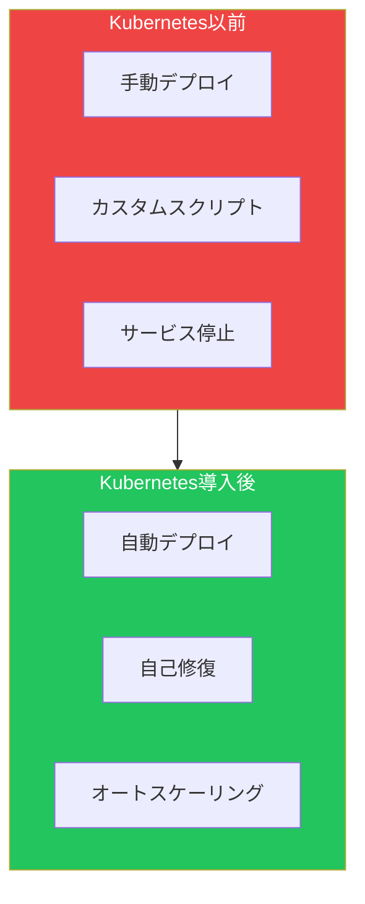
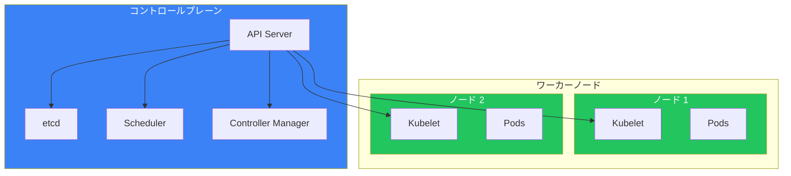
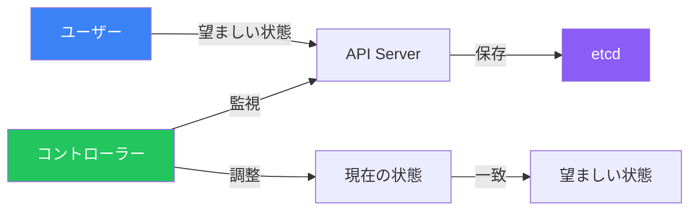

Kubernetes（K8s）はコンテナオーケストレーションのデファクトスタンダードとなりました。この記事では、Kubernetesの基礎、アーキテクチャ、コアコンセプトを紹介します。

## Kubernetesとは？

Kubernetesは、Googleが社内システム「Borg」をベースに開発したオープンソースのコンテナオーケストレーションプラットフォームです。名前はギリシャ語で「操舵手」を意味します。



## なぜKubernetesが必要か？

| 課題 | 従来のアプローチ | Kubernetesのソリューション |
|------|-----------------|---------------------------|
| デプロイ | 手動、エラーが発生しやすい | 宣言的、自動化 |
| スケーリング | より大きなサーバーを購入 | 水平Podスケーリング |
| 障害対応 | 手動介入が必要 | 自己修復 |
| アップデート | ダウンタイムが必要 | ローリングアップデート |
| リソース使用 | 低効率になりがち | ビンパッキング最適化 |

## Kubernetesアーキテクチャ

### 全体像



### コントロールプレーンコンポーネント

| コンポーネント | 役割 |
|---------------|------|
| **API Server** | Kubernetesのフロントエンド、すべてのAPIリクエストを処理 |
| **etcd** | クラスタ状態を保存する分散キーバリューストア |
| **Scheduler** | リソース要件に基づいてPodをノードに割り当て |
| **Controller Manager** | コントローラーループを実行（Deployment、ReplicaSetなど） |

### ワーカーノードコンポーネント

| コンポーネント | 役割 |
|---------------|------|
| **Kubelet** | Pod内でコンテナが実行されていることを保証するエージェント |
| **kube-proxy** | Pod通信のためのネットワークルールを維持 |
| **Container Runtime** | コンテナを実行（containerd、CRI-O） |

## コアKubernetesオブジェクト

### Pod

Kubernetesで最小のデプロイ単位。Podは以下を共有する1つ以上のコンテナを含みます：
- ネットワーク名前空間（同じIPアドレス）
- ストレージボリューム
- ライフサイクル

```yaml
apiVersion: v1
kind: Pod
metadata:
  name: nginx-pod
spec:
  containers:
    - name: nginx
      image: nginx:1.25
      ports:
        - containerPort: 80
```

### Deployment

ローリングアップデートとロールバックを備えたPodレプリカの望ましい状態を管理します。

```yaml
apiVersion: apps/v1
kind: Deployment
metadata:
  name: nginx-deployment
spec:
  replicas: 3
  selector:
    matchLabels:
      app: nginx
  template:
    metadata:
      labels:
        app: nginx
    spec:
      containers:
        - name: nginx
          image: nginx:1.25
          ports:
            - containerPort: 80
```

### Service

Podにアクセスするための安定したネットワーキングを提供します。

```yaml
apiVersion: v1
kind: Service
metadata:
  name: nginx-service
spec:
  selector:
    app: nginx
  ports:
    - port: 80
      targetPort: 80
  type: ClusterIP
```

## 宣言的モデル

Kubernetesは宣言的アプローチを採用：望ましい状態を定義し、Kubernetesがその状態を達成・維持します。



### 宣言的 vs 命令的

| アプローチ | 例 | 使用場面 |
|----------|-----|---------|
| 宣言的 | `kubectl apply -f deployment.yaml` | 本番環境、GitOps |
| 命令的 | `kubectl create deployment nginx --image=nginx` | クイックテスト |

## Kubernetesディストリビューション

| ディストリビューション | 説明 | 最適な用途 |
|----------------------|------|-----------|
| **マネージド（クラウド）** | | |
| EKS (AWS) | AmazonのマネージドK8s | AWSユーザー |
| GKE (Google) | GoogleのマネージドK8s | GCPユーザー |
| AKS (Azure) | AzureのマネージドK8s | Azureユーザー |
| **セルフマネージド** | | |
| kubeadm | 公式ブートストラップツール | オンプレミス |
| k3s | 軽量K8s | エッジ、IoT、開発 |
| **ローカル開発** | | |
| minikube | シングルノードクラスタ | 学習、開発 |
| kind | Docker内K8s | CI/CD、テスト |
| Docker Desktop | 組み込みK8s | デスクトップ開発 |

## はじめに

### kubectlのインストール

```bash
# macOS
brew install kubectl

# Linux
curl -LO "https://dl.k8s.io/release/$(curl -L -s https://dl.k8s.io/release/stable.txt)/bin/linux/amd64/kubectl"
chmod +x kubectl
sudo mv kubectl /usr/local/bin/

# Windows (chocolatey使用)
choco install kubernetes-cli
```

### インストール確認

```bash
# kubectlバージョン確認
kubectl version --client

# クラスタ接続確認
kubectl cluster-info

# ノード一覧
kubectl get nodes
```

### 最初のデプロイ

```bash
# Deploymentを作成
kubectl create deployment hello-world --image=nginx

# Serviceとして公開
kubectl expose deployment hello-world --port=80 --type=NodePort

# リソースを確認
kubectl get pods
kubectl get services

# クリーンアップ
kubectl delete deployment hello-world
kubectl delete service hello-world
```

## Kubernetes vs Docker Swarm

| 機能 | Kubernetes | Docker Swarm |
|-----|------------|--------------|
| 複雑さ | 学習曲線が高い | シンプル |
| スケーリング | オートスケーリング組み込み | 手動または外部 |
| ネットワーキング | 高度（CNIプラグイン） | 基本的なオーバーレイ |
| ロードバランシング | 複数オプション | 組み込み |
| エコシステム | 非常に大きい | 小さい |
| 本番使用 | 業界標準 | あまり一般的でない |

## 主要コンセプトまとめ

| コンセプト | 説明 |
|-----------|------|
| **クラスタ** | コンテナ化アプリケーションを実行するノードのセット |
| **ノード** | ワーカーマシン（VMまたは物理） |
| **Pod** | 最小のデプロイ単位、コンテナを含む |
| **Deployment** | Podレプリカとアップデートを管理 |
| **Service** | Podへの安定したネットワークエンドポイント |
| **Namespace** | リソース分離のための仮想クラスタ |
| **Label** | オブジェクトを整理するためのキーバリューペア |

## 重要なポイント

1. **Kubernetesはコンテナをオーケストレート** - デプロイ、スケーリング、管理を自動化
2. **宣言的設定** - 望ましい状態を定義、K8sが実現
3. **自己修復** - 失敗したコンテナを自動的に置き換え
4. **ポータブル** - あらゆるクラウドやオンプレミスで実行
5. **拡張可能** - ツールと統合の豊富なエコシステム

## 次のステップ

次の記事では、Kubernetesクラスタとやり取りするためのkubectlコマンドを詳しく解説します。

## 参考文献

- The Kubernetes Book, 3rd Edition - Nigel Poulton
- Kubernetes: Up and Running, 3rd Edition - Burns, Beda, Hightower
- [Kubernetes公式ドキュメント](https://kubernetes.io/docs/)
