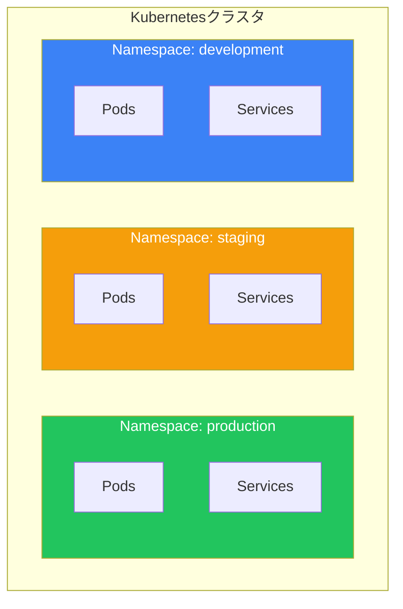

Namespaceはクラスタリソースを複数のユーザーやチーム間で分割する方法を提供します。ResourceQuotaとLimitRangeと組み合わせることで、効果的なマルチテナントリソース管理が可能になります。

## Namespaceとは？

Namespaceは物理クラスタ内の仮想クラスタで、以下を提供します：
- チーム/プロジェクト間のリソース分離
- 名前のスコープ（リソースはnamespace内で一意である必要）
- アクセス制御境界（RBAC）
- リソースクォータ境界



## デフォルトNamespace

| Namespace | 目的 |
|-----------|------|
| `default` | リソースのデフォルトnamespace |
| `kube-system` | Kubernetesシステムコンポーネント |
| `kube-public` | 公開読み取り可能なリソース |
| `kube-node-lease` | ノードハートビートリース |

## Namespaceの操作

### Namespaceの作成

```yaml
apiVersion: v1
kind: Namespace
metadata:
  name: production
  labels:
    environment: production
    team: platform
```

```bash
# 命令的に
kubectl create namespace production

# YAMLから
kubectl apply -f namespace.yaml
```

### Namespaceの表示

```bash
kubectl get namespaces
kubectl get ns

kubectl describe namespace production
```

### Namespaceにデプロイ

```bash
# コマンドで指定
kubectl apply -f deployment.yaml -n production

# コンテキストのデフォルトnamespaceを設定
kubectl config set-context --current --namespace=production

# 現在のnamespaceを表示
kubectl config view --minify | grep namespace:
```

### YAMLマニフェストで

```yaml
apiVersion: apps/v1
kind: Deployment
metadata:
  name: web-app
  namespace: production  # namespaceを指定
spec:
  replicas: 3
  # ...
```

## ResourceQuota

namespace単位で集約リソース消費を制限。

### コンピューティングResourceQuota

```yaml
apiVersion: v1
kind: ResourceQuota
metadata:
  name: compute-quota
  namespace: production
spec:
  hard:
    requests.cpu: "10"
    requests.memory: 20Gi
    limits.cpu: "20"
    limits.memory: 40Gi
    pods: "50"
    count/deployments.apps: "10"
```

### オブジェクト数クォータ

```yaml
apiVersion: v1
kind: ResourceQuota
metadata:
  name: object-quota
  namespace: development
spec:
  hard:
    pods: "20"
    services: "10"
    secrets: "20"
    configmaps: "20"
    persistentvolumeclaims: "10"
    services.loadbalancers: "2"
    services.nodeports: "5"
```

### ストレージクォータ

```yaml
apiVersion: v1
kind: ResourceQuota
metadata:
  name: storage-quota
  namespace: production
spec:
  hard:
    requests.storage: 100Gi
    persistentvolumeclaims: "10"
    # StorageClassごと
    fast.storageclass.storage.k8s.io/requests.storage: 50Gi
    fast.storageclass.storage.k8s.io/persistentvolumeclaims: "5"
```

### クォータ使用量の表示

```bash
kubectl get resourcequota -n production
kubectl describe resourcequota compute-quota -n production
```

## LimitRange

個々のコンテナ/Podのデフォルトと制限を設定。

### コンテナ制限

```yaml
apiVersion: v1
kind: LimitRange
metadata:
  name: container-limits
  namespace: production
spec:
  limits:
    - type: Container
      default:          # デフォルトlimits
        cpu: "500m"
        memory: "256Mi"
      defaultRequest:   # デフォルトrequests
        cpu: "100m"
        memory: "128Mi"
      max:              # 許可される最大値
        cpu: "2"
        memory: "2Gi"
      min:              # 必要な最小値
        cpu: "50m"
        memory: "64Mi"
```

### Pod制限

```yaml
apiVersion: v1
kind: LimitRange
metadata:
  name: pod-limits
  namespace: production
spec:
  limits:
    - type: Pod
      max:
        cpu: "4"
        memory: "8Gi"
      min:
        cpu: "100m"
        memory: "128Mi"
```

### PVC制限

```yaml
apiVersion: v1
kind: LimitRange
metadata:
  name: storage-limits
  namespace: production
spec:
  limits:
    - type: PersistentVolumeClaim
      max:
        storage: 50Gi
      min:
        storage: 1Gi
```

## Namespace分離

### ネットワーク分離

```yaml
apiVersion: networking.k8s.io/v1
kind: NetworkPolicy
metadata:
  name: deny-all
  namespace: production
spec:
  podSelector: {}
  policyTypes:
    - Ingress
    - Egress
```

### クロスNamespace通信

```yaml
# stagingnamespaceからのトラフィックを許可
apiVersion: networking.k8s.io/v1
kind: NetworkPolicy
metadata:
  name: allow-from-staging
  namespace: production
spec:
  podSelector: {}
  ingress:
    - from:
        - namespaceSelector:
            matchLabels:
              environment: staging
```

## Namespaceベストプラクティス

### 編成戦略

| 戦略 | 説明 | 使用例 |
|------|------|--------|
| 環境ごと | dev、staging、prod | 環境分離 |
| チームごと | team-a、team-b | チーム分離 |
| アプリごと | app1、app2 | アプリケーション分離 |
| 組み合わせ | team-a-prod、team-a-dev | マルチテナント |

### 推奨セットアップ

```yaml
# 完全な制御付きの本番namespace
apiVersion: v1
kind: Namespace
metadata:
  name: production
  labels:
    environment: production
---
apiVersion: v1
kind: ResourceQuota
metadata:
  name: production-quota
  namespace: production
spec:
  hard:
    requests.cpu: "50"
    requests.memory: 100Gi
    limits.cpu: "100"
    limits.memory: 200Gi
    pods: "100"
---
apiVersion: v1
kind: LimitRange
metadata:
  name: production-limits
  namespace: production
spec:
  limits:
    - type: Container
      default:
        cpu: "500m"
        memory: "512Mi"
      defaultRequest:
        cpu: "100m"
        memory: "256Mi"
      max:
        cpu: "4"
        memory: "8Gi"
```

## 一般的なコマンド

```bash
# namespaceを作成
kubectl create namespace myns

# namespace内のすべてのリソースを一覧表示
kubectl get all -n myns

# namespaceを削除（すべてのリソースも）
kubectl delete namespace myns

# クォータを表示
kubectl get resourcequota -n myns

# 制限を表示
kubectl get limitrange -n myns
```

## 重要なポイント

1. **Namespaceはリソースを分離** - クラスタ内の仮想クラスタ
2. **ResourceQuotaは集約使用量を制限** - namespace全体の消費を制御
3. **LimitRangeはデフォルトと制限を設定** - 個々のコンテナ/Pod制御
4. **マルチテナンシーに組み合わせ** - Namespace + Quota + LimitRange + RBAC
5. **意味のある名前を使用** - 目的や所有権を反映

## 次のステップ

次の記事では、Kubernetesリソースへのアクセスを制御するためのRBACとセキュリティを解説します。

## 参考文献

- The Kubernetes Book, 3rd Edition - Nigel Poulton
- Kubernetes: Up and Running, 3rd Edition - Burns, Beda, Hightower
- [Kubernetes Namespaceドキュメント](https://kubernetes.io/docs/concepts/overview/working-with-objects/namespaces/)
