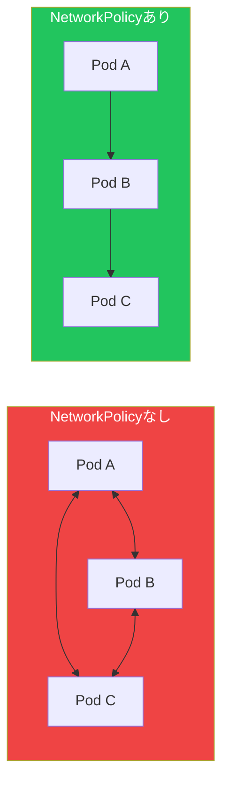

NetworkPolicyはネットワークレベルでPod間のトラフィックフローを制御します。デフォルトでは、すべてのPodが互いに通信できます。NetworkPolicyはネットワーク分離とセキュリティを実現します。

## NetworkPolicyの基本



## デフォルトですべて拒否

```yaml
# すべてのIngressを拒否
apiVersion: networking.k8s.io/v1
kind: NetworkPolicy
metadata:
  name: deny-all-ingress
  namespace: production
spec:
  podSelector: {}  # すべてのPodを選択
  policyTypes:
    - Ingress

---
# すべてのEgressを拒否
apiVersion: networking.k8s.io/v1
kind: NetworkPolicy
metadata:
  name: deny-all-egress
  namespace: production
spec:
  podSelector: {}
  policyTypes:
    - Egress

---
# すべてのトラフィックを拒否
apiVersion: networking.k8s.io/v1
kind: NetworkPolicy
metadata:
  name: deny-all
  namespace: production
spec:
  podSelector: {}
  policyTypes:
    - Ingress
    - Egress
```

## 特定のトラフィックを許可

### 特定のPodからのIngressを許可

```yaml
apiVersion: networking.k8s.io/v1
kind: NetworkPolicy
metadata:
  name: allow-frontend
  namespace: production
spec:
  podSelector:
    matchLabels:
      app: backend
  policyTypes:
    - Ingress
  ingress:
    - from:
        - podSelector:
            matchLabels:
              app: frontend
      ports:
        - protocol: TCP
          port: 8080
```

### Namespaceからを許可

```yaml
apiVersion: networking.k8s.io/v1
kind: NetworkPolicy
metadata:
  name: allow-from-monitoring
  namespace: production
spec:
  podSelector: {}
  policyTypes:
    - Ingress
  ingress:
    - from:
        - namespaceSelector:
            matchLabels:
              purpose: monitoring
```

### 外部へのEgressを許可

```yaml
apiVersion: networking.k8s.io/v1
kind: NetworkPolicy
metadata:
  name: allow-external-db
  namespace: production
spec:
  podSelector:
    matchLabels:
      app: backend
  policyTypes:
    - Egress
  egress:
    - to:
        - ipBlock:
            cidr: 10.0.0.0/24
      ports:
        - protocol: TCP
          port: 5432
```

### DNSを許可

```yaml
apiVersion: networking.k8s.io/v1
kind: NetworkPolicy
metadata:
  name: allow-dns
  namespace: production
spec:
  podSelector: {}
  policyTypes:
    - Egress
  egress:
    - to:
        - namespaceSelector: {}
          podSelector:
            matchLabels:
              k8s-app: kube-dns
      ports:
        - protocol: UDP
          port: 53
```

## 完全な例

```yaml
# 3層アプリケーションのネットワークポリシー
---
# フロントエンド：インターネットからのIngress、バックエンドへのEgress
apiVersion: networking.k8s.io/v1
kind: NetworkPolicy
metadata:
  name: frontend-policy
  namespace: production
spec:
  podSelector:
    matchLabels:
      tier: frontend
  policyTypes:
    - Ingress
    - Egress
  ingress:
    - from: []  # すべてのIngressを許可
      ports:
        - port: 80
  egress:
    - to:
        - podSelector:
            matchLabels:
              tier: backend
      ports:
        - port: 8080
    - to:  # DNS
        - namespaceSelector: {}
      ports:
        - port: 53
          protocol: UDP
---
# バックエンド：フロントエンドから、データベースへのEgress
apiVersion: networking.k8s.io/v1
kind: NetworkPolicy
metadata:
  name: backend-policy
  namespace: production
spec:
  podSelector:
    matchLabels:
      tier: backend
  policyTypes:
    - Ingress
    - Egress
  ingress:
    - from:
        - podSelector:
            matchLabels:
              tier: frontend
      ports:
        - port: 8080
  egress:
    - to:
        - podSelector:
            matchLabels:
              tier: database
      ports:
        - port: 5432
---
# データベース：バックエンドからのみ許可
apiVersion: networking.k8s.io/v1
kind: NetworkPolicy
metadata:
  name: database-policy
  namespace: production
spec:
  podSelector:
    matchLabels:
      tier: database
  policyTypes:
    - Ingress
  ingress:
    - from:
        - podSelector:
            matchLabels:
              tier: backend
      ports:
        - port: 5432
```

## ベストプラクティス

| プラクティス | 推奨事項 |
|-------------|---------|
| deny-allから開始 | その後特定のトラフィックを許可 |
| DNSを許可 | サービスディスカバリに必要 |
| ポリシーをテスト | 適用後に接続性を確認 |
| ポリシーを文書化 | 各ルールの理由を説明 |

## 重要なポイント

1. **デフォルトはallow-all** - 明示的に拒否が必要
2. **ポリシーは加算的** - 複数のポリシーが組み合わさる
3. **CNIサポートが必要** - Calico、Ciliumなど
4. **選択にはラベルを使用** - Podとnamespaceを対象に

## 参考文献

- [Kubernetes NetworkPolicyドキュメント](https://kubernetes.io/docs/concepts/services-networking/network-policies/)
