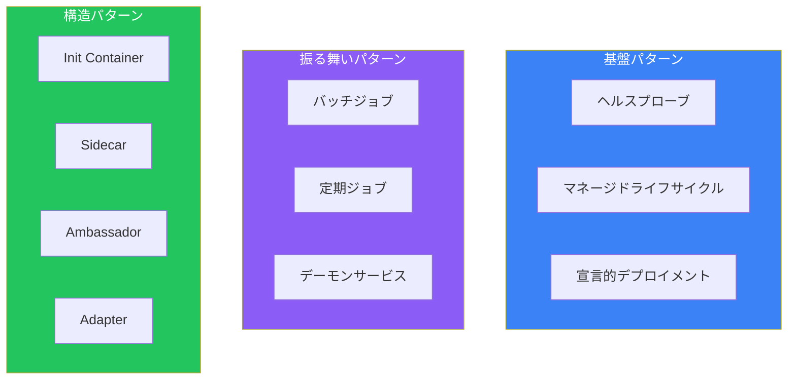
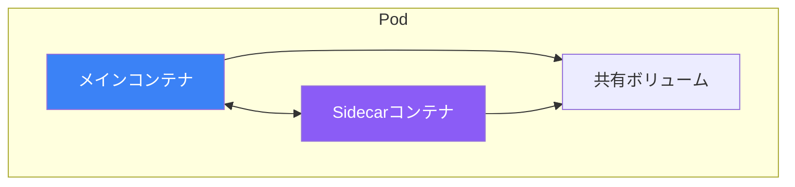
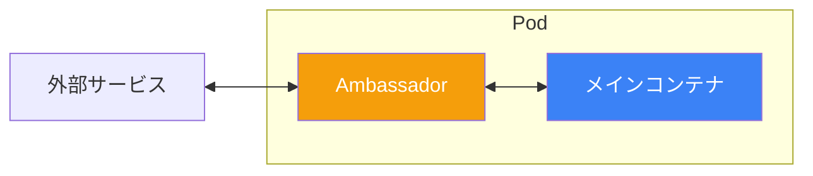
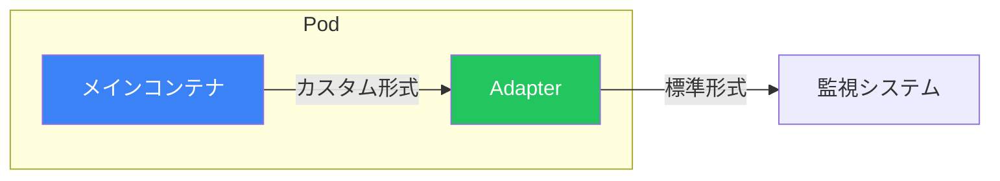
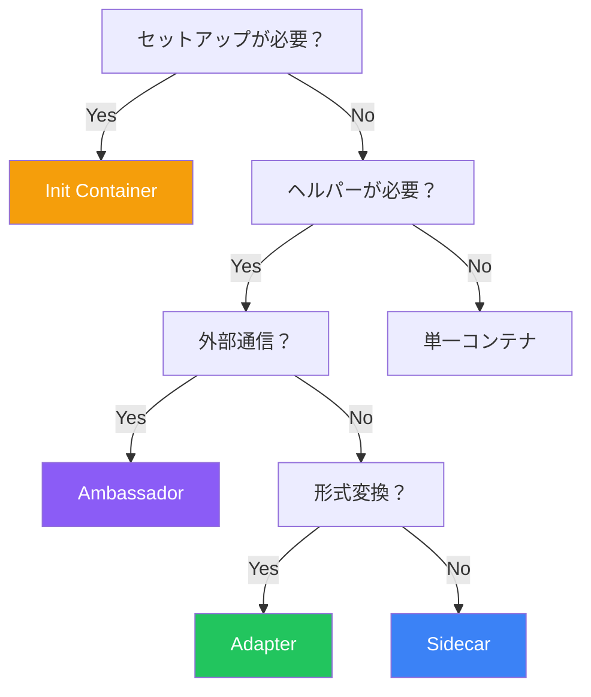

Kubernetesデザインパターンは、コンテナ化されたアプリケーションの一般的な課題に対する再利用可能なソリューションです。これらのパターンを理解することで、より保守性、スケーラビリティ、堅牢性の高いシステムを構築できます。

## パターンカテゴリ



## Init Containerパターン

Init Containerはメインコンテナの前に実行され、セットアップタスクを処理します。


### ユースケース

- 依存サービスの待機
- リポジトリのクローン
- 設定のダウンロード
- データベースマイグレーション

### 例：データベース待機

```yaml
apiVersion: v1
kind: Pod
metadata:
  name: web-app
spec:
  initContainers:
    - name: wait-for-db
      image: busybox:1.36
      command:
        - sh
        - -c
        - |
          until nc -z postgres-service 5432; do
            echo "Waiting for database..."
            sleep 2
          done
    - name: run-migrations
      image: myapp:1.0
      command: ["./migrate.sh"]
  containers:
    - name: app
      image: myapp:1.0
```

### 例：設定のクローン

```yaml
apiVersion: v1
kind: Pod
metadata:
  name: web-server
spec:
  initContainers:
    - name: git-clone
      image: alpine/git
      command:
        - git
        - clone
        - https://github.com/example/config.git
        - /config
      volumeMounts:
        - name: config-volume
          mountPath: /config
  containers:
    - name: nginx
      image: nginx:1.25
      volumeMounts:
        - name: config-volume
          mountPath: /usr/share/nginx/html
  volumes:
    - name: config-volume
      emptyDir: {}
```

## Sidecarパターン

メインコンテナの機能を拡張するヘルパーコンテナ。



### ユースケース

- ログ収集と転送
- モニタリングとメトリクス
- 設定同期
- TLS終端

### 例：ログ転送Sidecar

```yaml
apiVersion: v1
kind: Pod
metadata:
  name: app-with-logging
spec:
  containers:
    - name: app
      image: myapp:1.0
      volumeMounts:
        - name: logs
          mountPath: /var/log/app
    - name: log-shipper
      image: fluent/fluent-bit:2.1
      volumeMounts:
        - name: logs
          mountPath: /var/log/app
        - name: fluent-config
          mountPath: /fluent-bit/etc
  volumes:
    - name: logs
      emptyDir: {}
    - name: fluent-config
      configMap:
        name: fluent-bit-config
```

### 例：モニタリングSidecar

```yaml
apiVersion: v1
kind: Pod
metadata:
  name: app-with-metrics
spec:
  containers:
    - name: app
      image: myapp:1.0
      ports:
        - containerPort: 8080
    - name: prometheus-exporter
      image: prom/statsd-exporter:v0.24.0
      ports:
        - containerPort: 9102
      args:
        - --statsd.listen-udp=:9125
        - --web.listen-address=:9102
```

## Ambassadorパターン

外部通信を処理するプロキシコンテナ。



### ユースケース

- データベース接続プーリング
- サービスディスカバリの抽象化
- レート制限
- サーキットブレーカー

### 例：データベースプロキシ

```yaml
apiVersion: v1
kind: Pod
metadata:
  name: app-with-db-proxy
spec:
  containers:
    - name: app
      image: myapp:1.0
      env:
        - name: DATABASE_HOST
          value: "localhost"
        - name: DATABASE_PORT
          value: "5432"
    - name: cloud-sql-proxy
      image: gcr.io/cloud-sql-connectors/cloud-sql-proxy:2.1
      args:
        - --structured-logs
        - --port=5432
        - my-project:us-central1:my-instance
      securityContext:
        runAsNonRoot: true
```

### 例：Redisプロキシ

```yaml
apiVersion: v1
kind: Pod
metadata:
  name: app-with-redis-proxy
spec:
  containers:
    - name: app
      image: myapp:1.0
      env:
        - name: REDIS_HOST
          value: "localhost"
    - name: twemproxy
      image: twemproxy:latest
      ports:
        - containerPort: 6379
      volumeMounts:
        - name: config
          mountPath: /etc/twemproxy
  volumes:
    - name: config
      configMap:
        name: twemproxy-config
```

## Adapterパターン

メインコンテナからの出力を標準フォーマットに変換。



### ユースケース

- メトリクス形式変換
- ログ形式標準化
- プロトコル変換

### 例：Prometheusアダプター

```yaml
apiVersion: v1
kind: Pod
metadata:
  name: legacy-app
spec:
  containers:
    - name: legacy-app
      image: legacy:1.0
      ports:
        - containerPort: 8080
    - name: prometheus-adapter
      image: nginx/nginx-prometheus-exporter:0.11
      args:
        - -nginx.scrape-uri=http://localhost:8080/nginx_status
      ports:
        - containerPort: 9113
```

### 例：ログアダプター

```yaml
apiVersion: v1
kind: Pod
metadata:
  name: app-with-log-adapter
spec:
  containers:
    - name: app
      image: legacy:1.0
      volumeMounts:
        - name: logs
          mountPath: /var/log/app
    - name: log-adapter
      image: alpine:3.18
      command:
        - sh
        - -c
        - |
          tail -f /var/log/app/custom.log | \
          while read line; do
            echo "{\"timestamp\":\"$(date -Iseconds)\",\"message\":\"$line\"}"
          done
      volumeMounts:
        - name: logs
          mountPath: /var/log/app
  volumes:
    - name: logs
      emptyDir: {}
```

## パターン比較

| パターン | 目的 | コンテナの関係 |
|---------|------|---------------|
| Init Container | メイン前のセットアップ | 順次実行、終了する |
| Sidecar | 機能拡張 | 並列、同じライフサイクル |
| Ambassador | 外部通信処理 | メインと外部間のプロキシ |
| Adapter | 出力変換 | メインから受信 |

## パターンの組み合わせ

```yaml
apiVersion: v1
kind: Pod
metadata:
  name: full-pattern-example
spec:
  # Init Containerパターン
  initContainers:
    - name: wait-for-deps
      image: busybox:1.36
      command: ["sh", "-c", "until nc -z redis 6379; do sleep 1; done"]

  containers:
    # メインアプリケーション
    - name: app
      image: myapp:1.0
      ports:
        - containerPort: 8080
      volumeMounts:
        - name: logs
          mountPath: /var/log/app

    # Sidecarパターン：ログ収集
    - name: log-collector
      image: fluent/fluent-bit:2.1
      volumeMounts:
        - name: logs
          mountPath: /var/log/app

    # Ambassadorパターン：データベースプロキシ
    - name: db-proxy
      image: cloud-sql-proxy:2.1
      args: ["--port=5432", "project:region:instance"]

    # Adapterパターン：メトリクス変換
    - name: metrics-adapter
      image: prom/statsd-exporter:v0.24.0
      ports:
        - containerPort: 9102

  volumes:
    - name: logs
      emptyDir: {}
```

## ベストプラクティス

| プラクティス | 推奨事項 |
|-------------|---------|
| 単一責任 | 各コンテナは1つのことをうまく行う |
| 共有ボリューム | コンテナ間通信にemptyDirを使用 |
| リソース制限 | Sidecar含むすべてのコンテナに制限を設定 |
| ライフサイクル整合 | Sidecarがメインより長生きしないようにする |
| Sidecarは軽量に | リソースオーバーヘッドを最小化 |

## 各パターンの使い分け



## 重要なポイント

1. **Init Containerはセットアップ用** - メインコンテナの前に1回実行
2. **Sidecarは機能拡張** - ロギング、モニタリング、同期
3. **Ambassadorは外部通信処理** - プロキシと接続プーリング
4. **Adapterは出力標準化** - モニタリング用の形式変換
5. **必要に応じてパターンを組み合わせ** - 実際のアプリは複数パターンを使用

## 参考文献

- Kubernetes Patterns, 2nd Edition - Ibryam, Huß
- The Kubernetes Book, 3rd Edition - Nigel Poulton
- [Kubernetes マルチコンテナPod](https://kubernetes.io/docs/concepts/workloads/pods/#how-pods-manage-multiple-containers)
