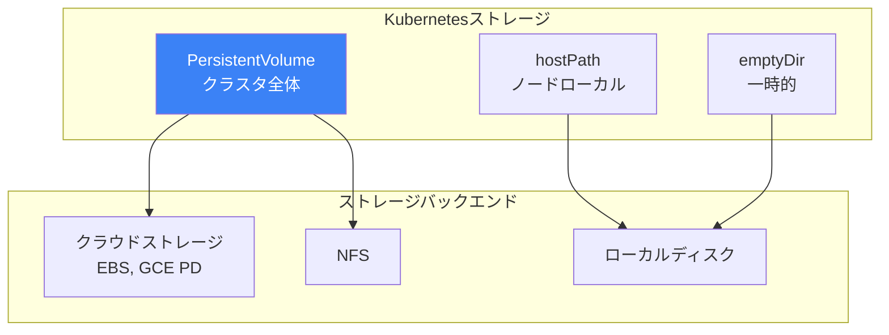
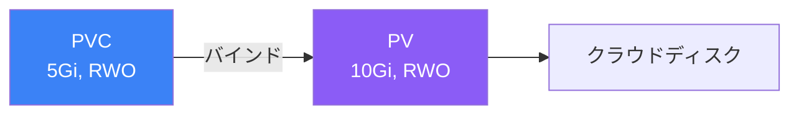

コンテナはデフォルトで一時的です - 再起動するとすべてのデータが失われます。Kubernetesは永続データのためのさまざまなストレージオプションを提供します。この記事では、ボリューム、PersistentVolume、StorageClass、StatefulSetを解説します。

## ストレージ概要



## ボリュームタイプ

### emptyDir

Podのライフタイム中存在する一時ストレージ。

```yaml
apiVersion: v1
kind: Pod
metadata:
  name: cache-pod
spec:
  containers:
    - name: app
      image: myapp:1.0
      volumeMounts:
        - name: cache
          mountPath: /cache
    - name: sidecar
      image: sidecar:1.0
      volumeMounts:
        - name: cache
          mountPath: /shared-cache
  volumes:
    - name: cache
      emptyDir: {}
      # またはサイズ制限付き
      # emptyDir:
      #   sizeLimit: 500Mi
      #   medium: Memory  # tmpfs
```

### hostPath

ホストノードからファイルまたはディレクトリをマウント。

```yaml
apiVersion: v1
kind: Pod
metadata:
  name: hostpath-pod
spec:
  containers:
    - name: app
      image: myapp:1.0
      volumeMounts:
        - name: data
          mountPath: /data
  volumes:
    - name: data
      hostPath:
        path: /mnt/data
        type: DirectoryOrCreate  # Directory, Fileなど
```

## PersistentVolume (PV)

物理ストレージを表すクラスタリソース。

```yaml
apiVersion: v1
kind: PersistentVolume
metadata:
  name: my-pv
spec:
  capacity:
    storage: 10Gi
  accessModes:
    - ReadWriteOnce
  persistentVolumeReclaimPolicy: Retain
  storageClassName: standard
  # バックエンド固有
  hostPath:
    path: /mnt/data
```

### アクセスモード

| モード | 略称 | 説明 |
|--------|------|------|
| ReadWriteOnce | RWO | 単一ノードで読み書き |
| ReadOnlyMany | ROX | 複数ノードで読み取り専用 |
| ReadWriteMany | RWX | 複数ノードで読み書き |
| ReadWriteOncePod | RWOP | 単一Podで読み書き |

### 回収ポリシー

| ポリシー | 説明 |
|---------|------|
| Retain | PVC削除後もPVを保持 |
| Delete | PVと基盤ストレージを削除 |
| Recycle | 非推奨、ワイプして再利用 |

## PersistentVolumeClaim (PVC)

ユーザーによるストレージのリクエスト。

```yaml
apiVersion: v1
kind: PersistentVolumeClaim
metadata:
  name: my-pvc
spec:
  accessModes:
    - ReadWriteOnce
  resources:
    requests:
      storage: 5Gi
  storageClassName: standard
  # オプション：特定のPV
  # volumeName: my-pv
```

### PodでPVCを使用

```yaml
apiVersion: v1
kind: Pod
metadata:
  name: app
spec:
  containers:
    - name: app
      image: myapp:1.0
      volumeMounts:
        - name: data
          mountPath: /data
  volumes:
    - name: data
      persistentVolumeClaim:
        claimName: my-pvc
```

## PVとPVCのバインディング



### バインディングプロセス

1. ユーザーが要件付きでPVCを作成
2. Kubernetesが一致するPVを検索（サイズ、アクセスモード、ストレージクラス）
3. PVCがPVにバインド（1:1関係）
4. PodがPVCを使用してストレージにアクセス

## StorageClass

動的プロビジョニングで「クラス」のストレージを定義。

```yaml
apiVersion: storage.k8s.io/v1
kind: StorageClass
metadata:
  name: fast
provisioner: kubernetes.io/aws-ebs
parameters:
  type: gp3
  iopsPerGB: "10"
reclaimPolicy: Delete
allowVolumeExpansion: true
volumeBindingMode: WaitForFirstConsumer
```

### 動的プロビジョニング

```yaml
# StorageClass付きPVC
apiVersion: v1
kind: PersistentVolumeClaim
metadata:
  name: dynamic-pvc
spec:
  accessModes:
    - ReadWriteOnce
  storageClassName: fast  # StorageClassを参照
  resources:
    requests:
      storage: 10Gi
# PVが自動的に作成される！
```

### 一般的なプロビジョナー

| プロバイダー | プロビジョナー |
|-------------|---------------|
| AWS EBS | `kubernetes.io/aws-ebs` |
| GCE PD | `kubernetes.io/gce-pd` |
| Azure Disk | `kubernetes.io/azure-disk` |
| NFS | `nfs-subdir-external-provisioner` |
| Local | `kubernetes.io/no-provisioner` |

### ボリュームバインディングモード

| モード | 説明 |
|--------|------|
| Immediate | PVC作成時に即座にプロビジョニング |
| WaitForFirstConsumer | PodがPVCを使用するまで待機 |

## StatefulSets

安定したストレージとネットワークIDを必要とするステートフルアプリケーション用。

```yaml
apiVersion: apps/v1
kind: StatefulSet
metadata:
  name: postgres
spec:
  serviceName: postgres
  replicas: 3
  selector:
    matchLabels:
      app: postgres
  template:
    metadata:
      labels:
        app: postgres
    spec:
      containers:
        - name: postgres
          image: postgres:15
          ports:
            - containerPort: 5432
          volumeMounts:
            - name: data
              mountPath: /var/lib/postgresql/data
          env:
            - name: POSTGRES_PASSWORD
              valueFrom:
                secretKeyRef:
                  name: postgres-secret
                  key: password

  volumeClaimTemplates:
    - metadata:
        name: data
      spec:
        accessModes: ["ReadWriteOnce"]
        storageClassName: fast
        resources:
          requests:
            storage: 10Gi
```

### StatefulSetの機能

| 機能 | 説明 |
|------|------|
| 安定したPod名 | postgres-0、postgres-1、postgres-2 |
| 順序付きデプロイ | 0 → 1 → 2 |
| 順序付き終了 | 2 → 1 → 0 |
| 安定したネットワークID | postgres-0.postgres.namespace.svc |
| 永続ストレージ | 各Podが独自のPVCを取得 |

### StatefulSet用Headless Service

```yaml
apiVersion: v1
kind: Service
metadata:
  name: postgres
spec:
  clusterIP: None  # Headless
  selector:
    app: postgres
  ports:
    - port: 5432
```

## ボリューム拡張

PVCサイズを拡張（StorageClassが許可している場合）：

```yaml
# StorageClassにはallowVolumeExpansion: trueが必要
apiVersion: v1
kind: PersistentVolumeClaim
metadata:
  name: my-pvc
spec:
  resources:
    requests:
      storage: 20Gi  # 10Giから増加
```

```bash
# PVCを拡張
kubectl patch pvc my-pvc -p '{"spec":{"resources":{"requests":{"storage":"20Gi"}}}}'
```

## ボリュームスナップショット

ボリュームのポイントインタイムコピーを作成。

```yaml
# VolumeSnapshotClass
apiVersion: snapshot.storage.k8s.io/v1
kind: VolumeSnapshotClass
metadata:
  name: csi-snapclass
driver: ebs.csi.aws.com
deletionPolicy: Delete
---
# スナップショットを作成
apiVersion: snapshot.storage.k8s.io/v1
kind: VolumeSnapshot
metadata:
  name: my-snapshot
spec:
  volumeSnapshotClassName: csi-snapclass
  source:
    persistentVolumeClaimName: my-pvc
---
# スナップショットから復元
apiVersion: v1
kind: PersistentVolumeClaim
metadata:
  name: restored-pvc
spec:
  dataSource:
    name: my-snapshot
    kind: VolumeSnapshot
    apiGroup: snapshot.storage.k8s.io
  accessModes:
    - ReadWriteOnce
  resources:
    requests:
      storage: 10Gi
```

## ストレージの操作

### 一般的なコマンド

```bash
# PVを一覧表示
kubectl get pv
kubectl get pv -o wide

# PVCを一覧表示
kubectl get pvc
kubectl get pvc -A

# StorageClassを一覧表示
kubectl get storageclass
kubectl get sc

# リソースを詳細表示
kubectl describe pv my-pv
kubectl describe pvc my-pvc

# PVCを削除（場合によってはPVも）
kubectl delete pvc my-pvc
```

### ストレージ問題のデバッグ

```bash
# PVCステータスを確認
kubectl get pvc my-pvc -o yaml

# イベントを確認
kubectl describe pvc my-pvc

# PVが利用可能か確認
kubectl get pv -o wide

# Podのボリュームマウントを確認
kubectl describe pod my-pod
```

## 完全な例

```yaml
# StorageClass
apiVersion: storage.k8s.io/v1
kind: StorageClass
metadata:
  name: database-storage
provisioner: kubernetes.io/aws-ebs
parameters:
  type: gp3
reclaimPolicy: Retain
allowVolumeExpansion: true
volumeBindingMode: WaitForFirstConsumer
---
# volumeClaimTemplate付きStatefulSet
apiVersion: apps/v1
kind: StatefulSet
metadata:
  name: mysql
spec:
  serviceName: mysql
  replicas: 3
  selector:
    matchLabels:
      app: mysql
  template:
    metadata:
      labels:
        app: mysql
    spec:
      containers:
        - name: mysql
          image: mysql:8.0
          ports:
            - containerPort: 3306
          env:
            - name: MYSQL_ROOT_PASSWORD
              valueFrom:
                secretKeyRef:
                  name: mysql-secret
                  key: password
          volumeMounts:
            - name: data
              mountPath: /var/lib/mysql
          readinessProbe:
            exec:
              command: ["mysqladmin", "ping", "-h", "localhost"]
            initialDelaySeconds: 30
            periodSeconds: 10

  volumeClaimTemplates:
    - metadata:
        name: data
      spec:
        accessModes: ["ReadWriteOnce"]
        storageClassName: database-storage
        resources:
          requests:
            storage: 50Gi
---
# Headless Service
apiVersion: v1
kind: Service
metadata:
  name: mysql
spec:
  clusterIP: None
  selector:
    app: mysql
  ports:
    - port: 3306
```

## ベストプラクティス

| プラクティス | 推奨事項 |
|-------------|---------|
| **StorageClassを使用** | 動的プロビジョニング用 |
| **本番にはRetainを使用** | 偶発的なデータ損失を防止 |
| **リソースリクエストを設定** | ボリュームを適切なサイズに |
| **ボリューム拡張を有効化** | 再作成なしで成長を許可 |
| **WaitForFirstConsumerを使用** | ゾーン対応プロビジョニング用 |
| **定期的にバックアップ** | スナップショットまたは外部バックアップを使用 |

## ストレージ比較

| タイプ | 永続性 | スコープ | 使用例 |
|--------|--------|---------|--------|
| emptyDir | Podのライフタイム | Pod | キャッシュ、一時ファイル |
| hostPath | ノードのライフタイム | ノード | ノードローカルデータ |
| PV/PVC | クラスタのライフタイム | クラスタ | データベース、永続アプリ |

## 重要なポイント

1. **コンテナは一時的** - データには永続ストレージを使用
2. **PVはストレージを抽象化** - クラスタ全体のストレージリソース
3. **PVCはストレージをリクエスト** - ユーザー向けストレージクレーム
4. **StorageClassで動的プロビジョニング** - 自動PV作成
5. **ステートフルアプリにはStatefulSet** - 安定したIDとストレージ
6. **適切な回収ポリシーを使用** - 本番データにはRetain

## 次のステップ

次の記事では、クラスタ編成とリソース管理のためのNamespaceとResourceQuotaを解説します。

## 参考文献

- The Kubernetes Book, 3rd Edition - Nigel Poulton
- Kubernetes: Up and Running, 3rd Edition - Burns, Beda, Hightower
- [Kubernetesストレージドキュメント](https://kubernetes.io/docs/concepts/storage/)
