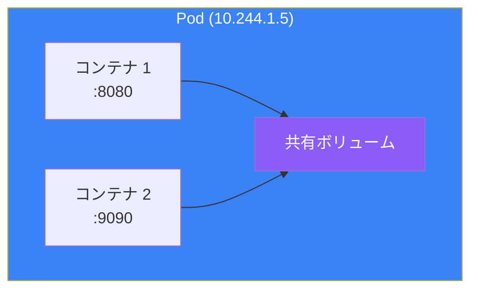
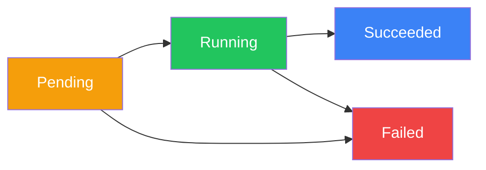

Podは Kubernetesの基本的な構成要素です。Podを理解することは、Kubernetesを効果的に使用するために不可欠です。この記事では、Podの概念、マニフェスト、マルチコンテナパターン、ベストプラクティスを解説します。

## Podとは？

PodはKubernetesで最小のデプロイ単位です。実行中のプロセスの単一インスタンスを表し、以下を共有する1つ以上のコンテナを含むことができます：

- ネットワーク名前空間（同じIPアドレスとポート空間）
- ストレージボリューム
- ライフサイクル（一緒に作成・削除される）



## Podマニフェスト構造

### 基本的なPod定義

```yaml
apiVersion: v1
kind: Pod
metadata:
  name: my-app
  namespace: default
  labels:
    app: my-app
    environment: production
  annotations:
    description: "My application pod"
spec:
  containers:
    - name: app
      image: nginx:1.25
      ports:
        - containerPort: 80
          name: http
      resources:
        requests:
          memory: "64Mi"
          cpu: "250m"
        limits:
          memory: "128Mi"
          cpu: "500m"
  restartPolicy: Always
```

### 主要なPod Specフィールド

| フィールド | 説明 |
|-----------|------|
| `containers` | Pod内のコンテナリスト |
| `initContainers` | メインコンテナの前に実行されるコンテナ |
| `volumes` | コンテナで利用可能なボリューム |
| `restartPolicy` | Always、OnFailure、またはNever |
| `nodeSelector` | ノード選択制約 |
| `serviceAccountName` | Podのサービスアカウント |
| `securityContext` | Pod レベルのセキュリティ設定 |

## コンテナ仕様

### 完全なコンテナ例

```yaml
apiVersion: v1
kind: Pod
metadata:
  name: full-example
spec:
  containers:
    - name: app
      image: myapp:1.0
      imagePullPolicy: IfNotPresent

      # ポート設定
      ports:
        - containerPort: 8080
          name: http
          protocol: TCP

      # 環境変数
      env:
        - name: DATABASE_URL
          value: "postgres://db:5432/myapp"
        - name: SECRET_KEY
          valueFrom:
            secretKeyRef:
              name: app-secrets
              key: secret-key
        - name: POD_NAME
          valueFrom:
            fieldRef:
              fieldPath: metadata.name

      # リソース管理
      resources:
        requests:
          memory: "256Mi"
          cpu: "500m"
        limits:
          memory: "512Mi"
          cpu: "1000m"

      # ボリュームマウント
      volumeMounts:
        - name: config
          mountPath: /etc/config
          readOnly: true
        - name: data
          mountPath: /data

      # ヘルスチェック
      livenessProbe:
        httpGet:
          path: /health
          port: 8080
        initialDelaySeconds: 10
        periodSeconds: 5

      readinessProbe:
        httpGet:
          path: /ready
          port: 8080
        initialDelaySeconds: 5
        periodSeconds: 3

      # ライフサイクルフック
      lifecycle:
        postStart:
          exec:
            command: ["/bin/sh", "-c", "echo Started"]
        preStop:
          exec:
            command: ["/bin/sh", "-c", "sleep 10"]

  volumes:
    - name: config
      configMap:
        name: app-config
    - name: data
      emptyDir: {}
```

## Podライフサイクル

### Podフェーズ



| フェーズ | 説明 |
|---------|------|
| **Pending** | Podは受け入れられたがコンテナがまだ作成されていない |
| **Running** | 少なくとも1つのコンテナが実行中 |
| **Succeeded** | すべてのコンテナが正常に終了 |
| **Failed** | すべてのコンテナが終了、少なくとも1つが失敗 |
| **Unknown** | Podの状態を判断できない |

### コンテナ状態

| 状態 | 説明 |
|------|------|
| **Waiting** | コンテナが開始を待機中 |
| **Running** | コンテナが実行中 |
| **Terminated** | コンテナが実行を完了 |

### 再起動ポリシー

```yaml
spec:
  restartPolicy: Always    # デフォルト、常に再起動
  restartPolicy: OnFailure # 失敗時のみ再起動
  restartPolicy: Never     # 再起動しない
```

## マルチコンテナPod

### サイドカーパターン

メインコンテナの機能を拡張するヘルパーコンテナ。

```yaml
apiVersion: v1
kind: Pod
metadata:
  name: app-with-sidecar
spec:
  containers:
    # メインアプリケーション
    - name: app
      image: myapp:1.0
      ports:
        - containerPort: 8080
      volumeMounts:
        - name: logs
          mountPath: /var/log/app

    # サイドカー：ログコレクター
    - name: log-collector
      image: fluentd:latest
      volumeMounts:
        - name: logs
          mountPath: /var/log/app
          readOnly: true

  volumes:
    - name: logs
      emptyDir: {}
```

### アンバサダーパターン

外部通信を処理するプロキシコンテナ。

```yaml
apiVersion: v1
kind: Pod
metadata:
  name: app-with-ambassador
spec:
  containers:
    - name: app
      image: myapp:1.0
      env:
        - name: DATABASE_URL
          value: "localhost:5432"  # アンバサダーに接続

    # アンバサダー：データベースプロキシ
    - name: db-proxy
      image: cloud-sql-proxy:latest
      args:
        - "--instances=project:region:instance=tcp:5432"
```

### アダプターパターン

メインコンテナからの出力を変換するコンテナ。

```yaml
apiVersion: v1
kind: Pod
metadata:
  name: app-with-adapter
spec:
  containers:
    - name: app
      image: legacy-app:1.0
      volumeMounts:
        - name: metrics
          mountPath: /metrics

    # アダプター：メトリクス形式を変換
    - name: metrics-adapter
      image: prometheus-adapter:latest
      ports:
        - containerPort: 9090
      volumeMounts:
        - name: metrics
          mountPath: /metrics
          readOnly: true

  volumes:
    - name: metrics
      emptyDir: {}
```

## Initコンテナ

Initコンテナはメインコンテナが開始する前に実行され、セットアップタスクに便利です。

```yaml
apiVersion: v1
kind: Pod
metadata:
  name: app-with-init
spec:
  initContainers:
    # データベースを待機
    - name: wait-for-db
      image: busybox:1.36
      command: ['sh', '-c', 'until nc -z db-service 5432; do sleep 2; done']

    # 設定をダウンロード
    - name: download-config
      image: busybox:1.36
      command: ['wget', '-O', '/config/app.conf', 'http://config-server/app.conf']
      volumeMounts:
        - name: config
          mountPath: /config

    # 権限を設定
    - name: set-permissions
      image: busybox:1.36
      command: ['chmod', '-R', '755', '/data']
      volumeMounts:
        - name: data
          mountPath: /data

  containers:
    - name: app
      image: myapp:1.0
      volumeMounts:
        - name: config
          mountPath: /etc/app
        - name: data
          mountPath: /data

  volumes:
    - name: config
      emptyDir: {}
    - name: data
      emptyDir: {}
```

## リソース管理

### リクエストとリミット

```yaml
resources:
  requests:    # 最小保証リソース
    memory: "256Mi"
    cpu: "500m"      # 0.5 CPUコア
  limits:      # 最大許可リソース
    memory: "512Mi"
    cpu: "1000m"     # 1 CPUコア
```

### CPU単位

| 値 | 意味 |
|----|------|
| `1` | 1 CPUコア |
| `1000m` | 1 CPUコア（ミリコア） |
| `500m` | 0.5 CPUコア |
| `100m` | 0.1 CPUコア |

### メモリ単位

| 値 | 意味 |
|----|------|
| `128Mi` | 128メビバイト |
| `1Gi` | 1ギビバイト |
| `128M` | 128メガバイト |
| `1G` | 1ギガバイト |

### サービス品質（QoS）

| QoSクラス | 条件 |
|----------|------|
| **Guaranteed** | すべてのコンテナでrequests == limits |
| **Burstable** | 少なくとも1つのコンテナにrequestsまたはlimitsがある |
| **BestEffort** | requestsもlimitsも設定されていない |

```yaml
# Guaranteed QoS
resources:
  requests:
    memory: "256Mi"
    cpu: "500m"
  limits:
    memory: "256Mi"
    cpu: "500m"
```

## Podセキュリティ

### セキュリティコンテキスト

```yaml
apiVersion: v1
kind: Pod
metadata:
  name: secure-pod
spec:
  securityContext:
    runAsUser: 1000
    runAsGroup: 3000
    fsGroup: 2000
    runAsNonRoot: true

  containers:
    - name: app
      image: myapp:1.0
      securityContext:
        allowPrivilegeEscalation: false
        readOnlyRootFilesystem: true
        capabilities:
          drop:
            - ALL
```

### Podセキュリティ標準

| レベル | 説明 |
|--------|------|
| **Privileged** | 制限なし |
| **Baseline** | 最小限の制限、既知のエスカレーションを防止 |
| **Restricted** | 高度に制限的、ハードニングのベストプラクティスに従う |

## Podの操作

### 作成と管理

```bash
# YAMLからPodを作成
kubectl apply -f pod.yaml

# 命令的にPodを作成
kubectl run nginx --image=nginx:1.25

# Podを一覧表示
kubectl get pods
kubectl get pods -o wide

# Podを詳細表示
kubectl describe pod my-pod

# Podを削除
kubectl delete pod my-pod

# Podを即座に削除
kubectl delete pod my-pod --force --grace-period=0
```

### デバッグとトラブルシューティング

```bash
# ログを表示
kubectl logs my-pod
kubectl logs my-pod -c container-name
kubectl logs my-pod --previous

# コマンドを実行
kubectl exec my-pod -- ls /app
kubectl exec -it my-pod -- /bin/sh

# ポートフォワード
kubectl port-forward my-pod 8080:80

# ファイルをコピー
kubectl cp my-pod:/app/log.txt ./log.txt
```

### Pod状態条件

```bash
# Pod条件を確認
kubectl get pod my-pod -o jsonpath='{.status.conditions}'
```

| 条件 | 説明 |
|------|------|
| PodScheduled | Podがノードにスケジュールされた |
| ContainersReady | すべてのコンテナが準備完了 |
| Initialized | すべてのinitコンテナが完了 |
| Ready | Podがリクエストを処理可能 |

## 一般的なパターン

### グレースフルシャットダウン

```yaml
spec:
  terminationGracePeriodSeconds: 30
  containers:
    - name: app
      lifecycle:
        preStop:
          exec:
            command: ["/bin/sh", "-c", "sleep 5 && kill -SIGTERM 1"]
```

### Pod Disruption Budget

```yaml
apiVersion: policy/v1
kind: PodDisruptionBudget
metadata:
  name: app-pdb
spec:
  minAvailable: 2
  selector:
    matchLabels:
      app: my-app
```

## ベストプラクティス

| プラクティス | 推奨事項 |
|-------------|---------|
| **1コンテナ1プロセス** | コンテナを集中的に保つ |
| **リソースリミットを設定** | リソース枯渇を防止 |
| **ヘルスチェックを使用** | 自己修復を有効化 |
| **非rootで実行** | セキュリティを向上 |
| **ラベルを使用** | Podを整理・選択 |
| **特権モードを避ける** | 攻撃面を最小化 |

## 重要なポイント

1. **Podは最小単位** - コンテナはPod内で実行される
2. **コンテナはリソースを共有** - ネットワーク、ストレージ、ライフサイクル
3. **initコンテナを使用** - セットアップと初期化用
4. **リソースのrequests/limitsを設定** - 適切なスケジューリングとQoSのため
5. **マルチコンテナパターン** - サイドカー、アンバサダー、アダプター
6. **セキュリティコンテキスト** - Podを安全に実行

## 次のステップ

次の記事では、Podレプリカとローリングアップデートを管理するDeploymentとReplicaSetを解説します。

## 参考文献

- The Kubernetes Book, 3rd Edition - Nigel Poulton
- Kubernetes: Up and Running, 3rd Edition - Burns, Beda, Hightower
- [Kubernetes Podドキュメント](https://kubernetes.io/docs/concepts/workloads/pods/)
