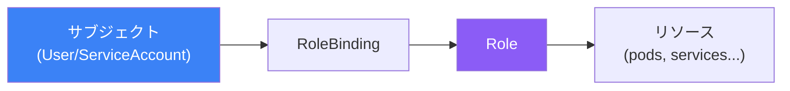

ロールベースアクセス制御（RBAC）は、Kubernetesリソースへのアクセスを制御する標準的な方法です。この記事では、RBACコンポーネント、ServiceAccount、セキュリティベストプラクティスを解説します。

## RBAC概要



## RBACコンポーネント

| コンポーネント | スコープ | 説明 |
|---------------|---------|------|
| Role | Namespace | namespace内の権限 |
| ClusterRole | クラスタ | クラスタ全体の権限 |
| RoleBinding | Namespace | Roleをサブジェクトにバインド |
| ClusterRoleBinding | クラスタ | ClusterRoleをサブジェクトにバインド |

## RoleとClusterRole

### Role（Namespaceスコープ）

```yaml
apiVersion: rbac.authorization.k8s.io/v1
kind: Role
metadata:
  name: pod-reader
  namespace: production
rules:
  - apiGroups: [""]
    resources: ["pods"]
    verbs: ["get", "list", "watch"]
  - apiGroups: [""]
    resources: ["pods/log"]
    verbs: ["get"]
```

### ClusterRole（クラスタスコープ）

```yaml
apiVersion: rbac.authorization.k8s.io/v1
kind: ClusterRole
metadata:
  name: secret-reader
rules:
  - apiGroups: [""]
    resources: ["secrets"]
    verbs: ["get", "list"]
  - apiGroups: [""]
    resources: ["nodes"]
    verbs: ["get", "list", "watch"]
```

### 一般的なVerbs

| Verb | 説明 |
|------|------|
| get | 単一リソースを読み取り |
| list | リソースを一覧表示 |
| watch | 変更を監視 |
| create | リソースを作成 |
| update | リソースを更新 |
| patch | 部分更新 |
| delete | リソースを削除 |
| deletecollection | 複数削除 |

## RoleBinding

### RoleBinding

```yaml
apiVersion: rbac.authorization.k8s.io/v1
kind: RoleBinding
metadata:
  name: read-pods
  namespace: production
subjects:
  - kind: User
    name: developer@example.com
    apiGroup: rbac.authorization.k8s.io
  - kind: ServiceAccount
    name: monitoring
    namespace: production
roleRef:
  kind: Role
  name: pod-reader
  apiGroup: rbac.authorization.k8s.io
```

### ClusterRoleBinding

```yaml
apiVersion: rbac.authorization.k8s.io/v1
kind: ClusterRoleBinding
metadata:
  name: cluster-admin-binding
subjects:
  - kind: User
    name: admin@example.com
    apiGroup: rbac.authorization.k8s.io
roleRef:
  kind: ClusterRole
  name: cluster-admin
  apiGroup: rbac.authorization.k8s.io
```

## ServiceAccount

PodがAPIにアクセスするためのID。

```yaml
apiVersion: v1
kind: ServiceAccount
metadata:
  name: app-service-account
  namespace: production
---
apiVersion: apps/v1
kind: Deployment
metadata:
  name: app
spec:
  template:
    spec:
      serviceAccountName: app-service-account
      containers:
        - name: app
          image: myapp:1.0
```

### Role付きServiceAccount

```yaml
apiVersion: v1
kind: ServiceAccount
metadata:
  name: monitoring-sa
  namespace: production
---
apiVersion: rbac.authorization.k8s.io/v1
kind: Role
metadata:
  name: monitoring-role
  namespace: production
rules:
  - apiGroups: [""]
    resources: ["pods", "services"]
    verbs: ["get", "list", "watch"]
---
apiVersion: rbac.authorization.k8s.io/v1
kind: RoleBinding
metadata:
  name: monitoring-binding
  namespace: production
subjects:
  - kind: ServiceAccount
    name: monitoring-sa
    namespace: production
roleRef:
  kind: Role
  name: monitoring-role
  apiGroup: rbac.authorization.k8s.io
```

## 権限のテスト

```bash
# 現在のユーザーがアクションを実行できるか確認
kubectl auth can-i create pods
kubectl auth can-i delete deployments -n production

# 別のユーザーとして確認
kubectl auth can-i create pods --as=developer@example.com

# ServiceAccountとして確認
kubectl auth can-i list secrets --as=system:serviceaccount:production:app-sa

# すべての権限を一覧表示
kubectl auth can-i --list
```

## 一般的なパターン

### 開発者Role

```yaml
apiVersion: rbac.authorization.k8s.io/v1
kind: Role
metadata:
  name: developer
  namespace: development
rules:
  - apiGroups: ["", "apps", "batch"]
    resources: ["*"]
    verbs: ["*"]
  - apiGroups: [""]
    resources: ["secrets"]
    verbs: ["get", "list"]  # 読み取り専用secrets
```

### 読み取り専用Role

```yaml
apiVersion: rbac.authorization.k8s.io/v1
kind: ClusterRole
metadata:
  name: readonly
rules:
  - apiGroups: ["*"]
    resources: ["*"]
    verbs: ["get", "list", "watch"]
```

## SecurityContext

Podとコンテナのセキュリティ設定。

```yaml
apiVersion: v1
kind: Pod
metadata:
  name: secure-pod
spec:
  securityContext:
    runAsNonRoot: true
    runAsUser: 1000
    fsGroup: 2000
  containers:
    - name: app
      image: myapp:1.0
      securityContext:
        allowPrivilegeEscalation: false
        readOnlyRootFilesystem: true
        capabilities:
          drop: ["ALL"]
```

## ベストプラクティス

| プラクティス | 推奨事項 |
|-------------|---------|
| 最小権限 | 必要最小限の権限を付与 |
| namespace付きRoleを使用 | ClusterRoleよりRoleを優先 |
| ワイルドカードを避ける | リソース/verbsを具体的に |
| 定期的に監査 | RBAC設定をレビュー |
| ServiceAccountを使用 | デフォルトSAを使わない |

## 重要なポイント

1. **RBACはアクセスを制御** - 誰が何をどのリソースに対してできるか
2. **namespaceにはRole、クラスタにはClusterRole** - スコープが重要
3. **Bindingはサブジェクトをロールに接続** - ユーザー/SAを権限に
4. **can-iでテスト** - デプロイ前に権限を確認
5. **最小権限の原則** - 必要なものだけを付与

## 参考文献

- The Kubernetes Book, 3rd Edition - Nigel Poulton
- [Kubernetes RBACドキュメント](https://kubernetes.io/docs/reference/access-authn-authz/rbac/)
