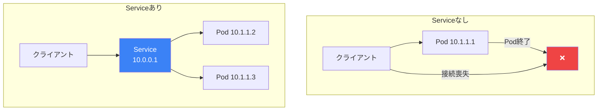
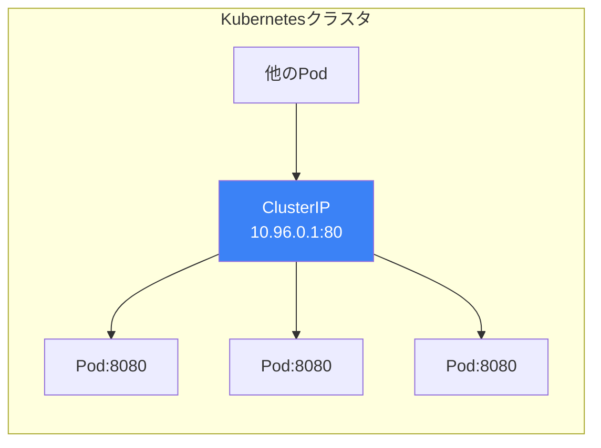
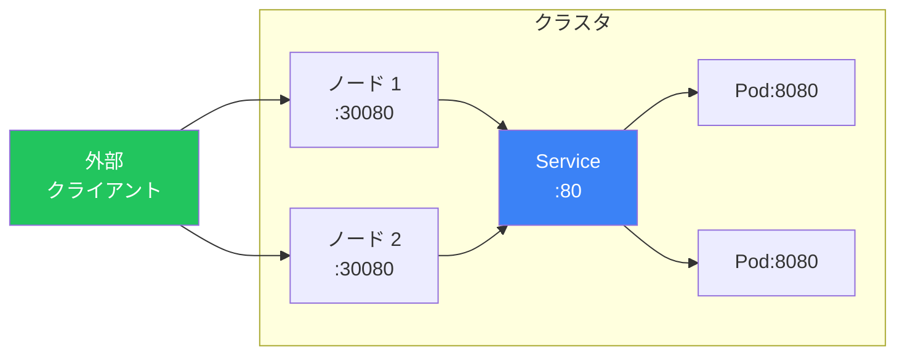
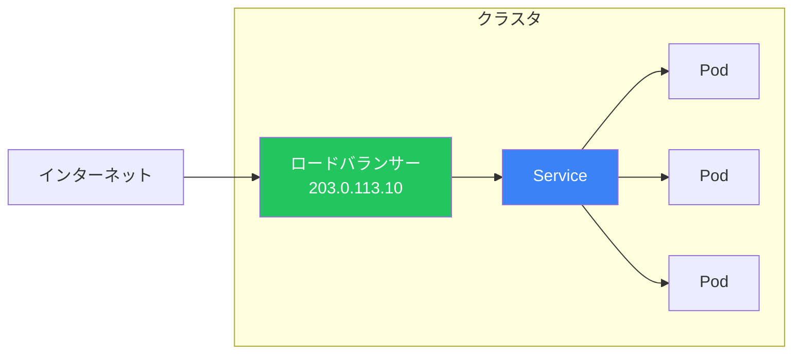

ServiceはKubernetesでPodにアクセスするための安定したネットワーキングを提供します。Podは一時的でIPアドレスが変わるため、Serviceは通信のための一貫したエンドポイントを提供します。この記事では、Serviceタイプ、ディスカバリ、ベストプラクティスを解説します。

## なぜServiceが必要か？

Podは一時的です - いつでも作成、削除、再スケジュールされる可能性があります。各Podは一意のIPアドレスを取得しますが、Podが再起動するとこれらのアドレスは変わります。



## Serviceタイプ

| タイプ | 説明 | アクセス元 |
|-------|------|-----------|
| **ClusterIP** | 内部クラスタIP（デフォルト） | クラスタ内部のみ |
| **NodePort** | 各ノードのポート | ノードIP経由で外部から |
| **LoadBalancer** | クラウドロードバランサー | 外部インターネット |
| **ExternalName** | DNS CNAMEレコード | 外部サービスにマッピング |

## ClusterIP Service

デフォルトのサービスタイプで、クラスタ内からのみアクセス可能です。

```yaml
apiVersion: v1
kind: Service
metadata:
  name: backend-service
spec:
  type: ClusterIP  # デフォルト、省略可能
  selector:
    app: backend
  ports:
    - name: http
      port: 80        # Serviceポート
      targetPort: 8080  # コンテナポート
      protocol: TCP
```



### ClusterIP Serviceへのアクセス

```bash
# クラスタ内から
curl http://backend-service:80
curl http://backend-service.default.svc.cluster.local:80

# ローカルアクセス用のポートフォワード
kubectl port-forward svc/backend-service 8080:80
```

## NodePort Service

各ノードのIPで静的ポートを通じてサービスを公開します。

```yaml
apiVersion: v1
kind: Service
metadata:
  name: web-service
spec:
  type: NodePort
  selector:
    app: web
  ports:
    - port: 80
      targetPort: 8080
      nodePort: 30080  # オプション：30000-32767
```



### NodePort範囲

```bash
# デフォルト範囲：30000-32767
# kube-apiserverで設定可能：
# --service-node-port-range=20000-32767
```

## LoadBalancer Service

外部ロードバランサーをプロビジョニングします（クラウドプロバイダー必須）。

```yaml
apiVersion: v1
kind: Service
metadata:
  name: public-web
  annotations:
    # AWS固有のアノテーション
    service.beta.kubernetes.io/aws-load-balancer-type: "nlb"
    service.beta.kubernetes.io/aws-load-balancer-internal: "false"
spec:
  type: LoadBalancer
  selector:
    app: web
  ports:
    - port: 80
      targetPort: 8080
```



### クラウドプロバイダーアノテーション

| プロバイダー | 一般的なアノテーション |
|-------------|----------------------|
| AWS | `service.beta.kubernetes.io/aws-load-balancer-*` |
| GCP | `cloud.google.com/load-balancer-type` |
| Azure | `service.beta.kubernetes.io/azure-load-balancer-*` |

## ExternalName Service

サービスを外部DNS名にマッピングします。

```yaml
apiVersion: v1
kind: Service
metadata:
  name: external-db
spec:
  type: ExternalName
  externalName: database.example.com
```

```bash
# クラスタ内から、外部DNSに解決される
nslookup external-db
# 戻り値：database.example.com
```

## Headless Service

クラスタIPなしのサービス、ステートフルアプリケーション用。

```yaml
apiVersion: v1
kind: Service
metadata:
  name: database-headless
spec:
  clusterIP: None  # Headlessにする
  selector:
    app: database
  ports:
    - port: 5432
```

### Headless Service DNS

```bash
# サービスIPの代わりに個々のPod IPを返す
nslookup database-headless
# pod-0.database-headless.default.svc.cluster.local
# pod-1.database-headless.default.svc.cluster.local
```

## サービスディスカバリ

### DNSベースのディスカバリ

KubernetesはサービスのDNSレコードを自動的に作成します。

```bash
# Service DNSパターン
<service-name>                              # 同じnamespace
<service-name>.<namespace>                  # クロスnamespace
<service-name>.<namespace>.svc              # 完全修飾
<service-name>.<namespace>.svc.cluster.local # 完全なFQDN
```

### DNS解決の例

```yaml
# 'production' namespaceのService
apiVersion: v1
kind: Service
metadata:
  name: api-service
  namespace: production
spec:
  selector:
    app: api
  ports:
    - port: 80
```

```bash
# 同じnamespaceからアクセス
curl http://api-service

# 別のnamespaceからアクセス
curl http://api-service.production
curl http://api-service.production.svc.cluster.local
```

### 環境変数

Kubernetesはサービス情報を環境変数としても注入します。

```bash
# 'redis-master'サービスの場合
REDIS_MASTER_SERVICE_HOST=10.96.0.10
REDIS_MASTER_SERVICE_PORT=6379
REDIS_MASTER_PORT=tcp://10.96.0.10:6379
```

## EndpointsとEndpointSlices

### Endpoints

EndpointsはサービスをバックするPodのIPアドレスを追跡します。

```bash
# Endpointsを表示
kubectl get endpoints backend-service
kubectl describe endpoints backend-service
```

```yaml
# Endpointsオブジェクト（自動作成）
apiVersion: v1
kind: Endpoints
metadata:
  name: backend-service
subsets:
  - addresses:
      - ip: 10.244.1.5
      - ip: 10.244.2.7
    ports:
      - port: 8080
```

### EndpointSlices

Endpointsのより新しい、スケーラブルな代替。

```bash
kubectl get endpointslices -l kubernetes.io/service-name=backend-service
```

### 外部Endpoints

外部リソースを指すサービスを作成します。

```yaml
apiVersion: v1
kind: Service
metadata:
  name: external-database
spec:
  ports:
    - port: 5432
---
apiVersion: v1
kind: Endpoints
metadata:
  name: external-database
subsets:
  - addresses:
      - ip: 192.168.1.100  # 外部IP
    ports:
      - port: 5432
```

## セッションアフィニティ

同じクライアントからのリクエストが同じPodに行くことを保証します。

```yaml
apiVersion: v1
kind: Service
metadata:
  name: sticky-service
spec:
  selector:
    app: web
  ports:
    - port: 80
  sessionAffinity: ClientIP
  sessionAffinityConfig:
    clientIP:
      timeoutSeconds: 10800  # 3時間
```

| アフィニティ | 説明 |
|-------------|------|
| None | デフォルト、ランダム分散 |
| ClientIP | クライアントIPに基づいてルーティング |

## マルチポートService

```yaml
apiVersion: v1
kind: Service
metadata:
  name: multi-port-service
spec:
  selector:
    app: my-app
  ports:
    - name: http
      port: 80
      targetPort: 8080
    - name: https
      port: 443
      targetPort: 8443
    - name: metrics
      port: 9090
      targetPort: 9090
```

## Serviceトポロジー

### トラフィックポリシー

トラフィックのルーティング方法を制御します。

```yaml
apiVersion: v1
kind: Service
metadata:
  name: local-service
spec:
  selector:
    app: web
  ports:
    - port: 80
  # ローカルノードのPodのみにルーティング
  internalTrafficPolicy: Local
  externalTrafficPolicy: Local
```

| ポリシー | 説明 |
|---------|------|
| Cluster | デフォルト、任意のPodにルーティング |
| Local | 同じノードのPodのみにルーティング |

## Serviceの操作

### 一般的なコマンド

```bash
# Serviceを作成
kubectl apply -f service.yaml
kubectl create service clusterip my-svc --tcp=80:8080

# DeploymentをServiceとして公開
kubectl expose deployment nginx --port=80 --target-port=8080

# Serviceを一覧表示
kubectl get services
kubectl get svc -o wide

# Serviceを詳細表示
kubectl describe service my-service

# Serviceを削除
kubectl delete service my-service
```

### Serviceのデバッグ

```bash
# Endpointsを確認
kubectl get endpoints my-service

# 接続をテスト
kubectl run debug --image=busybox --rm -it -- wget -qO- http://my-service

# DNS解決を確認
kubectl run debug --image=busybox --rm -it -- nslookup my-service

# ローカルテスト用のポートフォワード
kubectl port-forward svc/my-service 8080:80
```

## Service比較

| タイプ | クラスタアクセス | 外部アクセス | 使用例 |
|--------|----------------|-------------|--------|
| ClusterIP | 可能 | 不可（port-forward） | 内部サービス |
| NodePort | 可能 | ノードIP + ポート | 開発、オンプレミス |
| LoadBalancer | 可能 | パブリックIP | 本番、クラウド |
| ExternalName | DNSのみ | N/A | 外部サービス |
| Headless | Pod IP | 不可 | StatefulSets |

## ベストプラクティス

| プラクティス | 推奨事項 |
|-------------|---------|
| **ポートに名前を付ける** | マルチポートサービスでは常にポートに名前を |
| **ClusterIPを使用** | 内部サービスのデフォルト |
| **Readinessプローブ** | 適切なロードバランシングに必須 |
| **ラベルを一貫して使用** | セレクタとPodラベルを一致させる |
| **DNSを優先** | 環境変数より |
| **トラフィックポリシーを検討** | レイテンシ敏感なアプリにはLocal |

## 完全な例

```yaml
# Deployment
apiVersion: apps/v1
kind: Deployment
metadata:
  name: web-app
spec:
  replicas: 3
  selector:
    matchLabels:
      app: web-app
  template:
    metadata:
      labels:
        app: web-app
    spec:
      containers:
        - name: web
          image: nginx:1.25
          ports:
            - containerPort: 80
          readinessProbe:
            httpGet:
              path: /
              port: 80
---
# ClusterIP Service（内部）
apiVersion: v1
kind: Service
metadata:
  name: web-app-internal
spec:
  selector:
    app: web-app
  ports:
    - port: 80
---
# LoadBalancer Service（外部）
apiVersion: v1
kind: Service
metadata:
  name: web-app-external
spec:
  type: LoadBalancer
  selector:
    app: web-app
  ports:
    - port: 80
```

## 重要なポイント

1. **Serviceは安定したエンドポイントを提供** - Podは変わる、Serviceは変わらない
2. **ClusterIPがデフォルト** - 内部クラスタ通信
3. **外部にはLoadBalancer** - クラウドプロバイダーがLBをプロビジョニング
4. **DNSが優先** - service.namespace.svc.cluster.local
5. **Readinessプローブが重要** - 健全なエンドポイントを保証
6. **StatefulSetsにはHeadlessを使用** - 直接Pod アクセス

## 次のステップ

次の記事では、HTTPルーティングとTLS終端のためのIngressを解説します。

## 参考文献

- The Kubernetes Book, 3rd Edition - Nigel Poulton
- Kubernetes: Up and Running, 3rd Edition - Burns, Beda, Hightower
- [Kubernetes Serviceドキュメント](https://kubernetes.io/docs/concepts/services-networking/service/)
