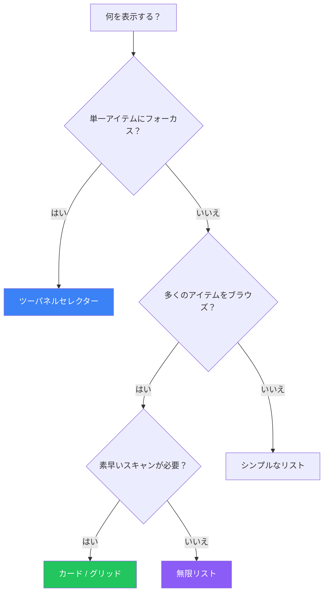

## はじめに

リストはソフトウェアインターフェースのあらゆる場所に存在します—メールの受信トレイ、商品カタログ、検索結果、ソーシャルフィード、ファイルブラウザなど。これらのコレクションをどのように表示するかは、ユーザビリティとユーザー満足度に大きく影響します。

この記事では、アイテムリストを表示するための必須パターンを解説し、特定のユースケースに適したアプローチを選択する手助けをします。

## リストパターンの選択

適切なパターンはいくつかの要素に依存します：



## 主要なリストパターン

### 1. カード

カードは、簡単にスキャンして比較できる自己完結型のコンテンツユニットです。

```tsx
function CardGrid({ items }) {
  return (
    <div className="grid grid-cols-1 sm:grid-cols-2 lg:grid-cols-3 gap-6">
      {items.map(item => (
        <article
          key={item.id}
          className="bg-white rounded-lg shadow-sm border overflow-hidden
                     hover:shadow-md transition-shadow"
        >
          {/* ビジュアル要素 */}
          <div className="aspect-video bg-gray-100">
            {item.image && (
              
            )}
          </div>

          {/* コンテンツ */}
          <div className="p-4">
            <h3 className="font-semibold text-gray-900">{item.title}</h3>
            <p className="mt-1 text-sm text-gray-600 line-clamp-2">
              {item.description}
            </p>

            {/* メタデータ */}
            <div className="mt-3 flex items-center justify-between text-sm">
              <span className="text-gray-500">{item.date}</span>
              <span className="font-medium text-blue-600">{item.price}</span>
            </div>
          </div>

          {/* アクション */}
          <div className="px-4 pb-4">
            <button className="w-full py-2 bg-blue-600 text-white rounded
                               hover:bg-blue-700">
              詳細を見る
            </button>
          </div>
        </article>
      ))}
    </div>
  );
}
```

**カードを使用するとき：**
- アイテムに視覚的コンテンツがある（画像、サムネイル）
- アイテムを並べて比較する必要がある
- アイテムが自己完結型で、単独で理解できる
- カードが明確なタップターゲットを提供するタッチインターフェース

### 2. ツーパネルセレクター（マスター-ディテール）

片側にリストを表示し、もう片側に選択したアイテムの詳細を表示します。

```tsx
function TwoPanelSelector({ items }) {
  const [selectedId, setSelectedId] = useState(items[0]?.id);
  const selectedItem = items.find(item => item.id === selectedId);

  return (
    <div className="flex h-screen">
      {/* リストパネル（マスター） */}
      <aside className="w-80 border-r overflow-auto">
        {items.map(item => (
          <button
            key={item.id}
            onClick={() => setSelectedId(item.id)}
            className={`
              w-full p-4 text-left border-b
              ${selectedId === item.id
                ? 'bg-blue-50 border-l-4 border-l-blue-600'
                : 'hover:bg-gray-50'
              }
            `}
          >
            <h3 className="font-medium truncate">{item.title}</h3>
            <p className="text-sm text-gray-500 truncate">{item.preview}</p>
            <span className="text-xs text-gray-400">{item.date}</span>
          </button>
        ))}
      </aside>

      {/* 詳細パネル */}
      <main className="flex-1 overflow-auto p-6">
        {selectedItem ? (
          <article>
            <h1 className="text-2xl font-bold">{selectedItem.title}</h1>
            <p className="mt-2 text-gray-600">{selectedItem.date}</p>
            <div className="mt-6 prose">{selectedItem.content}</div>
          </article>
        ) : (
          <div className="text-center text-gray-500 mt-20">
            アイテムを選択して詳細を表示
          </div>
        )}
      </main>
    </div>
  );
}
```

**ツーパネルを使用するとき：**
- メールクライアント、メッセージングアプリ
- ドキュメント管理システム
- 複数のセクションがある設定ページ
- 十分な幅があるデスクトップアプリケーション

### 3. ワンウィンドウドリルダウン

現在のビューを置き換えてリストから詳細に移動します。

```tsx
function DrilldownList({ items }) {
  const [selectedItem, setSelectedItem] = useState(null);

  if (selectedItem) {
    return (
      <div>
        {/* 戻るナビゲーション */}
        <button
          onClick={() => setSelectedItem(null)}
          className="flex items-center gap-2 p-4 text-blue-600"
        >
          ← リストに戻る
        </button>

        {/* 詳細ビュー */}
        <article className="p-4">
          <h1 className="text-2xl font-bold">{selectedItem.title}</h1>
          <div className="mt-4">{selectedItem.content}</div>
        </article>
      </div>
    );
  }

  return (
    <ul>
      {items.map(item => (
        <li key={item.id}>
          <button
            onClick={() => setSelectedItem(item)}
            className="w-full p-4 flex items-center justify-between
                       border-b hover:bg-gray-50"
          >
            <div>
              <h3 className="font-medium">{item.title}</h3>
              <p className="text-sm text-gray-500">{item.preview}</p>
            </div>
            <ChevronRight className="w-5 h-5 text-gray-400" />
          </button>
        </li>
      ))}
    </ul>
  );
}
```

**ドリルダウンを使用するとき：**
- 幅が限られたモバイルインターフェース
- 深い階層ナビゲーション
- 詳細ビューに完全な注意が必要な場合

### 4. 無限リスト

ユーザーがスクロールするとさらにアイテムを読み込みます。

```tsx
function InfiniteList() {
  const [items, setItems] = useState([]);
  const [page, setPage] = useState(1);
  const [hasMore, setHasMore] = useState(true);
  const [isLoading, setIsLoading] = useState(false);
  const loaderRef = useRef(null);

  // 無限スクロール用のIntersection Observer
  useEffect(() => {
    const observer = new IntersectionObserver(
      (entries) => {
        if (entries[0].isIntersecting && hasMore && !isLoading) {
          loadMore();
        }
      },
      { threshold: 0.1 }
    );

    if (loaderRef.current) {
      observer.observe(loaderRef.current);
    }

    return () => observer.disconnect();
  }, [hasMore, isLoading]);

  const loadMore = async () => {
    setIsLoading(true);
    const newItems = await fetchItems(page);

    if (newItems.length === 0) {
      setHasMore(false);
    } else {
      setItems(prev => [...prev, ...newItems]);
      setPage(prev => prev + 1);
    }
    setIsLoading(false);
  };

  return (
    <div>
      {items.map(item => (
        <ListItem key={item.id} item={item} />
      ))}

      {/* ローディングトリガー */}
      <div ref={loaderRef} className="py-8 text-center">
        {isLoading && <Spinner />}
        {!hasMore && <p className="text-gray-500">これ以上アイテムはありません</p>}
      </div>
    </div>
  );
}
```

**無限スクロールを使用するとき：**
- ソーシャルフィードとタイムライン
- 検索結果の探索
- コンテンツ発見インターフェース

**使用すべきでないとき：**
- フッターに到達する必要がある場合
- 総数が重要な場合
- タスク指向のインターフェース

### 5. ページネーション

結果を通じた従来のページベースのナビゲーション。

```tsx
function PaginatedList({ totalItems, itemsPerPage = 20 }) {
  const [currentPage, setCurrentPage] = useState(1);
  const totalPages = Math.ceil(totalItems / itemsPerPage);

  return (
    <div>
      {/* リストコンテンツ */}
      <ItemList page={currentPage} perPage={itemsPerPage} />

      {/* ページネーションコントロール */}
      <nav className="flex items-center justify-center gap-2 py-6">
        <button
          onClick={() => setCurrentPage(p => Math.max(1, p - 1))}
          disabled={currentPage === 1}
          className="px-3 py-2 border rounded disabled:opacity-50"
        >
          前へ
        </button>

        {/* ページ番号 */}
        {generatePageNumbers(currentPage, totalPages).map(page => (
          <button
            key={page}
            onClick={() => setCurrentPage(page)}
            className={`
              w-10 h-10 rounded
              ${currentPage === page
                ? 'bg-blue-600 text-white'
                : 'border hover:bg-gray-50'
              }
            `}
          >
            {page}
          </button>
        ))}

        <button
          onClick={() => setCurrentPage(p => Math.min(totalPages, p + 1))}
          disabled={currentPage === totalPages}
          className="px-3 py-2 border rounded disabled:opacity-50"
        >
          次へ
        </button>
      </nav>

      {/* 結果情報 */}
      <p className="text-center text-sm text-gray-500">
        {(currentPage - 1) * itemsPerPage + 1} -{' '}
        {Math.min(currentPage * itemsPerPage, totalItems)} / {totalItems}件
      </p>
    </div>
  );
}
```

**ページネーションを使用するとき：**
- ECの商品一覧
- 特定のページをブックマークする必要がある場合
- 総数が重要な場合
- 特定の位置にジャンプする必要がある場合

### 6. カルーセル

注目アイテムを紹介する横スクロールショーケース。

```tsx
function Carousel({ items }) {
  const [currentIndex, setCurrentIndex] = useState(0);
  const containerRef = useRef(null);

  const scrollTo = (index: number) => {
    const container = containerRef.current;
    if (container) {
      const item = container.children[index];
      item?.scrollIntoView({ behavior: 'smooth', inline: 'center' });
      setCurrentIndex(index);
    }
  };

  return (
    <div className="relative">
      {/* カルーセルコンテナ */}
      <div
        ref={containerRef}
        className="flex gap-4 overflow-x-auto snap-x snap-mandatory
                   scrollbar-hide px-4"
      >
        {items.map((item, index) => (
          <div
            key={item.id}
            className="flex-shrink-0 w-72 snap-center"
          >
            
            <h3 className="mt-2 font-medium">{item.title}</h3>
          </div>
        ))}
      </div>

      {/* ナビゲーション矢印 */}
      <button
        onClick={() => scrollTo(Math.max(0, currentIndex - 1))}
        className="absolute left-2 top-1/2 -translate-y-1/2
                   w-10 h-10 bg-white rounded-full shadow flex
                   items-center justify-center"
        disabled={currentIndex === 0}
      >
        ←
      </button>
      <button
        onClick={() => scrollTo(Math.min(items.length - 1, currentIndex + 1))}
        className="absolute right-2 top-1/2 -translate-y-1/2
                   w-10 h-10 bg-white rounded-full shadow flex
                   items-center justify-center"
        disabled={currentIndex === items.length - 1}
      >
        →
      </button>

      {/* ドットインジケーター */}
      <div className="flex justify-center gap-2 mt-4">
        {items.map((_, index) => (
          <button
            key={index}
            onClick={() => scrollTo(index)}
            className={`
              w-2 h-2 rounded-full
              ${index === currentIndex ? 'bg-blue-600' : 'bg-gray-300'}
            `}
          />
        ))}
      </div>
    </div>
  );
}
```

**カルーセルを使用するとき：**
- 注目コンテンツのショーケース
- 画像ギャラリー
- オンボーディングフロー
- 横方向のスペースが限られている場合

### 7. サムネイルグリッド

画像が多いコンテンツ向けのビジュアルファーストのグリッドレイアウト。

```tsx
function ThumbnailGrid({ items, onSelect }) {
  return (
    <div className="grid grid-cols-2 sm:grid-cols-3 md:grid-cols-4
                    lg:grid-cols-5 gap-1">
      {items.map(item => (
        <button
          key={item.id}
          onClick={() => onSelect(item)}
          className="relative aspect-square group"
        >
          

          {/* ホバーオーバーレイ */}
          <div className="absolute inset-0 bg-black/50 opacity-0
                          group-hover:opacity-100 transition-opacity
                          flex items-center justify-center">
            <span className="text-white text-sm">{item.title}</span>
          </div>

          {/* 選択インジケーター */}
          {item.selected && (
            <div className="absolute top-2 right-2 w-6 h-6 bg-blue-600
                            rounded-full flex items-center justify-center">
              <CheckIcon className="w-4 h-4 text-white" />
            </div>
          )}
        </button>
      ))}
    </div>
  );
}
```

## リストの拡張

### アイテムへのジャンプ

長いリストで特定のアイテムへの素早いナビゲーション。

```tsx
function AlphabeticJump({ items, groupBy }) {
  const groups = groupItemsByLetter(items, groupBy);
  const letters = Object.keys(groups);

  const scrollToLetter = (letter: string) => {
    document.getElementById(`group-${letter}`)?.scrollIntoView({
      behavior: 'smooth'
    });
  };

  return (
    <div className="flex">
      {/* メインリスト */}
      <div className="flex-1 overflow-auto">
        {letters.map(letter => (
          <div key={letter} id={`group-${letter}`}>
            <h3 className="sticky top-0 bg-gray-100 px-4 py-2 font-semibold">
              {letter}
            </h3>
            {groups[letter].map(item => (
              <ListItem key={item.id} item={item} />
            ))}
          </div>
        ))}
      </div>

      {/* アルファベットサイドバー */}
      <nav className="w-6 flex flex-col justify-center text-xs">
        {letters.map(letter => (
          <button
            key={letter}
            onClick={() => scrollToLetter(letter)}
            className="py-0.5 hover:text-blue-600"
          >
            {letter}
          </button>
        ))}
      </nav>
    </div>
  );
}
```

### リストインレイ

ナビゲーションせずにアイテムの詳細をインラインで展開。

```tsx
function ExpandableList({ items }) {
  const [expandedId, setExpandedId] = useState(null);

  return (
    <ul>
      {items.map(item => (
        <li key={item.id} className="border-b">
          <button
            onClick={() => setExpandedId(
              expandedId === item.id ? null : item.id
            )}
            className="w-full p-4 flex items-center justify-between"
          >
            <span>{item.title}</span>
            <ChevronDown
              className={`w-5 h-5 transition-transform
                ${expandedId === item.id ? 'rotate-180' : ''}`}
            />
          </button>

          {/* 展開されたコンテンツ */}
          {expandedId === item.id && (
            <div className="px-4 pb-4 bg-gray-50">
              <p>{item.details}</p>
              <div className="mt-4 flex gap-2">
                <button className="btn-primary">アクション1</button>
                <button className="btn-secondary">アクション2</button>
              </div>
            </div>
          )}
        </li>
      ))}
    </ul>
  );
}
```

## パターン比較

| パターン | 最適な用途 | 避けるべき場合 |
|---------|----------|--------------|
| カード | ビジュアルコンテンツ、比較 | 密なデータ、限られたスペース |
| ツーパネル | 詳細が多いアイテム、デスクトップ | モバイル、シンプルなアイテム |
| ドリルダウン | モバイル、深い階層 | 頻繁な切り替えが必要 |
| 無限リスト | フィード、発見 | フッターが必要、タスク重視 |
| ページネーション | EC、ブックマーク | 継続的なブラウジング |
| カルーセル | 注目アイテム、限られたスペース | 多くのアイテムをブラウズ |
| サムネイルグリッド | フォトギャラリー、視覚的選択 | テキスト重視のコンテンツ |

## まとめ

適切なリストパターンは、コンテンツタイプ、ユーザータスク、プラットフォームの制約によって決まります。主な考慮事項：

1. **ビジュアル vs テキストコンテンツ**：ビジュアルにはカードとグリッド、テキストにはリスト
2. **詳細の複雑さ**：複雑にはツーパネル、シンプルにはドリルダウン
3. **ブラウジング行動**：発見には無限、方向性のある検索にはページネーション
4. **画面サイズ**：デスクトップにはツーパネル、モバイルにはドリルダウン

モックアップでの見た目だけでなく、ユーザーが実際にコンテンツを消費する方法に合ったパターンを選択しましょう。

## 参考文献

- Tidwell, Jenifer, et al. "Designing Interfaces" (3rd Edition), Chapter 7
- Nielsen Norman Group - List vs. Grid Views
- Material Design - Lists
- Apple Human Interface Guidelines - Collections
