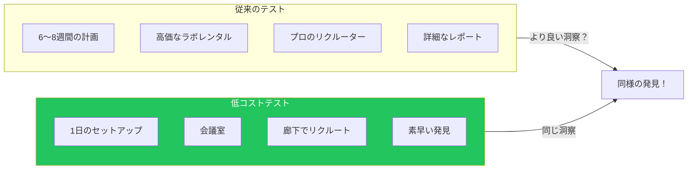

## はじめに

多くのチームは、高価なラボ、専門機材、何週間もの計画が必要だと思い、ユーザビリティテストをスキップしています。実際は：数人の参加者による簡単なテストでも、そうしなければ見過ごされていた重大な問題を明らかにできます。

Steve Krugは「Don't Make Me Think」で「1日10セントのユーザビリティテスト」を有名に提唱しました—頻繁で非公式なテストが、時々行う正式な調査に勝るという考えです。この記事では、そのアプローチの実装方法を紹介します。

## 低コストテストの理由



**重要な洞察：** 5人のユーザーでテストすると、ユーザビリティ問題の約85%が明らかになります。大きな問題を見つけるのに何十人もの参加者は必要ありません。

## クイックテストの計画

### 何をテストするか

すべてではなく、重要なユーザータスクに焦点を当てます：

```markdown
## 良いテスト候補
- サインアップ/オンボーディングフロー
- コア機能の初回使用
- チェックアウト/支払いプロセス
- 検索とナビゲーション
- エラーからの回復

## クイックテストに適さないもの
- 小さな視覚的好み
- まれなシナリオのエッジケース
- パフォーマンス最適化
- アクセシビリティ（専門的な方法が必要）
```

### タスクの作成

ユーザーを誘導しない現実的なタスクを書きます：

```markdown
## 悪いタスク（誘導的）
❌ 「右上の検索ボックスを使ってランニングシューズを見つけてください」
❌ 「青いボタンをクリックしてカートに追加してください」

## 良いタスク（現実的）
✓ 「トレイルランニング用のランニングシューズを買いたいとします。気に入ったペアを見つけてください。」
✓ 「購入について気が変わりました。カートから削除してください。」

## タスクテンプレート
「あなたが[状況]にいると想像してください。[目標]を達成したいです。
このページから始めて、[完了する具体的なアクション]。」
```

### サンプルテストスクリプト

```markdown
## ユーザビリティテストスクリプト

### 導入（2〜3分）
「本日はご協力いただきありがとうございます。私たちはウェブサイトをテストしています、
あなたをテストしているのではありません—間違った答えはありません。進みながら
声に出して考えてください。いくつかのタスクをお願いします。行き詰まっても、
それは私たちにとって貴重な情報です。始める前に質問はありますか？」

### ウォームアップ（1〜2分）
「始める前に教えてください：[類似製品]を使ったことはありますか？」

### タスク（15〜20分）

**タスク1：情報を見つける**
「[製品/機能]に興味があります。[具体的な情報]を見つけてください。」
- 観察：最初にどこを見るか？
- メモ：何をクリックするか？
- 質問：「今何を考えていますか？」

**タスク2：アクションを完了する**
「では[アクションを完了]してください。準備ができたら始めてください。」
- かかる時間を計る
- ためらいや後戻りをメモ
- 完全に行き詰まらない限り助けない

**タスク3：回復**
「何か問題が起きました。[エラー状態を説明]。どうしますか？」
- エラーをどう解釈するか観察
- 回復できるかメモ

### まとめ（5分）
「一番大変だったことは何ですか？」
「何を変えますか？」
「他に何かありますか？」
```

## テストの実施

### モデレーターの役割

```tsx
interface ModeratorGuidelines {
  do: [
    "中立を保つ—ユーザーのアクションに反応しない",
    "「今何を考えていますか？」と頻繁に聞く",
    "（適度に）苦労させる",
    "言葉だけでなく行動をメモ",
    "フォローアップ質問をする：「なぜそうしたのですか？」"
  ];

  dont: [
    "答えに導いたり助けたりしない",
    "間違ったことをしたときに反応しない",
    "誘導的な質問をしない",
    "デザインを擁護しない",
    "どう機能するはずか説明しない"
  ];
}
```

### 使うべきキーフレーズ

| 状況 | 言うこと |
|-----|---------|
| ユーザーが黙っている | 「今何を考えていますか？」 |
| ユーザーが助けを求める | 「私がいなかったらどうしますか？」 |
| ユーザーが行き詰まっている | 「試したいことはありますか？」 |
| ユーザーがタスクを完了 | 「どう感じましたか？期待通りでしたか？」 |
| ユーザーがエラーを起こす | [黙って観察] |
| ユーザーがイライラする | 「とても有益なフィードバックです。ゆっくりどうぞ。」 |

### メモの取り方

解釈ではなく観察に焦点を当てます：

```markdown
## 観察メモテンプレート

**タイムスタンプ:** 3:42
**タスク:** 商品価格を見つける
**観察:** ユーザーは価格を見つける前に2回スクロールで通り過ぎた
**引用:** 「価格はどこ？見逃してしまう。」
**深刻度:** 高—購入決定に影響

## クイック記法システム
✓ タスク正常完了
✗ タスク失敗
? ユーザーが混乱を表明
! 重大な発見
→ ユーザーの期待と現実のミスマッチ
```

## テスト後

### デブリーフィング

各セッションの直後に5分間で記録：

```markdown
## セッション後デブリーフ

### 観察された上位3つの問題
1. [最も深刻な問題]
2. [2番目に深刻]
3. [3番目に深刻]

### 驚いた瞬間
- [予期しないユーザー行動]

### 覚えておくべき引用
- 「[正確なユーザー引用]」

### 次のセッションへの質問
- [注視すべきこと]
```

### 発見の分析

すべてのセッション後、パターンを探します：

```tsx
interface FindingAnalysis {
  issue: string;
  frequency: number;      // 何人のユーザーが遭遇したか
  severity: 'critical' | 'major' | 'minor';
  quotes: string[];       // その問題についてのユーザー引用
  recommendation: string; // 推奨される修正
}

// 優先順位付けマトリックス
function prioritizeFindings(findings: FindingAnalysis[]) {
  return findings.sort((a, b) => {
    const severityScore = { critical: 3, major: 2, minor: 1 };
    const aScore = severityScore[a.severity] * a.frequency;
    const bScore = severityScore[b.severity] * b.frequency;
    return bScore - aScore;
  });
}
```

### 深刻度評価

| 深刻度 | 定義 | 例 |
|-------|-----|---|
| クリティカル | ユーザーがタスクを完了できない | チェックアウトボタンが見つからない |
| メジャー | 大きな困難を伴って完了 | わかりにくいエラーメッセージ |
| マイナー | ユーザーは気づくが回避策を見つける | 不明確なラベル |

## 結果の発表

### 1ページサマリー形式

```markdown
# ユーザビリティテスト結果: [機能/ページ名]

**日付:** 2025年1月15日
**参加者:** 5人
**テスト対象:** 新しいチェックアウトフロー

## 主な発見

### 🔴 クリティカルな問題
1. **3/5人がプロモコード欄を見つけられなかった**
   - モバイルでフォールド下に隠れている
   - 推奨：注文サマリーの上に移動

### 🟡 メジャーな問題
1. **4/5人が配送オプションで混乱**
   - 「エクスプレス」vs「プライオリティ」が不明確
   - 推奨：配達日の見積もりを追加

### 🟢 うまくいったこと
- 全ユーザーがカートへの追加に成功
- 支払いフォームは明確で完了しやすかった

## 推奨される次のステップ
1. プロモコードの可視性を修正（1日）
2. 配送オプションを明確化（2日）
3. 変更後に3人で再テスト
```

### ビデオハイライト

3〜5分のハイライト集を作成：

```markdown
## ハイライト集の構成

1. **導入**（30秒）
   - 何をテストしたか、何人のユーザー

2. **良かった点**（1分）
   - 成功した瞬間のクリップ
   - ポジティブな引用

3. **問題点**（2〜3分）
   - クリップ1：[問題]で苦労するユーザー
   - クリップ2：混乱についてのユーザー引用
   - クリップ3：複数のユーザーが同じ問題に遭遇

4. **推奨事項**（30秒）
   - 提案された修正のクイックサマリー
```

## テストのバリエーション

### リモート非同期テスト

素早くスケーラブルなフィードバック用：

```tsx
function RemoteTestSetup() {
  return {
    tools: [
      'UserTesting.com',
      'Maze',
      'UsabilityHub',
      'Lookback'
    ],
    pros: [
      'スケジュール調整不要',
      '大きなサンプルサイズ',
      '地理的多様性',
      'テスト当たりのコストが低い'
    ],
    cons: [
      'フォローアップ質問ができない',
      'コンテキストが少ない',
      '微妙な問題を見逃す可能性'
    ],
    bestFor: [
      'プロトタイプ検証',
      'A/B好み比較テスト',
      'ファーストクリックテスト',
      'シンプルなタスクフロー'
    ]
  };
}
```

### ゲリラテスト

公共の場でのテスト：

```markdown
## ゲリラテストチェックリスト

### 場所
- [ ] ターゲット層に近いカフェ
- [ ] 必要に応じて施設の許可
- [ ] ユーザーの声が聞こえる静かさ

### 機材
- [ ] プロトタイプを表示するラップトップまたはタブレット
- [ ] 同意書（シンプルな1段落）
- [ ] 小さなお礼（500円のコーヒーカード）

### アプローチスクリプト
「こんにちは、ウェブサイトを作っていて、5分ほど
フィードバックをいただけると助かります。コーヒーをご馳走します。
何かを試して感想を聞かせていただけますか？」

### クイックテスト形式
- タスクは1つだけ
- 最大3〜5分
- 第一印象に焦点
```

### 5秒テスト

第一印象と視覚的階層用：

```tsx
function FiveSecondTest({ design, questions }) {
  const [phase, setPhase] = useState<'show' | 'ask' | 'done'>('show');

  useEffect(() => {
    if (phase === 'show') {
      const timer = setTimeout(() => setPhase('ask'), 5000);
      return () => clearTimeout(timer);
    }
  }, [phase]);

  return (
    <div>
      {phase === 'show' && (
        
      )}

      {phase === 'ask' && (
        <div>
          <h2>デザインを隠しました。以下の質問に答えてください：</h2>
          {questions.map(q => (
            <div key={q.id}>
              <p>{q.text}</p>
              <textarea placeholder="あなたの回答..." />
            </div>
          ))}
        </div>
      )}
    </div>
  );
}

// よくある5秒テストの質問：
const questions = [
  "このページは何についてですか？",
  "これはどの会社またはブランドですか？",
  "最初に何をクリックしますか？",
  "最も目立ったものは何ですか？",
  "取れる主なアクションは何ですか？"
];
```

## テスト文化の構築

### テストをルーティンにする

```markdown
## 月間テストリズム

**第1週:** 何をテストするか特定
- 問題のある領域のアナリティクスをレビュー
- サポートチケットで一般的な問題を確認
- 2〜3のタスクを選ぶ

**第2週:** リクルートと準備
- 3〜5人の参加者を見つける
- タスクスクリプトを書く
- 録画をセットアップ

**第3週:** テスト実施
- 参加者1人あたり30〜45分
- 各セッション後にデブリーフ

**第4週:** 共有とアクション
- 1ページサマリーを作成
- チームにハイライト集を発表
- 次のスプリントで修正の優先順位付け
```

### 理解を得る

これらのアプローチでステークホルダーを説得：

| 反対意見 | 回答 |
|---------|-----|
| 「時間がない」 | 「3回のテストは半日で、何週間もの手戻りを防ぎます」 |
| 「予算がない」 | 「会議室 + 同僚5人 = 無料テスト」 |
| 「ユーザーを知っている」 | 「検証しましょう—30分の観察で」 |
| 「ローンチ後にテストする」 | 「今問題を見つければ修正コストは10分の1」 |

## まとめ

| 側面 | 従来のテスト | 低コストテスト |
|-----|------------|--------------|
| 計画 | 6〜8週間 | 1〜3日 |
| 参加者 | 8〜12人 | 3〜5人 |
| 場所 | ユーザビリティラボ | 静かな部屋ならどこでも |
| コスト | 50〜150万円 | 0〜5万円 |
| 成果物 | 50ページのレポート | 1ページのサマリー |
| 頻度 | 四半期ごと | 月1回以上 |
| 発見 | 同じクリティカルな問題 | 同じクリティカルな問題 |

目標は完璧なテストではなく、ユーザーより先に最大の問題を見つけることです。小さく始めて、頻繁にテストし、学んだことに基づいて反復しましょう。

## 参考文献

- Krug, Steve. "Don't Make Me Think", Chapter 9
- Krug, Steve. "Rocket Surgery Made Easy"
- Nielsen Norman Group - Usability Testing 101
- Rubin & Chisnell. "Handbook of Usability Testing"
