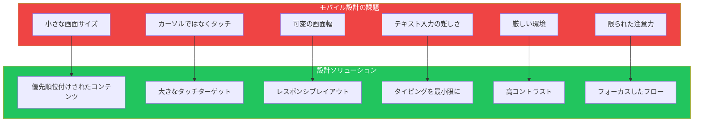
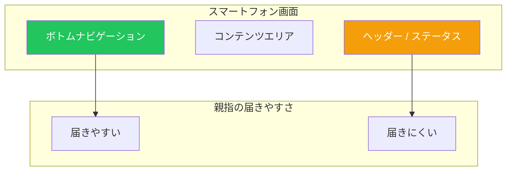

## はじめに

モバイルデバイスは、人々がウェブにアクセスする主要な手段となりました。モバイルファーストで設計することは、単に物事を小さくするだけではありません。タッチインターフェース、可変画面サイズ、モバイルコンテキストの独自の制約と機会を受け入れることです。

この記事では、自然で楽なモバイルインターフェースを作成するための必須パターンを解説します。

## モバイル設計の課題

モバイル設計には、デスクトップ設計者が見落としがちな独自の課題があります：



## 主要なモバイルパターン

### 1. タッチターゲット

指は不正確です。カーソルではなく、指のために設計しましょう。

**最小サイズ：**

| プラットフォーム | 最小ターゲットサイズ |
|---------------|------------------|
| iOS | 44×44ポイント |
| Android | 48×48dp |
| Web（モバイル） | 44×44 CSSピクセル |

```tsx
// 悪い例: 小さすぎるタッチターゲット
function BadNavigation() {
  return (
    <nav className="flex gap-1">
      <a href="/" className="p-1 text-sm">ホーム</a>
      <a href="/about" className="p-1 text-sm">概要</a>
    </nav>
  );
}

// 良い例: ゆとりあるタッチターゲット
function GoodNavigation() {
  return (
    <nav className="flex gap-2">
      <a
        href="/"
        className="px-4 py-3 min-h-[44px] min-w-[44px]
                   flex items-center justify-center"
      >
        ホーム
      </a>
      <a
        href="/about"
        className="px-4 py-3 min-h-[44px] min-w-[44px]
                   flex items-center justify-center"
      >
        概要
      </a>
    </nav>
  );
}
```

```css
/* 最小タッチターゲットサイズを確保 */
.touch-target {
  min-height: 44px;
  min-width: 44px;
  padding: 12px 16px;
}

/* 見た目を変えずにクリック可能領域を拡大 */
.icon-button {
  position: relative;
}

.icon-button::before {
  content: '';
  position: absolute;
  top: -8px;
  right: -8px;
  bottom: -8px;
  left: -8px;
}
```

### 2. ボトムナビゲーション

主要なナビゲーションは画面下部の親指が届く範囲に配置します。



```tsx
function MobileLayout({ children }) {
  return (
    <div className="min-h-screen flex flex-col">
      {/* コンテンツが利用可能なスペースを占める */}
      <main className="flex-1 pb-16 overflow-auto">
        {children}
      </main>

      {/* 固定のボトムナビゲーション */}
      <nav className="fixed bottom-0 left-0 right-0 h-16
                      bg-white border-t safe-area-bottom">
        <div className="flex justify-around items-center h-full">
          <NavItem icon="home" label="ホーム" href="/" />
          <NavItem icon="search" label="検索" href="/search" />
          <NavItem icon="add" label="作成" href="/create" primary />
          <NavItem icon="bell" label="通知" href="/alerts" />
          <NavItem icon="user" label="プロフィール" href="/profile" />
        </div>
      </nav>
    </div>
  );
}

function NavItem({ icon, label, href, primary }) {
  return (
    <a
      href={href}
      className={`
        flex flex-col items-center justify-center
        min-w-[64px] min-h-[48px] p-2
        ${primary ? 'text-blue-600' : 'text-gray-600'}
      `}
    >
      <Icon name={icon} className="w-6 h-6" />
      <span className="text-xs mt-1">{label}</span>
    </a>
  );
}
```

### 3. 垂直スタック

コンテンツを縦に積み重ねて、スクロールとスキャンを容易にします。

```tsx
function MobileFeed({ items }) {
  return (
    <div className="flex flex-col">
      {items.map(item => (
        <article
          key={item.id}
          className="p-4 border-b"
        >
          {/* 各アイテム内で垂直スタック */}
          <header className="flex items-center gap-3">
            <Avatar src={item.author.avatar} />
            <div>
              <p className="font-medium">{item.author.name}</p>
              <p className="text-sm text-gray-500">{item.time}</p>
            </div>
          </header>

          <p className="mt-3">{item.content}</p>

          {item.image && (
            
          )}

          <footer className="mt-3 flex gap-4">
            <ActionButton icon="heart" count={item.likes} />
            <ActionButton icon="comment" count={item.comments} />
            <ActionButton icon="share" />
          </footer>
        </article>
      ))}
    </div>
  );
}
```

### 4. ゆとりあるスペーシング

誤タップを防ぎ、可読性を向上させるために十分なスペースを使用します。

```tsx
function ListItem({ item, onSelect }) {
  return (
    <button
      onClick={() => onSelect(item)}
      className="w-full flex items-center gap-4 p-4
                 text-left border-b active:bg-gray-50"
    >
      {/* スペースを持ったサムネイル */}
      <div className="w-12 h-12 rounded-lg bg-gray-200 flex-shrink-0">
        {item.thumbnail && (
          
        )}
      </div>

      {/* 適切なスペースを持ったコンテンツ */}
      <div className="flex-1 min-w-0">
        <h3 className="font-medium truncate">{item.title}</h3>
        <p className="text-sm text-gray-500 mt-1 truncate">
          {item.description}
        </p>
      </div>

      {/* アクションインジケーター */}
      <ChevronRight className="w-5 h-5 text-gray-400 flex-shrink-0" />
    </button>
  );
}
```

```css
/* モバイル向けスペーシングスケール */
:root {
  --space-1: 4px;
  --space-2: 8px;
  --space-3: 12px;
  --space-4: 16px;
  --space-5: 24px;
  --space-6: 32px;
}

/* モバイル向けコンテンツパディング */
.mobile-container {
  padding-left: 16px;
  padding-right: 16px;
}

/* 快適なリストアイテムスペーシング */
.list-item {
  padding: 16px;
  gap: 12px;
}
```

### 5. フィルムストリップ（横スクロール）

縦に収まらない関連コンテンツには横スクロールを使用します。

```tsx
function HorizontalScroller({ title, items }) {
  return (
    <section className="py-4">
      <h2 className="px-4 text-lg font-semibold mb-3">{title}</h2>

      <div className="flex gap-3 overflow-x-auto px-4
                      scrollbar-hide snap-x snap-mandatory">
        {items.map(item => (
          <div
            key={item.id}
            className="flex-shrink-0 w-40 snap-start"
          >
            
            <h3 className="mt-2 text-sm font-medium truncate">
              {item.title}
            </h3>
            <p className="text-sm text-gray-500">{item.subtitle}</p>
          </div>
        ))}
      </div>
    </section>
  );
}
```

```css
/* スクロールバーを隠しつつ機能は維持 */
.scrollbar-hide {
  -ms-overflow-style: none;
  scrollbar-width: none;
}

.scrollbar-hide::-webkit-scrollbar {
  display: none;
}

/* カルーセル感覚のスクロールスナップ */
.snap-x {
  scroll-snap-type: x mandatory;
}

.snap-start {
  scroll-snap-align: start;
}
```

### 6. ローディングと進捗インジケーター

ローディング状態には常にフィードバックを表示します。

```tsx
function LoadingStates() {
  return (
    <div>
      {/* コンテンツローディング用スケルトン */}
      <div className="animate-pulse">
        <div className="h-4 bg-gray-200 rounded w-3/4 mb-2" />
        <div className="h-4 bg-gray-200 rounded w-1/2" />
      </div>

      {/* アクション用スピナー */}
      <button disabled className="flex items-center gap-2">
        <Spinner className="w-4 h-4 animate-spin" />
        読み込み中...
      </button>

      {/* プルトゥリフレッシュインジケーター */}
      <PullToRefresh onRefresh={handleRefresh}>
        <FeedContent />
      </PullToRefresh>

      {/* アップロード用プログレス */}
      <ProgressBar progress={uploadProgress} />
    </div>
  );
}

function PullToRefresh({ onRefresh, children }) {
  const [isRefreshing, setIsRefreshing] = useState(false);
  const [pullDistance, setPullDistance] = useState(0);

  // プル検出用タッチハンドラー
  return (
    <div className="relative">
      {/* プルインジケーター */}
      <div
        className="absolute top-0 left-0 right-0 flex justify-center
                   transition-transform"
        style={{ transform: `translateY(${pullDistance - 40}px)` }}
      >
        {isRefreshing ? (
          <Spinner className="w-6 h-6 animate-spin" />
        ) : (
          <ArrowDown className="w-6 h-6" />
        )}
      </div>

      {children}
    </div>
  );
}
```

### 7. タッチツール

ジェスチャーとタッチインタラクションを適切に使用します。

```tsx
function SwipeableCard({ item, onDelete, onArchive }) {
  const [offset, setOffset] = useState(0);
  const [action, setAction] = useState(null);

  const handleTouchMove = (e) => {
    const delta = e.touches[0].clientX - startX;
    setOffset(delta);

    if (delta > 80) setAction('archive');
    else if (delta < -80) setAction('delete');
    else setAction(null);
  };

  return (
    <div className="relative overflow-hidden">
      {/* スワイプで表示される背景アクション */}
      <div className="absolute inset-y-0 left-0 w-20 bg-green-500
                      flex items-center justify-center">
        <ArchiveIcon className="w-6 h-6 text-white" />
      </div>
      <div className="absolute inset-y-0 right-0 w-20 bg-red-500
                      flex items-center justify-center">
        <TrashIcon className="w-6 h-6 text-white" />
      </div>

      {/* スワイプ可能なコンテンツ */}
      <div
        className="relative bg-white transition-transform"
        style={{ transform: `translateX(${offset}px)` }}
        onTouchStart={handleTouchStart}
        onTouchMove={handleTouchMove}
        onTouchEnd={handleTouchEnd}
      >
        <CardContent item={item} />
      </div>
    </div>
  );
}
```

## レスポンシブ設計戦略

### モバイルファーストCSS

モバイルスタイルから始めて、大きな画面向けに複雑さを追加します。

```css
/* ベース: モバイルスタイル */
.container {
  padding: 16px;
}

.grid {
  display: flex;
  flex-direction: column;
  gap: 16px;
}

.sidebar {
  display: none;
}

/* タブレット以上 */
@media (min-width: 768px) {
  .container {
    padding: 24px;
  }

  .grid {
    display: grid;
    grid-template-columns: repeat(2, 1fr);
    gap: 24px;
  }
}

/* デスクトップ */
@media (min-width: 1024px) {
  .container {
    padding: 32px;
    max-width: 1200px;
    margin: 0 auto;
  }

  .grid {
    grid-template-columns: repeat(3, 1fr);
  }

  .sidebar {
    display: block;
  }
}
```

### レスポンシブコンポーネント

```tsx
function ResponsiveLayout({ children, sidebar }) {
  const isMobile = useMediaQuery('(max-width: 767px)');
  const [showSidebar, setShowSidebar] = useState(false);

  return (
    <div className="flex min-h-screen">
      {/* モバイル: サイドバーはオーバーレイ */}
      {isMobile ? (
        <>
          <Sheet open={showSidebar} onClose={() => setShowSidebar(false)}>
            {sidebar}
          </Sheet>

          <button
            onClick={() => setShowSidebar(true)}
            className="fixed bottom-20 right-4 z-10
                       w-14 h-14 rounded-full bg-blue-600 text-white
                       shadow-lg flex items-center justify-center"
          >
            <MenuIcon className="w-6 h-6" />
          </button>
        </>
      ) : (
        /* デスクトップ: サイドバーは常に表示 */
        <aside className="w-64 border-r bg-gray-50 p-4">
          {sidebar}
        </aside>
      )}

      <main className="flex-1">{children}</main>
    </div>
  );
}
```

## セーフエリア

デバイスのノッチやホームインジケーターを考慮します。

```css
/* ノッチ付きデバイスのセーフエリアインセット */
.bottom-nav {
  padding-bottom: env(safe-area-inset-bottom, 0);
}

.top-header {
  padding-top: env(safe-area-inset-top, 0);
}

.full-width-content {
  padding-left: env(safe-area-inset-left, 16px);
  padding-right: env(safe-area-inset-right, 16px);
}
```

```tsx
function SafeAreaLayout({ children }) {
  return (
    <div className="min-h-screen flex flex-col">
      {/* 上部セーフエリア */}
      <div className="bg-blue-600 pt-[env(safe-area-inset-top)]">
        <header className="h-14 flex items-center px-4">
          <h1 className="text-white font-semibold">アプリタイトル</h1>
        </header>
      </div>

      {/* コンテンツ */}
      <main className="flex-1">{children}</main>

      {/* 下部セーフエリア */}
      <nav className="bg-white border-t pb-[env(safe-area-inset-bottom)]">
        <div className="h-14 flex items-center justify-around">
          {/* ナビアイテム */}
        </div>
      </nav>
    </div>
  );
}
```

## パフォーマンスの考慮事項

```tsx
function OptimizedMobileList({ items }) {
  return (
    <VirtualList
      items={items}
      itemHeight={80}
      renderItem={(item) => (
        <ListItem item={item} />
      )}
      // 表示されているアイテムのみレンダリング
      overscan={5}
    />
  );
}

// 画像の遅延読み込み
function LazyImage({ src, alt, ...props }) {
  return (
    
  );
}

// 重要でないリソースを遅延
function MobileApp() {
  useEffect(() => {
    // 初期レンダリング後にアナリティクスを読み込み
    import('./analytics').then(m => m.init());
  }, []);

  return <App />;
}
```

## まとめ

| パターン | 目的 | 重要な考慮点 |
|---------|-----|------------|
| タッチターゲット | 誤タップを防止 | 最小44×44ピクセル |
| ボトムナビゲーション | 親指のアクセシビリティ | 3〜5の主要な宛先 |
| 垂直スタック | 自然なスクロール | 1カラム、全幅 |
| ゆとりあるスペーシング | 視覚的な余裕 | 最小16pxのスペース |
| フィルムストリップ | 横方向のブラウジング | スナップスクロール、次のアイテムをのぞかせる |
| ローディングインジケーター | 待機中のフィードバック | スケルトン、スピナー、プログレス |
| タッチツール | ネイティブ感覚のジェスチャー | スワイプ、プルトゥリフレッシュ |

モバイル設計の鍵は、制約を受け入れることです。小さな画面は、本当に重要なものに優先順位をつけることを強制します。タッチインタラクションには大きなターゲットが必要です。限られた注意力は、フォーカスした体験を求めます。

## 参考文献

- Tidwell, Jenifer, et al. "Designing Interfaces" (3rd Edition), Chapter 6
- Apple Human Interface Guidelines - iOS
- Material Design - Mobile Guidelines
- Nielsen Norman Group - Mobile UX
