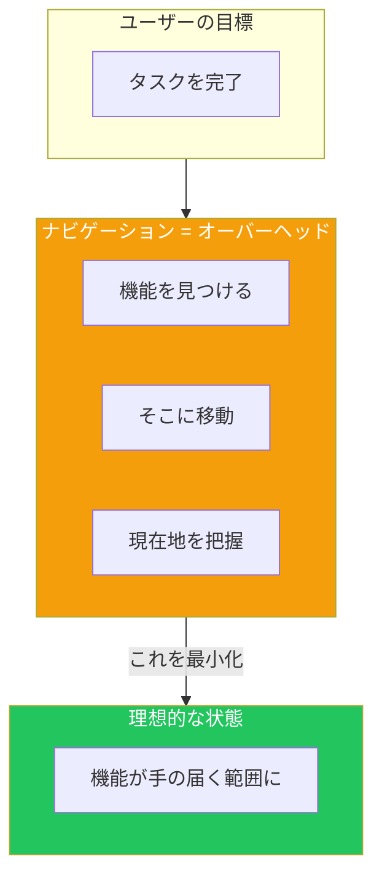
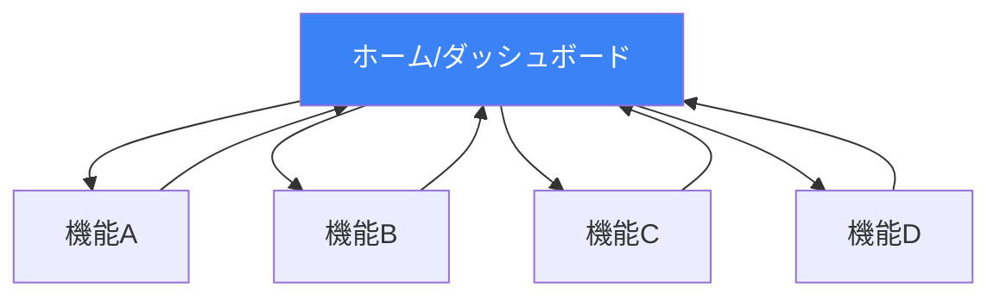
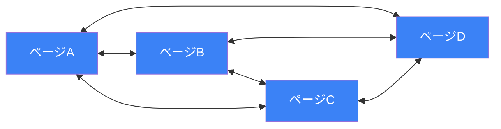
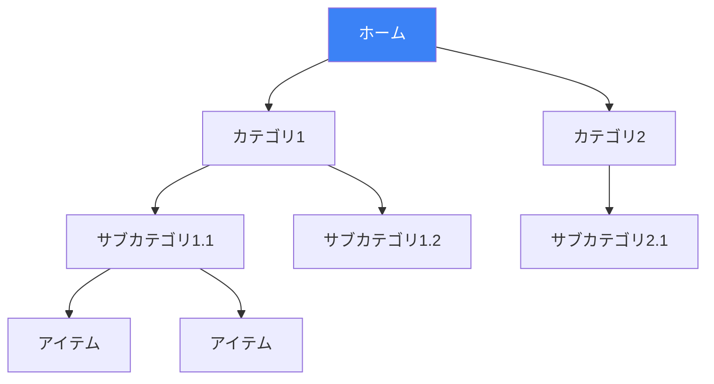
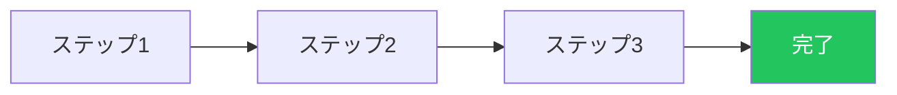

## はじめに

ナビゲーションはユーザー体験の根幹です。コンテンツがどれだけ良くても、ユーザーが目的地にたどり着けなければ離脱してしまいます。良いナビゲーションは3つの基本的な質問に答えます：

1. **今どこにいる？**
2. **どこに行ける？**
3. **どうやって行く？**

この記事では、ユーザーがアプリケーション内を自信を持って移動できるようにするナビゲーションパターンを探ります。

## ナビゲーションの目的

ナビゲーションは通勤のようなものです：目的地に着くために必要ですが、退屈で、費やす時間が無駄に感じられます。最良のナビゲーションはナビゲーションがないこと—すべてが手の届く範囲にあることです。



## ナビゲーションモデル

### ハブ&スポーク

ユーザーは中央のハブから始めてスポークに移動し、別の場所に行くにはハブに戻ります。



**最適な用途：** モバイルアプリ、ダッシュボード、設定画面

```tsx
function MobileApp() {
  const [currentScreen, setCurrentScreen] = useState('home');

  return (
    <div>
      {/* コンテンツエリア - 「スポーク」 */}
      <main>
        {currentScreen === 'home' && <HomeScreen />}
        {currentScreen === 'search' && <SearchScreen />}
        {currentScreen === 'profile' && <ProfileScreen />}
        {currentScreen === 'settings' && <SettingsScreen />}
      </main>

      {/* タブバー - 「ハブ」は常にアクセス可能 */}
      <nav className="fixed bottom-0 w-full bg-white border-t">
        <div className="flex justify-around py-2">
          {['home', 'search', 'profile', 'settings'].map(screen => (
            <button
              key={screen}
              onClick={() => setCurrentScreen(screen)}
              className={currentScreen === screen ? 'text-blue-600' : 'text-gray-400'}
            >
              <Icon name={screen} />
            </button>
          ))}
        </div>
      </nav>
    </div>
  );
}
```

### フルコネクト

ユーザーは任意のページ間を直接移動できます。



**最適な用途：** 小規模サイト、関連コンテンツセクション

```tsx
function GlobalNavigation({ pages, currentPage }) {
  return (
    <nav className="flex gap-6">
      {pages.map(page => (
        <a
          key={page.href}
          href={page.href}
          className={`
            ${currentPage === page.href
              ? 'text-blue-600 border-b-2 border-blue-600'
              : 'text-gray-600 hover:text-gray-900'
            }
          `}
        >
          {page.label}
        </a>
      ))}
    </nav>
  );
}
```

### マルチレベル（ツリー）

コンテンツがネストされた階層で整理されています。



**最適な用途：** EC、ドキュメント、ファイルシステム

### ステップバイステップ（ウィザード）

プロセスを線形に進行します。



**最適な用途：** チェックアウト、オンボーディング、フォーム

## 必須ナビゲーションパターン

### 1. ブレッドクラム

ユーザーに階層内の位置を示し、簡単に戻れるようにします。

```tsx
function Breadcrumbs({ items }) {
  return (
    <nav aria-label="パンくずリスト" className="text-sm">
      <ol className="flex items-center gap-2">
        {items.map((item, index) => (
          <li key={item.href} className="flex items-center gap-2">
            {index > 0 && <span className="text-gray-400">/</span>}

            {index === items.length - 1 ? (
              // 現在のページ - リンクではない
              <span className="text-gray-900 font-medium">
                {item.label}
              </span>
            ) : (
              // 親ページ - クリック可能なリンク
              <a
                href={item.href}
                className="text-gray-500 hover:text-gray-700"
              >
                {item.label}
              </a>
            )}
          </li>
        ))}
      </ol>
    </nav>
  );
}

// 使用例
<Breadcrumbs items={[
  { href: '/', label: 'ホーム' },
  { href: '/products', label: '製品' },
  { href: '/products/electronics', label: '電子機器' },
  { href: '/products/electronics/laptops', label: 'ノートPC' },
]} />
```

### 2. プログレスインジケーター

マルチステッププロセスでユーザーの現在位置を示します。

```tsx
function ProgressIndicator({ steps, currentStep }) {
  return (
    <div className="flex items-center justify-between">
      {steps.map((step, index) => {
        const status = index < currentStep
          ? 'completed'
          : index === currentStep
            ? 'current'
            : 'upcoming';

        return (
          <React.Fragment key={step.id}>
            {/* ステップインジケーター */}
            <div className="flex flex-col items-center">
              <div className={`
                w-10 h-10 rounded-full flex items-center justify-center
                ${status === 'completed' ? 'bg-green-500 text-white' : ''}
                ${status === 'current' ? 'bg-blue-600 text-white' : ''}
                ${status === 'upcoming' ? 'bg-gray-200 text-gray-500' : ''}
              `}>
                {status === 'completed' ? '✓' : index + 1}
              </div>
              <span className={`
                mt-2 text-sm
                ${status === 'current' ? 'font-medium text-gray-900' : 'text-gray-500'}
              `}>
                {step.label}
              </span>
            </div>

            {/* 接続線 */}
            {index < steps.length - 1 && (
              <div className={`
                flex-1 h-1 mx-4
                ${index < currentStep ? 'bg-green-500' : 'bg-gray-200'}
              `} />
            )}
          </React.Fragment>
        );
      })}
    </div>
  );
}
```

### 3. エスケープハッチ

現在のコンテキストを抜けて安全な場所に戻る方法を常に提供します。

```tsx
function Modal({ isOpen, onClose, children }) {
  // Escapeキーでモーダルを閉じる
  useEffect(() => {
    const handleEscape = (e) => {
      if (e.key === 'Escape') onClose();
    };
    window.addEventListener('keydown', handleEscape);
    return () => window.removeEventListener('keydown', handleEscape);
  }, [onClose]);

  if (!isOpen) return null;

  return (
    <div className="fixed inset-0 z-50">
      {/* 背景クリックで閉じる */}
      <div
        className="absolute inset-0 bg-black/50"
        onClick={onClose}
      />

      <div className="relative bg-white rounded-lg max-w-lg mx-auto mt-20 p-6">
        {/* 見える閉じるボタン */}
        <button
          onClick={onClose}
          className="absolute top-4 right-4 text-gray-400 hover:text-gray-600"
          aria-label="閉じる"
        >
          ✕
        </button>

        {children}
      </div>
    </div>
  );
}

function WizardFlow({ onCancel }) {
  return (
    <div>
      {/* 常にエスケープルートを表示 */}
      <header className="flex justify-between items-center mb-6">
        <h1>セットアップウィザード</h1>
        <button
          onClick={onCancel}
          className="text-gray-500 hover:text-gray-700"
        >
          キャンセルして終了
        </button>
      </header>

      {/* ウィザードコンテンツ */}
    </div>
  );
}
```

### 4. クリアエントリーポイント

ユーザーがどこから始めるべきかを明確にします。

```tsx
function Homepage() {
  return (
    <div>
      {/* 明確な主要アクションを持つヒーロー */}
      <section className="text-center py-20">
        <h1 className="text-4xl font-bold">
          プラットフォームへようこそ
        </h1>
        <p className="mt-4 text-xl text-gray-600">
          プロジェクト管理を最も簡単に
        </p>

        {/* 明確なエントリーポイント */}
        <div className="mt-8 flex justify-center gap-4">
          <a
            href="/signup"
            className="px-8 py-3 bg-blue-600 text-white font-medium
                       rounded-lg hover:bg-blue-700"
          >
            無料で始める
          </a>
          <a
            href="/demo"
            className="px-8 py-3 border border-gray-300 font-medium
                       rounded-lg hover:bg-gray-50"
          >
            デモを見る
          </a>
        </div>
      </section>

      {/* 異なるユーザータイプ向けの副次エントリーポイント */}
      <section className="py-16 bg-gray-50">
        <h2 className="text-2xl font-bold text-center mb-8">
          あなたに合ったプランを選択
        </h2>
        <div className="grid grid-cols-3 gap-6 max-w-4xl mx-auto">
          <EntryPointCard
            title="個人向け"
            description="パーソナルプロジェクト管理"
            href="/individuals"
          />
          <EntryPointCard
            title="チーム向け"
            description="チームでコラボレーション"
            href="/teams"
          />
          <EntryPointCard
            title="エンタープライズ向け"
            description="組織全体にスケール"
            href="/enterprise"
          />
        </div>
      </section>
    </div>
  );
}
```

### 5. ファットメニュー（メガメニュー）

複雑なナビゲーションですべてのオプションを一度に表示します。

```tsx
function MegaMenu({ categories }) {
  const [activeCategory, setActiveCategory] = useState(null);

  return (
    <nav className="relative">
      {/* トップレベルカテゴリ */}
      <div className="flex gap-6">
        {categories.map(category => (
          <button
            key={category.id}
            onMouseEnter={() => setActiveCategory(category.id)}
            className="py-4 text-gray-700 hover:text-gray-900"
          >
            {category.label}
          </button>
        ))}
      </div>

      {/* 展開されたメガメニュー */}
      {activeCategory && (
        <div
          className="absolute left-0 right-0 bg-white shadow-lg border-t
                     p-6 grid grid-cols-4 gap-8"
          onMouseLeave={() => setActiveCategory(null)}
        >
          {categories
            .find(c => c.id === activeCategory)
            ?.subcategories.map(sub => (
              <div key={sub.id}>
                <h3 className="font-semibold text-gray-900 mb-3">
                  {sub.label}
                </h3>
                <ul className="space-y-2">
                  {sub.items.map(item => (
                    <li key={item.href}>
                      <a
                        href={item.href}
                        className="text-gray-600 hover:text-blue-600"
                      >
                        {item.label}
                      </a>
                    </li>
                  ))}
                </ul>
              </div>
            ))}
        </div>
      )}
    </nav>
  );
}
```

### 6. ディープリンク

特定のコンテンツへの直接アクセスを可能にします。

```tsx
// シングルページアプリでのディープリンクサポート
function TabPanel({ tabs, defaultTab }) {
  const [searchParams, setSearchParams] = useSearchParams();
  const activeTab = searchParams.get('tab') || defaultTab;

  const setActiveTab = (tabId) => {
    setSearchParams({ tab: tabId });
  };

  return (
    <div>
      {/* タブがURLを更新してディープリンク可能に */}
      <div className="flex border-b">
        {tabs.map(tab => (
          <button
            key={tab.id}
            onClick={() => setActiveTab(tab.id)}
            className={`
              px-4 py-2 -mb-px
              ${activeTab === tab.id
                ? 'border-b-2 border-blue-600 text-blue-600'
                : 'text-gray-500'
              }
            `}
          >
            {tab.label}
          </button>
        ))}
      </div>

      {/* タブコンテンツ */}
      <div className="py-4">
        {tabs.find(t => t.id === activeTab)?.content}
      </div>
    </div>
  );
}

// ユーザーは /settings?tab=notifications のようなリンクを共有可能
```

### 7. サイトマップフッター

サイト構造の概要を提供します。

```tsx
function SitemapFooter({ sections }) {
  return (
    <footer className="bg-gray-900 text-gray-300 py-12">
      <div className="max-w-6xl mx-auto grid grid-cols-4 gap-8">
        {sections.map(section => (
          <div key={section.title}>
            <h3 className="text-white font-semibold mb-4">
              {section.title}
            </h3>
            <ul className="space-y-2">
              {section.links.map(link => (
                <li key={link.href}>
                  <a
                    href={link.href}
                    className="hover:text-white transition"
                  >
                    {link.label}
                  </a>
                </li>
              ))}
            </ul>
          </div>
        ))}
      </div>
    </footer>
  );
}
```

## ウェイファインディング：ユーザーが現在地を知る手助け

### 視覚的インジケーター

```tsx
function NavigationWithIndicators({ items, currentPath }) {
  return (
    <nav>
      <ul className="flex gap-6">
        {items.map(item => {
          const isActive = currentPath.startsWith(item.href);
          const isCurrent = currentPath === item.href;

          return (
            <li key={item.href}>
              <a
                href={item.href}
                className={`
                  relative py-2
                  ${isActive ? 'text-blue-600' : 'text-gray-600'}
                  ${isCurrent ? 'font-semibold' : ''}
                `}
                aria-current={isCurrent ? 'page' : undefined}
              >
                {item.label}

                {/* アクティブインジケーターライン */}
                {isActive && (
                  <span className="absolute bottom-0 left-0 right-0
                                   h-0.5 bg-blue-600" />
                )}
              </a>
            </li>
          );
        })}
      </ul>
    </nav>
  );
}
```

### ページタイトル

```tsx
function PageHeader({ title, description, breadcrumbs }) {
  // ブラウザタブのドキュメントタイトルを更新
  useEffect(() => {
    document.title = `${title} | マイアプリ`;
  }, [title]);

  return (
    <header className="mb-8">
      {/* ブレッドクラムが階層を表示 */}
      {breadcrumbs && <Breadcrumbs items={breadcrumbs} />}

      {/* 明確なページタイトル */}
      <h1 className="text-3xl font-bold mt-4">{title}</h1>

      {/* オプションの説明 */}
      {description && (
        <p className="mt-2 text-gray-600">{description}</p>
      )}
    </header>
  );
}
```

## ナビゲーションチェックリスト

```markdown
## ナビゲーション設計チェックリスト

### オリエンテーション
- [ ] ユーザーが現在のページ/セクションを識別できる
- [ ] 階層コンテンツにはブレッドクラムでパスを表示
- [ ] アクティブなナビゲーション項目が視覚的に区別される
- [ ] ページタイトルが明確で説明的

### 移動
- [ ] 主要ナビゲーションに常にアクセス可能
- [ ] 「戻る」機能が期待通りに動作
- [ ] ディープリンクで直接アクセス可能
- [ ] エスケープルートが常に利用可能

### 進捗（マルチステップフロー向け）
- [ ] 現在のステップが明確に示される
- [ ] 完了したステップにマークがある
- [ ] ユーザーが前のステップに戻れる
- [ ] ステップの総数が表示される

### モバイル考慮事項
- [ ] ナビゲーションがタッチフレンドリー
- [ ] 重要なアクションが親指で届く範囲
- [ ] メニューが適切に折りたたまれる
- [ ] 検索に簡単にアクセスできる
```

## まとめ

| パターン | ユースケース | 主なメリット |
|---------|------------|------------|
| ブレッドクラム | 階層サイト | パスを表示、戻りやすい |
| プログレスインジケーター | マルチステッププロセス | フロー内の位置を表示 |
| エスケープハッチ | モーダル、ウィザード | 安全な脱出口を提供 |
| クリアエントリーポイント | ランディングページ | 決定麻痺を軽減 |
| ファットメニュー | 複雑なサイト | すべてのオプションを一度に表示 |
| ディープリンク | 任意のコンテンツ | 共有、ブックマークが可能 |
| サイトマップフッター | 大規模サイト | 概要と代替パスを提供 |

ナビゲーション設計の目標は、それを見えなくすることです。ユーザーは意識的に考えることなく、行きたい場所に到達できるべきです。

## 参考文献

- Tidwell, Jenifer, et al. "Designing Interfaces" (3rd Edition), Chapter 3
- Krug, Steve. "Don't Make Me Think", Chapter 6
- Nielsen Norman Group - Navigation Design
- Apple Human Interface Guidelines - Navigation
