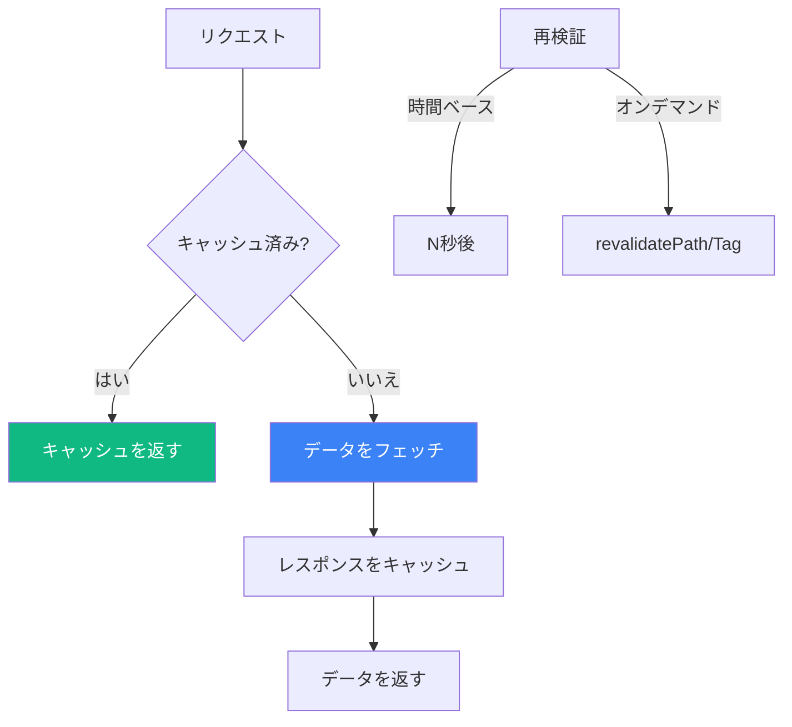
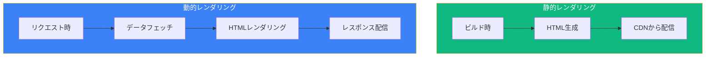

Next.js App Routerは非同期Server Componentsを通じて強力なデータフェッチ機能を提供します。キャッシュと再検証を理解することが、パフォーマンスの高いアプリケーション構築の鍵です。

## データフェッチの概要



## Server Componentsでのデータフェッチ

### 基本的なフェッチ

```tsx
// app/users/page.tsx
async function getUsers() {
  const res = await fetch('https://api.example.com/users');

  if (!res.ok) {
    throw new Error('ユーザーの取得に失敗しました');
  }

  return res.json();
}

export default async function UsersPage() {
  const users = await getUsers();

  return (
    <ul>
      {users.map((user) => (
        <li key={user.id}>{user.name}</li>
      ))}
    </ul>
  );
}
```

### 直接データベースアクセス

```tsx
// app/products/page.tsx
import { db } from '@/lib/database';

export default async function ProductsPage() {
  // 直接データベースクエリ - APIは不要
  const products = await db.query('SELECT * FROM products');

  return (
    <div>
      {products.map((product) => (
        <div key={product.id}>
          <h2>{product.name}</h2>
          <p>¥{product.price}</p>
        </div>
      ))}
    </div>
  );
}
```

### 複数の並列フェッチ

```tsx
// app/dashboard/page.tsx
async function getUser() {
  const res = await fetch('https://api.example.com/user');
  return res.json();
}

async function getPosts() {
  const res = await fetch('https://api.example.com/posts');
  return res.json();
}

async function getNotifications() {
  const res = await fetch('https://api.example.com/notifications');
  return res.json();
}

export default async function DashboardPage() {
  // 並列フェッチ - 順次より高速
  const [user, posts, notifications] = await Promise.all([
    getUser(),
    getPosts(),
    getNotifications(),
  ]);

  return (
    <div>
      <h1>ようこそ、{user.name}さん</h1>
      <p>{posts.length}件の投稿があります</p>
      <p>{notifications.length}件の通知</p>
    </div>
  );
}
```

## キャッシュ戦略

### デフォルトのキャッシュ動作

```tsx
// デフォルトでキャッシュ（force-cacheと同等）
const res = await fetch('https://api.example.com/data');

// キャッシュ動作を明示的に設定
const res = await fetch('https://api.example.com/data', {
  cache: 'force-cache', // デフォルト - 無期限にキャッシュ
});
```

### キャッシュなし

```tsx
// キャッシュしない - 常に新鮮なデータをフェッチ
const res = await fetch('https://api.example.com/data', {
  cache: 'no-store',
});
```

### 時間ベースの再検証

```tsx
// 60秒ごとに再検証
const res = await fetch('https://api.example.com/data', {
  next: { revalidate: 60 },
});
```

### 比較

| 戦略 | 使い方 | ユースケース |
|------|--------|-------------|
| `force-cache` | 永久にキャッシュ | 静的コンテンツ |
| `no-store` | キャッシュしない | リアルタイムデータ |
| `revalidate: N` | N秒間キャッシュ | 準動的データ |

## セグメントレベルのキャッシュ

### 動的ルートセグメント

```tsx
// app/posts/[id]/page.tsx

// このルートを動的にする
export const dynamic = 'force-dynamic';

// または静的にする
export const dynamic = 'force-static';

// 1時間ごとに再検証
export const revalidate = 3600;

export default async function PostPage({
  params,
}: {
  params: Promise<{ id: string }>;
}) {
  const { id } = await params;
  const post = await getPost(id);

  return <article>{post.content}</article>;
}
```

### ルートセグメント設定オプション

```tsx
// 動的レンダリングを強制
export const dynamic = 'force-dynamic';

// 静的レンダリングを強制
export const dynamic = 'force-static';

// 自動（デフォルト）- Next.jsが決定
export const dynamic = 'auto';

// 動的な場合はエラー
export const dynamic = 'error';

// 再検証間隔（秒）
export const revalidate = 60;

// 再検証なし（永久に静的）
export const revalidate = false;

// リクエストごとに再検証
export const revalidate = 0;
```

## タグベースの再検証

### タグの設定

```tsx
// app/posts/page.tsx
async function getPosts() {
  const res = await fetch('https://api.example.com/posts', {
    next: { tags: ['posts'] },
  });
  return res.json();
}

async function getPost(id: string) {
  const res = await fetch(`https://api.example.com/posts/${id}`, {
    next: { tags: ['posts', `post-${id}`] },
  });
  return res.json();
}
```

### タグの再検証

```tsx
// app/actions.ts
'use server';

import { revalidateTag } from 'next/cache';

export async function createPost(formData: FormData) {
  await db.posts.create({ /* ... */ });

  // 'posts'タグを持つすべてのリクエストを再検証
  revalidateTag('posts');
}

export async function updatePost(id: string, formData: FormData) {
  await db.posts.update(id, { /* ... */ });

  // 特定の投稿とリストを再検証
  revalidateTag(`post-${id}`);
  revalidateTag('posts');
}
```

## 静的 vs 動的レンダリング



### generateStaticParamsでの静的生成

```tsx
// app/blog/[slug]/page.tsx
export async function generateStaticParams() {
  const posts = await getPosts();

  return posts.map((post) => ({
    slug: post.slug,
  }));
}

export default async function BlogPost({
  params,
}: {
  params: Promise<{ slug: string }>;
}) {
  const { slug } = await params;
  const post = await getPost(slug);

  return <article>{post.content}</article>;
}
```

### 動的関数

これらの関数を使用するとルートが動的になります：

```tsx
import { cookies, headers } from 'next/headers';
import { searchParams } from 'next/navigation';

export default async function Page({
  searchParams,
}: {
  searchParams: Promise<{ q?: string }>;
}) {
  // cookiesを使用するとルートが動的に
  const cookieStore = await cookies();
  const theme = cookieStore.get('theme');

  // headersを使用するとルートが動的に
  const headersList = await headers();
  const userAgent = headersList.get('user-agent');

  // searchParamsを使用するとルートが動的に
  const params = await searchParams;
  const query = params.q;

  return <div>...</div>;
}
```

## リクエストのメモ化

Next.jsは同一のfetchリクエストを自動的に重複排除します：

```tsx
// このフェッチは複数の場所で呼び出される
async function getUser() {
  // 同じURL = 同じリクエスト（重複排除）
  const res = await fetch('https://api.example.com/user');
  return res.json();
}

// レイアウトがユーザーをフェッチ
export default async function Layout({ children }) {
  const user = await getUser(); // リクエスト#1
  return <div>{children}</div>;
}

// ページもユーザーをフェッチ
export default async function Page() {
  const user = await getUser(); // 重複排除 - #1を再利用
  return <div>{user.name}</div>;
}

// コンポーネントもユーザーをフェッチ
async function UserProfile() {
  const user = await getUser(); // 重複排除 - #1を再利用
  return <div>{user.email}</div>;
}
```

## エラーハンドリング

### エラー境界

```tsx
// app/posts/error.tsx
'use client';

export default function Error({
  error,
  reset,
}: {
  error: Error;
  reset: () => void;
}) {
  return (
    <div>
      <h2>投稿の読み込みに失敗しました</h2>
      <p>{error.message}</p>
      <button onClick={reset}>もう一度試す</button>
    </div>
  );
}
```

### 優雅なエラーハンドリング

```tsx
// app/posts/page.tsx
async function getPosts() {
  try {
    const res = await fetch('https://api.example.com/posts');

    if (!res.ok) {
      throw new Error(`HTTPエラー: ${res.status}`);
    }

    return res.json();
  } catch (error) {
    console.error('投稿の取得に失敗:', error);
    return []; // フォールバックとして空配列を返す
  }
}

export default async function PostsPage() {
  const posts = await getPosts();

  if (posts.length === 0) {
    return <p>投稿がありません</p>;
  }

  return (
    <ul>
      {posts.map((post) => (
        <li key={post.id}>{post.title}</li>
      ))}
    </ul>
  );
}
```

## データフェッチパターン

### ウォーターフォールパターン（避ける）

```tsx
// ❌ 遅い - 順次フェッチ
export default async function Page() {
  const user = await getUser();           // 待機
  const posts = await getPosts(user.id);  // さらに待機
  const comments = await getComments();    // さらに待機

  return <div>...</div>;
}
```

### 並列パターン（推奨）

```tsx
// ✅ 高速 - 並列フェッチ
export default async function Page() {
  const [user, posts, comments] = await Promise.all([
    getUser(),
    getPosts(),
    getComments(),
  ]);

  return <div>...</div>;
}
```

### プリロードパターン

```tsx
// lib/data.ts
import { cache } from 'react';

export const getUser = cache(async (id: string) => {
  const res = await fetch(`/api/users/${id}`);
  return res.json();
});

export const preloadUser = (id: string) => {
  void getUser(id);
};
```

```tsx
// app/user/[id]/page.tsx
import { getUser, preloadUser } from '@/lib/data';

export default async function UserPage({
  params,
}: {
  params: Promise<{ id: string }>;
}) {
  const { id } = await params;

  // 早めにフェッチを開始
  preloadUser(id);

  // ... 他のコード

  const user = await getUser(id); // プリロードされたデータを使用

  return <div>{user.name}</div>;
}
```

## Suspenseでストリーミング

```tsx
import { Suspense } from 'react';

async function SlowComponent() {
  const data = await fetch('https://api.example.com/slow');
  return <div>{data}</div>;
}

export default function Page() {
  return (
    <div>
      <h1>ダッシュボード</h1>

      {/* 高速なコンテンツは即座に表示 */}
      <p>ダッシュボードへようこそ</p>

      {/* 遅いコンテンツは後でストリーム */}
      <Suspense fallback={<p>読み込み中...</p>}>
        <SlowComponent />
      </Suspense>
    </div>
  );
}
```

## まとめ

| 概念 | 使い方 |
|------|--------|
| `cache: 'force-cache'` | 無期限にキャッシュ（デフォルト） |
| `cache: 'no-store'` | キャッシュしない |
| `next: { revalidate: N }` | N秒間キャッシュ |
| `next: { tags: [...] }` | オンデマンド再検証用タグ |
| `revalidateTag()` | タグ付きキャッシュをパージ |
| `revalidatePath()` | パスキャッシュをパージ |
| `generateStaticParams` | 動的ルートの静的生成 |
| `export const dynamic` | ルートセグメント設定 |

重要なポイント：

- Server Componentsは`async/await`を使って直接データをフェッチできる
- fetchリクエストはデフォルトでキャッシュされる；リアルタイムデータには`no-store`を使用
- 時間ベースのキャッシュ無効化には`revalidate`を使用
- きめ細かいオンデマンド再検証にはタグを使用
- `Promise.all`での並列フェッチは順次より高速
- リクエストのメモ化は同一のフェッチを重複排除
- 遅いデータのストリーミングにはSuspenseを使用
- `generateStaticParams`は動的ルートの静的生成を可能に

これらのパターンを理解することで、高速で効率的なNext.jsアプリケーションを構築できます。

## 参考文献

- [Next.js Data Fetching](https://nextjs.org/docs/app/building-your-application/data-fetching)
- [Next.js Caching](https://nextjs.org/docs/app/building-your-application/caching)
- Schwarzmüller, Maximilian. *React Key Concepts - Second Edition*. Packt, 2025.
